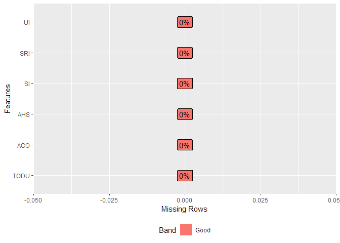
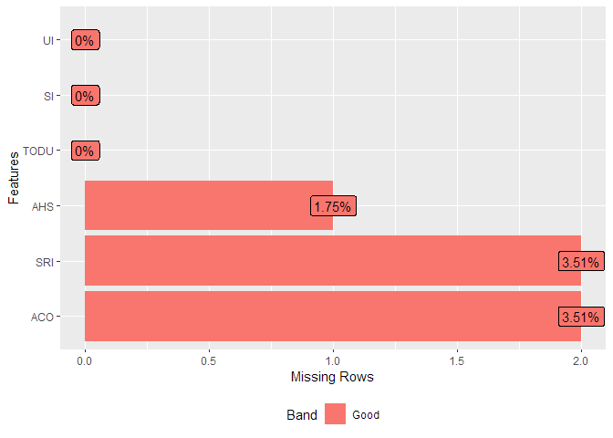
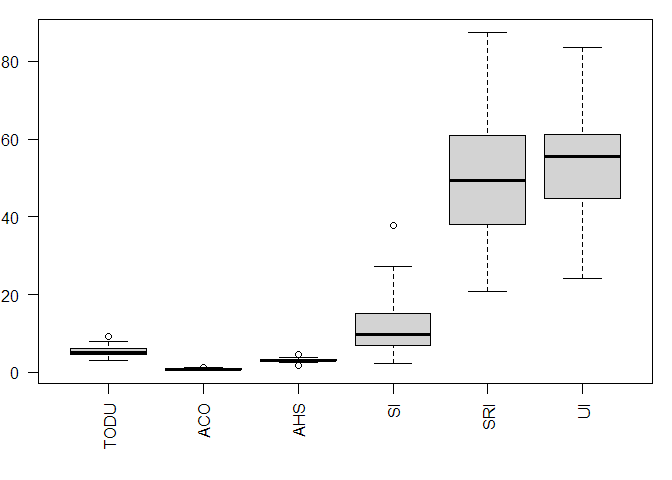
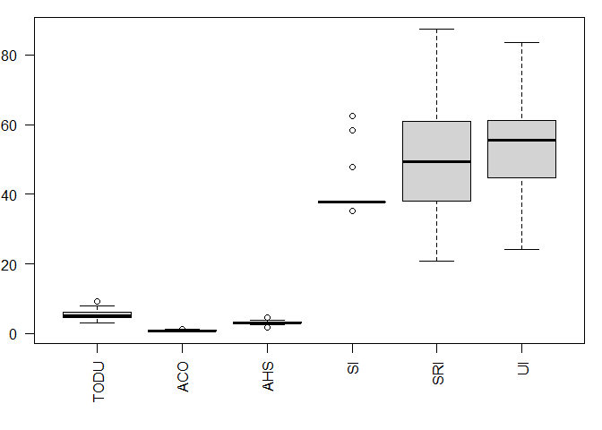
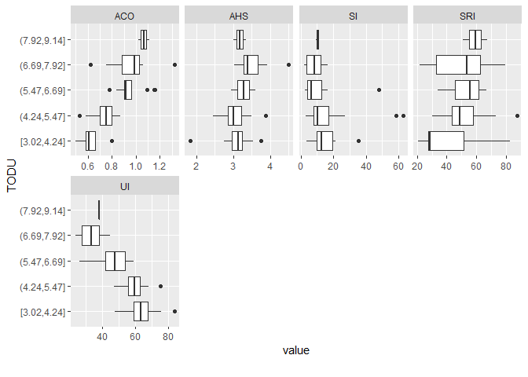

Exploratory Data Analysis
================

## Chicago example exercise

##### We will use the example of the following Multiple linear regression chapter to perform an EDA.

Trip production of 57 Traffic Assignment Zones of Chicago in 1960’s.

*Your task*: Explore and analyse the dataset before going to the
Multiple linear regression chapter.

### Variables:

  - `TODU`: Motorized Trips (private car or Public Transportation) per
    occupied dwelling unit;

  - `ACO`: Average car ownership (cars per dwelling);

  - `AHS`: Average household size;

  - `SRI`: Social Rank Index:  
    1\. proportion of blue-collar workers (e.g., construction,
    mining);  
    2\. proportion of people with age higher than 25 years that have
    completed at least 8 year of education; (***Note:** The SRI has its
    maximum value when there are no blue-collar workers and all adults
    have education of at least 8 years*)

  - `UI`: Urbanization Index:  
    1\. fertility rate, defined as the ratio of children under 5 years
    of age to the female population of childbearing age;  
    2\. female labor force participation rate, meaning the % of women
    who are in the labor force;  
    3\. % of single family units to total dwelling units.
    
    The degree of urbanization index would be increased by a) lower
    fertility rate, b) higher female labor force participation rate, and
    c) higher proportion of single dwelling units. (***Note:** High
    values for this index imply less attachment to the home*)

  - `SI`:Segregation Index It measures the proportion of an area to
    which minority groups (e.g: non-whites, foreign-born, Eastern
    Europeans) live in isolation. (***Note:** High values for this index
    imply that those communities are less prone to leaving their living
    areas and as such to having lower levels of mobility*)

## Let’s begin with R\!

##### Import Libraries

> > > > > > > Stashed changes

For the first time, you will need to install some of the packages. Step
by step:

1.  Go to Packages on the lower right display window and click install
2.  Write the library you want to install and click “install”

Or… `install.packages("readxl","tidyverse")` etc…

Depending on the version of your R, `DataExplorer` may need to be
installed from source, such as

``` r
if (!require(devtools)) install.packages("devtools")
devtools::install_github("boxuancui/DataExplorer")
```

##### Import Libraries

Now, import these libraries:

``` r
library(readxl) #Library used to import excel files
library(tidyverse) # Library used in data science to perform exploratory data analysis
library(skimr) # Library used for providing a summary of the data
library(DataExplorer) # Library used in data science to perform exploratory data analysis
library(corrplot) # Library used for correlation plots
library(car) # Library used for testing autocorrelation (Durbin Watson)
library(olsrr) # Library used for testing multicollinearity (VIF, TOL, etc.)
```

## Get to know your data

##### Import dataset

``` r
dataset <- read_excel("Data/TDM_Class3_MLR_Chicago_Example.xls") 
```

##### Check the structure of the dataset

``` r
str(dataset)
```

    ## tibble [57 x 6] (S3: tbl_df/tbl/data.frame)
    ##  $ TODU: num [1:57] 3.18 3.89 3.98 4.16 3.6 4.1 4.36 4.87 5.85 4.97 ...
    ##  $ ACO : num [1:57] 0.59 0.57 0.61 0.61 0.63 0.66 0.71 0.77 0.84 0.74 ...
    ##  $ AHS : num [1:57] 3.26 3.13 3.02 3.14 3.75 3.24 2.77 2.74 3.02 2.84 ...
    ##  $ SI  : num [1:57] 21 21.6 12.6 17.6 35.3 ...
    ##  $ SRI : num [1:57] 28.3 20.9 26 28.5 27.2 ...
    ##  $ UI  : num [1:57] 60.1 65.7 63.2 66.2 58.4 ...

##### Take a first look at the dataset

``` r
head(dataset, 10)
```

    ## # A tibble: 10 x 6
    ##     TODU   ACO   AHS    SI   SRI    UI
    ##    <dbl> <dbl> <dbl> <dbl> <dbl> <dbl>
    ##  1  3.18 0.59   3.26 21.0   28.3  60.1
    ##  2  3.89 0.570  3.13 21.6   20.9  65.7
    ##  3  3.98 0.61   3.02 12.6   26.0  63.2
    ##  4  4.16 0.61   3.14 17.6   28.5  66.2
    ##  5  3.6  0.63   3.75 35.3   27.2  58.4
    ##  6  4.1  0.66   3.24 14.7   28.0  59.6
    ##  7  4.36 0.71   2.77 11.6   39.9  64.6
    ##  8  4.87 0.77   2.74 10.7   48.4  67.9
    ##  9  5.85 0.84   3.02  8.2   42.2  56.9
    ## 10  4.97 0.74   2.84  7.94  38.1  62.4

##### Check the type and class of the dataset

``` r
typeof(dataset)
class(dataset)
```

##### Transform the dataset into a dataframe

``` r
df <- data.frame(dataset)
```

##### Compare the structure of the dataset with df

``` r
str(dataset)
```

    ## tibble [57 x 6] (S3: tbl_df/tbl/data.frame)
    ##  $ TODU: num [1:57] 3.18 3.89 3.98 4.16 3.6 4.1 4.36 4.87 5.85 4.97 ...
    ##  $ ACO : num [1:57] 0.59 0.57 0.61 0.61 0.63 0.66 0.71 0.77 0.84 0.74 ...
    ##  $ AHS : num [1:57] 3.26 3.13 3.02 3.14 3.75 3.24 2.77 2.74 3.02 2.84 ...
    ##  $ SI  : num [1:57] 21 21.6 12.6 17.6 35.3 ...
    ##  $ SRI : num [1:57] 28.3 20.9 26 28.5 27.2 ...
    ##  $ UI  : num [1:57] 60.1 65.7 63.2 66.2 58.4 ...

``` r
str(df)
```

    ## 'data.frame':    57 obs. of  6 variables:
    ##  $ TODU: num  3.18 3.89 3.98 4.16 3.6 4.1 4.36 4.87 5.85 4.97 ...
    ##  $ ACO : num  0.59 0.57 0.61 0.61 0.63 0.66 0.71 0.77 0.84 0.74 ...
    ##  $ AHS : num  3.26 3.13 3.02 3.14 3.75 3.24 2.77 2.74 3.02 2.84 ...
    ##  $ SI  : num  21 21.6 12.6 17.6 35.3 ...
    ##  $ SRI : num  28.3 20.9 26 28.5 27.2 ...
    ##  $ UI  : num  60.1 65.7 63.2 66.2 58.4 ...

> **Note:** The dataframe function transforms columns into variables and
> rows into observations.

##### Take a look at the dataframe

``` r
head(df, 10)
```

    ##    TODU  ACO  AHS    SI   SRI    UI
    ## 1  3.18 0.59 3.26 21.01 28.32 60.10
    ## 2  3.89 0.57 3.13 21.61 20.89 65.71
    ## 3  3.98 0.61 3.02 12.57 25.99 63.19
    ## 4  4.16 0.61 3.14 17.61 28.52 66.24
    ## 5  3.60 0.63 3.75 35.32 27.18 58.36
    ## 6  4.10 0.66 3.24 14.73 27.95 59.58
    ## 7  4.36 0.71 2.77 11.61 39.91 64.64
    ## 8  4.87 0.77 2.74 10.71 48.36 67.88
    ## 9  5.85 0.84 3.02  8.20 42.15 56.86
    ## 10 4.97 0.74 2.84  7.94 38.14 62.44

##### Show summary statistics

``` r
skim(df)
```

|                                                  |      |
| :----------------------------------------------- | :--- |
| Name                                             | df   |
| Number of rows                                   | 57   |
| Number of columns                                | 6    |
| \_\_\_\_\_\_\_\_\_\_\_\_\_\_\_\_\_\_\_\_\_\_\_   |      |
| Column type frequency:                           |      |
| numeric                                          | 6    |
| \_\_\_\_\_\_\_\_\_\_\_\_\_\_\_\_\_\_\_\_\_\_\_\_ |      |
| Group variables                                  | None |

Data summary

**Variable type: numeric**

| skim\_variable | n\_missing | complete\_rate |  mean |    sd |    p0 |   p25 |   p50 |   p75 |  p100 | hist  |
| :------------- | ---------: | -------------: | ----: | ----: | ----: | ----: | ----: | ----: | ----: | :---- |
| TODU           |          0 |              1 |  5.37 |  1.33 |  3.02 |  4.54 |  5.10 |  6.13 |  9.14 | ▃▇▅▃▁ |
| ACO            |          0 |              1 |  0.81 |  0.18 |  0.50 |  0.67 |  0.79 |  0.92 |  1.32 | ▆▇▇▃▁ |
| AHS            |          0 |              1 |  3.19 |  0.39 |  1.83 |  3.00 |  3.19 |  3.37 |  4.50 | ▁▂▇▂▁ |
| SI             |          0 |              1 | 13.07 | 12.19 |  2.17 |  6.82 |  9.86 | 15.08 | 62.53 | ▇▂▁▁▁ |
| SRI            |          0 |              1 | 49.56 | 15.84 | 20.89 | 38.14 | 49.37 | 60.85 | 87.38 | ▅▆▇▅▂ |
| UI             |          0 |              1 | 52.62 | 13.46 | 24.08 | 44.80 | 55.51 | 61.09 | 83.66 | ▃▅▇▅▁ |

### Deal with missing data

Is there missing data? How many?

``` r
table(is.na(df))
```

    ## 
    ## FALSE 
    ##   342

``` r
plot_missing(df)
```

<!-- -->

> **Note:** We do not have any missing data in the dataset.

For the sake of the example, I deleted some values in the dataset and
created a copy file. Import the file and take a look at some functions
that you can use to treat missing data.

##### Dataset with missing data

``` r
df_missing <- read_excel("Data/TDM_Class3_MLR_Chicago_Example_md.xls")

df_missing <- data.frame(df_missing)
```

Take a look where is the missing data

``` r
is.na(df_missing)
```

    ##        TODU   ACO   AHS    SI   SRI    UI
    ##  [1,] FALSE FALSE FALSE FALSE FALSE FALSE
    ##  [2,] FALSE FALSE FALSE FALSE FALSE FALSE
    ##  [3,] FALSE FALSE FALSE FALSE FALSE FALSE
    ##  [4,] FALSE FALSE FALSE FALSE FALSE FALSE
    ##  [5,] FALSE FALSE FALSE FALSE FALSE FALSE
    ##  [6,] FALSE FALSE FALSE FALSE FALSE FALSE
    ##  [7,] FALSE FALSE FALSE FALSE FALSE FALSE
    ##  [8,] FALSE FALSE FALSE FALSE FALSE FALSE
    ##  [9,] FALSE FALSE FALSE FALSE FALSE FALSE
    ## [10,] FALSE FALSE FALSE FALSE FALSE FALSE
    ## [11,] FALSE  TRUE FALSE FALSE FALSE FALSE
    ## [12,] FALSE FALSE FALSE FALSE FALSE FALSE
    ## [13,] FALSE FALSE FALSE FALSE FALSE FALSE
    ## [14,] FALSE FALSE FALSE FALSE FALSE FALSE
    ## [15,] FALSE FALSE FALSE FALSE FALSE FALSE
    ## [16,] FALSE FALSE FALSE FALSE FALSE FALSE
    ## [17,] FALSE FALSE FALSE FALSE FALSE FALSE
    ## [18,] FALSE FALSE FALSE FALSE FALSE FALSE
    ## [19,] FALSE FALSE FALSE FALSE FALSE FALSE
    ## [20,] FALSE FALSE FALSE FALSE FALSE FALSE
    ## [21,] FALSE FALSE FALSE FALSE FALSE FALSE
    ## [22,] FALSE FALSE FALSE FALSE FALSE FALSE
    ## [23,] FALSE FALSE FALSE FALSE FALSE FALSE
    ## [24,] FALSE FALSE FALSE FALSE FALSE FALSE
    ## [25,] FALSE FALSE FALSE FALSE FALSE FALSE
    ## [26,] FALSE FALSE FALSE FALSE FALSE FALSE
    ## [27,] FALSE FALSE FALSE FALSE FALSE FALSE
    ## [28,] FALSE FALSE FALSE FALSE FALSE FALSE
    ## [29,] FALSE  TRUE FALSE FALSE FALSE FALSE
    ## [30,] FALSE FALSE FALSE FALSE FALSE FALSE
    ## [31,] FALSE FALSE FALSE FALSE FALSE FALSE
    ## [32,] FALSE FALSE FALSE FALSE FALSE FALSE
    ## [33,] FALSE FALSE FALSE FALSE FALSE FALSE
    ## [34,] FALSE FALSE FALSE FALSE FALSE FALSE
    ## [35,] FALSE FALSE FALSE FALSE FALSE FALSE
    ## [36,] FALSE FALSE FALSE FALSE FALSE FALSE
    ## [37,] FALSE FALSE FALSE FALSE FALSE FALSE
    ## [38,] FALSE FALSE FALSE FALSE FALSE FALSE
    ## [39,] FALSE FALSE FALSE FALSE  TRUE FALSE
    ## [40,] FALSE FALSE FALSE FALSE FALSE FALSE
    ## [41,] FALSE FALSE FALSE FALSE FALSE FALSE
    ## [42,] FALSE FALSE FALSE FALSE FALSE FALSE
    ## [43,] FALSE FALSE FALSE FALSE FALSE FALSE
    ## [44,] FALSE FALSE FALSE FALSE FALSE FALSE
    ## [45,] FALSE FALSE FALSE FALSE FALSE FALSE
    ## [46,] FALSE FALSE FALSE FALSE FALSE FALSE
    ## [47,] FALSE FALSE FALSE FALSE FALSE FALSE
    ## [48,] FALSE FALSE FALSE FALSE FALSE FALSE
    ## [49,] FALSE FALSE FALSE FALSE FALSE FALSE
    ## [50,] FALSE FALSE  TRUE FALSE FALSE FALSE
    ## [51,] FALSE FALSE FALSE FALSE FALSE FALSE
    ## [52,] FALSE FALSE FALSE FALSE FALSE FALSE
    ## [53,] FALSE FALSE FALSE FALSE FALSE FALSE
    ## [54,] FALSE FALSE FALSE FALSE FALSE FALSE
    ## [55,] FALSE FALSE FALSE FALSE  TRUE FALSE
    ## [56,] FALSE FALSE FALSE FALSE FALSE FALSE
    ## [57,] FALSE FALSE FALSE FALSE FALSE FALSE

Plot the percentage of missing data

``` r
plot_missing(df_missing)
```

<!-- -->

##### Treat missing data

  - **Listwise deletion**. Delete observation (row) with incomplete
    information.

<!-- end list -->

``` r
na.omit(df_missing)
```

    ##    TODU  ACO  AHS    SI   SRI    UI
    ## 1  3.18 0.59 3.26 21.01 28.32 60.10
    ## 2  3.89 0.57 3.13 21.61 20.89 65.71
    ## 3  3.98 0.61 3.02 12.57 25.99 63.19
    ## 4  4.16 0.61 3.14 17.61 28.52 66.24
    ## 5  3.60 0.63 3.75 35.32 27.18 58.36
    ## 6  4.10 0.66 3.24 14.73 27.95 59.58
    ## 7  4.36 0.71 2.77 11.61 39.91 64.64
    ## 8  4.87 0.77 2.74 10.71 48.36 67.88
    ## 9  5.85 0.84 3.02  8.20 42.15 56.86
    ## 10 4.97 0.74 2.84  7.94 38.14 62.44
    ## 12 4.31 0.64 3.87 27.33 43.90 59.49
    ## 13 4.54 0.73 3.16 18.70 30.27 57.76
    ## 14 4.82 0.86 3.42 14.52 32.18 63.06
    ## 15 4.04 0.66 3.54  3.82 34.45 47.73
    ## 16 4.60 0.64 3.49  8.73 43.32 59.36
    ## 17 3.40 0.50 2.76 11.40 75.32 75.81
    ## 18 4.65 0.58 2.91 58.43 62.20 75.26
    ## 19 3.02 0.53 1.83  8.32 82.53 83.66
    ## 20 9.14 1.11 3.00 11.49 67.31 38.21
    ## 21 4.30 0.70 2.94 17.95 64.01 55.51
    ## 22 4.24 0.80 3.19  8.10 51.16 52.44
    ## 23 5.00 0.77 2.61  4.67 59.15 59.38
    ## 24 5.93 0.96 3.24  6.82 48.51 46.51
    ## 25 5.11 0.86 2.95 10.43 47.44 51.17
    ## 26 5.84 0.92 2.95  6.53 57.34 58.60
    ## 27 4.70 0.80 3.00  3.37 62.60 62.40
    ## 28 4.54 0.79 2.71 10.10 73.00 67.23
    ## 30 5.10 0.75 3.38 17.94 43.67 56.64
    ## 31 4.70 0.83 3.11  9.38 52.74 54.02
    ## 32 5.17 0.76 3.20  3.02 52.29 58.35
    ## 33 5.41 0.87 3.24 12.75 43.42 47.78
    ## 34 6.46 1.16 3.60 16.49 45.94 51.21
    ## 35 6.03 0.90 3.02  2.80 61.53 54.92
    ## 36 4.79 0.53 3.09 62.53 49.37 58.63
    ## 37 4.83 0.75 2.46  6.92 87.38 65.67
    ## 38 6.30 0.78 3.36 16.34 55.85 59.00
    ## 40 6.01 0.96 3.27  4.25 67.01 48.39
    ## 41 6.39 0.86 3.32  3.85 62.18 50.04
    ## 42 5.82 1.09 3.29  7.54 45.58 46.47
    ## 43 6.25 1.15 3.58  3.41 60.85 26.36
    ## 44 6.13 0.90 3.09  3.62 55.59 43.58
    ## 45 6.70 1.02 3.02  2.17 75.73 35.89
    ## 46 7.10 1.00 3.33  3.78 57.84 28.28
    ## 47 7.89 1.32 3.58  2.42 79.69 25.37
    ## 48 7.80 1.06 3.17  7.20 57.01 31.97
    ## 49 8.02 1.02 3.35  9.17 50.93 38.17
    ## 51 5.14 0.82 3.31  7.61 36.36 46.98
    ## 52 5.56 0.94 3.21 47.73 62.27 36.27
    ## 53 5.74 0.90 3.52  4.17 42.64 26.15
    ## 54 6.77 0.62 3.92 11.36 21.66 24.08
    ## 56 7.64 0.93 3.37 15.08 34.74 44.54
    ## 57 7.25 0.75 4.50 16.44 26.21 44.80

  - **Pairwise deletion**. Delete only the row of missing value if the
    variable is used.

<!-- end list -->

``` r
df_missing[!is.na(df_missing$ACO),]
```

    ##    TODU  ACO  AHS    SI   SRI    UI
    ## 1  3.18 0.59 3.26 21.01 28.32 60.10
    ## 2  3.89 0.57 3.13 21.61 20.89 65.71
    ## 3  3.98 0.61 3.02 12.57 25.99 63.19
    ## 4  4.16 0.61 3.14 17.61 28.52 66.24
    ## 5  3.60 0.63 3.75 35.32 27.18 58.36
    ## 6  4.10 0.66 3.24 14.73 27.95 59.58
    ## 7  4.36 0.71 2.77 11.61 39.91 64.64
    ## 8  4.87 0.77 2.74 10.71 48.36 67.88
    ## 9  5.85 0.84 3.02  8.20 42.15 56.86
    ## 10 4.97 0.74 2.84  7.94 38.14 62.44
    ## 12 4.31 0.64 3.87 27.33 43.90 59.49
    ## 13 4.54 0.73 3.16 18.70 30.27 57.76
    ## 14 4.82 0.86 3.42 14.52 32.18 63.06
    ## 15 4.04 0.66 3.54  3.82 34.45 47.73
    ## 16 4.60 0.64 3.49  8.73 43.32 59.36
    ## 17 3.40 0.50 2.76 11.40 75.32 75.81
    ## 18 4.65 0.58 2.91 58.43 62.20 75.26
    ## 19 3.02 0.53 1.83  8.32 82.53 83.66
    ## 20 9.14 1.11 3.00 11.49 67.31 38.21
    ## 21 4.30 0.70 2.94 17.95 64.01 55.51
    ## 22 4.24 0.80 3.19  8.10 51.16 52.44
    ## 23 5.00 0.77 2.61  4.67 59.15 59.38
    ## 24 5.93 0.96 3.24  6.82 48.51 46.51
    ## 25 5.11 0.86 2.95 10.43 47.44 51.17
    ## 26 5.84 0.92 2.95  6.53 57.34 58.60
    ## 27 4.70 0.80 3.00  3.37 62.60 62.40
    ## 28 4.54 0.79 2.71 10.10 73.00 67.23
    ## 30 5.10 0.75 3.38 17.94 43.67 56.64
    ## 31 4.70 0.83 3.11  9.38 52.74 54.02
    ## 32 5.17 0.76 3.20  3.02 52.29 58.35
    ## 33 5.41 0.87 3.24 12.75 43.42 47.78
    ## 34 6.46 1.16 3.60 16.49 45.94 51.21
    ## 35 6.03 0.90 3.02  2.80 61.53 54.92
    ## 36 4.79 0.53 3.09 62.53 49.37 58.63
    ## 37 4.83 0.75 2.46  6.92 87.38 65.67
    ## 38 6.30 0.78 3.36 16.34 55.85 59.00
    ## 39 4.94 0.69 2.94  9.51    NA 61.09
    ## 40 6.01 0.96 3.27  4.25 67.01 48.39
    ## 41 6.39 0.86 3.32  3.85 62.18 50.04
    ## 42 5.82 1.09 3.29  7.54 45.58 46.47
    ## 43 6.25 1.15 3.58  3.41 60.85 26.36
    ## 44 6.13 0.90 3.09  3.62 55.59 43.58
    ## 45 6.70 1.02 3.02  2.17 75.73 35.89
    ## 46 7.10 1.00 3.33  3.78 57.84 28.28
    ## 47 7.89 1.32 3.58  2.42 79.69 25.37
    ## 48 7.80 1.06 3.17  7.20 57.01 31.97
    ## 49 8.02 1.02 3.35  9.17 50.93 38.17
    ## 50 7.20 0.98   NA  9.86 49.75 34.69
    ## 51 5.14 0.82 3.31  7.61 36.36 46.98
    ## 52 5.56 0.94 3.21 47.73 62.27 36.27
    ## 53 5.74 0.90 3.52  4.17 42.64 26.15
    ## 54 6.77 0.62 3.92 11.36 21.66 24.08
    ## 55 4.94 0.77 3.02  8.73    NA 51.39
    ## 56 7.64 0.93 3.37 15.08 34.74 44.54
    ## 57 7.25 0.75 4.50 16.44 26.21 44.80

> **Note:** Listwise deletion may lose a lot of information, while
> pairwise deletion considers diferent sizes of variables in the
> analysis, which may be a problem. Choosing one method or the other
> depends on the number of missing data, sample size and characteristics
> of your data.

  - **Replace missing value with mean or median**

<!-- end list -->

``` r
df_missing$ACO[is.na(df_missing$ACO)] <- mean(df_missing$ACO, na.rm = TRUE)

df_missing$ACO[is.na(df_missing$ACO)] <- median(df_missing$ACO, na.rm = TRUE)
```

> **Note**: Here are just some examples of how to treat missing data.
> Take a look at other methods such as the prediction model or K-nearest
> neighbor imputation.

### Detect Outliers

  - Examine the boxplots

<!-- end list -->

``` r
df_no_outliers <- df
par(mar=c(5,2,1,1)) # Make labels fit in the boxplot
boxplot(df_no_outliers, las = 2)
```

<!-- -->

Take the out the outliers from the variable SI

``` r
outlier <- function(x){
  quant <- quantile(x, probs=c(0.25, 0.75))
  caps <- quantile(x, probs=c(0.05, 0.95))
  H <- 1.5* IQR(x, na.rm = TRUE)
  x[x < (quant[1] - H)] <- caps[1]
  x[x > (quant[2] + H)] <- caps[2]
  return(x)
}

df_no_outliers$SI=outlier(df_no_outliers$SI)
```

  - Take a look again at the boxplots

<!-- end list -->

``` r
par(mar=c(5,2,1,1)) # Make labels fit in the boxplot
boxplot(df_no_outliers, las = 2)
```

<!-- -->

  - **Compare results of the dataset with and without the outliers**

**Data with outliers**

``` r
mean(df$SI)
```

    ## [1] 13.07316

``` r
median(df$SI)
```

    ## [1] 9.86

``` r
var(df$SI)
```

    ## [1] 148.5175

**Data without outliers**

``` r
mean(df_no_outliers$SI)
```

    ## [1] 12.14681

``` r
median(df_no_outliers$SI)
```

    ## [1] 9.86

``` r
var(df_no_outliers$SI)
```

    ## [1] 80.62296

> **Note:** There are many methods to treat outliers. This is just one
> of them. Try using other methods and evaluate the difference. In the
> next chapter we will demonstrate other methods of detecting outliers
> such as the Cook distance and QQ plot.

##### Plot histograms of all the continuous variables

``` r
plot_histogram(df)
```

<!-- -->

> **Note**: Take a special look at TODU, and see if the variable looks
> like a normal distribution.

##### Plot boxplots of each independent variable with TODU

``` r
plot_boxplot(df, by = "TODU")
```

<!-- -->

> **Note**: If you increase the average car ownership (ACO) it will tend
> to increase the number of trips per dwelling unit (TODU). This makes
> sense. Try analyzing the other relations and check if it is coherent.

##### Plot correlation heatmaps

``` r
res1 <- cor.mtest(df, conf.level = .95)

corrplot(cor(df), p.mat = res1$p, method = "number", type = "upper", order="hclust", sig.level = 0.05)
```

<!-- -->

> **Note:** try putting into method “color” or “circle”, and see the
> diference.

> **Note:** The pairwise correlations that are crossed are statistically
> insignificant.The null hypothesis is that correlation is zero.This
> means that the correlations are only significant when you reject the
> null hypothesis (pvalue \< 0.05).

Therefore, take a look at this example and check the pvalue of a crossed
pair correlation:

``` r
cor.test(df$AHS, df$SI)
```

    ## 
    ##  Pearson's product-moment correlation
    ## 
    ## data:  df$AHS and df$SI
    ## t = 0.63199, df = 55, p-value = 0.53
    ## alternative hypothesis: true correlation is not equal to 0
    ## 95 percent confidence interval:
    ##  -0.1796317  0.3379997
    ## sample estimates:
    ##        cor 
    ## 0.08491026

> **Note:** Correlation heatmaps only consider pairwise correlations and
> does not demonstrate multicollinearity.

#### Now that you have done some descriptive analysis of the data, go to the next chapter. There you will learn how to perform a Multiple Linear Regression model\!
