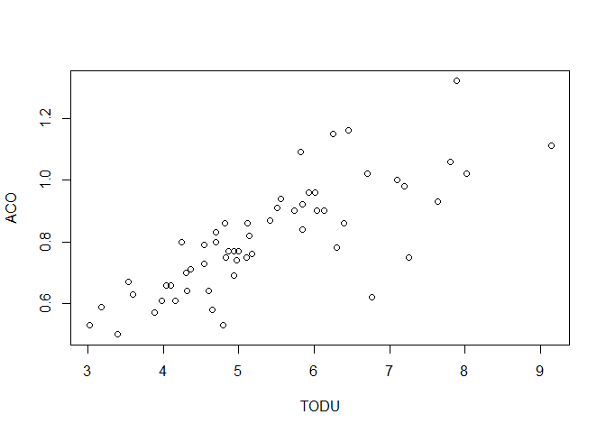
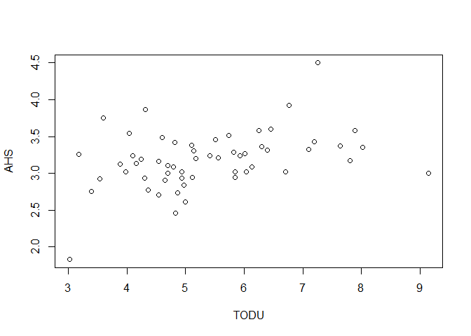
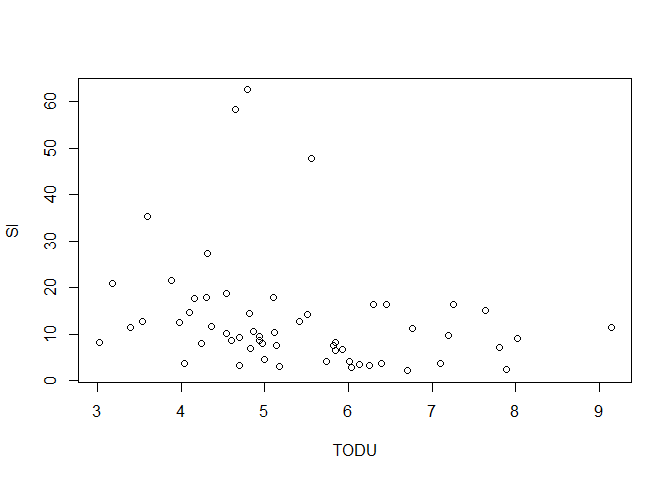
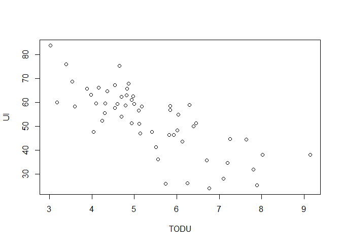
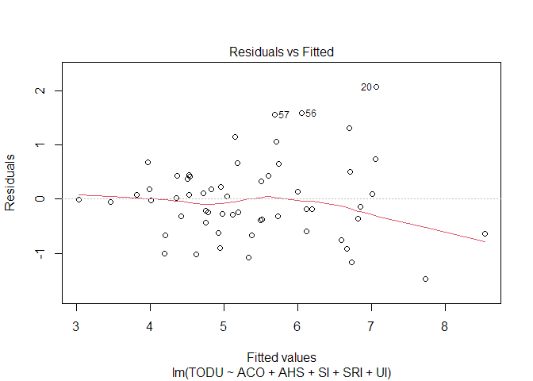
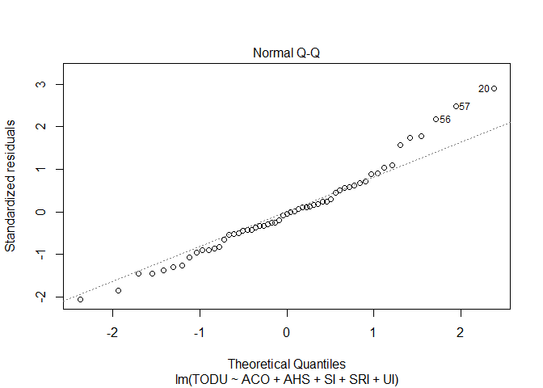
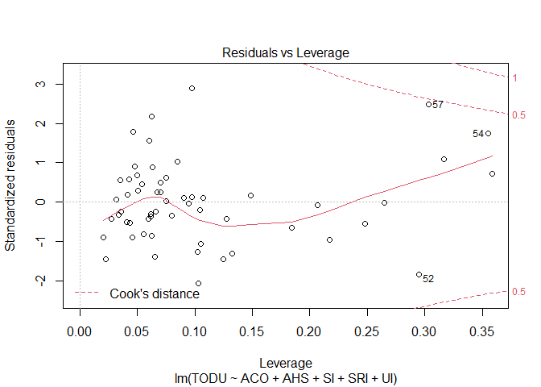

Multiple Linear Regression models
================

## Chicago example exercise

Trip production of 57 Traffic Assignment Zones of Chicago in 1960’s

> Your task: Estimate a linear regression model that predicts trips per
> occupied dwelling unit.

### Variables:

  - `TODU`: Motorized Trips (private car or Public Transportation) per
    occupied dwelling unit;

  - `ACO`: Average car ownership (cars per dwelling);

  - `AHS`: Average household size;

  - `SRI`: Social Rank Index:  
    1\. proportion of blue-collar workers (e.g., construction,
    mining);  
    2\. proportion of people with age higher than 25 years that have
    completed at least 8 year of education; (***Note:** The SRI has its
    maximum value when there are no blue-collar workers and all adults
    have education of at least 8 years*)

  - `UI`: Urbanization Index:  
    1\. fertility rate, defined as the ratio of children under 5 years
    of age to the female population of childbearing age;  
    2\. female labor force participation rate, meaning the % of women
    who are in the labor force;  
    3\. % of single family units to total dwelling units.
    
    The degree of urbanization index would be increased by a) lower
    fertility rate, b) higher female labor force participation rate, and
    c) higher proportion of single dwelling units. (***Note:** High
    values for this index imply less attachment to the home*)

  - `SI`:Segregation Index It measures the proportion of an area to
    which minority groups (e.g: non-whites, foreign-born, Eastern
    Europeans) live in isolation. (***Note:** High values for this index
    imply that those communities are less prone to leaving their living
    areas and as such to having lower levels of mobility*)

#### Import Libraries

Let’s begin\!

For the first time, you will need to install some of the packages. Step
by step:

1.  Go to Packages on the lower right display window and click install
2.  Write the library you want to install and click “install”

Or… `install.packages("readxl","tidyverse")` etc…

Depending on the version of your R, `DataExplorer` may need to be
installed from source, such as

``` r
if (!require(devtools)) install.packages("devtools")
devtools::install_github("boxuancui/DataExplorer")
```

Now, import these libraries:

``` r
library(readxl) #Library used to import excel files
library(tidyverse) # Library used in data science to perform exploratory data analysis
library(skimr) # Library used for providing a summary of the data
library(DataExplorer) # Library used in data science to perform exploratory data analysis
library(corrplot) # Library used for correlation plots
library(car) # Library used for testing autocorrelation (Durbin Watson)
library(olsrr) # Library used for testing multicollinearity (VIF, TOL, etc.)
```

### EXPLORATORY DATA ANALYSIS (EDA)

#### Import dataset

``` r
dataset <- read_excel("Data/TDM_Class3_MLR_Chicago_Example.xls") 
```

#### Check the structure of the dataset

``` r
str(dataset)
```

    ## tibble [57 x 6] (S3: tbl_df/tbl/data.frame)
    ##  $ TODU: num [1:57] 3.18 3.89 3.98 4.16 3.6 4.1 4.36 4.87 5.85 4.97 ...
    ##  $ ACO : num [1:57] 0.59 0.57 0.61 0.61 0.63 0.66 0.71 0.77 0.84 0.74 ...
    ##  $ AHS : num [1:57] 3.26 3.13 3.02 3.14 3.75 3.24 2.77 2.74 3.02 2.84 ...
    ##  $ SI  : num [1:57] 21 21.6 12.6 17.6 35.3 ...
    ##  $ SRI : num [1:57] 28.3 20.9 26 28.5 27.2 ...
    ##  $ UI  : num [1:57] 60.1 65.7 63.2 66.2 58.4 ...

#### Take a first look at the dataset

``` r
head(dataset, 10)
```

    ## # A tibble: 10 x 6
    ##     TODU   ACO   AHS    SI   SRI    UI
    ##    <dbl> <dbl> <dbl> <dbl> <dbl> <dbl>
    ##  1  3.18 0.59   3.26 21.0   28.3  60.1
    ##  2  3.89 0.570  3.13 21.6   20.9  65.7
    ##  3  3.98 0.61   3.02 12.6   26.0  63.2
    ##  4  4.16 0.61   3.14 17.6   28.5  66.2
    ##  5  3.6  0.63   3.75 35.3   27.2  58.4
    ##  6  4.1  0.66   3.24 14.7   28.0  59.6
    ##  7  4.36 0.71   2.77 11.6   39.9  64.6
    ##  8  4.87 0.77   2.74 10.7   48.4  67.9
    ##  9  5.85 0.84   3.02  8.2   42.2  56.9
    ## 10  4.97 0.74   2.84  7.94  38.1  62.4

#### Check the type and class of the dataset

``` r
typeof(dataset)
class(dataset)
```

    ## [1] "list"

    ## [1] "tbl_df"     "tbl"        "data.frame"

#### Transform the dataset into a dataframe

``` r
df <- data.frame(dataset)
```

#### Compare the structure of the dataset with df

``` r
str(dataset)
```

    ## tibble [57 x 6] (S3: tbl_df/tbl/data.frame)
    ##  $ TODU: num [1:57] 3.18 3.89 3.98 4.16 3.6 4.1 4.36 4.87 5.85 4.97 ...
    ##  $ ACO : num [1:57] 0.59 0.57 0.61 0.61 0.63 0.66 0.71 0.77 0.84 0.74 ...
    ##  $ AHS : num [1:57] 3.26 3.13 3.02 3.14 3.75 3.24 2.77 2.74 3.02 2.84 ...
    ##  $ SI  : num [1:57] 21 21.6 12.6 17.6 35.3 ...
    ##  $ SRI : num [1:57] 28.3 20.9 26 28.5 27.2 ...
    ##  $ UI  : num [1:57] 60.1 65.7 63.2 66.2 58.4 ...

``` r
str(df)
```

    ## 'data.frame':    57 obs. of  6 variables:
    ##  $ TODU: num  3.18 3.89 3.98 4.16 3.6 4.1 4.36 4.87 5.85 4.97 ...
    ##  $ ACO : num  0.59 0.57 0.61 0.61 0.63 0.66 0.71 0.77 0.84 0.74 ...
    ##  $ AHS : num  3.26 3.13 3.02 3.14 3.75 3.24 2.77 2.74 3.02 2.84 ...
    ##  $ SI  : num  21 21.6 12.6 17.6 35.3 ...
    ##  $ SRI : num  28.3 20.9 26 28.5 27.2 ...
    ##  $ UI  : num  60.1 65.7 63.2 66.2 58.4 ...

> **Note:** The dataframe function transforms columns into variables and
> rows into observations.

#### Take a look at the dataframe

``` r
head(df, 10)
```

    ##    TODU  ACO  AHS    SI   SRI    UI
    ## 1  3.18 0.59 3.26 21.01 28.32 60.10
    ## 2  3.89 0.57 3.13 21.61 20.89 65.71
    ## 3  3.98 0.61 3.02 12.57 25.99 63.19
    ## 4  4.16 0.61 3.14 17.61 28.52 66.24
    ## 5  3.60 0.63 3.75 35.32 27.18 58.36
    ## 6  4.10 0.66 3.24 14.73 27.95 59.58
    ## 7  4.36 0.71 2.77 11.61 39.91 64.64
    ## 8  4.87 0.77 2.74 10.71 48.36 67.88
    ## 9  5.85 0.84 3.02  8.20 42.15 56.86
    ## 10 4.97 0.74 2.84  7.94 38.14 62.44

#### Show summary statistics

``` r
skim(df)
```

|                                                  |      |
| :----------------------------------------------- | :--- |
| Name                                             | df   |
| Number of rows                                   | 57   |
| Number of columns                                | 6    |
| \_\_\_\_\_\_\_\_\_\_\_\_\_\_\_\_\_\_\_\_\_\_\_   |      |
| Column type frequency:                           |      |
| numeric                                          | 6    |
| \_\_\_\_\_\_\_\_\_\_\_\_\_\_\_\_\_\_\_\_\_\_\_\_ |      |
| Group variables                                  | None |

Data summary

**Variable type: numeric**

| skim\_variable | n\_missing | complete\_rate |  mean |    sd |    p0 |   p25 |   p50 |   p75 |  p100 | hist  |
| :------------- | ---------: | -------------: | ----: | ----: | ----: | ----: | ----: | ----: | ----: | :---- |
| TODU           |          0 |              1 |  5.37 |  1.33 |  3.02 |  4.54 |  5.10 |  6.13 |  9.14 | ▃▇▅▃▁ |
| ACO            |          0 |              1 |  0.81 |  0.18 |  0.50 |  0.67 |  0.79 |  0.92 |  1.32 | ▆▇▇▃▁ |
| AHS            |          0 |              1 |  3.19 |  0.39 |  1.83 |  3.00 |  3.19 |  3.37 |  4.50 | ▁▂▇▂▁ |
| SI             |          0 |              1 | 13.07 | 12.19 |  2.17 |  6.82 |  9.86 | 15.08 | 62.53 | ▇▂▁▁▁ |
| SRI            |          0 |              1 | 49.56 | 15.84 | 20.89 | 38.14 | 49.37 | 60.85 | 87.38 | ▅▆▇▅▂ |
| UI             |          0 |              1 | 52.62 | 13.46 | 24.08 | 44.80 | 55.51 | 61.09 | 83.66 | ▃▅▇▅▁ |

#### Check missing data

``` r
plot_missing(df)
```

<!-- -->

#### Plot histograms of all the continuous variables

``` r
plot_histogram(df)
```

<!-- -->

> **Note**: Take a special look at TODU, and see if the variable looks
> like a normal distribution.

#### Plot boxplots of each independent variable with TODU

``` r
plot_boxplot(df, by = "TODU")
```

<!-- -->

> **Note**: If you increase the average car ownership (ACO) it will tend
> to increase the number of trips per dwelling unit (TODU). This makes
> sense. Try analyzing the other relations and check if it is coherent.

#### Plot correlation heatmaps

``` r
res1 <- cor.mtest(df, conf.level = .95)

corrplot(cor(df), p.mat = res1$p, method = "number", type = "upper", order="hclust", sig.level = 0.05)
```

<!-- -->

> **Note:** try putting into method “color” or “circle”, and see the
> diference.

> **Note:** The pairwise correlations that are crossed are statistically
> insignificant.The null hypothesis is that correlation is zero.This
> means that the correlations are only significant when you reject the
> null hypothesis (pvalue \< 0.05).

Therefore, take a look at this example and check the pvalue of a crossed
pair correlation:

``` r
cor.test(df$AHS, df$SI)
```

    ## 
    ##  Pearson's product-moment correlation
    ## 
    ## data:  df$AHS and df$SI
    ## t = 0.63199, df = 55, p-value = 0.53
    ## alternative hypothesis: true correlation is not equal to 0
    ## 95 percent confidence interval:
    ##  -0.1796317  0.3379997
    ## sample estimates:
    ##        cor 
    ## 0.08491026

> **Note:** Correlation heatmaps only consider pairwise correlations and
> does not demonstrate multicollinearity.

### MULTIPLE LINEAR REGRESSION

> y(`TODU`) = bo + b1*`ACO` + b2*`AHS` + b3*`SI` + b4*`SRI` +b5\*`UI` +
> Error

#### Before running the model, you need to check if the assumptions are met. For instance, let’s take a look if the independent variables have linear relation with the dependent variable.

``` r
plot(x = df$TODU, y = df$ACO, xlab = "TODU", ylab = "ACO")  
```

<!-- -->

``` r
plot(x = df$TODU, y = df$AHS, xlab = "TODU", ylab = "AHS")  
```

<!-- -->

``` r
plot(x = df$TODU, y = df$SI, xlab = "TODU", ylab = "SI")  
```

<!-- -->

``` r
plot(x = df$TODU, y = df$SRI, xlab = "TODU", ylab = "SRI")  
```

<!-- -->

``` r
plot(x = df$TODU, y = df$UI, xlab = "TODU", ylab = "UI")
```

<!-- -->

Or you could execute a pairwise scatterplot matrix, that compares every
variable with each other:

``` r
pairs(df[,1:6], pch = 19, lower.panel = NULL)
```

<!-- -->

> **Note:** SRI and TODU do not have a linear relationship. This should
> interfere on the model.

#### Check if the Dependent variable is normally distributed

If the sample is smaller than 2000 observations, use Shapiro-Wilk test:

``` r
shapiro.test(df$TODU)
```

    ## 
    ##  Shapiro-Wilk normality test
    ## 
    ## data:  df$TODU
    ## W = 0.96816, p-value = 0.1377

If not, use the Kolmogorov-Smirnov test

``` r
ks.test(df$TODU, "pnorm", mean=mean(df$TODU), sd = sd(df$TODU))
```

    ## Warning in ks.test(df$TODU, "pnorm", mean = mean(df$TODU), sd = sd(df$TODU)):
    ## ties should not be present for the Kolmogorov-Smirnov test

    ## 
    ##  One-sample Kolmogorov-Smirnov test
    ## 
    ## data:  df$TODU
    ## D = 0.12231, p-value = 0.3612
    ## alternative hypothesis: two-sided

> **Note:** The warning that appears in the Kolmogorov-Smirnov test:
> “ties should not be present for the Kolmogorov-Smirnov test”. Most
> likely what happened is that this test is only reliable with
> continuous variables. Although TODU is a continuous variable, the
> small sample size, makes it likely to have repeated values.
> Consequently, the test considers TODU as a categorical variable.
> Therefore, this is another evidence, that for small samples it is more
> appropriate to use the Shapiro-Wilk Test.

> **Note:** The null hypothesis of both tests is that the distribution
> is normal. Therefore, for the distribution to be normal, the pvalue \>
> 0.05 and you should not reject the null hypothesis.

#### Finally, let’s run the multiple linear regression model\!

``` r
model <- lm(TODU ~ ACO + AHS + SI + SRI + UI, data = df)
summary(model)
```

    ## 
    ## Call:
    ## lm(formula = TODU ~ ACO + AHS + SI + SRI + UI, data = df)
    ## 
    ## Residuals:
    ##     Min      1Q  Median      3Q     Max 
    ## -1.4771 -0.3842 -0.0262  0.4116  2.0806 
    ## 
    ## Coefficients:
    ##              Estimate Std. Error t value Pr(>|t|)    
    ## (Intercept)  2.817367   2.208380   1.276 0.207820    
    ## ACO          3.646707   0.956500   3.813 0.000372 ***
    ## AHS          0.323673   0.412119   0.785 0.435860    
    ## SI           0.005325   0.009279   0.574 0.568550    
    ## SRI          0.008135   0.008804   0.924 0.359783    
    ## UI          -0.036264   0.013330  -2.720 0.008894 ** 
    ## ---
    ## Signif. codes:  0 '***' 0.001 '**' 0.01 '*' 0.05 '.' 0.1 ' ' 1
    ## 
    ## Residual standard error: 0.7554 on 51 degrees of freedom
    ## Multiple R-squared:  0.7042, Adjusted R-squared:  0.6752 
    ## F-statistic: 24.28 on 5 and 51 DF,  p-value: 2.04e-12

> **Note**: First check the pvalue and the F statistics of the model to
> see if there is any statistical relation between the Dependent
> Variable and the Independent Variables. If pvalue \< 0.05 and the F
> statistics \> Fcritical = 2,39, then the model is statistically
> acceptable.

> **Note**: The Rsquare and Adjusted Rsquare evaluate the amount of
> variance that is explained by the model. The diference between one and
> another is that the Rsquare does not consider the number of variables.
> If you increase the number of variables in the model, the Rsquare will
> tend to increase which can lead to overfitting. On the other hand, the
> Adjusted Rsquare adjust to the number of independent variables.

> **Note**: Take a look a the tvalue and the Pr(\>|t|). If the tvalue \>
> 1,96 or Pr(\>|t|) \< 0,05, then the IV is statistically significant to
> the model.

> **Note**: To analyze the estimates of the variables, you should first
> check the signal and evaluate if the independent variable has a direct
> or inverse relationship with the dependent variable. It is only
> possible to evaluate the magnitude of the estimate if all variables
> are continuous and standarzized or by calculating the elasticities.
> The elasticities are explained and demonstrated in chapter 4.

``` r
plot(model)
```

<!-- --><!-- --><!-- --><!-- -->

  - **Residuals vs Fitted:** This plot is used to detect non-linearity,
    heteroscedasticity, and outliers.

  - **Normal Q-Q:** The quantile-quantile (Q-Q) plot is used to check if
    the dependent variable follows a normal distribution.

  - **Scale-Location:** This plot is used to verify if the residuals are
    spread equally (homoscedasticity) or not (heteroscedasticity)
    through the sample.

  - **Residuals vs Leverage:** This plot is used to detect the impact of
    the outliers in the model. If the outliers are outside the
    Cook-distance, this may lead to serious problems in the model.

Try analyzing the plots and check if the model meets the assumptions.

#### Execute the Durbin Watson test to evaluate autocorrelation of the residuals

``` r
durbinWatsonTest(model)
```

    ##  lag Autocorrelation D-W Statistic p-value
    ##    1       0.1416308      1.597747   0.076
    ##  Alternative hypothesis: rho != 0

> **Note:** In the Durbin-Watson test, values of the D-W Statistic vary
> from 0 to 4. If the values are from 1.8 to 2.2 this means that there
> is no autocorrelation in the model.

#### Calculate the VIF and TOL to test multicollinearity

``` r
ols_vif_tol(model)
```

    ##   Variables Tolerance      VIF
    ## 1       ACO 0.3528890 2.833752
    ## 2       AHS 0.3963709 2.522889
    ## 3        SI 0.7968916 1.254876
    ## 4       SRI 0.5236950 1.909508
    ## 5        UI 0.3165801 3.158758

> **Note:** Values of VIF \> 5, indicate multicollinearity problems.

#### Calculate the Condition Index to test multicollinearity

``` r
ols_eigen_cindex(model)
```

    ##    Eigenvalue Condition Index    intercept          ACO          AHS
    ## 1 5.386537577        1.000000 6.994331e-05 0.0005136938 0.0001916512
    ## 2 0.444466338        3.481252 6.484243e-05 0.0026682253 0.0001278701
    ## 3 0.084386209        7.989491 5.829055e-05 0.0478676279 0.0091615336
    ## 4 0.073784878        8.544195 1.355679e-03 0.0031699136 0.0100934045
    ## 5 0.009322827       24.037043 5.414145e-03 0.7943557055 0.2105218176
    ## 6 0.001502171       59.881840 9.930371e-01 0.1514248340 0.7699037229
    ##            SI         SRI           UI
    ## 1 0.007888051 0.001515333 6.216297e-04
    ## 2 0.693175876 0.006641788 7.488285e-07
    ## 3 0.051400736 0.055585833 1.128114e-01
    ## 4 0.152292605 0.382488929 4.801705e-02
    ## 5 0.090809203 0.374832118 1.851308e-01
    ## 6 0.004433528 0.178935999 6.534183e-01

> **Note:** Condition index values \> 15 indicate multicollinearity
> problems, and values \> 30 indicate serious problems of
> multicollinearity.

#### To test both simultaneously, you can run the code below:

``` r
ols_coll_diag(model)
```

    ## Tolerance and Variance Inflation Factor
    ## ---------------------------------------
    ##   Variables Tolerance      VIF
    ## 1       ACO 0.3528890 2.833752
    ## 2       AHS 0.3963709 2.522889
    ## 3        SI 0.7968916 1.254876
    ## 4       SRI 0.5236950 1.909508
    ## 5        UI 0.3165801 3.158758
    ## 
    ## 
    ## Eigenvalue and Condition Index
    ## ------------------------------
    ##    Eigenvalue Condition Index    intercept          ACO          AHS
    ## 1 5.386537577        1.000000 6.994331e-05 0.0005136938 0.0001916512
    ## 2 0.444466338        3.481252 6.484243e-05 0.0026682253 0.0001278701
    ## 3 0.084386209        7.989491 5.829055e-05 0.0478676279 0.0091615336
    ## 4 0.073784878        8.544195 1.355679e-03 0.0031699136 0.0100934045
    ## 5 0.009322827       24.037043 5.414145e-03 0.7943557055 0.2105218176
    ## 6 0.001502171       59.881840 9.930371e-01 0.1514248340 0.7699037229
    ##            SI         SRI           UI
    ## 1 0.007888051 0.001515333 6.216297e-04
    ## 2 0.693175876 0.006641788 7.488285e-07
    ## 3 0.051400736 0.055585833 1.128114e-01
    ## 4 0.152292605 0.382488929 4.801705e-02
    ## 5 0.090809203 0.374832118 1.851308e-01
    ## 6 0.004433528 0.178935999 6.534183e-01

<!-- knitr::purl("1-MultipleLinearRegression.Rmd", "Code/1-MultipleLinearRegression.R", documentation = 2) -->
