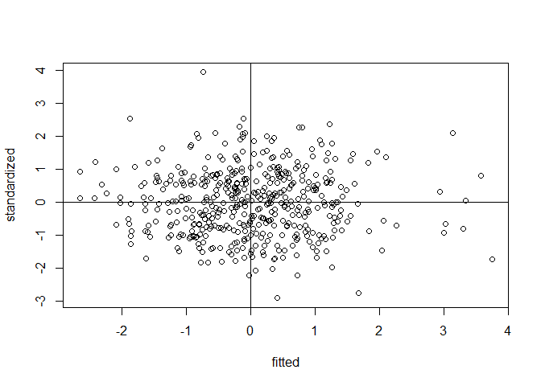
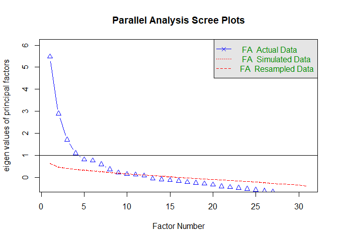
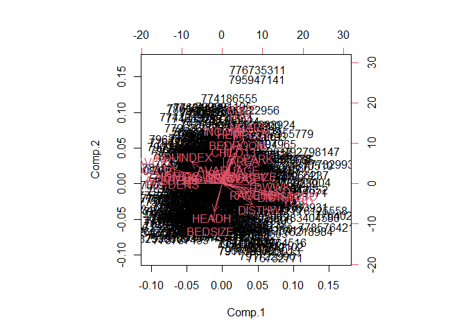

Exploratory Factor Analysis
================

## EXAMPLE EXERCISE:

### “Residential location satisfaction in the Lisbon metropolitan area”

The aim of this study was to examine the perception of households
towards their residential location considering several land use and
accessibility factors as well as household socioeconomic and attitudinal
characteristics.

*Reference:* **Martinez, L. G., de Abreu e Silva, J., & Viegas, J. M.
(2010). Assessment of residential location satisfaction in the Lisbon
metropolitan area, TRB (No. 10-1161).**

> Your task: Analyse the data and create meaningful latent factors.

### Variables:

  - `DWELCLAS`: Classification of the dwelling;
  - `INCOME`: Income of the household;
  - `CHILD13`: Number of children under 13 years old;
  - `H18`: Number of household members above 18 years old;
  - `HEMPLOY`: Number of household members employed;
  - `HSIZE`: Household size;
  - `IAGE`: Age of the respondent;
  - `ISEX`: Sex of the respondent;
  - `NCARS`: Number of cars in the household;
  - `AREA`: Area of the dwelling;
  - `BEDROOM`: Number of bedrooms in the dwelling;
  - `PARK`: Number of parking spaces in the dwelling;
  - `BEDSIZE`: BEDROOM/HSIZE;
  - `PARKSIZE`: PARK/NCARS;
  - `RAGE10`: 1 if Dwelling age \<= 10;
  - `TCBD`: Private car distance in time to CBD;
  - `DISTTC`: Euclidean distance to heavy public transport system stops;
  - `TWCBD`: Private car distance in time of workplace to CBD;
  - `TDWWK`: Private car distance in time of dwelling to work place;
  - `HEADH`: 1 if Head of the Household;
  - `POPDENS`: Population density per hectare;
  - `EQUINDEX`: Number of undergraduate students/Population over 20
    years old (500m)

### Rules of thumb:

  - At least 10 variables
  - n \< 50 (Unacceptable); n \> 200 (recommended)
  - It is recommended to use continuous variables. If your data contains
    categorical variables, you should transform them to dummy variables.

### Assumptions:

  - Normality;
  - linearity;
  - Homogeneity;
  - Homoscedasticity (some multicollinearity is desirable);
  - Correlations between variables \< 0.3 (not appropriate to use Factor
    Analysis)

#### Import Libraries

Let’s start\!

``` r
library(foreign) # Library used to read SPSS files
library(nFactors) # Library used for factor analysis
library(tidyverse) # Library used in data science to perform exploratory data analysis
library(summarytools) # Library used for checking the summary of the dataset
library(psych) # Library used for factor analysis
library(GPArotation) # Library used for factor analysis
```

#### Import dataset

``` r
data <- read.spss("Data/example_fact.sav")
```

#### Take a look at the main characteristics of the dataset

``` r
class(data) #type of data
```

    ## [1] "list"

``` r
str(data)
```

    ## List of 32
    ##  $ RespondentID: num [1:470] 7.99e+08 7.98e+08 7.98e+08 7.98e+08 7.98e+08 ...
    ##  $ DWELCLAS    : num [1:470] 5 6 6 5 6 6 4 2 6 5 ...
    ##  $ INCOME      : num [1:470] 7500 4750 4750 7500 2750 1500 12500 1500 1500 1500 ...
    ##  $ CHILD13     : num [1:470] 1 0 2 0 1 0 0 0 0 0 ...
    ##  $ H18         : num [1:470] 2 1 2 3 1 3 3 4 1 1 ...
    ##  $ HEMPLOY     : num [1:470] 2 1 2 2 1 2 0 2 1 1 ...
    ##  $ HSIZE       : num [1:470] 3 1 4 4 2 3 3 4 1 1 ...
    ##  $ AVADUAGE    : num [1:470] 32 31 41.5 44.7 33 ...
    ##  $ IAGE        : num [1:470] 32 31 42 52 33 47 62 21 34 25 ...
    ##  $ ISEX        : num [1:470] 1 1 0 1 0 1 1 0 0 0 ...
    ##  $ NCARS       : num [1:470] 2 1 2 3 1 1 2 3 1 1 ...
    ##  $ AREA        : num [1:470] 100 90 220 120 90 100 178 180 80 50 ...
    ##  $ BEDROOM     : num [1:470] 2 2 4 3 2 2 5 3 2 1 ...
    ##  $ PARK        : num [1:470] 1 1 2 0 0 0 2 0 0 1 ...
    ##  $ BEDSIZE     : num [1:470] 0.667 2 1 0.75 1 ...
    ##  $ PARKSIZE    : num [1:470] 0.5 1 1 0 0 0 1 0 0 1 ...
    ##  $ RAGE10      : num [1:470] 1 0 1 0 0 0 0 0 1 1 ...
    ##  $ TCBD        : num [1:470] 36.79 15.47 24.1 28.72 7.28 ...
    ##  $ DISTHTC     : num [1:470] 629 551 548 2351 698 ...
    ##  $ TWCBD       : num [1:470] 10 15.5 12.71 3.17 5.36 ...
    ##  $ TDWWK       : num [1:470] 31.1 0 20.4 32.9 13 ...
    ##  $ HEADH       : num [1:470] 1 1 1 1 1 1 1 0 1 1 ...
    ##  $ POPDENS     : num [1:470] 85.7 146.4 106.6 36.8 181.6 ...
    ##  $ EDUINDEX    : num [1:470] 0.0641 0.2672 0.1 0.0867 0.1309 ...
    ##  $ GRAVCPC     : num [1:470] 0.249 0.329 0.24 0.273 0.285 ...
    ##  $ GRAVCPT     : num [1:470] 0.249 0.31 0.29 0.249 0.291 ...
    ##  $ GRAVPCPT    : num [1:470] 1 1.062 0.826 1.099 0.98 ...
    ##  $ NSTRTC      : num [1:470] 38 34 33 6 31 45 12 6 4 22 ...
    ##  $ DISTHW      : num [1:470] 2036 748 2279 1196 3507 ...
    ##  $ DIVIDX      : num [1:470] 0.323 0.348 0.324 0.327 0.355 ...
    ##  $ ACTDENS     : num [1:470] 0.672 2.486 1.625 1.766 11.325 ...
    ##  $ DISTCBD     : num [1:470] 9776 3524 11036 6257 1265 ...
    ##  - attr(*, "label.table")=List of 32
    ##   ..$ RespondentID: NULL
    ##   ..$ DWELCLAS    : NULL
    ##   ..$ INCOME      : NULL
    ##   ..$ CHILD13     : NULL
    ##   ..$ H18         : NULL
    ##   ..$ HEMPLOY     : NULL
    ##   ..$ HSIZE       : NULL
    ##   ..$ AVADUAGE    : NULL
    ##   ..$ IAGE        : NULL
    ##   ..$ ISEX        : NULL
    ##   ..$ NCARS       : NULL
    ##   ..$ AREA        : NULL
    ##   ..$ BEDROOM     : NULL
    ##   ..$ PARK        : NULL
    ##   ..$ BEDSIZE     : NULL
    ##   ..$ PARKSIZE    : NULL
    ##   ..$ RAGE10      : NULL
    ##   ..$ TCBD        : NULL
    ##   ..$ DISTHTC     : NULL
    ##   ..$ TWCBD       : NULL
    ##   ..$ TDWWK       : NULL
    ##   ..$ HEADH       : NULL
    ##   ..$ POPDENS     : NULL
    ##   ..$ EDUINDEX    : NULL
    ##   ..$ GRAVCPC     : NULL
    ##   ..$ GRAVCPT     : NULL
    ##   ..$ GRAVPCPT    : NULL
    ##   ..$ NSTRTC      : NULL
    ##   ..$ DISTHW      : NULL
    ##   ..$ DIVIDX      : NULL
    ##   ..$ ACTDENS     : NULL
    ##   ..$ DISTCBD     : NULL
    ##  - attr(*, "codepage")= int 1252
    ##  - attr(*, "variable.labels")= Named chr(0) 
    ##   ..- attr(*, "names")= chr(0)

#### Transform dataset into dataframe

``` r
df <- data.frame(data)
```

#### Check summary statistics of variables

``` r
descriptive_stats <- dfSummary(df)
```

``` r
view(descriptive_stats)
```

<style type="text/css">
 img {   background-color: transparent;   border: 0; }  .st-table td, .st-table th {   padding: 8px; }  .st-table > thead > tr {    background-color: #eeeeee; }  .st-cross-table td {   text-align: center; }  .st-descr-table td {   text-align: right; }  table.st-table th {   text-align: center; }  table.st-table > thead > tr {    background-color: #eeeeee; }  table.st-table td span {   display: block; }  table.st-table > tfoot > tr > td {   border:none; }  .st-container {   width: 100%;   padding-right: 15px;   padding-left: 15px;   margin-right: auto;   margin-left: auto;   margin-top: 15px; }  .st-multiline {   white-space: pre; }  .st-table {     width: auto;     table-layout: auto;     margin-top: 20px;     margin-bottom: 20px;     max-width: 100%;     background-color: transparent;     border-collapse: collapse; }  .st-table > thead > tr > th, .st-table > tbody > tr > th, .st-table > tfoot > tr > th, .st-table > thead > tr > td, .st-table > tbody > tr > td, .st-table > tfoot > tr > td {   vertical-align: middle; }  .st-table-bordered {   border: 1px solid #bbbbbb; }  .st-table-bordered > thead > tr > th, .st-table-bordered > tbody > tr > th, .st-table-bordered > thead > tr > td, .st-table-bordered > tbody > tr > td {   border: 1px solid #cccccc; }  .st-table-bordered > thead > tr > th, .st-table-bordered > thead > tr > td, .st-table thead > tr > th {   border-bottom: none; }  .st-freq-table > thead > tr > th, .st-freq-table > tbody > tr > th, .st-freq-table > tfoot > tr > th, .st-freq-table > thead > tr > td, .st-freq-table > tbody > tr > td, .st-freq-table > tfoot > tr > td, .st-freq-table-nomiss > thead > tr > th, .st-freq-table-nomiss > tbody > tr > th, .st-freq-table-nomiss > tfoot > tr > th, .st-freq-table-nomiss > thead > tr > td, .st-freq-table-nomiss > tbody > tr > td, .st-freq-table-nomiss > tfoot > tr > td, .st-cross-table > thead > tr > th, .st-cross-table > tbody > tr > th, .st-cross-table > tfoot > tr > th, .st-cross-table > thead > tr > td, .st-cross-table > tbody > tr > td, .st-cross-table > tfoot > tr > td {   padding-left: 20px;   padding-right: 20px; }  .st-table-bordered > thead > tr > th, .st-table-bordered > tbody > tr > th, .st-table-bordered > thead > tr > td, .st-table-bordered > tbody > tr > td {   border: 1px solid #cccccc; }  .st-table-striped > tbody > tr:nth-of-type(odd) {   background-color: #ffffff; }  .st-table-striped > tbody > tr:nth-of-type(even) {   background-color: #f9f9f9; }  .st-descr-table > thead > tr > th, .st-descr-table > tbody > tr > th, .st-descr-table > thead > tr > td, .st-descr-table > tbody > tr > td {   padding-left: 24px;   padding-right: 24px;   word-wrap: break-word; }  .st-freq-table, .st-freq-table-nomiss, .st-cross-table {   border: medium none; }  .st-freq-table > thead > tr:nth-child(1) > th:nth-child(1), .st-cross-table > thead > tr:nth-child(1) > th:nth-child(1), .st-cross-table > thead > tr:nth-child(1) > th:nth-child(3) {   border: none;   background-color: #ffffff;   text-align: center; }  .st-protect-top-border {   border-top: 1px solid #cccccc !important; }  .st-ws-char {   display: inline;   color: #999999;   letter-spacing: 0.2em; }  /* Optionnal classes */ .st-small {   font-size: 13px; }  .st-small td, .st-small th {   padding: 8px; }  .st-small > thead > tr > th, .st-small > tbody > tr > th, .st-small > thead > tr > td, .st-small > tbody > tr > td {   padding-left: 12px;   padding-right: 12px; } </style>

### Data Frame Summary

**df**  
**Dimensions:** 470 x 32  
**Duplicates:** 0

<table style="width:100%;">
<colgroup>
<col style="width: 4%" />
<col style="width: 13%" />
<col style="width: 31%" />
<col style="width: 18%" />
<col style="width: 23%" />
<col style="width: 8%" />
</colgroup>
<thead>
<tr class="header">
<th style="text-align: left;">No</th>
<th style="text-align: left;">Variable</th>
<th style="text-align: left;">Stats / Values</th>
<th style="text-align: left;">Freqs (% of Valid)</th>
<th style="text-align: left;">Graph</th>
<th style="text-align: left;">Missing</th>
</tr>
</thead>
<tbody>
<tr class="odd">
<td style="text-align: left;">1</td>
<td style="text-align: left;">RespondentID<br />
[numeric]</td>
<td style="text-align: left;">Mean (sd) : 784082877.9 (8627500.7)<br />
min &lt; med &lt; max:<br />
773001005 &lt; 780248282.5 &lt; 808234671<br />
IQR (CV) : 16634784.8 (0)</td>
<td style="text-align: left;">470 distinct values</td>
<td style="text-align: left;"><br />
  :<br />
  :     :<br />
  :     :<br />
: :     :<br />
: : : : : :</td>
<td style="text-align: left;">0<br />
(0%)</td>
</tr>
<tr class="even">
<td style="text-align: left;">2</td>
<td style="text-align: left;">DWELCLAS<br />
[numeric]</td>
<td style="text-align: left;">Mean (sd) : 5.1 (1.3)<br />
min &lt; med &lt; max:<br />
1 &lt; 5 &lt; 7<br />
IQR (CV) : 2 (0.2)</td>
<td style="text-align: left;">1 : 5 ( 1.1%)<br />
2 : 14 ( 3.0%)<br />
3 : 31 ( 6.6%)<br />
4 : 75 (16.0%)<br />
5 : 130 (27.7%)<br />
6 : 162 (34.5%)<br />
7 : 53 (11.3%)</td>
<td style="text-align: left;"><br />
<br />
I<br />
III<br />
IIIII<br />
IIIIII<br />
II</td>
<td style="text-align: left;">0<br />
(0%)</td>
</tr>
<tr class="odd">
<td style="text-align: left;">3</td>
<td style="text-align: left;">INCOME<br />
[numeric]</td>
<td style="text-align: left;">Mean (sd) : 4259.6 (3001.8)<br />
min &lt; med &lt; max:<br />
700 &lt; 2750 &lt; 12500<br />
IQR (CV) : 2000 (0.7)</td>
<td style="text-align: left;">700 : 20 ( 4.3%)<br />
1500 : 96 (20.4%)<br />
2750 : 142 (30.2%)<br />
4750 : 106 (22.6%)<br />
7500 : 75 (16.0%)<br />
12500 : 31 ( 6.6%)</td>
<td style="text-align: left;"><br />
IIII<br />
IIIIII<br />
IIII<br />
III<br />
I</td>
<td style="text-align: left;">0<br />
(0%)</td>
</tr>
<tr class="even">
<td style="text-align: left;">4</td>
<td style="text-align: left;">CHILD13<br />
[numeric]</td>
<td style="text-align: left;">Mean (sd) : 0.4 (0.8)<br />
min &lt; med &lt; max:<br />
0 &lt; 0 &lt; 4<br />
IQR (CV) : 0 (2)</td>
<td style="text-align: left;">0 : 353 (75.1%)<br />
1 : 62 (13.2%)<br />
2 : 41 ( 8.7%)<br />
3 : 13 ( 2.8%)<br />
4 : 1 ( 0.2%)</td>
<td style="text-align: left;">IIIIIIIIIIIIIII<br />
II<br />
I<br />
<br />
</td>
<td style="text-align: left;">0<br />
(0%)</td>
</tr>
<tr class="odd">
<td style="text-align: left;">5</td>
<td style="text-align: left;">H18<br />
[numeric]</td>
<td style="text-align: left;">Mean (sd) : 2.1 (0.9)<br />
min &lt; med &lt; max:<br />
0 &lt; 2 &lt; 6<br />
IQR (CV) : 0.8 (0.4)</td>
<td style="text-align: left;">0 : 1 ( 0.2%)<br />
1 : 112 (23.8%)<br />
2 : 239 (50.8%)<br />
3 : 77 (16.4%)<br />
4 : 35 ( 7.4%)<br />
5 : 3 ( 0.6%)<br />
6 : 3 ( 0.6%)</td>
<td style="text-align: left;"><br />
IIII<br />
IIIIIIIIII<br />
III<br />
I<br />
<br />
</td>
<td style="text-align: left;">0<br />
(0%)</td>
</tr>
<tr class="even">
<td style="text-align: left;">6</td>
<td style="text-align: left;">HEMPLOY<br />
[numeric]</td>
<td style="text-align: left;">Mean (sd) : 1.5 (0.7)<br />
min &lt; med &lt; max:<br />
0 &lt; 2 &lt; 5<br />
IQR (CV) : 1 (0.5)</td>
<td style="text-align: left;">0 : 39 ( 8.3%)<br />
1 : 171 (36.4%)<br />
2 : 237 (50.4%)<br />
3 : 21 ( 4.5%)<br />
4 : 1 ( 0.2%)<br />
5 : 1 ( 0.2%)</td>
<td style="text-align: left;">I<br />
IIIIIII<br />
IIIIIIIIII<br />
<br />
<br />
</td>
<td style="text-align: left;">0<br />
(0%)</td>
</tr>
<tr class="odd">
<td style="text-align: left;">7</td>
<td style="text-align: left;">HSIZE<br />
[numeric]</td>
<td style="text-align: left;">Mean (sd) : 2.6 (1.3)<br />
min &lt; med &lt; max:<br />
1 &lt; 2 &lt; 7<br />
IQR (CV) : 2 (0.5)</td>
<td style="text-align: left;">1 : 104 (22.1%)<br />
2 : 147 (31.3%)<br />
3 : 96 (20.4%)<br />
4 : 96 (20.4%)<br />
5 : 20 ( 4.3%)<br />
6 : 5 ( 1.1%)<br />
7 : 2 ( 0.4%)</td>
<td style="text-align: left;">IIII<br />
IIIIII<br />
IIII<br />
IIII<br />
<br />
<br />
</td>
<td style="text-align: left;">0<br />
(0%)</td>
</tr>
<tr class="even">
<td style="text-align: left;">8</td>
<td style="text-align: left;">AVADUAGE<br />
[numeric]</td>
<td style="text-align: left;">Mean (sd) : 37.8 (9.9)<br />
min &lt; med &lt; max:<br />
0 &lt; 36 &lt; 78<br />
IQR (CV) : 12.7 (0.3)</td>
<td style="text-align: left;">126 distinct values</td>
<td style="text-align: left;"><br />
      :<br />
      :<br />
    : : :<br />
    : : :<br />
    : : : : .</td>
<td style="text-align: left;">0<br />
(0%)</td>
</tr>
<tr class="odd">
<td style="text-align: left;">9</td>
<td style="text-align: left;">IAGE<br />
[numeric]</td>
<td style="text-align: left;">Mean (sd) : 36.9 (11.6)<br />
min &lt; med &lt; max:<br />
0 &lt; 34 &lt; 78<br />
IQR (CV) : 15 (0.3)</td>
<td style="text-align: left;">53 distinct values</td>
<td style="text-align: left;"><br />
    : :<br />
    : :<br />
    : : .<br />
    : : : .<br />
    : : : : .</td>
<td style="text-align: left;">0<br />
(0%)</td>
</tr>
<tr class="even">
<td style="text-align: left;">10</td>
<td style="text-align: left;">ISEX<br />
[numeric]</td>
<td style="text-align: left;">Min : 0<br />
Mean : 0.5<br />
Max : 1</td>
<td style="text-align: left;">0 : 214 (45.5%)<br />
1 : 256 (54.5%)</td>
<td style="text-align: left;">IIIIIIIII<br />
IIIIIIIIII</td>
<td style="text-align: left;">0<br />
(0%)</td>
</tr>
<tr class="odd">
<td style="text-align: left;">11</td>
<td style="text-align: left;">NCARS<br />
[numeric]</td>
<td style="text-align: left;">Mean (sd) : 1.7 (0.9)<br />
min &lt; med &lt; max:<br />
0 &lt; 2 &lt; 5<br />
IQR (CV) : 1 (0.5)</td>
<td style="text-align: left;">0 : 23 ( 4.9%)<br />
1 : 182 (38.7%)<br />
2 : 193 (41.1%)<br />
3 : 56 (11.9%)<br />
4 : 13 ( 2.8%)<br />
5 : 3 ( 0.6%)</td>
<td style="text-align: left;"><br />
IIIIIII<br />
IIIIIIII<br />
II<br />
<br />
</td>
<td style="text-align: left;">0<br />
(0%)</td>
</tr>
<tr class="even">
<td style="text-align: left;">12</td>
<td style="text-align: left;">AREA<br />
[numeric]</td>
<td style="text-align: left;">Mean (sd) : 133 (121.5)<br />
min &lt; med &lt; max:<br />
30 &lt; 110 &lt; 2250<br />
IQR (CV) : 60 (0.9)</td>
<td style="text-align: left;">76 distinct values</td>
<td style="text-align: left;"><br />
:<br />
:<br />
:<br />
:<br />
:</td>
<td style="text-align: left;">0<br />
(0%)</td>
</tr>
<tr class="odd">
<td style="text-align: left;">13</td>
<td style="text-align: left;">BEDROOM<br />
[numeric]</td>
<td style="text-align: left;">Mean (sd) : 2.9 (1.1)<br />
min &lt; med &lt; max:<br />
0 &lt; 3 &lt; 7<br />
IQR (CV) : 1 (0.4)</td>
<td style="text-align: left;">0 : 1 ( 0.2%)<br />
1 : 28 ( 6.0%)<br />
2 : 153 (32.6%)<br />
3 : 180 (38.3%)<br />
4 : 73 (15.5%)<br />
5 : 26 ( 5.5%)<br />
6 : 7 ( 1.5%)<br />
7 : 2 ( 0.4%)</td>
<td style="text-align: left;"><br />
I<br />
IIIIII<br />
IIIIIII<br />
III<br />
I<br />
<br />
</td>
<td style="text-align: left;">0<br />
(0%)</td>
</tr>
<tr class="even">
<td style="text-align: left;">14</td>
<td style="text-align: left;">PARK<br />
[numeric]</td>
<td style="text-align: left;">Mean (sd) : 0.8 (1)<br />
min &lt; med &lt; max:<br />
0 &lt; 1 &lt; 4<br />
IQR (CV) : 1 (1.2)</td>
<td style="text-align: left;">0 : 224 (47.7%)<br />
1 : 136 (28.9%)<br />
2 : 84 (17.9%)<br />
3 : 18 ( 3.8%)<br />
4 : 8 ( 1.7%)</td>
<td style="text-align: left;">IIIIIIIII<br />
IIIII<br />
III<br />
<br />
</td>
<td style="text-align: left;">0<br />
(0%)</td>
</tr>
<tr class="odd">
<td style="text-align: left;">15</td>
<td style="text-align: left;">BEDSIZE<br />
[numeric]</td>
<td style="text-align: left;">Mean (sd) : 1.4 (0.8)<br />
min &lt; med &lt; max:<br />
0 &lt; 1 &lt; 5<br />
IQR (CV) : 0.7 (0.6)</td>
<td style="text-align: left;">22 distinct values</td>
<td style="text-align: left;"><br />
  :<br />
  :<br />
  :<br />
  : . .<br />
. : : :   .</td>
<td style="text-align: left;">0<br />
(0%)</td>
</tr>
<tr class="even">
<td style="text-align: left;">16</td>
<td style="text-align: left;">PARKSIZE<br />
[numeric]</td>
<td style="text-align: left;">Mean (sd) : 0.5 (0.6)<br />
min &lt; med &lt; max:<br />
0 &lt; 0.2 &lt; 3<br />
IQR (CV) : 1 (1.2)</td>
<td style="text-align: left;">13 distinct values</td>
<td style="text-align: left;"><br />
:<br />
:<br />
:<br />
: :<br />
: :   .</td>
<td style="text-align: left;">0<br />
(0%)</td>
</tr>
<tr class="odd">
<td style="text-align: left;">17</td>
<td style="text-align: left;">RAGE10<br />
[numeric]</td>
<td style="text-align: left;">Min : 0<br />
Mean : 0.2<br />
Max : 1</td>
<td style="text-align: left;">0 : 356 (75.7%)<br />
1 : 114 (24.3%)</td>
<td style="text-align: left;">IIIIIIIIIIIIIII<br />
IIII</td>
<td style="text-align: left;">0<br />
(0%)</td>
</tr>
<tr class="even">
<td style="text-align: left;">18</td>
<td style="text-align: left;">TCBD<br />
[numeric]</td>
<td style="text-align: left;">Mean (sd) : 24.7 (16.2)<br />
min &lt; med &lt; max:<br />
0.8 &lt; 23.8 &lt; 73.3<br />
IQR (CV) : 25.7 (0.7)</td>
<td style="text-align: left;">434 distinct values</td>
<td style="text-align: left;"><br />
:<br />
: : . :<br />
: : : :<br />
: : : : . .<br />
: : : : : : .</td>
<td style="text-align: left;">0<br />
(0%)</td>
</tr>
<tr class="odd">
<td style="text-align: left;">19</td>
<td style="text-align: left;">DISTHTC<br />
[numeric]</td>
<td style="text-align: left;">Mean (sd) : 1347 (1815.8)<br />
min &lt; med &lt; max:<br />
49 &lt; 719 &lt; 17732.7<br />
IQR (CV) : 1125 (1.3)</td>
<td style="text-align: left;">434 distinct values</td>
<td style="text-align: left;"><br />
:<br />
:<br />
:<br />
:<br />
: .</td>
<td style="text-align: left;">0<br />
(0%)</td>
</tr>
<tr class="even">
<td style="text-align: left;">20</td>
<td style="text-align: left;">TWCBD<br />
[numeric]</td>
<td style="text-align: left;">Mean (sd) : 17 (16.2)<br />
min &lt; med &lt; max:<br />
0.3 &lt; 9.9 &lt; 67.8<br />
IQR (CV) : 20 (1)</td>
<td style="text-align: left;">439 distinct values</td>
<td style="text-align: left;"><br />
:<br />
:<br />
: .<br />
: :   .<br />
: : : : . : .   .</td>
<td style="text-align: left;">0<br />
(0%)</td>
</tr>
<tr class="odd">
<td style="text-align: left;">21</td>
<td style="text-align: left;">TDWWK<br />
[numeric]</td>
<td style="text-align: left;">Mean (sd) : 23.5 (17.1)<br />
min &lt; med &lt; max:<br />
0 &lt; 22.2 &lt; 80.7<br />
IQR (CV) : 23.6 (0.7)</td>
<td style="text-align: left;">414 distinct values</td>
<td style="text-align: left;"><br />
: .<br />
: : : :<br />
: : : :<br />
: : : : .<br />
: : : : : . .</td>
<td style="text-align: left;">0<br />
(0%)</td>
</tr>
<tr class="even">
<td style="text-align: left;">22</td>
<td style="text-align: left;">HEADH<br />
[numeric]</td>
<td style="text-align: left;">Min : 0<br />
Mean : 0.9<br />
Max : 1</td>
<td style="text-align: left;">0 : 64 (13.6%)<br />
1 : 406 (86.4%)</td>
<td style="text-align: left;">II<br />
IIIIIIIIIIIIIIIII</td>
<td style="text-align: left;">0<br />
(0%)</td>
</tr>
<tr class="odd">
<td style="text-align: left;">23</td>
<td style="text-align: left;">POPDENS<br />
[numeric]</td>
<td style="text-align: left;">Mean (sd) : 92 (58.2)<br />
min &lt; med &lt; max:<br />
0 &lt; 83.2 &lt; 255.6<br />
IQR (CV) : 89.2 (0.6)</td>
<td style="text-align: left;">431 distinct values</td>
<td style="text-align: left;"><br />
    . :<br />
: : : :<br />
: : : : : . .<br />
: : : : : : : .<br />
: : : : : : : : :</td>
<td style="text-align: left;">0<br />
(0%)</td>
</tr>
<tr class="even">
<td style="text-align: left;">24</td>
<td style="text-align: left;">EDUINDEX<br />
[numeric]</td>
<td style="text-align: left;">Mean (sd) : 0.2 (0.1)<br />
min &lt; med &lt; max:<br />
0 &lt; 0.2 &lt; 0.7<br />
IQR (CV) : 0.2 (0.6)</td>
<td style="text-align: left;">434 distinct values</td>
<td style="text-align: left;"><br />
  :<br />
  : .<br />
  : : :<br />
: : : : : .<br />
: : : : : : : . .</td>
<td style="text-align: left;">0<br />
(0%)</td>
</tr>
<tr class="odd">
<td style="text-align: left;">25</td>
<td style="text-align: left;">GRAVCPC<br />
[numeric]</td>
<td style="text-align: left;">Mean (sd) : 0.3 (0.1)<br />
min &lt; med &lt; max:<br />
0.1 &lt; 0.3 &lt; 0.4<br />
IQR (CV) : 0.1 (0.2)</td>
<td style="text-align: left;">433 distinct values</td>
<td style="text-align: left;"><br />
          :<br />
          :<br />
        . : .<br />
      . : : :<br />
  . : : : : :</td>
<td style="text-align: left;">0<br />
(0%)</td>
</tr>
<tr class="even">
<td style="text-align: left;">26</td>
<td style="text-align: left;">GRAVCPT<br />
[numeric]</td>
<td style="text-align: left;">Mean (sd) : 0.3 (0.1)<br />
min &lt; med &lt; max:<br />
0 &lt; 0.3 &lt; 0.4<br />
IQR (CV) : 0.1 (0.2)</td>
<td style="text-align: left;">434 distinct values</td>
<td style="text-align: left;"><br />
            :<br />
          : :<br />
        : : :<br />
      : : : :<br />
    . : : : :</td>
<td style="text-align: left;">0<br />
(0%)</td>
</tr>
<tr class="odd">
<td style="text-align: left;">27</td>
<td style="text-align: left;">GRAVPCPT<br />
[numeric]</td>
<td style="text-align: left;">Mean (sd) : 1.2 (0.3)<br />
min &lt; med &lt; max:<br />
0.5 &lt; 1.1 &lt; 2.9<br />
IQR (CV) : 0.2 (0.3)</td>
<td style="text-align: left;">434 distinct values</td>
<td style="text-align: left;"><br />
    :<br />
    :<br />
    :<br />
    : .<br />
. : : : . .</td>
<td style="text-align: left;">0<br />
(0%)</td>
</tr>
<tr class="even">
<td style="text-align: left;">28</td>
<td style="text-align: left;">NSTRTC<br />
[numeric]</td>
<td style="text-align: left;">Mean (sd) : 22.2 (12.6)<br />
min &lt; med &lt; max:<br />
0 &lt; 22 &lt; 84<br />
IQR (CV) : 16 (0.6)</td>
<td style="text-align: left;">59 distinct values</td>
<td style="text-align: left;"><br />
  : .<br />
  : :<br />
: : : :<br />
: : : :<br />
: : : : .</td>
<td style="text-align: left;">0<br />
(0%)</td>
</tr>
<tr class="odd">
<td style="text-align: left;">29</td>
<td style="text-align: left;">DISTHW<br />
[numeric]</td>
<td style="text-align: left;">Mean (sd) : 1883.4 (1748.3)<br />
min &lt; med &lt; max:<br />
74.7 &lt; 1338.7 &lt; 16590.1<br />
IQR (CV) : 1820.5 (0.9)</td>
<td style="text-align: left;">434 distinct values</td>
<td style="text-align: left;"><br />
:<br />
:<br />
:<br />
: :<br />
: : . .</td>
<td style="text-align: left;">0<br />
(0%)</td>
</tr>
<tr class="even">
<td style="text-align: left;">30</td>
<td style="text-align: left;">DIVIDX<br />
[numeric]</td>
<td style="text-align: left;">Mean (sd) : 0.4 (0.1)<br />
min &lt; med &lt; max:<br />
0.3 &lt; 0.4 &lt; 0.6<br />
IQR (CV) : 0.1 (0.2)</td>
<td style="text-align: left;">144 distinct values</td>
<td style="text-align: left;"><br />
  :<br />
  : :<br />
  : :<br />
  : :<br />
: : : : : . . .</td>
<td style="text-align: left;">0<br />
(0%)</td>
</tr>
<tr class="odd">
<td style="text-align: left;">31</td>
<td style="text-align: left;">ACTDENS<br />
[numeric]</td>
<td style="text-align: left;">Mean (sd) : 5.8 (8.5)<br />
min &lt; med &lt; max:<br />
0 &lt; 2.5 &lt; 63.2<br />
IQR (CV) : 3.5 (1.5)</td>
<td style="text-align: left;">144 distinct values</td>
<td style="text-align: left;"><br />
:<br />
:<br />
:<br />
:<br />
: . .</td>
<td style="text-align: left;">0<br />
(0%)</td>
</tr>
<tr class="even">
<td style="text-align: left;">32</td>
<td style="text-align: left;">DISTCBD<br />
[numeric]</td>
<td style="text-align: left;">Mean (sd) : 7967.4 (7442.9)<br />
min &lt; med &lt; max:<br />
148.9 &lt; 5542.3 &lt; 44004.6<br />
IQR (CV) : 9777.9 (0.9)</td>
<td style="text-align: left;">434 distinct values</td>
<td style="text-align: left;"><br />
:<br />
:<br />
:<br />
: : .<br />
: : : : .</td>
<td style="text-align: left;">0<br />
(0%)</td>
</tr>
</tbody>
</table>

``` r
summary(df)
```

    ##   RespondentID          DWELCLAS         INCOME         CHILD13      
    ##  Min.   :773001005   Min.   :1.000   Min.   :  700   Min.   :0.0000  
    ##  1st Qu.:776363273   1st Qu.:4.000   1st Qu.: 2750   1st Qu.:0.0000  
    ##  Median :780248282   Median :5.000   Median : 2750   Median :0.0000  
    ##  Mean   :784082878   Mean   :5.147   Mean   : 4260   Mean   :0.3979  
    ##  3rd Qu.:792998058   3rd Qu.:6.000   3rd Qu.: 4750   3rd Qu.:0.0000  
    ##  Max.   :808234671   Max.   :7.000   Max.   :12500   Max.   :4.0000  
    ##       H18           HEMPLOY          HSIZE          AVADUAGE    
    ##  Min.   :0.000   Min.   :0.000   Min.   :1.000   Min.   : 0.00  
    ##  1st Qu.:2.000   1st Qu.:1.000   1st Qu.:2.000   1st Qu.:30.33  
    ##  Median :2.000   Median :2.000   Median :2.000   Median :36.00  
    ##  Mean   :2.115   Mean   :1.526   Mean   :2.583   Mean   :37.79  
    ##  3rd Qu.:2.750   3rd Qu.:2.000   3rd Qu.:4.000   3rd Qu.:43.00  
    ##  Max.   :6.000   Max.   :5.000   Max.   :7.000   Max.   :78.00  
    ##       IAGE            ISEX            NCARS            AREA     
    ##  Min.   : 0.00   Min.   :0.0000   Min.   :0.000   Min.   :  30  
    ##  1st Qu.:28.00   1st Qu.:0.0000   1st Qu.:1.000   1st Qu.:  90  
    ##  Median :34.00   Median :1.0000   Median :2.000   Median : 110  
    ##  Mean   :36.89   Mean   :0.5447   Mean   :1.709   Mean   : 133  
    ##  3rd Qu.:43.00   3rd Qu.:1.0000   3rd Qu.:2.000   3rd Qu.: 150  
    ##  Max.   :78.00   Max.   :1.0000   Max.   :5.000   Max.   :2250  
    ##     BEDROOM           PARK           BEDSIZE        PARKSIZE     
    ##  Min.   :0.000   Min.   :0.0000   Min.   :0.00   Min.   :0.0000  
    ##  1st Qu.:2.000   1st Qu.:0.0000   1st Qu.:0.80   1st Qu.:0.0000  
    ##  Median :3.000   Median :1.0000   Median :1.00   Median :0.2500  
    ##  Mean   :2.877   Mean   :0.8298   Mean   :1.35   Mean   :0.4662  
    ##  3rd Qu.:3.000   3rd Qu.:1.0000   3rd Qu.:1.50   3rd Qu.:1.0000  
    ##  Max.   :7.000   Max.   :4.0000   Max.   :5.00   Max.   :3.0000  
    ##      RAGE10            TCBD            DISTHTC             TWCBD        
    ##  Min.   :0.0000   Min.   : 0.7817   Min.   :   49.05   Min.   : 0.3116  
    ##  1st Qu.:0.0000   1st Qu.: 9.9509   1st Qu.:  400.47   1st Qu.: 5.2482  
    ##  Median :0.0000   Median :23.8093   Median :  719.04   Median : 9.8600  
    ##  Mean   :0.2426   Mean   :24.7046   Mean   : 1346.98   Mean   :16.9986  
    ##  3rd Qu.:0.0000   3rd Qu.:35.6981   3rd Qu.: 1525.45   3rd Qu.:25.2658  
    ##  Max.   :1.0000   Max.   :73.2820   Max.   :17732.68   Max.   :67.8190  
    ##      TDWWK           HEADH           POPDENS          EDUINDEX      
    ##  Min.   : 0.00   Min.   :0.0000   Min.   :  0.00   Min.   :0.00000  
    ##  1st Qu.:10.14   1st Qu.:1.0000   1st Qu.: 45.86   1st Qu.:0.09601  
    ##  Median :22.18   Median :1.0000   Median : 83.17   Median :0.17319  
    ##  Mean   :23.53   Mean   :0.8638   Mean   : 92.00   Mean   :0.19880  
    ##  3rd Qu.:33.72   3rd Qu.:1.0000   3rd Qu.:135.01   3rd Qu.:0.27699  
    ##  Max.   :80.72   Max.   :1.0000   Max.   :255.55   Max.   :0.65966  
    ##     GRAVCPC           GRAVCPT           GRAVPCPT          NSTRTC     
    ##  Min.   :0.06528   Min.   :0.02569   Min.   :0.4534   Min.   : 0.00  
    ##  1st Qu.:0.25301   1st Qu.:0.22117   1st Qu.:0.9985   1st Qu.:14.00  
    ##  Median :0.30924   Median :0.28129   Median :1.0911   Median :22.00  
    ##  Mean   :0.28980   Mean   :0.26186   Mean   :1.1517   Mean   :22.22  
    ##  3rd Qu.:0.34041   3rd Qu.:0.31036   3rd Qu.:1.2224   3rd Qu.:30.00  
    ##  Max.   :0.39395   Max.   :0.36508   Max.   :2.8799   Max.   :84.00  
    ##      DISTHW             DIVIDX          ACTDENS            DISTCBD       
    ##  Min.   :   74.67   Min.   :0.2634   Min.   : 0.02199   Min.   :  148.9  
    ##  1st Qu.:  712.79   1st Qu.:0.3239   1st Qu.: 1.31611   1st Qu.: 2025.3  
    ##  Median : 1338.74   Median :0.3548   Median : 2.49377   Median : 5542.3  
    ##  Mean   : 1883.41   Mean   :0.3777   Mean   : 5.77963   Mean   : 7967.4  
    ##  3rd Qu.: 2533.30   3rd Qu.:0.3970   3rd Qu.: 4.85162   3rd Qu.:11803.2  
    ##  Max.   :16590.06   Max.   :0.6500   Max.   :63.18205   Max.   :44004.6

> **Note:** I used other functions for summary statistics compared to
> the MLR chapter. R allows you to do the same or similar tasks with
> different packages.

#### Take a look at the first values of the dataset

``` r
head(df,10)
```

    ##    RespondentID DWELCLAS INCOME CHILD13 H18 HEMPLOY HSIZE AVADUAGE IAGE ISEX
    ## 1     799161661        5   7500       1   2       2     3 32.00000   32    1
    ## 2     798399409        6   4750       0   1       1     1 31.00000   31    1
    ## 3     798374392        6   4750       2   2       2     4 41.50000   42    0
    ## 4     798275277        5   7500       0   3       2     4 44.66667   52    1
    ## 5     798264250        6   2750       1   1       1     2 33.00000   33    0
    ## 6     798235878        6   1500       0   3       2     3 30.00000   47    1
    ## 7     797907742        4  12500       0   3       0     3 69.33333   62    1
    ## 8     797871767        2   1500       0   4       2     4 48.75000   21    0
    ## 9     797821210        6   1500       0   1       1     1 34.00000   34    0
    ## 10    797552006        5   1500       0   1       1     1 25.00000   25    0
    ##    NCARS AREA BEDROOM PARK   BEDSIZE PARKSIZE RAGE10      TCBD   DISTHTC
    ## 1      2  100       2    1 0.6666667      0.5      1 36.791237  629.1120
    ## 2      1   90       2    1 2.0000000      1.0      0 15.472989  550.5769
    ## 3      2  220       4    2 1.0000000      1.0      1 24.098125  547.8633
    ## 4      3  120       3    0 0.7500000      0.0      0 28.724796 2350.5782
    ## 5      1   90       2    0 1.0000000      0.0      0  7.283384  698.3000
    ## 6      1  100       2    0 0.6666667      0.0      0 20.604348 1838.2472
    ## 7      2  178       5    2 1.6666667      1.0      0 42.613947 6837.6209
    ## 8      3  180       3    0 0.7500000      0.0      0 40.805074 6815.2118
    ## 9      1   80       2    0 2.0000000      0.0      1 46.289862 4308.7500
    ## 10     1   50       1    1 1.0000000      1.0      1  8.701663  512.1624
    ##        TWCBD     TDWWK HEADH    POPDENS   EDUINDEX   GRAVCPC   GRAVCPT
    ## 1  10.003945 31.142824     1  85.701553 0.06406279 0.2492962 0.2492607
    ## 2  15.502989  0.000000     1 146.434938 0.26723192 0.3293831 0.3102800
    ## 3  12.709374 20.384273     1 106.608098 0.09996816 0.2396229 0.2899865
    ## 4   3.168599 32.942463     1  36.783804 0.08671065 0.2734539 0.2487830
    ## 5   5.364160 13.040133     1 181.627196 0.13091674 0.2854017 0.2913676
    ## 6   5.024916 22.424728     1  72.065190 0.31409969 0.3655758 0.2339590
    ## 7  41.749079  9.190614     1  47.797301 0.08100000 0.1559960 0.2087794
    ## 8  45.143804  3.489875     0  40.794500 0.07485605 0.1647730 0.1802961
    ## 9   1.313656 47.399052     1   6.977336 0.04782609 0.1471991 0.2285333
    ## 10 14.502650 15.541200     1 179.615483 0.13547579 0.3353141 0.2940870
    ##     GRAVPCPT NSTRTC    DISTHW    DIVIDX     ACTDENS   DISTCBD
    ## 1  1.0001423     38 2036.4661 0.3225354  0.67224060  9776.142
    ## 2  1.0615674     34  747.7683 0.3484588  2.48603452  3523.994
    ## 3  0.8263245     33 2279.0577 0.3237884  1.62490591 11036.407
    ## 4  1.0991661      6 1196.4665 0.3272149  1.76649226  6257.262
    ## 5  0.9795244     31 3507.2402 0.3545181 11.32493089  1265.239
    ## 6  1.5625632     45  345.3282 0.3545291  4.60901894  6614.929
    ## 7  0.7471812     12 4125.4581 0.3914727  0.05016163 12035.249
    ## 8  0.9139020      6 4346.3370 0.3914727  0.05016163 11759.166
    ## 9  0.6441035      4 2385.6950 0.3534021  0.12445352 11817.881
    ## 10 1.1401870     22 3082.7274 0.3111948  3.84403202  1726.137

#### Make ID as row names or case number

``` r
df<-data.frame(df, row.names = 1)
```

#### Evaluating the assumptions for factoral analysis:

Let’s run a random regression model in order to evaluate some
assumptions

``` r
random = rchisq(nrow(df), 32)
fake = lm(random ~ ., data = df)
standardized = rstudent(fake)
fitted = scale(fake$fitted.values)
```

  - **Normality**

<!-- end list -->

``` r
hist(standardized)
```

<!-- -->

  - **Linearity**

<!-- end list -->

``` r
qqnorm(standardized)
abline(0,1)
```

<!-- -->

  - **Homogeneity**

<!-- end list -->

``` r
plot(fitted, standardized)
abline(0,0)
abline(v=0)
```

<!-- -->

#### Calculate the correlation matrix

``` r
corr_matrix <- cor(df, method = "pearson")
```

#### Check for correlation adequacy - Bartlett’s Test.

``` r
cortest.bartlett(corr_matrix, n = nrow(df))
```

    ## $chisq
    ## [1] 9880.074
    ## 
    ## $p.value
    ## [1] 0
    ## 
    ## $df
    ## [1] 465

> **Note:** The Bartlett test examines if there is equal variance
> (homogeneity) between variables. Thus, it evaluates if there is any
> pattern between variables.  
> **Note:** The null hypothesis is that there is no correlation between
> variables. Therefore, in factor analysis you want to reject the null
> hypothesis.

#### Check for sampling adequacy - KMO test

``` r
KMO(corr_matrix)
```

    ## Kaiser-Meyer-Olkin factor adequacy
    ## Call: KMO(r = corr_matrix)
    ## Overall MSA =  0.68
    ## MSA for each item = 
    ## DWELCLAS   INCOME  CHILD13      H18  HEMPLOY    HSIZE AVADUAGE     IAGE 
    ##     0.70     0.85     0.33     0.58     0.88     0.59     0.38     0.40 
    ##     ISEX    NCARS     AREA  BEDROOM     PARK  BEDSIZE PARKSIZE   RAGE10 
    ##     0.71     0.74     0.60     0.53     0.62     0.58     0.57     0.84 
    ##     TCBD  DISTHTC    TWCBD    TDWWK    HEADH  POPDENS EDUINDEX  GRAVCPC 
    ##     0.88     0.88     0.82     0.89     0.47     0.82     0.85     0.76 
    ##  GRAVCPT GRAVPCPT   NSTRTC   DISTHW   DIVIDX  ACTDENS  DISTCBD 
    ##     0.71     0.31     0.83     0.76     0.63     0.70     0.86

> **Note:** We want at least 0.7 of the overall Mean Sample Adequacy
> (MSA). If, 0.6 \< MSA \< 0.7, it is not a good value, but acceptable
> in some cases.

#### Determine the number of factors to extract

**1.\_Parallel Analysis\_**

``` r
num_factors = fa.parallel(df, fm = "ml", fa = "fa")
```

<!-- -->

    ## Parallel analysis suggests that the number of factors =  8  and the number of components =  NA

> **Note:** fm = factor math; ml = maximum likelihood; fa = factor
> analysis

The selection of the number of factors in the Parallel analysis can be
threefold:

  - Detect where there is an “elbow” in the graph;
  - Detect the intersection between the “FA Actual Data” and the “FA
    Simulated Data”;
  - Consider the number of factors with eigenvalue \> 1.

**2. *Kaiser Criterion***

``` r
sum(num_factors$fa.values > 1)
```

    ## [1] 4

> **Note:** Determines the number of factors with eigenvalue \> 1.

> **Note:** You can also consider factors with eigenvalue \> 0.7, since
> some of the literature indicate that this value does not overestimate
> the number of factors as much as considering an eigenvalue = 1.

**3. *Principal Component Analysis* (PCA)**

``` r
df_pca <- princomp(df, cor=TRUE)
```

> **Note:** cor = TRUE, standardizes your dataset before running a PCA.

\# print variance that explains the components

``` r
summary(df_pca)  
```

    ## Importance of components:
    ##                          Comp.1    Comp.2     Comp.3     Comp.4     Comp.5
    ## Standard deviation     2.450253 1.9587909 1.61305418 1.43367870 1.27628545
    ## Proportion of Variance 0.193669 0.1237697 0.08393367 0.06630434 0.05254531
    ## Cumulative Proportion  0.193669 0.3174388 0.40137245 0.46767679 0.52022210
    ##                            Comp.6     Comp.7     Comp.8    Comp.9    Comp.10
    ## Standard deviation     1.26612033 1.22242045 1.11550534 1.0304937 0.99888665
    ## Proportion of Variance 0.05171164 0.04820361 0.04014039 0.0342554 0.03218628
    ## Cumulative Proportion  0.57193374 0.62013734 0.66027774 0.6945331 0.72671941
    ##                           Comp.11    Comp.12   Comp.13    Comp.14    Comp.15
    ## Standard deviation     0.97639701 0.92221635 0.9042314 0.85909928 0.80853555
    ## Proportion of Variance 0.03075326 0.02743494 0.0263753 0.02380812 0.02108806
    ## Cumulative Proportion  0.75747267 0.78490761 0.8112829 0.83509102 0.85617908
    ##                          Comp.16    Comp.17    Comp.18    Comp.19    Comp.20
    ## Standard deviation     0.7877571 0.74436225 0.72574751 0.69380677 0.67269732
    ## Proportion of Variance 0.0200181 0.01787339 0.01699063 0.01552799 0.01459747
    ## Cumulative Proportion  0.8761972 0.89407058 0.91106120 0.92658920 0.94118667
    ##                           Comp.21    Comp.22    Comp.23     Comp.24     Comp.25
    ## Standard deviation     0.63466979 0.61328635 0.55192724 0.397467153 0.384354087
    ## Proportion of Variance 0.01299373 0.01213291 0.00982657 0.005096133 0.004765421
    ## Cumulative Proportion  0.95418041 0.96631331 0.97613988 0.981236017 0.986001438
    ##                            Comp.26     Comp.27     Comp.28     Comp.29
    ## Standard deviation     0.364232811 0.322026864 0.276201256 0.262018088
    ## Proportion of Variance 0.004279534 0.003345203 0.002460875 0.002214628
    ## Cumulative Proportion  0.990280972 0.993626175 0.996087050 0.998301679
    ##                             Comp.30      Comp.31
    ## Standard deviation     0.1712372644 0.1527277294
    ## Proportion of Variance 0.0009458774 0.0007524438
    ## Cumulative Proportion  0.9992475562 1.0000000000

Scree Plot

``` r
require(graphics)
screeplot(df_pca,type="lines", npcs = 31) 
```

<!-- -->

``` r
biplot(df_pca)
```

<!-- -->

# EXPLORATORY FACTOR ANALYSIS

## Model 1: No rotation

df\_factor \<- factanal(df, factors = 4, rotation = “none”,
scores=c(“regression”), fm = “ml”)

## Model 2: Rotation Varimax

df\_factor\_var \<- factanal(df, factors = 4, rotation = “varimax”,
scores=c(“regression”), fm = “ml”)

## Model 3: Rotation Oblimin

df\_factor\_obl \<- factanal(df, factors = 4, rotation = “oblimin”,
scores=c(“regression”), fm = “ml”)

# Let’s print out the results of df\_factor\_obl, and take a look.

print(df\_factor, digits=2, cutoff=0.3, sort=TRUE)

## Note: We used a cutoff of 0.3 due to the sample size is higher than 350 obs.

## Note: Variability contained in the factors = Communality + Uniqueness

## Note: Varimax assigns orthogonal rotation,

## and oblimin assigns oblique rotation.

\#Plot factor 1 against factor 2, and compare the results of different
rotations

## No Rotation

plot(df\_factor\(loadings[,1],  df_factor\)loadings\[,2\], xlab =
“Factor 1”, ylab = “Factor 2”, ylim = c(-1,1), xlim = c(-1,1), main =
“No rotation”) abline(h = 0, v = 0) load \<-
df\_factor$loadings\[,1:2\] text(text(load,labels=names(df),cex=.7,
col=“blue”)) abline(h = 0, v = 0)

## Varimax rotation

plot(df\_factor\_var\(loadings[,1],  df_factor_var\)loadings\[,2\], xlab
= “Factor 1”, ylab = “Factor 2”, ylim = c(-1,1), xlim = c(-1,1), main =
“Varimax rotation”) abline(h = 0, v = 0) \#Note: If you also want to
put the variable label here, just take out the \#. \#load \<-
df\_factor\_var$loadings\[,1:2\]
\#text(text(load,labels=names(df),cex=.7, col=“red”))

# Oblimin Rotation

plot(df\_factor\_obl\(loadings[,1],  df_factor_obl\)loadings\[,2\], xlab
= “Factor 1”, ylab = “Factor 2”, ylim = c(-1,1), xlim = c(-1,1), main =
“Oblimin rotation”) abline(h = 0, v = 0) \#load \<-
df\_factor\_obl$loadings\[,1:2\]
\#text(text(load,labels=names(df),cex=.7, col=“yellow”)) \#abline(h = 0,
v = 0)

knitr::spin(hair = “Factor\_Analysis\_TDMLecture.R”)
