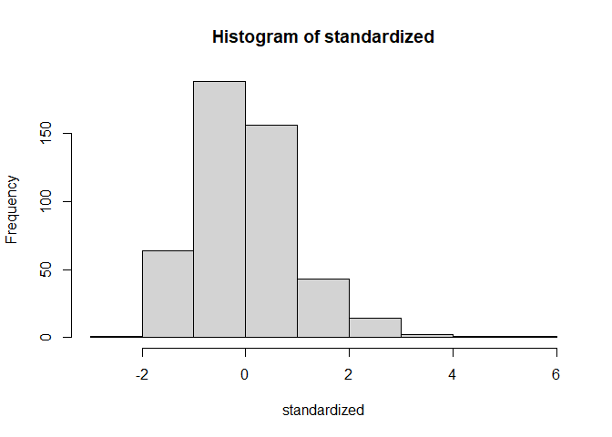
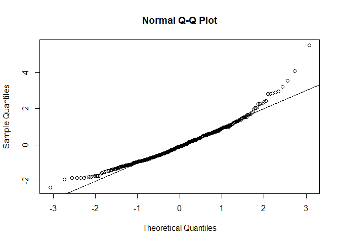
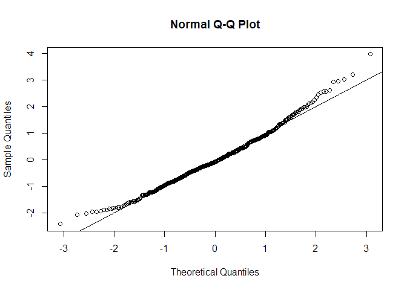
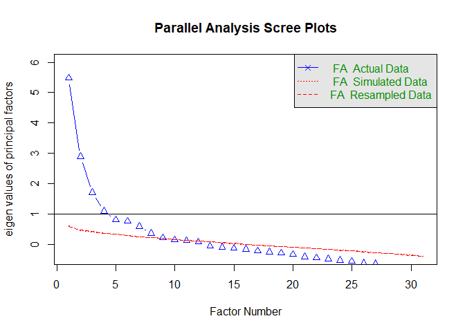

Exploratory Factor Analysis
================

## EXAMPLE EXERCISE:

### “Residential location satisfaction in the Lisbon metropolitan area”

The aim of this study was to examine the perception of households
towards their residential location considering several land use and
accessibility factors as well as household socioeconomic and attitudinal
characteristics.

*Reference:* **Martinez, L. G., de Abreu e Silva, J., & Viegas, J. M.
(2010). Assessment of residential location satisfaction in the Lisbon
metropolitan area, TRB (No. 10-1161).**

> Your task: Analyse the data and create meaningful latent factors.

### Variables:

  - `DWELCLAS`: Classification of the dwelling;
  - `INCOME`: Income of the household;
  - `CHILD13`: Number of children under 13 years old;
  - `H18`: Number of household members above 18 years old;
  - `HEMPLOY`: Number of household members employed;
  - `HSIZE`: Household size;
  - `IAGE`: Age of the respondent;
  - `ISEX`: Sex of the respondent;
  - `NCARS`: Number of cars in the household;
  - `AREA`: Area of the dwelling;
  - `BEDROOM`: Number of bedrooms in the dwelling;
  - `PARK`: Number of parking spaces in the dwelling;
  - `BEDSIZE`: BEDROOM/HSIZE;
  - `PARKSIZE`: PARK/NCARS;
  - `RAGE10`: 1 if Dwelling age \<= 10;
  - `TCBD`: Private car distance in time to CBD;
  - `DISTTC`: Euclidean distance to heavy public transport system stops;
  - `TWCBD`: Private car distance in time of workplace to CBD;
  - `TDWWK`: Private car distance in time of dwelling to work place;
  - `HEADH`: 1 if Head of the Household;
  - `POPDENS`: Population density per hectare;
  - `EQUINDEX`: Number of undergraduate students/Population over 20
    years old (500m)

### Rules of thumb:

  - At least 10 variables
  - n \< 50 (Unacceptable); n \> 200 (recommended)
  - It is recommended to use continuous variables. If your data contains
    categorical variables, you should transform them to dummy variables.

### Assumptions:

  - Normality;
  - linearity;
  - Homogeneity;
  - Homoscedasticity (some multicollinearity is desirable);
  - Correlations between variables \< 0.3 (not appropriate to use Factor
    Analysis)

#### Import Libraries

Let’s start\!

``` r
library(foreign) # Library used to read SPSS files
library(nFactors) # Library used for factor analysis
library(tidyverse) # Library used in data science to perform exploratory data analysis
library(summarytools) # Library used for checking the summary of the dataset
library(psych) # Library used for factor analysis
library(GPArotation) # Library used for factor analysis
```

#### Set working directory

``` r
setwd("G:/O meu disco/TDM - Lecture R/TDM github/Transport-Demand-Modelling/")
```

#### Import dataset

``` r
data <- read.spss("Data/example_fact.sav")
```

#### Take a look at the main characteristics of the dataset

``` r
str(data)
```

    ## List of 32
    ##  $ RespondentID: num [1:470] 7.99e+08 7.98e+08 7.98e+08 7.98e+08 7.98e+08 ...
    ##  $ DWELCLAS    : num [1:470] 5 6 6 5 6 6 4 2 6 5 ...
    ##  $ INCOME      : num [1:470] 7500 4750 4750 7500 2750 1500 12500 1500 1500 1500 ...
    ##  $ CHILD13     : num [1:470] 1 0 2 0 1 0 0 0 0 0 ...
    ##  $ H18         : num [1:470] 2 1 2 3 1 3 3 4 1 1 ...
    ##  $ HEMPLOY     : num [1:470] 2 1 2 2 1 2 0 2 1 1 ...
    ##  $ HSIZE       : num [1:470] 3 1 4 4 2 3 3 4 1 1 ...
    ##  $ AVADUAGE    : num [1:470] 32 31 41.5 44.7 33 ...
    ##  $ IAGE        : num [1:470] 32 31 42 52 33 47 62 21 34 25 ...
    ##  $ ISEX        : num [1:470] 1 1 0 1 0 1 1 0 0 0 ...
    ##  $ NCARS       : num [1:470] 2 1 2 3 1 1 2 3 1 1 ...
    ##  $ AREA        : num [1:470] 100 90 220 120 90 100 178 180 80 50 ...
    ##  $ BEDROOM     : num [1:470] 2 2 4 3 2 2 5 3 2 1 ...
    ##  $ PARK        : num [1:470] 1 1 2 0 0 0 2 0 0 1 ...
    ##  $ BEDSIZE     : num [1:470] 0.667 2 1 0.75 1 ...
    ##  $ PARKSIZE    : num [1:470] 0.5 1 1 0 0 0 1 0 0 1 ...
    ##  $ RAGE10      : num [1:470] 1 0 1 0 0 0 0 0 1 1 ...
    ##  $ TCBD        : num [1:470] 36.79 15.47 24.1 28.72 7.28 ...
    ##  $ DISTHTC     : num [1:470] 629 551 548 2351 698 ...
    ##  $ TWCBD       : num [1:470] 10 15.5 12.71 3.17 5.36 ...
    ##  $ TDWWK       : num [1:470] 31.1 0 20.4 32.9 13 ...
    ##  $ HEADH       : num [1:470] 1 1 1 1 1 1 1 0 1 1 ...
    ##  $ POPDENS     : num [1:470] 85.7 146.4 106.6 36.8 181.6 ...
    ##  $ EDUINDEX    : num [1:470] 0.0641 0.2672 0.1 0.0867 0.1309 ...
    ##  $ GRAVCPC     : num [1:470] 0.249 0.329 0.24 0.273 0.285 ...
    ##  $ GRAVCPT     : num [1:470] 0.249 0.31 0.29 0.249 0.291 ...
    ##  $ GRAVPCPT    : num [1:470] 1 1.062 0.826 1.099 0.98 ...
    ##  $ NSTRTC      : num [1:470] 38 34 33 6 31 45 12 6 4 22 ...
    ##  $ DISTHW      : num [1:470] 2036 748 2279 1196 3507 ...
    ##  $ DIVIDX      : num [1:470] 0.323 0.348 0.324 0.327 0.355 ...
    ##  $ ACTDENS     : num [1:470] 0.672 2.486 1.625 1.766 11.325 ...
    ##  $ DISTCBD     : num [1:470] 9776 3524 11036 6257 1265 ...
    ##  - attr(*, "label.table")=List of 32
    ##   ..$ RespondentID: NULL
    ##   ..$ DWELCLAS    : NULL
    ##   ..$ INCOME      : NULL
    ##   ..$ CHILD13     : NULL
    ##   ..$ H18         : NULL
    ##   ..$ HEMPLOY     : NULL
    ##   ..$ HSIZE       : NULL
    ##   ..$ AVADUAGE    : NULL
    ##   ..$ IAGE        : NULL
    ##   ..$ ISEX        : NULL
    ##   ..$ NCARS       : NULL
    ##   ..$ AREA        : NULL
    ##   ..$ BEDROOM     : NULL
    ##   ..$ PARK        : NULL
    ##   ..$ BEDSIZE     : NULL
    ##   ..$ PARKSIZE    : NULL
    ##   ..$ RAGE10      : NULL
    ##   ..$ TCBD        : NULL
    ##   ..$ DISTHTC     : NULL
    ##   ..$ TWCBD       : NULL
    ##   ..$ TDWWK       : NULL
    ##   ..$ HEADH       : NULL
    ##   ..$ POPDENS     : NULL
    ##   ..$ EDUINDEX    : NULL
    ##   ..$ GRAVCPC     : NULL
    ##   ..$ GRAVCPT     : NULL
    ##   ..$ GRAVPCPT    : NULL
    ##   ..$ NSTRTC      : NULL
    ##   ..$ DISTHW      : NULL
    ##   ..$ DIVIDX      : NULL
    ##   ..$ ACTDENS     : NULL
    ##   ..$ DISTCBD     : NULL
    ##  - attr(*, "codepage")= int 1252
    ##  - attr(*, "variable.labels")= Named chr(0) 
    ##   ..- attr(*, "names")= chr(0)

#### Transform dataset into dataframe

``` r
df <- data.frame(data)
```

#### Check summary statistics of variables

``` r
descriptive_stats <- dfSummary(df, style = "grid", method = 'browser', graph.magnif = 0.75, valid.col = FALSE, tmp.img.dir = "/tmp" )

view(descriptive_stats)
```

    ## Switching method to 'browser'

    ## Output file written: C:\Users\gabri\AppData\Local\Temp\RtmpsDiBfd\file3b10382b8b.html

> **Note:** I used other functions for summary statistics than in the
> MLR chapter. R allows you to do the same or similar tasks with
> different packages.

#### Take a look at the dataset

``` r
head(df,10)
```

    ##    RespondentID DWELCLAS INCOME CHILD13 H18 HEMPLOY HSIZE AVADUAGE IAGE ISEX
    ## 1     799161661        5   7500       1   2       2     3 32.00000   32    1
    ## 2     798399409        6   4750       0   1       1     1 31.00000   31    1
    ## 3     798374392        6   4750       2   2       2     4 41.50000   42    0
    ## 4     798275277        5   7500       0   3       2     4 44.66667   52    1
    ## 5     798264250        6   2750       1   1       1     2 33.00000   33    0
    ## 6     798235878        6   1500       0   3       2     3 30.00000   47    1
    ## 7     797907742        4  12500       0   3       0     3 69.33333   62    1
    ## 8     797871767        2   1500       0   4       2     4 48.75000   21    0
    ## 9     797821210        6   1500       0   1       1     1 34.00000   34    0
    ## 10    797552006        5   1500       0   1       1     1 25.00000   25    0
    ##    NCARS AREA BEDROOM PARK   BEDSIZE PARKSIZE RAGE10      TCBD   DISTHTC
    ## 1      2  100       2    1 0.6666667      0.5      1 36.791237  629.1120
    ## 2      1   90       2    1 2.0000000      1.0      0 15.472989  550.5769
    ## 3      2  220       4    2 1.0000000      1.0      1 24.098125  547.8633
    ## 4      3  120       3    0 0.7500000      0.0      0 28.724796 2350.5782
    ## 5      1   90       2    0 1.0000000      0.0      0  7.283384  698.3000
    ## 6      1  100       2    0 0.6666667      0.0      0 20.604348 1838.2472
    ## 7      2  178       5    2 1.6666667      1.0      0 42.613947 6837.6209
    ## 8      3  180       3    0 0.7500000      0.0      0 40.805074 6815.2118
    ## 9      1   80       2    0 2.0000000      0.0      1 46.289862 4308.7500
    ## 10     1   50       1    1 1.0000000      1.0      1  8.701663  512.1624
    ##        TWCBD     TDWWK HEADH    POPDENS   EDUINDEX   GRAVCPC   GRAVCPT
    ## 1  10.003945 31.142824     1  85.701553 0.06406279 0.2492962 0.2492607
    ## 2  15.502989  0.000000     1 146.434938 0.26723192 0.3293831 0.3102800
    ## 3  12.709374 20.384273     1 106.608098 0.09996816 0.2396229 0.2899865
    ## 4   3.168599 32.942463     1  36.783804 0.08671065 0.2734539 0.2487830
    ## 5   5.364160 13.040133     1 181.627196 0.13091674 0.2854017 0.2913676
    ## 6   5.024916 22.424728     1  72.065190 0.31409969 0.3655758 0.2339590
    ## 7  41.749079  9.190614     1  47.797301 0.08100000 0.1559960 0.2087794
    ## 8  45.143804  3.489875     0  40.794500 0.07485605 0.1647730 0.1802961
    ## 9   1.313656 47.399052     1   6.977336 0.04782609 0.1471991 0.2285333
    ## 10 14.502650 15.541200     1 179.615483 0.13547579 0.3353141 0.2940870
    ##     GRAVPCPT NSTRTC    DISTHW    DIVIDX     ACTDENS   DISTCBD
    ## 1  1.0001423     38 2036.4661 0.3225354  0.67224060  9776.142
    ## 2  1.0615674     34  747.7683 0.3484588  2.48603452  3523.994
    ## 3  0.8263245     33 2279.0577 0.3237884  1.62490591 11036.407
    ## 4  1.0991661      6 1196.4665 0.3272149  1.76649226  6257.262
    ## 5  0.9795244     31 3507.2402 0.3545181 11.32493089  1265.239
    ## 6  1.5625632     45  345.3282 0.3545291  4.60901894  6614.929
    ## 7  0.7471812     12 4125.4581 0.3914727  0.05016163 12035.249
    ## 8  0.9139020      6 4346.3370 0.3914727  0.05016163 11759.166
    ## 9  0.6441035      4 2385.6950 0.3534021  0.12445352 11817.881
    ## 10 1.1401870     22 3082.7274 0.3111948  3.84403202  1726.137

#### Make ID as row names or case number

``` r
df<-data.frame(df, row.names = 1)
```

#### Evaluating the assumptions for factoral analysis:

Let’s run a random regression model in order to evaluate some
assumptions

``` r
random = rchisq(nrow(df), 32)
fake = lm(random ~ ., data = df)
standardized = rstudent(fake)
fitted = scale(fake$fitted.values)
```

  - **Normality**

<!-- end list -->

``` r
hist(standardized)
```

<!-- -->

  - **Linearity**

<!-- end list -->

``` r
qqnorm(standardized)
abline(0,1)
```

<!-- -->

  - **Homogeneity**

<!-- end list -->

``` r
plot(fitted, standardized)
abline(0,0)
abline(v=0)
```

<!-- -->

#### Calculate the correlation matrix

``` r
corr_matrix <- cor(df, method = "pearson")
```

#### Check for correlation adequacy - Bartlett’s Test.

``` r
cortest.bartlett(corr_matrix, n = nrow(df))
```

    ## $chisq
    ## [1] 9880.074
    ## 
    ## $p.value
    ## [1] 0
    ## 
    ## $df
    ## [1] 465

> **Note:** The Bartlett test examines if there are equal variance
> (homogeneity) between variables. Thus, it evaluates if there is any
> pattern between variables.  
> **Note:** The null hypothesis is that there is no difference in
> variance between variables.

#### Check for sampling adequacy - KMO test

``` r
KMO(corr_matrix)
```

    ## Kaiser-Meyer-Olkin factor adequacy
    ## Call: KMO(r = corr_matrix)
    ## Overall MSA =  0.68
    ## MSA for each item = 
    ## DWELCLAS   INCOME  CHILD13      H18  HEMPLOY    HSIZE AVADUAGE     IAGE 
    ##     0.70     0.85     0.33     0.58     0.88     0.59     0.38     0.40 
    ##     ISEX    NCARS     AREA  BEDROOM     PARK  BEDSIZE PARKSIZE   RAGE10 
    ##     0.71     0.74     0.60     0.53     0.62     0.58     0.57     0.84 
    ##     TCBD  DISTHTC    TWCBD    TDWWK    HEADH  POPDENS EDUINDEX  GRAVCPC 
    ##     0.88     0.88     0.82     0.89     0.47     0.82     0.85     0.76 
    ##  GRAVCPT GRAVPCPT   NSTRTC   DISTHW   DIVIDX  ACTDENS  DISTCBD 
    ##     0.71     0.31     0.83     0.76     0.63     0.70     0.86

> **Note:** We want at least 0.7 of the overall Mean Sample Adequacy
> (MSA). If, 0.6 \< MSA \< 0.7, it is not a good value, but acceptable
> in some cases.

#### Determine the number of factors to extract

**1.\_Parallel Analysis\_**

``` r
num_factors = fa.parallel(df, fm = "ml", fa = "fa")
```

<!-- -->

    ## Parallel analysis suggests that the number of factors =  8  and the number of components =  NA

> **Note:** fm = factor math; ml = maximum likelihood; fa = factor
> analysis

**2. *Kaiser Criterion***

``` r
sum(num_factors$fa.values > 1)
```

    ## [1] 4

> **Note:** Determines the number of factors with eigenvalue \> 1

**3. *Principal Component Analysis* (PCA)**

``` r
df_pca <- princomp(df, cor=TRUE)
```

> **Note:** cor = TRUE, standardizes your dataset

\# print variance that explains the components

``` r
summary(df_pca)  
```

    ## Importance of components:
    ##                          Comp.1    Comp.2     Comp.3     Comp.4     Comp.5
    ## Standard deviation     2.450253 1.9587909 1.61305418 1.43367870 1.27628545
    ## Proportion of Variance 0.193669 0.1237697 0.08393367 0.06630434 0.05254531
    ## Cumulative Proportion  0.193669 0.3174388 0.40137245 0.46767679 0.52022210
    ##                            Comp.6     Comp.7     Comp.8    Comp.9    Comp.10
    ## Standard deviation     1.26612033 1.22242045 1.11550534 1.0304937 0.99888665
    ## Proportion of Variance 0.05171164 0.04820361 0.04014039 0.0342554 0.03218628
    ## Cumulative Proportion  0.57193374 0.62013734 0.66027774 0.6945331 0.72671941
    ##                           Comp.11    Comp.12   Comp.13    Comp.14    Comp.15
    ## Standard deviation     0.97639701 0.92221635 0.9042314 0.85909928 0.80853555
    ## Proportion of Variance 0.03075326 0.02743494 0.0263753 0.02380812 0.02108806
    ## Cumulative Proportion  0.75747267 0.78490761 0.8112829 0.83509102 0.85617908
    ##                          Comp.16    Comp.17    Comp.18    Comp.19    Comp.20
    ## Standard deviation     0.7877571 0.74436225 0.72574751 0.69380677 0.67269732
    ## Proportion of Variance 0.0200181 0.01787339 0.01699063 0.01552799 0.01459747
    ## Cumulative Proportion  0.8761972 0.89407058 0.91106120 0.92658920 0.94118667
    ##                           Comp.21    Comp.22    Comp.23     Comp.24     Comp.25
    ## Standard deviation     0.63466979 0.61328635 0.55192724 0.397467153 0.384354087
    ## Proportion of Variance 0.01299373 0.01213291 0.00982657 0.005096133 0.004765421
    ## Cumulative Proportion  0.95418041 0.96631331 0.97613988 0.981236017 0.986001438
    ##                            Comp.26     Comp.27     Comp.28     Comp.29
    ## Standard deviation     0.364232811 0.322026864 0.276201256 0.262018088
    ## Proportion of Variance 0.004279534 0.003345203 0.002460875 0.002214628
    ## Cumulative Proportion  0.990280972 0.993626175 0.996087050 0.998301679
    ##                             Comp.30      Comp.31
    ## Standard deviation     0.1712372644 0.1527277294
    ## Proportion of Variance 0.0009458774 0.0007524438
    ## Cumulative Proportion  0.9992475562 1.0000000000

``` r
loadings(df_pca) 
```

    ## 
    ## Loadings:
    ##          Comp.1 Comp.2 Comp.3 Comp.4 Comp.5 Comp.6 Comp.7 Comp.8 Comp.9 Comp.10
    ## DWELCLAS                0.279         0.169  0.102         0.147         0.462 
    ## INCOME           0.308        -0.122                       0.237         0.270 
    ## CHILD13          0.186  0.129               -0.336  0.362 -0.428 -0.235        
    ## H18              0.396 -0.218                0.107         0.116  0.125        
    ## HEMPLOY   0.101  0.292         0.256                                     0.245 
    ## HSIZE            0.436                      -0.131  0.177 -0.182               
    ## AVADUAGE                      -0.504 -0.212                             -0.303 
    ## IAGE                          -0.584 -0.229         0.113                      
    ## ISEX                          -0.226                       0.158  0.636  0.175 
    ## NCARS     0.124  0.333                                     0.253         0.142 
    ## AREA      0.104  0.131  0.113         0.402  0.141 -0.157 -0.263 -0.108 -0.115 
    ## BEDROOM          0.227        -0.280  0.410  0.120        -0.248         0.173 
    ## PARK      0.167  0.150  0.398         0.138 -0.163                0.178 -0.274 
    ## BEDSIZE         -0.277  0.171 -0.211  0.328  0.219 -0.182                0.194 
    ## PARKSIZE  0.129         0.446               -0.223                0.240 -0.270 
    ## RAGE10    0.139         0.288  0.179        -0.159  0.107  0.235  0.101 -0.137 
    ## TCBD      0.356 -0.102 -0.129                                                  
    ## DISTHTC   0.274                              0.266  0.186                      
    ## TWCBD     0.159        -0.111 -0.121  0.152 -0.183  0.130  0.209 -0.208        
    ## TDWWK     0.219                0.169                      -0.234  0.182        
    ## HEADH           -0.199  0.236 -0.157 -0.164 -0.255  0.298                0.350 
    ## POPDENS  -0.234        -0.216               -0.183        -0.193  0.303        
    ## EDUINDEX -0.178  0.157  0.219                0.138 -0.110        -0.229        
    ## GRAVCPC  -0.343  0.128  0.166        -0.156        -0.120                      
    ## GRAVCPT  -0.331                       0.210 -0.214         0.176 -0.111        
    ## GRAVPCPT                0.249        -0.407  0.366        -0.270  0.122        
    ## NSTRTC   -0.205        -0.121                             -0.312  0.358        
    ## DISTHW    0.176 -0.152 -0.176         0.222         0.292  0.155               
    ## DIVIDX   -0.189         0.116                0.381  0.449               -0.214 
    ## ACTDENS  -0.233                       0.165  0.253  0.486         0.118 -0.193 
    ## DISTCBD   0.334                              0.127                             
    ##          Comp.11 Comp.12 Comp.13 Comp.14 Comp.15 Comp.16 Comp.17 Comp.18
    ## DWELCLAS  0.152   0.556   0.203   0.206   0.246   0.216           0.173 
    ## INCOME   -0.296   0.101  -0.127  -0.181          -0.188   0.164  -0.516 
    ## CHILD13                   0.121   0.164  -0.171   0.200   0.112  -0.232 
    ## H18                                       0.130          -0.185   0.277 
    ## HEMPLOY                  -0.122  -0.278  -0.110  -0.181   0.115   0.359 
    ## HSIZE                     0.151                   0.108                 
    ## AVADUAGE          0.298   0.134          -0.101   0.162   0.262         
    ## IAGE              0.132          -0.172   0.201                   0.269 
    ## ISEX      0.173  -0.476           0.335   0.143   0.118   0.119  -0.114 
    ## NCARS                    -0.233          -0.175   0.122  -0.105  -0.242 
    ## AREA                                      0.600  -0.280          -0.247 
    ## BEDROOM          -0.160   0.113  -0.166  -0.254   0.201  -0.116   0.179 
    ## PARK                                             -0.247                 
    ## BEDSIZE          -0.117          -0.148  -0.365   0.143                 
    ## PARKSIZE                                 -0.242  -0.176           0.156 
    ## RAGE10    0.143           0.113  -0.413   0.178   0.405          -0.189 
    ## TCBD                     -0.192   0.103                                 
    ## DISTHTC                   0.119                          -0.532         
    ## TWCBD     0.589          -0.281          -0.101  -0.136   0.230   0.121 
    ## TDWWK    -0.498          -0.176   0.158           0.187   0.367   0.204 
    ## HEADH    -0.128  -0.123  -0.208  -0.179   0.174  -0.188  -0.240         
    ## POPDENS           0.253          -0.119  -0.124  -0.300          -0.100 
    ## EDUINDEX                 -0.134   0.550          -0.105  -0.245         
    ## GRAVCPC                   0.102                                         
    ## GRAVCPT  -0.178                           0.103   0.144                 
    ## GRAVPCPT  0.314           0.182                  -0.184   0.151         
    ## NSTRTC    0.143   0.403  -0.368                   0.123  -0.322  -0.139 
    ## DISTHW   -0.151   0.109   0.459   0.132  -0.157  -0.307          -0.124 
    ## DIVIDX                   -0.222                           0.113         
    ## ACTDENS                                          -0.124   0.137         
    ## DISTCBD                  -0.307                                         
    ##          Comp.19 Comp.20 Comp.21 Comp.22 Comp.23 Comp.24 Comp.25 Comp.26
    ## DWELCLAS  0.160           0.121           0.152                         
    ## INCOME    0.172   0.170  -0.298  -0.314                                 
    ## CHILD13                   0.117           0.126                  -0.154 
    ## H18       0.159  -0.113  -0.264          -0.128                         
    ## HEMPLOY  -0.461   0.438   0.256                                         
    ## HSIZE     0.127          -0.119                                         
    ## AVADUAGE -0.241           0.187                           0.229   0.403 
    ## IAGE                                             -0.130  -0.257  -0.521 
    ## ISEX              0.118                                                 
    ## NCARS            -0.465   0.433   0.359                                 
    ## AREA     -0.193           0.195                                         
    ## BEDROOM                  -0.160                   0.116   0.141   0.215 
    ## PARK                      0.178                                         
    ## BEDSIZE                                                  -0.119  -0.242 
    ## PARKSIZE  0.105                                                         
    ## RAGE10   -0.399          -0.311   0.119  -0.155                         
    ## TCBD              0.157  -0.146   0.245          -0.129  -0.122   0.152 
    ## DISTHTC  -0.125                  -0.394   0.541                         
    ## TWCBD            -0.305  -0.117  -0.371                                 
    ## TDWWK    -0.189  -0.431  -0.118  -0.226                                 
    ## HEADH            -0.172                                   0.235   0.412 
    ## POPDENS  -0.192  -0.138  -0.316   0.296   0.476  -0.149                 
    ## EDUINDEX -0.513          -0.271          -0.107          -0.136         
    ## GRAVCPC          -0.118          -0.139           0.223   0.293  -0.214 
    ## GRAVCPT                                   0.141   0.171   0.323  -0.173 
    ## GRAVPCPT         -0.138                  -0.148           0.147         
    ## NSTRTC                    0.161  -0.261  -0.375                         
    ## DISTHW   -0.192  -0.130   0.135          -0.397           0.297  -0.158 
    ## DIVIDX                            0.103          -0.581   0.300         
    ## ACTDENS                           0.187           0.570  -0.362         
    ## DISTCBD           0.276  -0.162   0.281           0.382   0.447  -0.330 
    ##          Comp.27 Comp.28 Comp.29 Comp.30 Comp.31
    ## DWELCLAS                                        
    ## INCOME                                          
    ## CHILD13           0.132                   0.438 
    ## H18               0.420                   0.522 
    ## HEMPLOY                                         
    ## HSIZE             0.275                  -0.723 
    ## AVADUAGE          0.166                         
    ## IAGE             -0.162                         
    ## ISEX                                            
    ## NCARS     0.197  -0.110                         
    ## AREA      0.195                                 
    ## BEDROOM  -0.116  -0.480                         
    ## PARK     -0.666   0.142  -0.100                 
    ## BEDSIZE           0.558                         
    ## PARKSIZE  0.633  -0.127                         
    ## RAGE10                                          
    ## TCBD      0.114   0.137  -0.757                 
    ## DISTHTC                  -0.121                 
    ## TWCBD                                           
    ## TDWWK                                           
    ## HEADH             0.214                         
    ## POPDENS                                         
    ## EDUINDEX                                        
    ## GRAVCPC                  -0.470   0.566         
    ## GRAVCPT           0.103  -0.242  -0.638         
    ## GRAVPCPT                         -0.493         
    ## NSTRTC                                          
    ## DISTHW                                          
    ## DIVIDX                                          
    ## ACTDENS   0.109                                 
    ## DISTCBD                   0.244   0.109         
    ## 
    ##                Comp.1 Comp.2 Comp.3 Comp.4 Comp.5 Comp.6 Comp.7 Comp.8 Comp.9
    ## SS loadings     1.000  1.000  1.000  1.000  1.000  1.000  1.000  1.000  1.000
    ## Proportion Var  0.032  0.032  0.032  0.032  0.032  0.032  0.032  0.032  0.032
    ## Cumulative Var  0.032  0.065  0.097  0.129  0.161  0.194  0.226  0.258  0.290
    ##                Comp.10 Comp.11 Comp.12 Comp.13 Comp.14 Comp.15 Comp.16 Comp.17
    ## SS loadings      1.000   1.000   1.000   1.000   1.000   1.000   1.000   1.000
    ## Proportion Var   0.032   0.032   0.032   0.032   0.032   0.032   0.032   0.032
    ## Cumulative Var   0.323   0.355   0.387   0.419   0.452   0.484   0.516   0.548
    ##                Comp.18 Comp.19 Comp.20 Comp.21 Comp.22 Comp.23 Comp.24 Comp.25
    ## SS loadings      1.000   1.000   1.000   1.000   1.000   1.000   1.000   1.000
    ## Proportion Var   0.032   0.032   0.032   0.032   0.032   0.032   0.032   0.032
    ## Cumulative Var   0.581   0.613   0.645   0.677   0.710   0.742   0.774   0.806
    ##                Comp.26 Comp.27 Comp.28 Comp.29 Comp.30 Comp.31
    ## SS loadings      1.000   1.000   1.000   1.000   1.000   1.000
    ## Proportion Var   0.032   0.032   0.032   0.032   0.032   0.032
    ## Cumulative Var   0.839   0.871   0.903   0.935   0.968   1.000

Scree Plot

plot(df\_pca,type=“lines”) fit$scores \#biplot(df\_pca)

# EXPLORATORY FACTOR ANALYSIS

## Model 1: No rotation

df\_factor \<- factanal(df, factors = 4, rotation = “none”,
scores=c(“regression”), fm = “ml”)

## Model 2: Rotation Varimax

df\_factor\_var \<- factanal(df, factors = 4, rotation = “varimax”,
scores=c(“regression”), fm = “ml”)

## Model 3: Rotation Oblimin

df\_factor\_obl \<- factanal(df, factors = 4, rotation = “oblimin”,
scores=c(“regression”), fm = “ml”)

# Let’s print out the results of df\_factor\_obl, and take a look.

print(df\_factor, digits=2, cutoff=0.3, sort=TRUE)

## Note: We used a cutoff of 0.3 due to the sample size is higher than 350 obs.

## Note: Variability contained in the factors = Communality + Uniqueness

## Note: Varimax assigns orthogonal rotation,

## and oblimin assigns oblique rotation.

\#Plot factor 1 against factor 2, and compare the results of different
rotations

## No Rotation

plot(df\_factor\(loadings[,1],  df_factor\)loadings\[,2\], xlab =
“Factor 1”, ylab = “Factor 2”, ylim = c(-1,1), xlim = c(-1,1), main =
“No rotation”) abline(h = 0, v = 0) load \<-
df\_factor$loadings\[,1:2\] text(text(load,labels=names(df),cex=.7,
col=“blue”)) abline(h = 0, v = 0)

## Varimax rotation

plot(df\_factor\_var\(loadings[,1],  df_factor_var\)loadings\[,2\], xlab
= “Factor 1”, ylab = “Factor 2”, ylim = c(-1,1), xlim = c(-1,1), main =
“Varimax rotation”) abline(h = 0, v = 0) \#Note: If you also want to
put the variable label here, just take out the \#. \#load \<-
df\_factor\_var$loadings\[,1:2\]
\#text(text(load,labels=names(df),cex=.7, col=“red”))

# Oblimin Rotation

plot(df\_factor\_obl\(loadings[,1],  df_factor_obl\)loadings\[,2\], xlab
= “Factor 1”, ylab = “Factor 2”, ylim = c(-1,1), xlim = c(-1,1), main =
“Oblimin rotation”) abline(h = 0, v = 0) \#load \<-
df\_factor\_obl$loadings\[,1:2\]
\#text(text(load,labels=names(df),cex=.7, col=“yellow”)) \#abline(h = 0,
v = 0)

knitr::spin(hair = “Factor\_Analysis\_TDMLecture.R”)
