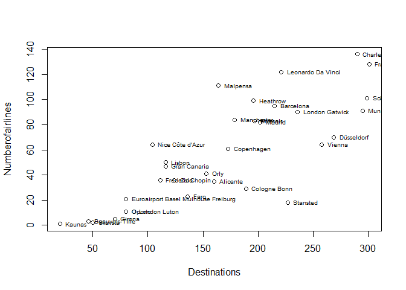
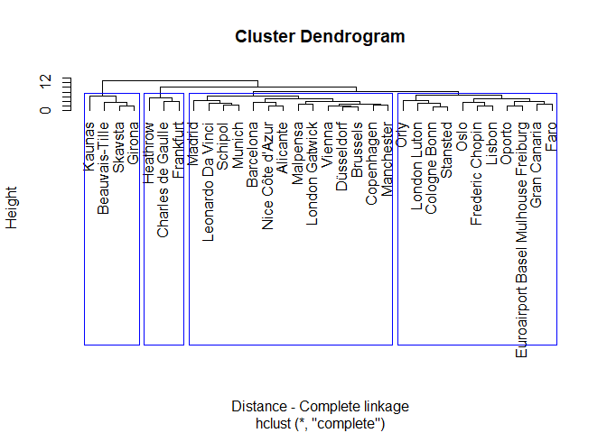
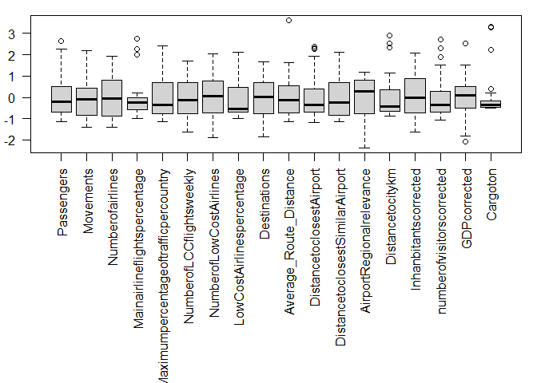
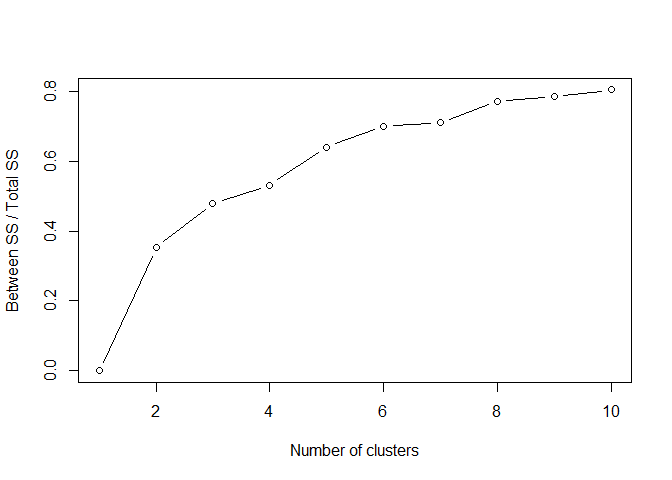

Cluster Analysis
================

## Example Airports

### Variables:

`Code`: Code of the airport;

`Airport`: Name of the airport;

`Ordem`: ID of the observations;

`Passengers`: Number of passengers;

`Movements`: Number of flights;

`Numberofairlines`: Number of airlines in each airport;

`Mainairlineflightspercentage`: percentage of flights of the main
airline of each airport;

`Maximumpercentageoftrafficpercountry`: Maximum percentage of flights
per country;

`NumberofLCCflightsweekly`: Number of weekly low cost flights\`;

`NumberofLowCostAirlines`: Number of low cost airlines of each airport;

`LowCostAirlinespercentage`: percentage of the number of low cost
airlines in each airport;

`Destinations`: \# Average\_route\_Distance \# Distance to closest
Similar Airport \# Airport Regional Relevance \# Distance to city km \#
Inhabitants corrected \# Number of visitors corrected \# GDP corrected
\# Cargoton

#### Import Libraries

``` r
library(readxl) # Library used for reading excel files
library(skimr) # Library used for summary statistics
library(tidyverse) # Library used in data science to perform exploratory data analysis
```

    ## -- Attaching packages --------------------------------------- tidyverse 1.3.0 --

    ## v ggplot2 3.3.2     v purrr   0.3.4
    ## v tibble  3.0.4     v dplyr   1.0.2
    ## v tidyr   1.1.2     v stringr 1.4.0
    ## v readr   1.4.0     v forcats 0.5.0

    ## -- Conflicts ------------------------------------------ tidyverse_conflicts() --
    ## x dplyr::filter() masks stats::filter()
    ## x dplyr::lag()    masks stats::lag()

``` r
library(mclust) # Library used for model based clustering
```

    ## Package 'mclust' version 5.4.6
    ## Type 'citation("mclust")' for citing this R package in publications.

    ## 
    ## Attaching package: 'mclust'

    ## The following object is masked from 'package:purrr':
    ## 
    ##     map

``` r
library(cluster) # Library used for cluster analysis
library(factoextra) # Library used for visualizing distances
```

    ## Welcome! Want to learn more? See two factoextra-related books at https://goo.gl/ve3WBa

#### Set working directory

``` r
setwd("G:/O meu disco/TDM - Lecture R/TDM github/Transport-Demand-Modelling/")
```

#### Import dataset

``` r
dataset <- read_excel("Data/Data_Aeroports_Clustersv1.xlsX")
```

#### Transform dataset into dataframe

``` r
df <- data.frame(dataset)
```

#### Summary statistics

``` r
skim(df)
```

|                                                  |      |
| :----------------------------------------------- | :--- |
| Name                                             | df   |
| Number of rows                                   | 32   |
| Number of columns                                | 21   |
| \_\_\_\_\_\_\_\_\_\_\_\_\_\_\_\_\_\_\_\_\_\_\_   |      |
| Column type frequency:                           |      |
| character                                        | 2    |
| numeric                                          | 19   |
| \_\_\_\_\_\_\_\_\_\_\_\_\_\_\_\_\_\_\_\_\_\_\_\_ |      |
| Group variables                                  | None |

Data summary

**Variable type: character**

| skim\_variable | n\_missing | complete\_rate | min | max | empty | n\_unique | whitespace |
| :------------- | ---------: | -------------: | --: | --: | ----: | --------: | ---------: |
| Code           |          0 |              1 |   3 |   3 |     0 |        32 |          0 |
| Airport        |          0 |              1 |   4 |  35 |     0 |        32 |          0 |

**Variable type: numeric**

| skim\_variable                       | n\_missing | complete\_rate |        mean |          sd |        p0 |        p25 |         p50 |         p75 |        p100 | hist  |
| :----------------------------------- | ---------: | -------------: | ----------: | ----------: | --------: | ---------: | ----------: | ----------: | ----------: | :---- |
| Ordem                                |          0 |              1 |       16.50 |        9.38 |      1.00 |       8.75 |       16.50 |       24.25 |       32.00 | ▇▇▇▇▇ |
| Passengers                           |          0 |              1 | 20750710.88 | 17601931.34 | 456698.00 | 8927021.50 | 17275317.50 | 28666511.50 | 67054745.00 | ▇▅▂▂▁ |
| Movements                            |          0 |              1 |   205111.16 |   143564.45 |   5698.00 |   82765.75 |   191742.50 |   258654.50 |   518018.00 | ▇▅▇▂▃ |
| Numberofairlines                     |          0 |              1 |       57.81 |       40.42 |      1.00 |      22.50 |       55.50 |       90.25 |      136.00 | ▇▆▅▆▃ |
| Mainairlineflightspercentage         |          0 |              1 |       33.78 |       22.08 |     12.00 |      22.00 |       28.50 |       33.00 |       95.00 | ▇▆▁▁▂ |
| Maximumpercentageoftrafficpercountry |          0 |              1 |       17.47 |        7.31 |      9.00 |      12.00 |       15.00 |       22.25 |       35.00 | ▇▂▃▂▂ |
| NumberofLCCflightsweekly             |          0 |              1 |      397.59 |      221.56 |     37.00 |     226.25 |      366.50 |      546.75 |      776.00 | ▅▇▅▅▆ |
| NumberofLowCostAirlines              |          0 |              1 |       11.59 |        5.60 |      1.00 |       7.75 |       12.00 |       16.00 |       23.00 | ▃▇▇▆▃ |
| LowCostAirlinespercentage            |          0 |              1 |       36.44 |       30.10 |      6.25 |      16.29 |       19.59 |       50.36 |      100.00 | ▇▂▁▁▂ |
| Destinations                         |          0 |              1 |      167.62 |       80.13 |     20.00 |     109.25 |      168.50 |      222.50 |      301.00 | ▃▇▆▇▆ |
| Average\_Route\_Distance             |          0 |              1 |     2275.19 |      930.28 |   1225.00 |    1599.50 |     2152.00 |     2765.00 |     5635.00 | ▇▆▂▁▁ |
| DistancetoclosestAirport             |          0 |              1 |       90.19 |       64.56 |     13.84 |      45.83 |       66.50 |      111.61 |      244.50 | ▇▇▃▁▂ |
| DistancetoclosestSimilarAirport      |          0 |              1 |      248.64 |      183.60 |     38.16 |      97.74 |      206.12 |      376.15 |      635.05 | ▇▅▃▁▃ |
| AirportRegionalrelevance             |          0 |              1 |        0.73 |        0.23 |      0.19 |       0.58 |        0.80 |        0.91 |        0.99 | ▁▃▁▆▇ |
| Distancetocitykm                     |          0 |              1 |       25.81 |       25.44 |      3.00 |       9.75 |       14.50 |       35.00 |      100.00 | ▇▂▁▁▁ |
| Inhanbitantscorrected                |          0 |              1 |  4528561.95 |  2590542.88 | 329240.50 | 2856960.30 |  4532760.00 |  6733158.88 |  9870818.00 | ▆▆▇▇▁ |
| numberofvisitorscorrected            |          0 |              1 |  2766002.58 |  2549773.72 |  80232.50 | 1018390.89 |  1896295.60 |  3450491.78 |  9732062.00 | ▇▃▁▂▁ |
| GDPcorrected                         |          0 |              1 |    30160.75 |    10510.93 |   8500.00 |   25000.00 |    31150.00 |    35550.00 |    56600.00 | ▃▅▇▃▁ |
| Cargoton                             |          0 |              1 |   236531.76 |   478310.12 |      0.00 |   10325.00 |    72749.85 |   153372.85 |  1819000.00 | ▇▁▁▁▁ |

#### Now let us plot an example and take a look

``` r
plot(Numberofairlines ~ Destinations, df)
with(df, text(Numberofairlines ~ Destinations, label = Airport, pos = 4, cex = 0.6))
```

<!-- -->

> **Note:** You can already guess the number of clusters by visualizing
> the two variables. However, this is not clear and it does not consider
> the other variables.

#### Treat the data before performing a cluster analysis

  - In this example we do not have missing values. In case you do have
    in the future, you can take out the missing values with listwise
    deletion.

<!-- end list -->

``` r
 df <- na.omit(df)
```

  - Leave only continuous variables, and take out “Ordem”

<!-- end list -->

``` r
  drop <- c("Code","Airport", "Ordem")
  df_reduced = df[,!(names(df) %in% drop)]
```

Analyze how the scale of the values of the variables are different

``` r
head(df_reduced)
```

    ##   Passengers Movements Numberofairlines Mainairlineflightspercentage
    ## 1    9830987    119322               64                           18
    ## 2    9742300    132200               29                           33
    ## 3    9155665    101557               47                           17
    ## 4    9139479     74281               35                           29
    ## 5    9129053     83013               11                           37
    ## 6    8320927    115934               36                           31
    ##   Maximumpercentageoftrafficpercountry NumberofLCCflightsweekly
    ## 1                                   20                      256
    ## 2                                   13                      351
    ## 3                                   26                      259
    ## 4                                   23                      300
    ## 5                                   22                      227
    ## 6                                   14                      341
    ##   NumberofLowCostAirlines LowCostAirlinespercentage Destinations
    ## 1                      18                  28.12500          104
    ## 2                      12                  41.37931          189
    ## 3                      19                  40.42553          116
    ## 4                      18                  51.42857          160
    ## 5                       8                  72.72727           87
    ## 6                       7                  19.44445          111
    ##   Average_Route_Distance DistancetoclosestAirport
    ## 1                   1253                 23.66681
    ## 2                   1721                 63.45766
    ## 3                   3143                122.58936
    ## 4                   1701                 63.09924
    ## 5                   1582                 45.13247
    ## 6                   1460                244.49577
    ##   DistancetoclosestSimilarAirport AirportRegionalrelevance Distancetocitykm
    ## 1                       223.83824                0.8698581                6
    ## 2                        63.45766                0.5127419               15
    ## 3                       132.45082                0.7840877               19
    ## 4                       134.50558                0.8098081                9
    ## 5                        45.13247                0.1947903               55
    ## 6                       559.31000                0.9810450               10
    ##   Inhanbitantscorrected numberofvisitorscorrected GDPcorrected Cargoton
    ## 1             3551805.0                 2152829.8        26300 11223.39
    ## 2             4180133.5                 1151381.6        30100   562.00
    ## 3              705807.8                 1678968.6        20700 25994.00
    ## 4             1508358.6                 1944196.8        25000  3199.73
    ## 5             1562709.8                  181063.5        32000 28698.00
    ## 6             6626197.0                  770720.5        11200 82756.54

  - Standardization (Z-score) - (xi - xmean / standard deviation)

<!-- end list -->

``` r
  mean <- apply(df_reduced, 2, mean) # The "2" in the function is used to select the columns. MARGIN: c(1,2)
  sd <- apply(df_reduced, 2, sd)
  df_scaled <- scale(df_reduced, mean, sd)
```

### HIERARCHICAL CLUSTERING

#### Measuring Similarity through Euclidean distances

``` r
  distance <- dist(df_scaled, method = "euclidean")
  print(distance, digits = 3)
```

    ##        1     2     3     4     5     6     7     8     9    10    11    12
    ## 2   3.03                                                                  
    ## 3   3.12  3.73                                                            
    ## 4   1.93  2.62  2.19                                                      
    ## 5   4.84  3.34  4.70  4.14                                                
    ## 6   4.98  5.11  5.27  5.17  6.77                                          
    ## 7   4.08  4.49  2.76  2.96  5.41  4.38                                    
    ## 8   3.76  4.03  3.40  3.05  4.14  4.62  3.08                              
    ## 9   4.06  1.74  4.47  3.51  2.92  5.70  5.25  4.54                        
    ## 10  3.22  3.29  4.47  3.73  5.65  4.65  5.27  5.19  3.80                  
    ## 11  3.48  3.36  4.20  3.88  5.75  5.00  5.34  5.65  3.94  2.33            
    ## 12  3.84  3.42  4.34  3.88  5.95  5.09  5.47  5.56  3.78  2.22  2.69      
    ## 13  4.01  4.11  4.68  4.23  5.43  3.64  4.93  4.47  4.23  2.80  4.32  3.40
    ## 14  3.89  2.45  4.27  3.76  5.23  5.53  5.51  5.37  2.98  2.77  2.55  2.18
    ## 15  3.64  3.55  4.77  4.47  5.70  5.23  5.96  5.92  3.96  3.00  2.71  3.09
    ## 16  3.26  2.60  4.38  3.74  5.32  5.29  5.67  5.41  3.28  2.28  1.93  2.05
    ## 17  4.50  5.04  4.26  4.56  6.58  1.92  3.66  4.22  5.68  4.40  4.72  4.59
    ## 18  8.79  8.19  8.63  8.89  9.42  9.97 10.12  9.98  8.07  7.09  7.14  6.76
    ## 19  8.32  8.22  8.83  8.74  9.97  9.42 10.00 10.29  8.21  6.68  6.77  6.29
    ## 20  7.55  7.19  7.76  7.79  9.15  7.34  8.56  8.82  7.19  5.26  5.50  5.20
    ## 21  4.63  5.52  5.71  5.32  7.21  5.81  6.55  6.28  5.59  3.65  4.33  3.88
    ## 22  5.81  5.96  6.50  6.23  8.34  7.06  7.52  8.14  6.20  4.28  4.05  3.61
    ## 23  4.98  5.79  6.13  5.84  7.80  6.27  7.08  7.48  6.05  4.29  4.10  3.92
    ## 24  5.70  5.35  6.38  6.10  7.86  5.75  6.99  7.62  5.50  3.74  3.63  3.39
    ## 25  4.89  3.66  5.41  5.07  5.56  6.68  6.76  6.85  3.55  3.88  2.86  3.80
    ## 26  3.45  4.60  4.09  3.75  6.67  5.78  4.87  5.72  5.29  4.02  3.82  3.88
    ## 27  6.91  5.76  6.74  6.21  4.03  7.55  6.84  5.65  5.03  7.08  7.83  7.24
    ## 28  6.65  5.38  6.40  5.82  3.64  7.24  6.36  5.26  4.74  7.21  7.59  7.20
    ## 29  4.35  3.24  4.73  4.43  4.43  6.83  6.34  5.50  3.57  4.03  4.47  3.92
    ## 30  3.42  3.20  3.45  2.95  3.24  5.28  3.88  2.18  3.85  4.75  5.00  5.35
    ## 31  7.29  7.03  6.46  6.34  6.31  6.28  5.05  4.17  7.22  8.16  8.68  8.43
    ## 32  6.70  5.34  6.88  6.27  3.70  7.30  6.82  5.61  4.82  7.38  7.56  7.55
    ##       13    14    15    16    17    18    19    20    21    22    23    24
    ## 2                                                                         
    ## 3                                                                         
    ## 4                                                                         
    ## 5                                                                         
    ## 6                                                                         
    ## 7                                                                         
    ## 8                                                                         
    ## 9                                                                         
    ## 10                                                                        
    ## 11                                                                        
    ## 12                                                                        
    ## 13                                                                        
    ## 14  4.39                                                                  
    ## 15  4.25  3.03                                                            
    ## 16  4.09  1.49  2.13                                                      
    ## 17  3.40  5.25  4.92  5.01                                                
    ## 18  8.35  6.88  6.75  6.74  9.05                                          
    ## 19  8.06  6.99  6.06  6.56  8.66  4.12                                    
    ## 20  6.56  5.69  5.49  5.65  6.95  5.36  3.94                              
    ## 21  4.28  4.83  4.34  4.22  4.99  6.85  5.89  5.25                        
    ## 22  5.84  4.54  4.25  4.03  6.29  5.77  4.54  4.90  3.70                  
    ## 23  5.28  5.06  3.30  4.12  5.53  6.73  4.74  5.29  3.36  2.78            
    ## 24  5.04  4.01  3.38  3.63  5.41  6.30  5.20  4.41  4.15  2.45  3.22      
    ## 25  5.55  2.81  2.73  2.64  6.40  6.29  6.27  5.81  5.23  4.32  4.63  3.74
    ## 26  5.09  4.32  3.74  3.84  4.73  7.45  6.50  6.35  4.10  3.95  3.50  4.24
    ## 27  5.80  7.18  7.35  7.26  7.59 10.68 11.21 10.22  8.62  9.92  9.25  9.08
    ## 28  6.10  6.97  7.23  7.06  7.30 10.83 11.17 10.19  8.52  9.77  9.06  8.96
    ## 29  4.89  3.38  3.95  3.32  6.22  6.32  7.10  6.95  5.38  5.65  5.72  5.75
    ## 30  4.67  4.71  5.23  4.68  4.75  9.10  9.65  8.55  6.04  7.58  7.06  7.17
    ## 31  6.73  8.32  8.87  8.50  6.09 12.20 12.68 10.96  9.01 10.86 10.27 10.06
    ## 32  6.57  7.08  6.75  6.92  7.34 10.36 10.82 10.31  8.41  9.53  8.65  8.60
    ##       25    26    27    28    29    30    31
    ## 2                                           
    ## 3                                           
    ## 4                                           
    ## 5                                           
    ## 6                                           
    ## 7                                           
    ## 8                                           
    ## 9                                           
    ## 10                                          
    ## 11                                          
    ## 12                                          
    ## 13                                          
    ## 14                                          
    ## 15                                          
    ## 16                                          
    ## 17                                          
    ## 18                                          
    ## 19                                          
    ## 20                                          
    ## 21                                          
    ## 22                                          
    ## 23                                          
    ## 24                                          
    ## 25                                          
    ## 26  4.56                                    
    ## 27  7.73  8.62                              
    ## 28  7.45  8.20  1.97                        
    ## 29  4.07  5.16  6.81  6.92                  
    ## 30  5.74  5.27  5.86  5.48  4.32            
    ## 31  9.63  8.59  5.85  5.20  8.66  5.41      
    ## 32  7.01  8.02  3.75  3.04  6.50  5.15  6.13

#### Visualize distances in heatmap

``` r
  fviz_dist(distance, gradient = list(low = "#00AFBB", mid = "white", high = "#FC4E07"), order = FALSE)
```

<!-- -->

> **Note:** There are other forms distance measures that can be used
> such as: i) Minkowski distance; ii) Manhattan distance; iii)
> Mahanalobis distance.

**1. Complete linkage (Farthest neighbor) clustering algorithm**

Based on the maximum distance between observations in each cluster.

``` r
modelc <- hclust(distance, "complete")
plot(modelc, labels = df$Airport, xlab = "Distance - Complete linkage", hang = -1)

# Visualize the cut on the tree 
rect.hclust(modelc, 4, border = "blue") 
```

<!-- -->

**2. Average linkage between groups**

The distance between clusters is the average of the distances between
observations in one cluster to all the members in the other cluster.

``` r
modela <- hclust(distance, "average")
plot(modela, labels = df$Airport, xlab = "Distance - Average linkage", hang = -1)
rect.hclust(modelc, 4, border = "red")
```

<!-- -->

**3. Ward\`s method**

The measures of similarity are the sum of squares within the cluster
summed over all variables.

``` r
modelw <- hclust(distance, "ward.D2")
plot(modelw, labels = df$Airport, xlab = "Distance - Ward method", hang = -1)
# Visualize where to cut on the tree (choose number of clusters)
rect.hclust(modelw, 4, border = "orange")
```

<!-- -->

**4. Centroid method**

The similarity between two clusters is the distance between its
centroids.

``` r
modelcen <- hclust(distance, "centroid")
plot(modelcen, labels = df$Airport, xlab = "Distance - Centroid method", hang = -1)
rect.hclust(modelcen, 4, border = "green")
```

<!-- -->

#### Now lets evaluate the membership of each observation with the cutree function for each method.

``` r
member_com <- cutree(modelc, 4)
member_av <- cutree(modela, 4)
member_ward <- cutree(modelw, 4)
member_cen <- cutree(modelcen, 4)
```

#### Plot table to compare how common each method is to each other.

Let us compare the complete linkage with the average linkage

``` r
table(member_com, member_av)
```

    ##           member_av
    ## member_com  1  2  3  4
    ##          1 14  0  0  0
    ##          2 11  0  0  0
    ##          3  0  3  0  0
    ##          4  0  0  3  1

#### Silhouette Plot

plot(silhouette(member\_com, distance)) plot(silhouette(member\_av,
distance)) plot(silhouette(member\_ward, distance))
plot(silhouette(member\_cen, distance))

> **Note:** Analyzes how similiar an observation is to its own cluster
> compared to other clusters. The clustering configuration is
> appropriate when most objects have high values. Low or negative values
> indicate that the clustering does not have an appropriate number of
> clusters.

### NON-HiERARCHICAL CLUSTERING

#### K-means clustering

``` r
km_clust <- kmeans(df_scaled, 3)
```

Print out the results

``` r
km_clust 
```

    ## K-means clustering with 3 clusters of sizes 11, 5, 16
    ## 
    ## Cluster means:
    ##   Passengers  Movements Numberofairlines Mainairlineflightspercentage
    ## 1 -0.6095999 -0.6567742       -0.5981361                   -0.1917995
    ## 2 -0.9520429 -1.0882984       -1.3214660                    1.9931973
    ## 3  0.7166133  0.7916255        0.8241767                   -0.4910120
    ##   Maximumpercentageoftrafficpercountry NumberofLCCflightsweekly
    ## 1                            0.5577814               -0.5451081
    ## 2                            0.6473374               -1.2772631
    ## 3                           -0.5857676                0.7739065
    ##   NumberofLowCostAirlines LowCostAirlinespercentage Destinations
    ## 1              0.07256111                 0.1215978   -0.4548142
    ## 2             -1.39205703                 1.9302799   -1.4105623
    ## 3              0.38513206                -0.6868110    0.7534855
    ##   Average_Route_Distance DistancetoclosestAirport
    ## 1             -0.4759152                0.4952267
    ## 2             -0.9635706                0.2765206
    ## 3              0.6283075               -0.4268811
    ##   DistancetoclosestSimilarAirport AirportRegionalrelevance Distancetocitykm
    ## 1                      0.04572232                 0.230860       -0.4143005
    ## 2                     -0.71705981                -1.236449        1.6976272
    ## 3                      0.19264710                 0.227674       -0.2456769
    ##   Inhanbitantscorrected numberofvisitorscorrected GDPcorrected   Cargoton
    ## 1            -0.4802512                -0.5070902   -0.6566693 -0.4356553
    ## 2            -0.9802943                -0.7587213   -0.3558915 -0.4142745
    ## 3             0.6365147                 0.5857249    0.5626763  0.4289738
    ## 
    ## Clustering vector:
    ##  1  2  3  4  5  6  7  8  9 10 11 12 13 14 15 16 17 18 19 20 21 22 23 24 25 26 
    ##  1  1  1  1  2  1  1  1  1  3  3  3  1  3  3  3  1  3  3  3  3  3  3  3  3  3 
    ## 27 28 29 30 31 32 
    ##  2  2  3  1  2  2 
    ## 
    ## Within cluster sum of squares by cluster:
    ## [1]  81.96037  41.82151 166.93358
    ##  (between_SS / total_SS =  47.9 %)
    ## 
    ## Available components:
    ## 
    ## [1] "cluster"      "centers"      "totss"        "withinss"     "tot.withinss"
    ## [6] "betweenss"    "size"         "iter"         "ifault"

``` r
str(km_clust)
```

    ## List of 9
    ##  $ cluster     : Named int [1:32] 1 1 1 1 2 1 1 1 1 3 ...
    ##   ..- attr(*, "names")= chr [1:32] "1" "2" "3" "4" ...
    ##  $ centers     : num [1:3, 1:18] -0.61 -0.952 0.717 -0.657 -1.088 ...
    ##   ..- attr(*, "dimnames")=List of 2
    ##   .. ..$ : chr [1:3] "1" "2" "3"
    ##   .. ..$ : chr [1:18] "Passengers" "Movements" "Numberofairlines" "Mainairlineflightspercentage" ...
    ##  $ totss       : num 558
    ##  $ withinss    : num [1:3] 82 41.8 166.9
    ##  $ tot.withinss: num 291
    ##  $ betweenss   : num 267
    ##  $ size        : int [1:3] 11 5 16
    ##  $ iter        : int 3
    ##  $ ifault      : int 0
    ##  - attr(*, "class")= chr "kmeans"

#### Choosing K

#### This algorithm will detect how many clusters from 1 to 10 explains more variance

``` r
  k <- list()
  for(i in 1:10){
    k[[i]] <- kmeans(df_scaled, i)
  }
```

#### Print the k value and take a look at the ratio (between\_SS / total\_SS)

``` r
k
```

    ## [[1]]
    ## K-means clustering with 1 clusters of sizes 32
    ## 
    ## Cluster means:
    ##     Passengers     Movements Numberofairlines Mainairlineflightspercentage
    ## 1 6.938894e-18 -6.938894e-17    -5.551115e-17                 1.387779e-17
    ##   Maximumpercentageoftrafficpercountry NumberofLCCflightsweekly
    ## 1                         6.418477e-17             6.938894e-18
    ##   NumberofLowCostAirlines LowCostAirlinespercentage Destinations
    ## 1            4.163336e-17              1.110223e-16 2.081668e-17
    ##   Average_Route_Distance DistancetoclosestAirport
    ## 1           3.469447e-17             3.295975e-17
    ##   DistancetoclosestSimilarAirport AirportRegionalrelevance Distancetocitykm
    ## 1                    -5.20417e-17            -1.110223e-16     1.387779e-17
    ##   Inhanbitantscorrected numberofvisitorscorrected GDPcorrected     Cargoton
    ## 1         -5.551115e-17              1.561251e-17 1.040834e-17 5.030698e-17
    ## 
    ## Clustering vector:
    ##  1  2  3  4  5  6  7  8  9 10 11 12 13 14 15 16 17 18 19 20 21 22 23 24 25 26 
    ##  1  1  1  1  1  1  1  1  1  1  1  1  1  1  1  1  1  1  1  1  1  1  1  1  1  1 
    ## 27 28 29 30 31 32 
    ##  1  1  1  1  1  1 
    ## 
    ## Within cluster sum of squares by cluster:
    ## [1] 558
    ##  (between_SS / total_SS =   0.0 %)
    ## 
    ## Available components:
    ## 
    ## [1] "cluster"      "centers"      "totss"        "withinss"     "tot.withinss"
    ## [6] "betweenss"    "size"         "iter"         "ifault"      
    ## 
    ## [[2]]
    ## K-means clustering with 2 clusters of sizes 16, 16
    ## 
    ## Cluster means:
    ##   Passengers  Movements Numberofairlines Mainairlineflightspercentage
    ## 1 -0.7166133 -0.7916255       -0.8241767                     0.491012
    ## 2  0.7166133  0.7916255        0.8241767                    -0.491012
    ##   Maximumpercentageoftrafficpercountry NumberofLCCflightsweekly
    ## 1                            0.5857676               -0.7739065
    ## 2                           -0.5857676                0.7739065
    ##   NumberofLowCostAirlines LowCostAirlinespercentage Destinations
    ## 1              -0.3851321                  0.686811   -0.7534855
    ## 2               0.3851321                 -0.686811    0.7534855
    ##   Average_Route_Distance DistancetoclosestAirport
    ## 1             -0.6283075                0.4268811
    ## 2              0.6283075               -0.4268811
    ##   DistancetoclosestSimilarAirport AirportRegionalrelevance Distancetocitykm
    ## 1                      -0.1926471                -0.227674        0.2456769
    ## 2                       0.1926471                 0.227674       -0.2456769
    ##   Inhanbitantscorrected numberofvisitorscorrected GDPcorrected   Cargoton
    ## 1            -0.6365147                -0.5857249   -0.5626763 -0.4289738
    ## 2             0.6365147                 0.5857249    0.5626763  0.4289738
    ## 
    ## Clustering vector:
    ##  1  2  3  4  5  6  7  8  9 10 11 12 13 14 15 16 17 18 19 20 21 22 23 24 25 26 
    ##  1  1  1  1  1  1  1  1  1  2  2  2  1  2  2  2  1  2  2  2  2  2  2  2  2  2 
    ## 27 28 29 30 31 32 
    ##  1  1  2  1  1  1 
    ## 
    ## Within cluster sum of squares by cluster:
    ## [1] 193.7689 166.9336
    ##  (between_SS / total_SS =  35.4 %)
    ## 
    ## Available components:
    ## 
    ## [1] "cluster"      "centers"      "totss"        "withinss"     "tot.withinss"
    ## [6] "betweenss"    "size"         "iter"         "ifault"      
    ## 
    ## [[3]]
    ## K-means clustering with 3 clusters of sizes 3, 16, 13
    ## 
    ## Cluster means:
    ##   Passengers  Movements Numberofairlines Mainairlineflightspercentage
    ## 1  2.2082860  1.9174235        1.5633070                   -0.2919658
    ## 2 -0.7166133 -0.7916255       -0.8241767                    0.4910120
    ## 3  0.3723812  0.5318260        0.6536081                   -0.5369457
    ##   Maximumpercentageoftrafficpercountry NumberofLCCflightsweekly
    ## 1                           -0.7482433                1.5198394
    ## 2                            0.5857676               -0.7739065
    ## 3                           -0.5482732                0.6017682
    ##   NumberofLowCostAirlines LowCostAirlinespercentage Destinations
    ## 1              -0.2251255                -0.9329811    1.1819686
    ## 2              -0.3851321                 0.6868110   -0.7534855
    ## 3               0.5259607                -0.6300025    0.6546048
    ##   Average_Route_Distance DistancetoclosestAirport
    ## 1              2.1737031               -0.2311652
    ## 2             -0.6283075                0.4268811
    ## 3              0.2716778               -0.4720463
    ##   DistancetoclosestSimilarAirport AirportRegionalrelevance Distancetocitykm
    ## 1                       0.1667423                 0.190403       -0.2415823
    ## 2                      -0.1926471                -0.227674        0.2456769
    ## 3                       0.1986251                 0.236275       -0.2466218
    ##   Inhanbitantscorrected numberofvisitorscorrected GDPcorrected   Cargoton
    ## 1             0.9414886                 1.6718238    1.5164455  2.9391006
    ## 2            -0.6365147                -0.5857249   -0.5626763 -0.4289738
    ## 3             0.5661361                 0.3350867    0.3425757 -0.1502862
    ## 
    ## Clustering vector:
    ##  1  2  3  4  5  6  7  8  9 10 11 12 13 14 15 16 17 18 19 20 21 22 23 24 25 26 
    ##  2  2  2  2  2  2  2  2  2  3  3  3  2  3  3  3  2  1  1  1  3  3  3  3  3  3 
    ## 27 28 29 30 31 32 
    ##  2  2  3  2  2  2 
    ## 
    ## Within cluster sum of squares by cluster:
    ## [1]  20.38512 193.76889  86.77173
    ##  (between_SS / total_SS =  46.1 %)
    ## 
    ## Available components:
    ## 
    ## [1] "cluster"      "centers"      "totss"        "withinss"     "tot.withinss"
    ## [6] "betweenss"    "size"         "iter"         "ifault"      
    ## 
    ## [[4]]
    ## K-means clustering with 4 clusters of sizes 5, 11, 3, 13
    ## 
    ## Cluster means:
    ##   Passengers  Movements Numberofairlines Mainairlineflightspercentage
    ## 1 -0.9520429 -1.0882984       -1.3214660                    1.9931973
    ## 2 -0.6095999 -0.6567742       -0.5981361                   -0.1917995
    ## 3  2.2082860  1.9174235        1.5633070                   -0.2919658
    ## 4  0.3723812  0.5318260        0.6536081                   -0.5369457
    ##   Maximumpercentageoftrafficpercountry NumberofLCCflightsweekly
    ## 1                            0.6473374               -1.2772631
    ## 2                            0.5577814               -0.5451081
    ## 3                           -0.7482433                1.5198394
    ## 4                           -0.5482732                0.6017682
    ##   NumberofLowCostAirlines LowCostAirlinespercentage Destinations
    ## 1             -1.39205703                 1.9302799   -1.4105623
    ## 2              0.07256111                 0.1215978   -0.4548142
    ## 3             -0.22512550                -0.9329811    1.1819686
    ## 4              0.52596072                -0.6300025    0.6546048
    ##   Average_Route_Distance DistancetoclosestAirport
    ## 1             -0.9635706                0.2765206
    ## 2             -0.4759152                0.4952267
    ## 3              2.1737031               -0.2311652
    ## 4              0.2716778               -0.4720463
    ##   DistancetoclosestSimilarAirport AirportRegionalrelevance Distancetocitykm
    ## 1                     -0.71705981                -1.236449        1.6976272
    ## 2                      0.04572232                 0.230860       -0.4143005
    ## 3                      0.16674229                 0.190403       -0.2415823
    ## 4                      0.19862513                 0.236275       -0.2466218
    ##   Inhanbitantscorrected numberofvisitorscorrected GDPcorrected   Cargoton
    ## 1            -0.9802943                -0.7587213   -0.3558915 -0.4142745
    ## 2            -0.4802512                -0.5070902   -0.6566693 -0.4356553
    ## 3             0.9414886                 1.6718238    1.5164455  2.9391006
    ## 4             0.5661361                 0.3350867    0.3425757 -0.1502862
    ## 
    ## Clustering vector:
    ##  1  2  3  4  5  6  7  8  9 10 11 12 13 14 15 16 17 18 19 20 21 22 23 24 25 26 
    ##  2  2  2  2  1  2  2  2  2  4  4  4  2  4  4  4  2  3  3  3  4  4  4  4  4  4 
    ## 27 28 29 30 31 32 
    ##  1  1  4  2  1  1 
    ## 
    ## Within cluster sum of squares by cluster:
    ## [1] 41.82151 81.96037 20.38512 86.77173
    ##  (between_SS / total_SS =  58.6 %)
    ## 
    ## Available components:
    ## 
    ## [1] "cluster"      "centers"      "totss"        "withinss"     "tot.withinss"
    ## [6] "betweenss"    "size"         "iter"         "ifault"      
    ## 
    ## [[5]]
    ## K-means clustering with 5 clusters of sizes 4, 6, 6, 3, 13
    ## 
    ## Cluster means:
    ##   Passengers  Movements Numberofairlines Mainairlineflightspercentage
    ## 1 -0.9018180 -1.0131193       -1.3004364                    1.7984905
    ## 2 -0.8702773 -1.0165840       -0.8612878                    0.2212148
    ## 3 -0.4394795 -0.4190046       -0.4695591                   -0.1108432
    ## 4  2.2082860  1.9174235        1.5633070                   -0.2919658
    ## 5  0.3723812  0.5318260        0.6536081                   -0.5369457
    ##   Maximumpercentageoftrafficpercountry NumberofLCCflightsweekly
    ## 1                            0.2095081               -1.1897032
    ## 2                            1.5777245               -0.9271740
    ## 3                           -0.1553496               -0.3434413
    ## 4                           -0.7482433                1.5198394
    ## 5                           -0.5482732                0.6017682
    ##   NumberofLowCostAirlines LowCostAirlinespercentage Destinations
    ## 1             -1.26702865                 1.8849761   -1.3026095
    ## 2              0.01302379                 0.7978422   -0.8606063
    ## 3             -0.19535684                -0.2229970   -0.2802820
    ## 4             -0.22512550                -0.9329811    1.1819686
    ## 5              0.52596072                -0.6300025    0.6546048
    ##   Average_Route_Distance DistancetoclosestAirport
    ## 1             -0.9614745               -0.2312573
    ## 2             -0.3923787                0.7282840
    ## 3             -0.6421251                0.5642370
    ## 4              2.1737031               -0.2311652
    ## 5              0.2716778               -0.4720463
    ##   DistancetoclosestSimilarAirport AirportRegionalrelevance Distancetocitykm
    ## 1                      -0.8834238               -1.6309022        2.2282893
    ## 2                      -0.4217030                0.1802314       -0.6084597
    ## 3                       0.4969266                0.2999062       -0.2219281
    ## 4                       0.1667423                0.1904030       -0.2415823
    ## 5                       0.1986251                0.2362750       -0.2466218
    ##   Inhanbitantscorrected numberofvisitorscorrected GDPcorrected   Cargoton
    ## 1           -0.82011286                -0.6850675   0.07033156 -0.3953218
    ## 2           -1.12512497                -0.6303200  -1.11732120 -0.4693090
    ## 3           -0.02550562                -0.4749014  -0.43003654 -0.4110733
    ## 4            0.94148858                 1.6718238   1.51644546  2.9391006
    ## 5            0.56613609                 0.3350867   0.34257567 -0.1502862
    ## 
    ## Clustering vector:
    ##  1  2  3  4  5  6  7  8  9 10 11 12 13 14 15 16 17 18 19 20 21 22 23 24 25 26 
    ##  3  3  2  2  1  3  2  2  3  5  5  5  3  5  5  5  3  4  4  4  5  5  5  5  5  5 
    ## 27 28 29 30 31 32 
    ##  1  1  5  2  2  1 
    ## 
    ## Within cluster sum of squares by cluster:
    ## [1] 17.60049 41.00188 44.88002 20.38512 86.77173
    ##  (between_SS / total_SS =  62.3 %)
    ## 
    ## Available components:
    ## 
    ## [1] "cluster"      "centers"      "totss"        "withinss"     "tot.withinss"
    ## [6] "betweenss"    "size"         "iter"         "ifault"      
    ## 
    ## [[6]]
    ## K-means clustering with 6 clusters of sizes 10, 9, 5, 2, 1, 5
    ## 
    ## Cluster means:
    ##    Passengers   Movements Numberofairlines Mainairlineflightspercentage
    ## 1 -0.06476653  0.03235859        0.1802983                  -0.38856451
    ## 2 -0.67056681 -0.70751145       -0.5424069                  -0.24668517
    ## 3 -0.95204291 -1.08829840       -1.3214660                   1.99319728
    ## 4  1.99711776  1.98832895        1.8354554                  -0.39762064
    ## 5  2.63062236  1.77561264        1.0190102                  -0.08065614
    ## 6  0.96362465  1.14664772        0.9992176                  -0.59685547
    ##   Maximumpercentageoftrafficpercountry NumberofLCCflightsweekly
    ## 1                          -0.74824332                0.4251902
    ## 2                           0.80240189               -0.6375643
    ## 3                           0.64733736               -1.2772631
    ## 4                          -1.15870823                1.4258103
    ## 5                           0.07268649                1.7078976
    ## 6                          -0.14622812                0.6625949
    ##   NumberofLowCostAirlines LowCostAirlinespercentage Destinations
    ## 1              0.10828351               -0.45023500    0.4602034
    ## 2              0.13209843                0.08036306   -0.6678582
    ## 3             -1.39205703                1.93027991   -1.4105623
    ## 4              0.07256111               -0.91153417    1.5958917
    ## 5             -0.82049873               -0.97587494    0.3541226
    ## 6              1.07278813               -0.61467476    0.9831192
    ##   Average_Route_Distance DistancetoclosestAirport
    ## 1              0.1310497             -0.544591168
    ## 2             -0.4509634              0.726530659
    ## 3             -0.9635706              0.276520602
    ## 4              1.4547416              0.002203984
    ## 5              3.6116263             -0.697903436
    ## 6              0.2089835             -0.356394359
    ##   DistancetoclosestSimilarAirport AirportRegionalrelevance Distancetocitykm
    ## 1                      -0.4696931               -0.3408964       -0.1420012
    ## 2                       0.2645934                0.5169252       -0.5560487
    ## 3                      -0.7170598               -1.2364486        1.6976272
    ## 4                       0.8017812                0.4654437       -0.2874419
    ## 5                      -1.1033355               -0.3596785       -0.1498629
    ## 6                       1.0801324                0.8735343       -0.2677878
    ##   Inhanbitantscorrected numberofvisitorscorrected GDPcorrected    Cargoton
    ## 1             0.1959801                -0.2949595    0.4033183 -0.25857806
    ## 2            -0.5458431                -0.4486654   -0.8213964 -0.43040478
    ## 3            -0.9802943                -0.7587213   -0.3558915 -0.41427449
    ## 4             0.8885859                 1.3541079    1.0169653  3.29695771
    ## 5             1.0472940                 2.3072555    2.5154057  2.22338645
    ## 6             1.0059584                 1.1531437    0.1179011 -0.05730114
    ## 
    ## Clustering vector:
    ##  1  2  3  4  5  6  7  8  9 10 11 12 13 14 15 16 17 18 19 20 21 22 23 24 25 26 
    ##  2  1  2  2  3  2  2  2  1  1  1  1  2  1  1  1  2  5  4  4  6  6  6  6  1  6 
    ## 27 28 29 30 31 32 
    ##  3  3  1  2  3  3 
    ## 
    ## Within cluster sum of squares by cluster:
    ## [1] 44.869158 62.115467 41.821510  7.747589  0.000000 25.746923
    ##  (between_SS / total_SS =  67.3 %)
    ## 
    ## Available components:
    ## 
    ## [1] "cluster"      "centers"      "totss"        "withinss"     "tot.withinss"
    ## [6] "betweenss"    "size"         "iter"         "ifault"      
    ## 
    ## [[7]]
    ## K-means clustering with 7 clusters of sizes 3, 4, 10, 3, 5, 6, 1
    ## 
    ## Cluster means:
    ##    Passengers   Movements Numberofairlines Mainairlineflightspercentage
    ## 1  2.20828596  1.91742351        1.5633070                  -0.29196581
    ## 2 -0.90181803 -1.01311927       -1.3004364                   1.79849052
    ## 3 -0.06476653  0.03235859        0.1802983                  -0.38856451
    ## 4 -0.44866960 -0.35318278       -0.4242010                  -0.02028195
    ## 5  0.96362465  1.14664772        0.9992176                  -0.59685547
    ## 6 -0.78151541 -0.88467579       -0.6015098                  -0.35988677
    ## 7 -1.15294239 -1.38901492       -1.4055846                   2.77202434
    ##   Maximumpercentageoftrafficpercountry NumberofLCCflightsweekly
    ## 1                          -0.74824332                1.5198394
    ## 2                           0.20950813               -1.1897032
    ## 3                          -0.74824332                0.4251902
    ## 4                          -0.06413514               -0.3878230
    ## 5                          -0.14622812                0.6625949
    ## 6                           1.23567040               -0.7624350
    ## 7                           2.39865430               -1.6275027
    ##   NumberofLowCostAirlines LowCostAirlinespercentage Destinations
    ## 1              -0.2251255                -0.9329811    1.1819686
    ## 2              -1.2670286                 1.8849761   -1.3026095
    ## 3               0.1082835                -0.4502350    0.4602034
    ## 4              -0.6418868                -0.5586325   -0.6318046
    ## 5               1.0727881                -0.6146748    0.9831192
    ## 6               0.5190910                 0.3998609   -0.6858850
    ## 7              -1.8921705                 2.1114951   -1.8423735
    ##   Average_Route_Distance DistancetoclosestAirport
    ## 1              2.1737031               -0.2311652
    ## 2             -0.9614745               -0.2312573
    ## 3              0.1310497               -0.5445912
    ## 4             -0.5258515                1.8357025
    ## 5              0.2089835               -0.3563944
    ## 6             -0.4135193                0.1719447
    ## 7             -0.9719552                2.3076321
    ##   DistancetoclosestSimilarAirport AirportRegionalrelevance Distancetocitykm
    ## 1                      0.16674229                0.1904030       -0.2415823
    ## 2                     -0.88342380               -1.6309022        2.2282893
    ## 3                     -0.46969307               -0.3408964       -0.1420012
    ## 4                      1.66501284                1.0974317       -0.3333016
    ## 5                      1.08013237                0.8735343       -0.2677878
    ## 6                     -0.43561625                0.2266719       -0.6674222
    ## 7                     -0.05160382                0.3413657       -0.4250210
    ##   Inhanbitantscorrected numberofvisitorscorrected GDPcorrected    Cargoton
    ## 1             0.9414886                 1.6718238   1.51644546  2.93910062
    ## 2            -0.8201129                -0.6850675   0.07033156 -0.39532179
    ## 3             0.1959801                -0.2949595   0.40331831 -0.25857806
    ## 4             0.1980632                -0.3563079  -0.79403863 -0.35894114
    ## 5             1.0059584                 1.1531437   0.11790110 -0.05730114
    ## 6            -0.9177962                -0.4948441  -0.83507528 -0.46613661
    ## 7            -1.6210199                -1.0533366  -2.06078366 -0.49008530
    ## 
    ## Clustering vector:
    ##  1  2  3  4  5  6  7  8  9 10 11 12 13 14 15 16 17 18 19 20 21 22 23 24 25 26 
    ##  6  3  6  6  2  4  6  6  3  3  3  3  4  3  3  3  4  1  1  1  5  5  5  5  3  5 
    ## 27 28 29 30 31 32 
    ##  2  2  3  6  7  2 
    ## 
    ## Within cluster sum of squares by cluster:
    ## [1] 20.385124 17.600495 44.869158  9.508474 25.746923 24.646807  0.000000
    ##  (between_SS / total_SS =  74.4 %)
    ## 
    ## Available components:
    ## 
    ## [1] "cluster"      "centers"      "totss"        "withinss"     "tot.withinss"
    ## [6] "betweenss"    "size"         "iter"         "ifault"      
    ## 
    ## [[8]]
    ## K-means clustering with 8 clusters of sizes 6, 3, 2, 8, 2, 5, 3, 3
    ## 
    ## Cluster means:
    ##    Passengers   Movements Numberofairlines Mainairlineflightspercentage
    ## 1 -0.78151541 -0.88467579       -0.6015098                   -0.3598868
    ## 2  0.89629741  0.97014394        1.0355040                   -0.6542110
    ## 3 -0.56535091 -0.55028357       -0.3664726                   -0.1259368
    ## 4 -0.05488242 -0.01995989        0.1963798                   -0.3976206
    ## 5  1.06461551  1.41140338        0.9447879                   -0.5108222
    ## 6 -0.95204291 -1.08829840       -1.3214660                    1.9931973
    ## 7 -0.14130432  0.17476131       -0.1025711                   -0.1712174
    ## 8  2.20828596  1.91742351        1.5633070                   -0.2919658
    ##   Maximumpercentageoftrafficpercountry NumberofLCCflightsweekly
    ## 1                           1.23567040               -0.7624350
    ## 2                           0.39193698                0.1658203
    ## 3                           0.07268649               -0.3772918
    ## 4                          -0.71403791                0.3724963
    ## 5                          -0.95347577                1.4077567
    ## 6                           0.64733736               -1.2772631
    ## 7                          -0.70263611                0.2876820
    ## 8                          -0.74824332                1.5198394
    ##   NumberofLowCostAirlines LowCostAirlinespercentage Destinations
    ## 1               0.5190910                 0.3998609   -0.6858850
    ## 2               1.1442329                -0.6081394    0.5621241
    ## 3              -0.5525808                -0.5555563   -0.6754849
    ## 4               0.1172141                -0.4196591    0.4258831
    ## 5               0.9656210                -0.6244778    1.6146118
    ## 6              -1.3920570                 1.9302799   -1.4105623
    ## 7              -0.2251255                -0.5699539    0.2168416
    ## 8              -0.2251255                -0.9329811    1.1819686
    ##   Average_Route_Distance DistancetoclosestAirport
    ## 1             -0.4135193               0.17194472
    ## 2             -0.1582190              -0.60811852
    ## 3             -0.4274937               2.32165130
    ## 4              0.1399449              -0.61954842
    ## 5              0.7597872               0.02119189
    ## 6             -0.9635706               0.27652060
    ## 7             -0.1772098               0.12476023
    ## 8              2.1737031              -0.23116516
    ##   DistancetoclosestSimilarAirport AirportRegionalrelevance Distancetocitykm
    ## 1                      -0.4356162                0.2266719      -0.66742218
    ## 2                       1.2252335                0.8682995      -0.25468503
    ## 3                       1.7111087                1.0894867      -0.68052495
    ## 4                      -0.7042036               -0.6407869      -0.05159214
    ## 5                       0.8624807                0.8813865      -0.28744194
    ## 6                      -0.7170598               -1.2364486       1.69762721
    ## 7                       0.8365063                0.9435510      -0.21537673
    ## 8                       0.1667423                0.1904030      -0.24158226
    ##   Inhanbitantscorrected numberofvisitorscorrected GDPcorrected   Cargoton
    ## 1            -0.9177962                -0.4948441   -0.8350753 -0.4661366
    ## 2             0.6346956                 1.2149819   -0.1865439  0.1187763
    ## 3             0.5805471                -0.3545227   -1.6088731 -0.3208815
    ## 4             0.3096994                -0.3301522    0.3224501 -0.3005770
    ## 5             1.5628525                 1.0603863    0.5745686 -0.3214174
    ## 6            -0.9802943                -0.7587213   -0.3558915 -0.4142745
    ## 7            -0.3615660                -0.2227518    0.7630709 -0.2054083
    ## 8             0.9414886                 1.6718238    1.5164455  2.9391006
    ## 
    ## Clustering vector:
    ##  1  2  3  4  5  6  7  8  9 10 11 12 13 14 15 16 17 18 19 20 21 22 23 24 25 26 
    ##  1  4  1  1  6  3  1  1  4  7  4  7  7  4  4  4  3  8  8  8  2  5  2  5  4  2 
    ## 27 28 29 30 31 32 
    ##  6  6  4  1  6  6 
    ## 
    ## Within cluster sum of squares by cluster:
    ## [1] 24.646807 13.425427  1.852738 34.787333  2.992323 41.821510  8.104143
    ## [8] 20.385124
    ##  (between_SS / total_SS =  73.5 %)
    ## 
    ## Available components:
    ## 
    ## [1] "cluster"      "centers"      "totss"        "withinss"     "tot.withinss"
    ## [6] "betweenss"    "size"         "iter"         "ifault"      
    ## 
    ## [[9]]
    ## K-means clustering with 9 clusters of sizes 3, 4, 10, 3, 2, 3, 3, 1, 3
    ## 
    ## Cluster means:
    ##    Passengers   Movements Numberofairlines Mainairlineflightspercentage
    ## 1  2.20828596  1.91742351        1.5633070                 -0.291965810
    ## 2 -0.70752053 -0.84971704       -0.3850281                 -0.499502088
    ## 3 -0.06476653  0.03235859        0.1802983                 -0.388564514
    ## 4  0.89629741  0.97014394        1.0355040                 -0.654210950
    ## 5  1.06461551  1.41140338        0.9447879                 -0.510822249
    ## 6 -0.83975311 -0.91988762       -1.0757078                 -0.005188407
    ## 7 -0.98234104 -1.06733360       -1.3478562                  2.349405006
    ## 8 -1.15294239 -1.38901492       -1.4055846                  2.772024336
    ## 9 -0.44866960 -0.35318278       -0.4242010                 -0.020281954
    ##   Maximumpercentageoftrafficpercountry NumberofLCCflightsweekly
    ## 1                          -0.74824332                1.5198394
    ## 2                           0.92782172               -0.6221436
    ## 3                          -0.74824332                0.4251902
    ## 4                           0.39193698                0.1658203
    ## 5                          -0.95347577                1.4077567
    ## 6                           1.44090285               -0.9519976
    ## 7                           0.07268649               -1.3296185
    ## 8                           2.39865430               -1.6275027
    ## 9                          -0.06413514               -0.3878230
    ##   NumberofLowCostAirlines LowCostAirlinespercentage Destinations
    ## 1              -0.2251255                -0.9329811    1.1819686
    ## 2               1.1888859                 0.4357375   -0.4820435
    ## 3               0.1082835                -0.4502350    0.4602034
    ## 4               1.1442329                -0.6081394    0.5621241
    ## 5               0.9656210                -0.6244778    1.6146118
    ## 6              -0.7609614                 0.6205447   -1.0644478
    ## 7              -1.4754093                 2.1114951   -1.4014102
    ## 8              -1.8921705                 2.1114951   -1.8423735
    ## 9              -0.6418868                -0.5586325   -0.6318046
    ##   Average_Route_Distance DistancetoclosestAirport
    ## 1              2.1737031              -0.23116516
    ## 2             -0.2659826               0.24254979
    ## 3              0.1310497              -0.54459117
    ## 4             -0.1582190              -0.60811852
    ## 5              0.7597872               0.02119189
    ## 6             -0.7207755              -0.21214476
    ## 7             -1.0335856              -0.07570856
    ## 8             -0.9719552               2.30763212
    ## 9             -0.5258515               1.83570254
    ##   DistancetoclosestSimilarAirport AirportRegionalrelevance Distancetocitykm
    ## 1                      0.16674229                0.1904030      -0.24158226
    ## 2                     -0.36680227                0.4775402      -0.65104372
    ## 3                     -0.46969307               -0.3408964      -0.14200123
    ## 4                      1.22523348                0.8682995      -0.25468503
    ## 5                      0.86248070                0.8813865      -0.28744194
    ## 6                     -0.75164084               -0.9766905      -0.08434906
    ## 7                     -0.80842036               -1.3812223       2.58861535
    ## 8                     -0.05160382                0.3413657      -0.42502100
    ## 9                      1.66501284                1.0974317      -0.33330163
    ##   Inhanbitantscorrected numberofvisitorscorrected GDPcorrected   Cargoton
    ## 1             0.9414886                 1.6718238   1.51644546  2.9391006
    ## 2            -0.9747330                -0.3987946  -0.79305552 -0.4730588
    ## 3             0.1959801                -0.2949595   0.40331831 -0.2585781
    ## 4             0.6346956                 1.2149819  -0.18654394  0.1187763
    ## 5             1.5628525                 1.0603863   0.57456864 -0.3214174
    ## 6            -0.9175739                -0.7958927  -0.55441502 -0.4463671
    ## 7            -0.7118582                -0.5754928   0.03544723 -0.3822568
    ## 8            -1.6210199                -1.0533366  -2.06078366 -0.4900853
    ## 9             0.1980632                -0.3563079  -0.79403863 -0.3589411
    ## 
    ## Clustering vector:
    ##  1  2  3  4  5  6  7  8  9 10 11 12 13 14 15 16 17 18 19 20 21 22 23 24 25 26 
    ##  2  3  2  2  6  9  2  6  3  3  3  3  9  3  3  3  9  1  1  1  4  5  4  5  3  4 
    ## 27 28 29 30 31 32 
    ##  7  7  3  6  8  7 
    ## 
    ## Within cluster sum of squares by cluster:
    ## [1] 20.385124 12.815724 44.869158 13.425427  2.992323 10.797686  9.077146
    ## [8]  0.000000  9.508474
    ##  (between_SS / total_SS =  77.8 %)
    ## 
    ## Available components:
    ## 
    ## [1] "cluster"      "centers"      "totss"        "withinss"     "tot.withinss"
    ## [6] "betweenss"    "size"         "iter"         "ifault"      
    ## 
    ## [[10]]
    ## K-means clustering with 10 clusters of sizes 1, 6, 1, 5, 5, 3, 4, 2, 3, 2
    ## 
    ## Cluster means:
    ##      Passengers  Movements Numberofairlines Mainairlineflightspercentage
    ## 1  -1.152942395 -1.3890149       -1.4055846                   2.77202434
    ## 2  -0.781515407 -0.8846758       -0.6015098                  -0.35988677
    ## 3   2.630622358  1.7756126        1.0190102                  -0.08065614
    ## 4   0.963624650  1.1466477        0.9992176                  -0.59685547
    ## 5  -0.003221662  0.1006074        0.7369655                  -0.46101354
    ## 6  -0.982341040 -1.0673336       -1.3478562                   2.34940501
    ## 7  -0.270800021 -0.3782981       -0.8179915                  -0.18253759
    ## 8  -0.565350909 -0.5502836       -0.3664726                  -0.12593679
    ## 9  -0.141304316  0.1747613       -0.1025711                  -0.17121743
    ## 10  1.997117756  1.9883290        1.8354554                  -0.39762064
    ##    Maximumpercentageoftrafficpercountry NumberofLCCflightsweekly
    ## 1                            2.39865430               -1.6275027
    ## 2                            1.23567040               -0.7624350
    ## 3                            0.07268649                1.7078976
    ## 4                           -0.14622812                0.6625949
    ## 5                           -0.85770063                0.8133423
    ## 6                            0.07268649               -1.3296185
    ## 7                           -0.20095678               -0.4641747
    ## 8                            0.07268649               -0.3772918
    ## 9                           -0.70263611                0.2876820
    ## 10                          -1.15870823                1.4258103
    ##    NumberofLowCostAirlines LowCostAirlinespercentage Destinations
    ## 1              -1.89217054                 2.1114951  -1.84237345
    ## 2               0.51909103                 0.3998609  -0.68588501
    ## 3              -0.82049873                -0.9758749   0.35412259
    ## 4               1.07278813                -0.6146748   0.98311918
    ## 5               0.39406265                -0.6818095   0.51636377
    ## 6              -1.47540928                 2.1114951  -1.40141023
    ## 7              -0.41862180                 0.3142983  -0.04524033
    ## 8              -0.55258078                -0.5555563  -0.67548493
    ## 9              -0.22512550                -0.5699539   0.21684158
    ## 10              0.07256111                -0.9115342   1.59589165
    ##    Average_Route_Distance DistancetoclosestAirport
    ## 1              -0.9719552              2.307632121
    ## 2              -0.4135193              0.171944719
    ## 3               3.6116263             -0.697903436
    ## 4               0.2089835             -0.356394359
    ## 5               0.3113186             -0.557715364
    ## 6              -1.0335856             -0.075708558
    ## 7              -0.2955437             -0.716428488
    ## 8              -0.4274937              2.321651297
    ## 9              -0.1772098              0.124760226
    ## 10              1.4547416              0.002203984
    ##    DistancetoclosestSimilarAirport AirportRegionalrelevance Distancetocitykm
    ## 1                      -0.05160382                0.3413657      -0.42502100
    ## 2                      -0.43561625                0.2266719      -0.66742218
    ## 3                      -1.10333548               -0.3596785      -0.14986289
    ## 4                       1.08013237                0.8735343      -0.26778779
    ## 5                      -0.52176527               -0.3198303      -0.07124629
    ## 6                      -0.80842036               -1.3812223       2.58861535
    ## 7                      -1.03330906               -1.4767714       0.27270133
    ## 8                       1.71110866                1.0894867      -0.68052495
    ## 9                       0.83650633                0.9435510      -0.21537673
    ## 10                      0.80178118                0.4654437      -0.28744194
    ##    Inhanbitantscorrected numberofvisitorscorrected GDPcorrected    Cargoton
    ## 1             -1.6210199                -1.0533366  -2.06078366 -0.49008530
    ## 2             -0.9177962                -0.4948441  -0.83507528 -0.46613661
    ## 3              1.0472940                 2.3072555   2.51540572  2.22338645
    ## 4              1.0059584                 1.1531437   0.11790110 -0.05730114
    ## 5              0.6511299                -0.3473323   0.17688732 -0.24304787
    ## 6             -0.7118582                -0.5754928   0.03544723 -0.38225680
    ## 7             -0.4807328                -0.4795869   0.46753719 -0.40597337
    ## 8              0.5805471                -0.3545227  -1.60887307 -0.32088154
    ## 9             -0.3615660                -0.2227518   0.76307086 -0.20540829
    ## 10             0.8885859                 1.3541079   1.01696533  3.29695771
    ## 
    ## Clustering vector:
    ##  1  2  3  4  5  6  7  8  9 10 11 12 13 14 15 16 17 18 19 20 21 22 23 24 25 26 
    ##  2  7  2  2  7  8  2  2  7  9  5  9  9  5  5  5  8  3 10 10  4  4  4  4  5  4 
    ## 27 28 29 30 31 32 
    ##  6  6  7  2  1  6 
    ## 
    ## Within cluster sum of squares by cluster:
    ##  [1]  0.000000 24.646807  0.000000 25.746923 12.800632  9.077146 16.389639
    ##  [8]  1.852738  8.104143  7.747589
    ##  (between_SS / total_SS =  80.9 %)
    ## 
    ## Available components:
    ## 
    ## [1] "cluster"      "centers"      "totss"        "withinss"     "tot.withinss"
    ## [6] "betweenss"    "size"         "iter"         "ifault"

#### Now lets try to plot (between\_SS / total\_SS) in to a scree plot

``` r
betSS_totSS <- list()
for(i in 1:10){
betSS_totSS[[i]] <- k[[i]]$betweenss/k[[i]]$totss
}
plot(1:10, betSS_totSS, type = "b", ylab = "Between SS / Total SS", xlab = "Number of clusters")
```

<!-- -->

#### Finally, try plotting each variable with each other and analyze if the clusters make sense.

Let us go back to first example and take a look.

``` r
plot(Numberofairlines ~ Destinations, df, col = km_clust$cluster)
with(df, text(Numberofairlines ~ Destinations, label = Airport, pos = 1, cex = 0.6))
```

<!-- -->
