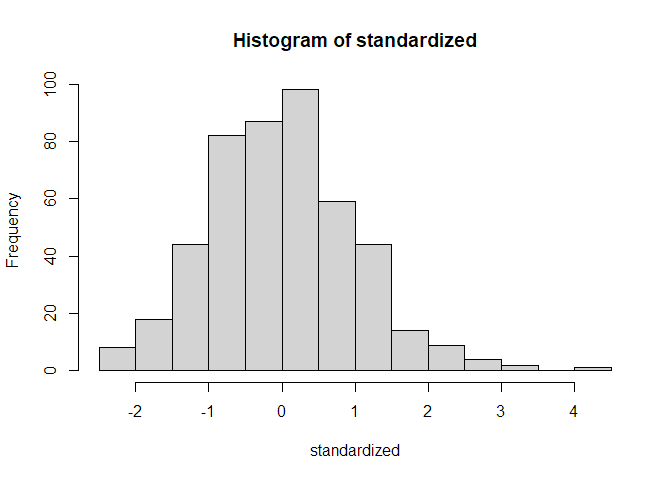
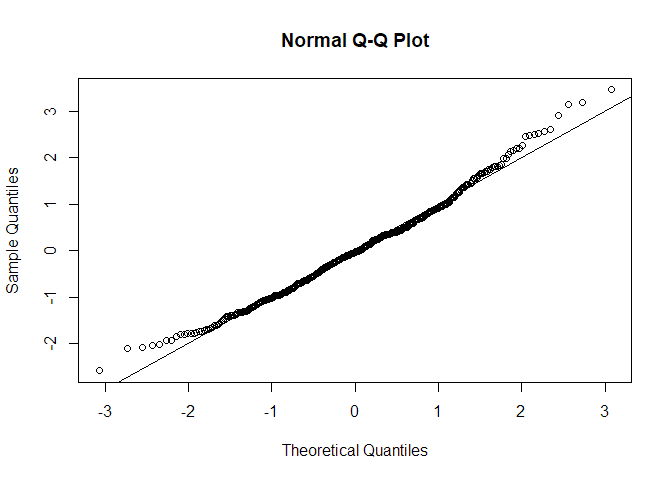
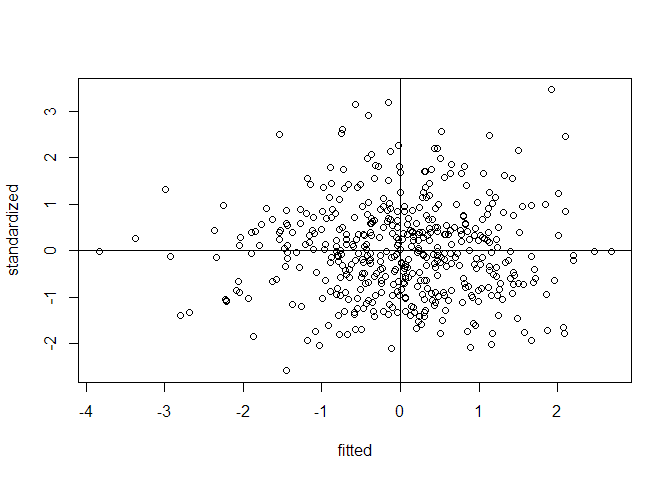
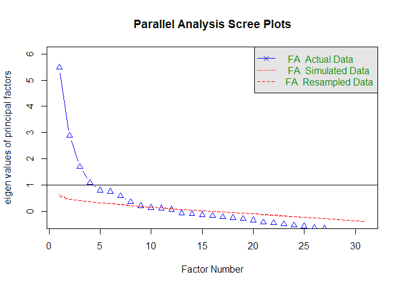
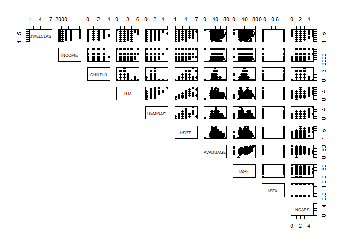
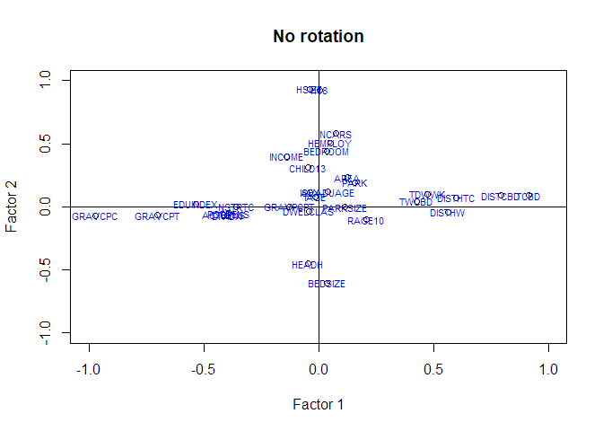
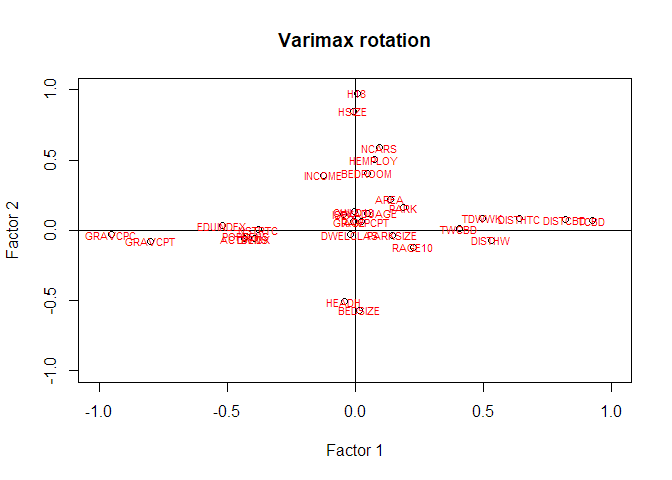
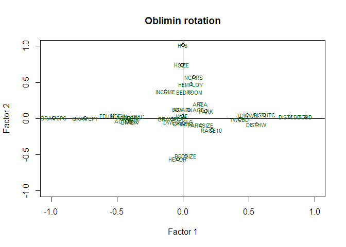

Exploratory Factor Analysis
================

#### Example exercise: “Residential location satisfaction in the Lisbon metropolitan area”

The aim of this study was to examine the perception of households
towards their residential location considering several land use and
accessibility factors as well as household socioeconomic and attitudinal
characteristics.

*Reference:* Martinez, L. G., de Abreu e Silva, J., & Viegas, J. M.
(2010). Assessment of residential location satisfaction in the Lisbon
metropolitan area, TRB (No. 10-1161).

**Your task:** Analyse the data and create meaningful latent factors.

## Data

#### Variables:

-   `DWELCLAS`: Classification of the dwelling;
-   `INCOME`: Income of the household;
-   `CHILD13`: Number of children under 13 years old;
-   `H18`: Number of household members above 18 years old;
-   `HEMPLOY`: Number of household members employed;
-   `HSIZE`: Household size;
-   `IAGE`: Age of the respondent;
-   `ISEX`: Sex of the respondent;
-   `NCARS`: Number of cars in the household;
-   `AREA`: Area of the dwelling;
-   `BEDROOM`: Number of bedrooms in the dwelling;
-   `PARK`: Number of parking spaces in the dwelling;
-   `BEDSIZE`: BEDROOM/HSIZE;
-   `PARKSIZE`: PARK/NCARS;
-   `RAGE10`: 1 if Dwelling age &lt;= 10;
-   `TCBD`: Private car distance in time to CBD;
-   `DISTTC`: Euclidean distance to heavy public transport system stops;
-   `TWCBD`: Private car distance in time of workplace to CBD;
-   `TDWWK`: Private car distance in time of dwelling to work place;
-   `HEADH`: 1 if Head of the Household;
-   `POPDENS`: Population density per hectare;
-   `EQUINDEX`: Number of undergraduate students/Population over 20
    years old (500m)

#### Rules of thumb:

-   At least 10 variables
-   n &lt; 50 (Unacceptable); n &gt; 200 (recommended)
-   It is recommended to use continuous variables. If your data contains
    categorical variables, you should transform them to dummy variables.

#### Assumptions:

-   Normality;
-   linearity;
-   Homogeneity;
-   Homoscedasticity (some multicollinearity is desirable);
-   Correlations between variables &lt; 0.3 (not appropriate to use
    Factor Analysis)

## Let’s start!

#### Import Libraries

``` r
library(foreign) # Library used to read SPSS files
library(nFactors) # Library used for factor analysis
library(tidyverse) # Library used in data science to perform exploratory data analysis
library(summarytools) # Library used for checking the summary of the dataset
library(psych) # Library used for factor analysis
library(GPArotation) # Library used for factor analysis
```

### Get to know your dataset

##### Import dataset

``` r
df <- read.spss("Data/example_fact.sav", to.data.frame = T) #transforms a list into a data.frame directly
```

##### Take a look at the main characteristics of the dataset

``` r
class(df) #type of data
```

    ## [1] "data.frame"

``` r
str(df)
```

    ## 'data.frame':    470 obs. of  32 variables:
    ##  $ RespondentID: num  7.99e+08 7.98e+08 7.98e+08 7.98e+08 7.98e+08 ...
    ##  $ DWELCLAS    : num  5 6 6 5 6 6 4 2 6 5 ...
    ##  $ INCOME      : num  7500 4750 4750 7500 2750 1500 12500 1500 1500 1500 ...
    ##  $ CHILD13     : num  1 0 2 0 1 0 0 0 0 0 ...
    ##  $ H18         : num  2 1 2 3 1 3 3 4 1 1 ...
    ##  $ HEMPLOY     : num  2 1 2 2 1 2 0 2 1 1 ...
    ##  $ HSIZE       : num  3 1 4 4 2 3 3 4 1 1 ...
    ##  $ AVADUAGE    : num  32 31 41.5 44.7 33 ...
    ##  $ IAGE        : num  32 31 42 52 33 47 62 21 34 25 ...
    ##  $ ISEX        : num  1 1 0 1 0 1 1 0 0 0 ...
    ##  $ NCARS       : num  2 1 2 3 1 1 2 3 1 1 ...
    ##  $ AREA        : num  100 90 220 120 90 100 178 180 80 50 ...
    ##  $ BEDROOM     : num  2 2 4 3 2 2 5 3 2 1 ...
    ##  $ PARK        : num  1 1 2 0 0 0 2 0 0 1 ...
    ##  $ BEDSIZE     : num  0.667 2 1 0.75 1 ...
    ##  $ PARKSIZE    : num  0.5 1 1 0 0 0 1 0 0 1 ...
    ##  $ RAGE10      : num  1 0 1 0 0 0 0 0 1 1 ...
    ##  $ TCBD        : num  36.79 15.47 24.1 28.72 7.28 ...
    ##  $ DISTHTC     : num  629 551 548 2351 698 ...
    ##  $ TWCBD       : num  10 15.5 12.71 3.17 5.36 ...
    ##  $ TDWWK       : num  31.1 0 20.4 32.9 13 ...
    ##  $ HEADH       : num  1 1 1 1 1 1 1 0 1 1 ...
    ##  $ POPDENS     : num  85.7 146.4 106.6 36.8 181.6 ...
    ##  $ EDUINDEX    : num  0.0641 0.2672 0.1 0.0867 0.1309 ...
    ##  $ GRAVCPC     : num  0.249 0.329 0.24 0.273 0.285 ...
    ##  $ GRAVCPT     : num  0.249 0.31 0.29 0.249 0.291 ...
    ##  $ GRAVPCPT    : num  1 1.062 0.826 1.099 0.98 ...
    ##  $ NSTRTC      : num  38 34 33 6 31 45 12 6 4 22 ...
    ##  $ DISTHW      : num  2036 748 2279 1196 3507 ...
    ##  $ DIVIDX      : num  0.323 0.348 0.324 0.327 0.355 ...
    ##  $ ACTDENS     : num  0.672 2.486 1.625 1.766 11.325 ...
    ##  $ DISTCBD     : num  9776 3524 11036 6257 1265 ...
    ##  - attr(*, "variable.labels")= Named chr(0) 
    ##   ..- attr(*, "names")= chr(0) 
    ##  - attr(*, "codepage")= int 1252

##### Check summary statistics of variables

``` r
descriptive_stats <- dfSummary(df)
view(descriptive_stats)
```

<div class="container st-container">
<h3>Data Frame Summary</h3>
<h4>df</h4>
<strong>Dimensions</strong>: 470 x 32
  <br/><strong>Duplicates</strong>: 0
<br/>
<div style="max-height:500px;overflow-y:scroll;margin:10px 2px">
  <table class="table table-striped table-bordered st-table st-table-striped st-table-bordered st-multiline ">
    <thead>
      <tr>
        <th align="center" class="st-protect-top-border"><strong>No</strong></th>
        <th align="center" class="st-protect-top-border"><strong>Variable</strong></th>
        <th align="center" class="st-protect-top-border"><strong>Stats / Values</strong></th>
        <th align="center" class="st-protect-top-border"><strong>Freqs (% of Valid)</strong></th>
        <th align="center" class="st-protect-top-border"><strong>Graph</strong></th>
        <th align="center" class="st-protect-top-border"><strong>Missing</strong></th>
      </tr>
    </thead>
    <tbody>
      <tr>
        <td align="center">1</td>
        <td align="left">RespondentID
[numeric]</td>
        <td align="left">Mean (sd) : 784082878 (8627501)
min < med < max:
773001005 < 780248283 < 808234671
IQR (CV) : 16634785 (0)</td>
        <td align="left" style="vertical-align:middle">470 distinct values</td>
        <td align="left" style="vertical-align:middle;padding:0;background-color:transparent"></td>
        <td align="center">0
(0.0%)</td>
      </tr>
      <tr>
        <td align="center">2</td>
        <td align="left">DWELCLAS
[numeric]</td>
        <td align="left">Mean (sd) : 5.1 (1.3)
min < med < max:
1 < 5 < 7
IQR (CV) : 2 (0.2)</td>
        <td align="left" style="padding:0;vertical-align:middle"><table style="border-collapse:collapse;border:none;margin:0"><tr style="background-color:transparent"><td style="padding:0 2px 0 7px;margin:0;border:0" align="right">1</td><td style="padding:0 2px;border:0;" align="left">:</td><td style="padding:0 4px 0 6px;margin:0;border:0" align="right">5</td><td style="padding:0;border:0" align="left">(</td><td style="padding:0 2px;margin:0;border:0" align="right">1.1%</td><td style="padding:0 4px 0 0;border:0" align="left">)</td></tr><tr style="background-color:transparent"><td style="padding:0 2px 0 7px;margin:0;border:0" align="right">2</td><td style="padding:0 2px;border:0;" align="left">:</td><td style="padding:0 4px 0 6px;margin:0;border:0" align="right">14</td><td style="padding:0;border:0" align="left">(</td><td style="padding:0 2px;margin:0;border:0" align="right">3.0%</td><td style="padding:0 4px 0 0;border:0" align="left">)</td></tr><tr style="background-color:transparent"><td style="padding:0 2px 0 7px;margin:0;border:0" align="right">3</td><td style="padding:0 2px;border:0;" align="left">:</td><td style="padding:0 4px 0 6px;margin:0;border:0" align="right">31</td><td style="padding:0;border:0" align="left">(</td><td style="padding:0 2px;margin:0;border:0" align="right">6.6%</td><td style="padding:0 4px 0 0;border:0" align="left">)</td></tr><tr style="background-color:transparent"><td style="padding:0 2px 0 7px;margin:0;border:0" align="right">4</td><td style="padding:0 2px;border:0;" align="left">:</td><td style="padding:0 4px 0 6px;margin:0;border:0" align="right">75</td><td style="padding:0;border:0" align="left">(</td><td style="padding:0 2px;margin:0;border:0" align="right">16.0%</td><td style="padding:0 4px 0 0;border:0" align="left">)</td></tr><tr style="background-color:transparent"><td style="padding:0 2px 0 7px;margin:0;border:0" align="right">5</td><td style="padding:0 2px;border:0;" align="left">:</td><td style="padding:0 4px 0 6px;margin:0;border:0" align="right">130</td><td style="padding:0;border:0" align="left">(</td><td style="padding:0 2px;margin:0;border:0" align="right">27.7%</td><td style="padding:0 4px 0 0;border:0" align="left">)</td></tr><tr style="background-color:transparent"><td style="padding:0 2px 0 7px;margin:0;border:0" align="right">6</td><td style="padding:0 2px;border:0;" align="left">:</td><td style="padding:0 4px 0 6px;margin:0;border:0" align="right">162</td><td style="padding:0;border:0" align="left">(</td><td style="padding:0 2px;margin:0;border:0" align="right">34.5%</td><td style="padding:0 4px 0 0;border:0" align="left">)</td></tr><tr style="background-color:transparent"><td style="padding:0 2px 0 7px;margin:0;border:0" align="right">7</td><td style="padding:0 2px;border:0;" align="left">:</td><td style="padding:0 4px 0 6px;margin:0;border:0" align="right">53</td><td style="padding:0;border:0" align="left">(</td><td style="padding:0 2px;margin:0;border:0" align="right">11.3%</td><td style="padding:0 4px 0 0;border:0" align="left">)</td></tr></table></td>
        <td align="left" style="vertical-align:middle;padding:0;background-color:transparent"></td>
        <td align="center">0
(0.0%)</td>
      </tr>
      <tr>
        <td align="center">3</td>
        <td align="left">INCOME
[numeric]</td>
        <td align="left">Mean (sd) : 4259.6 (3001.8)
min < med < max:
700 < 2750 < 12500
IQR (CV) : 2000 (0.7)</td>
        <td align="left" style="padding:0;vertical-align:middle"><table style="border-collapse:collapse;border:none;margin:0"><tr style="background-color:transparent"><td style="padding:0 2px 0 7px;margin:0;border:0" align="right">700</td><td style="padding:0 2px;border:0;" align="left">:</td><td style="padding:0 4px 0 6px;margin:0;border:0" align="right">20</td><td style="padding:0;border:0" align="left">(</td><td style="padding:0 2px;margin:0;border:0" align="right">4.3%</td><td style="padding:0 4px 0 0;border:0" align="left">)</td></tr><tr style="background-color:transparent"><td style="padding:0 2px 0 7px;margin:0;border:0" align="right">1500</td><td style="padding:0 2px;border:0;" align="left">:</td><td style="padding:0 4px 0 6px;margin:0;border:0" align="right">96</td><td style="padding:0;border:0" align="left">(</td><td style="padding:0 2px;margin:0;border:0" align="right">20.4%</td><td style="padding:0 4px 0 0;border:0" align="left">)</td></tr><tr style="background-color:transparent"><td style="padding:0 2px 0 7px;margin:0;border:0" align="right">2750</td><td style="padding:0 2px;border:0;" align="left">:</td><td style="padding:0 4px 0 6px;margin:0;border:0" align="right">142</td><td style="padding:0;border:0" align="left">(</td><td style="padding:0 2px;margin:0;border:0" align="right">30.2%</td><td style="padding:0 4px 0 0;border:0" align="left">)</td></tr><tr style="background-color:transparent"><td style="padding:0 2px 0 7px;margin:0;border:0" align="right">4750</td><td style="padding:0 2px;border:0;" align="left">:</td><td style="padding:0 4px 0 6px;margin:0;border:0" align="right">106</td><td style="padding:0;border:0" align="left">(</td><td style="padding:0 2px;margin:0;border:0" align="right">22.6%</td><td style="padding:0 4px 0 0;border:0" align="left">)</td></tr><tr style="background-color:transparent"><td style="padding:0 2px 0 7px;margin:0;border:0" align="right">7500</td><td style="padding:0 2px;border:0;" align="left">:</td><td style="padding:0 4px 0 6px;margin:0;border:0" align="right">75</td><td style="padding:0;border:0" align="left">(</td><td style="padding:0 2px;margin:0;border:0" align="right">16.0%</td><td style="padding:0 4px 0 0;border:0" align="left">)</td></tr><tr style="background-color:transparent"><td style="padding:0 2px 0 7px;margin:0;border:0" align="right">12500</td><td style="padding:0 2px;border:0;" align="left">:</td><td style="padding:0 4px 0 6px;margin:0;border:0" align="right">31</td><td style="padding:0;border:0" align="left">(</td><td style="padding:0 2px;margin:0;border:0" align="right">6.6%</td><td style="padding:0 4px 0 0;border:0" align="left">)</td></tr></table></td>
        <td align="left" style="vertical-align:middle;padding:0;background-color:transparent"></td>
        <td align="center">0
(0.0%)</td>
      </tr>
      <tr>
        <td align="center">4</td>
        <td align="left">CHILD13
[numeric]</td>
        <td align="left">Mean (sd) : 0.4 (0.8)
min < med < max:
0 < 0 < 4
IQR (CV) : 0 (2)</td>
        <td align="left" style="padding:0;vertical-align:middle"><table style="border-collapse:collapse;border:none;margin:0"><tr style="background-color:transparent"><td style="padding:0 2px 0 7px;margin:0;border:0" align="right">0</td><td style="padding:0 2px;border:0;" align="left">:</td><td style="padding:0 4px 0 6px;margin:0;border:0" align="right">353</td><td style="padding:0;border:0" align="left">(</td><td style="padding:0 2px;margin:0;border:0" align="right">75.1%</td><td style="padding:0 4px 0 0;border:0" align="left">)</td></tr><tr style="background-color:transparent"><td style="padding:0 2px 0 7px;margin:0;border:0" align="right">1</td><td style="padding:0 2px;border:0;" align="left">:</td><td style="padding:0 4px 0 6px;margin:0;border:0" align="right">62</td><td style="padding:0;border:0" align="left">(</td><td style="padding:0 2px;margin:0;border:0" align="right">13.2%</td><td style="padding:0 4px 0 0;border:0" align="left">)</td></tr><tr style="background-color:transparent"><td style="padding:0 2px 0 7px;margin:0;border:0" align="right">2</td><td style="padding:0 2px;border:0;" align="left">:</td><td style="padding:0 4px 0 6px;margin:0;border:0" align="right">41</td><td style="padding:0;border:0" align="left">(</td><td style="padding:0 2px;margin:0;border:0" align="right">8.7%</td><td style="padding:0 4px 0 0;border:0" align="left">)</td></tr><tr style="background-color:transparent"><td style="padding:0 2px 0 7px;margin:0;border:0" align="right">3</td><td style="padding:0 2px;border:0;" align="left">:</td><td style="padding:0 4px 0 6px;margin:0;border:0" align="right">13</td><td style="padding:0;border:0" align="left">(</td><td style="padding:0 2px;margin:0;border:0" align="right">2.8%</td><td style="padding:0 4px 0 0;border:0" align="left">)</td></tr><tr style="background-color:transparent"><td style="padding:0 2px 0 7px;margin:0;border:0" align="right">4</td><td style="padding:0 2px;border:0;" align="left">:</td><td style="padding:0 4px 0 6px;margin:0;border:0" align="right">1</td><td style="padding:0;border:0" align="left">(</td><td style="padding:0 2px;margin:0;border:0" align="right">0.2%</td><td style="padding:0 4px 0 0;border:0" align="left">)</td></tr></table></td>
        <td align="left" style="vertical-align:middle;padding:0;background-color:transparent"></td>
        <td align="center">0
(0.0%)</td>
      </tr>
      <tr>
        <td align="center">5</td>
        <td align="left">H18
[numeric]</td>
        <td align="left">Mean (sd) : 2.1 (0.9)
min < med < max:
0 < 2 < 6
IQR (CV) : 0.8 (0.4)</td>
        <td align="left" style="padding:0;vertical-align:middle"><table style="border-collapse:collapse;border:none;margin:0"><tr style="background-color:transparent"><td style="padding:0 2px 0 7px;margin:0;border:0" align="right">0</td><td style="padding:0 2px;border:0;" align="left">:</td><td style="padding:0 4px 0 6px;margin:0;border:0" align="right">1</td><td style="padding:0;border:0" align="left">(</td><td style="padding:0 2px;margin:0;border:0" align="right">0.2%</td><td style="padding:0 4px 0 0;border:0" align="left">)</td></tr><tr style="background-color:transparent"><td style="padding:0 2px 0 7px;margin:0;border:0" align="right">1</td><td style="padding:0 2px;border:0;" align="left">:</td><td style="padding:0 4px 0 6px;margin:0;border:0" align="right">112</td><td style="padding:0;border:0" align="left">(</td><td style="padding:0 2px;margin:0;border:0" align="right">23.8%</td><td style="padding:0 4px 0 0;border:0" align="left">)</td></tr><tr style="background-color:transparent"><td style="padding:0 2px 0 7px;margin:0;border:0" align="right">2</td><td style="padding:0 2px;border:0;" align="left">:</td><td style="padding:0 4px 0 6px;margin:0;border:0" align="right">239</td><td style="padding:0;border:0" align="left">(</td><td style="padding:0 2px;margin:0;border:0" align="right">50.9%</td><td style="padding:0 4px 0 0;border:0" align="left">)</td></tr><tr style="background-color:transparent"><td style="padding:0 2px 0 7px;margin:0;border:0" align="right">3</td><td style="padding:0 2px;border:0;" align="left">:</td><td style="padding:0 4px 0 6px;margin:0;border:0" align="right">77</td><td style="padding:0;border:0" align="left">(</td><td style="padding:0 2px;margin:0;border:0" align="right">16.4%</td><td style="padding:0 4px 0 0;border:0" align="left">)</td></tr><tr style="background-color:transparent"><td style="padding:0 2px 0 7px;margin:0;border:0" align="right">4</td><td style="padding:0 2px;border:0;" align="left">:</td><td style="padding:0 4px 0 6px;margin:0;border:0" align="right">35</td><td style="padding:0;border:0" align="left">(</td><td style="padding:0 2px;margin:0;border:0" align="right">7.4%</td><td style="padding:0 4px 0 0;border:0" align="left">)</td></tr><tr style="background-color:transparent"><td style="padding:0 2px 0 7px;margin:0;border:0" align="right">5</td><td style="padding:0 2px;border:0;" align="left">:</td><td style="padding:0 4px 0 6px;margin:0;border:0" align="right">3</td><td style="padding:0;border:0" align="left">(</td><td style="padding:0 2px;margin:0;border:0" align="right">0.6%</td><td style="padding:0 4px 0 0;border:0" align="left">)</td></tr><tr style="background-color:transparent"><td style="padding:0 2px 0 7px;margin:0;border:0" align="right">6</td><td style="padding:0 2px;border:0;" align="left">:</td><td style="padding:0 4px 0 6px;margin:0;border:0" align="right">3</td><td style="padding:0;border:0" align="left">(</td><td style="padding:0 2px;margin:0;border:0" align="right">0.6%</td><td style="padding:0 4px 0 0;border:0" align="left">)</td></tr></table></td>
        <td align="left" style="vertical-align:middle;padding:0;background-color:transparent"></td>
        <td align="center">0
(0.0%)</td>
      </tr>
      <tr>
        <td align="center">6</td>
        <td align="left">HEMPLOY
[numeric]</td>
        <td align="left">Mean (sd) : 1.5 (0.7)
min < med < max:
0 < 2 < 5
IQR (CV) : 1 (0.5)</td>
        <td align="left" style="padding:0;vertical-align:middle"><table style="border-collapse:collapse;border:none;margin:0"><tr style="background-color:transparent"><td style="padding:0 2px 0 7px;margin:0;border:0" align="right">0</td><td style="padding:0 2px;border:0;" align="left">:</td><td style="padding:0 4px 0 6px;margin:0;border:0" align="right">39</td><td style="padding:0;border:0" align="left">(</td><td style="padding:0 2px;margin:0;border:0" align="right">8.3%</td><td style="padding:0 4px 0 0;border:0" align="left">)</td></tr><tr style="background-color:transparent"><td style="padding:0 2px 0 7px;margin:0;border:0" align="right">1</td><td style="padding:0 2px;border:0;" align="left">:</td><td style="padding:0 4px 0 6px;margin:0;border:0" align="right">171</td><td style="padding:0;border:0" align="left">(</td><td style="padding:0 2px;margin:0;border:0" align="right">36.4%</td><td style="padding:0 4px 0 0;border:0" align="left">)</td></tr><tr style="background-color:transparent"><td style="padding:0 2px 0 7px;margin:0;border:0" align="right">2</td><td style="padding:0 2px;border:0;" align="left">:</td><td style="padding:0 4px 0 6px;margin:0;border:0" align="right">237</td><td style="padding:0;border:0" align="left">(</td><td style="padding:0 2px;margin:0;border:0" align="right">50.4%</td><td style="padding:0 4px 0 0;border:0" align="left">)</td></tr><tr style="background-color:transparent"><td style="padding:0 2px 0 7px;margin:0;border:0" align="right">3</td><td style="padding:0 2px;border:0;" align="left">:</td><td style="padding:0 4px 0 6px;margin:0;border:0" align="right">21</td><td style="padding:0;border:0" align="left">(</td><td style="padding:0 2px;margin:0;border:0" align="right">4.5%</td><td style="padding:0 4px 0 0;border:0" align="left">)</td></tr><tr style="background-color:transparent"><td style="padding:0 2px 0 7px;margin:0;border:0" align="right">4</td><td style="padding:0 2px;border:0;" align="left">:</td><td style="padding:0 4px 0 6px;margin:0;border:0" align="right">1</td><td style="padding:0;border:0" align="left">(</td><td style="padding:0 2px;margin:0;border:0" align="right">0.2%</td><td style="padding:0 4px 0 0;border:0" align="left">)</td></tr><tr style="background-color:transparent"><td style="padding:0 2px 0 7px;margin:0;border:0" align="right">5</td><td style="padding:0 2px;border:0;" align="left">:</td><td style="padding:0 4px 0 6px;margin:0;border:0" align="right">1</td><td style="padding:0;border:0" align="left">(</td><td style="padding:0 2px;margin:0;border:0" align="right">0.2%</td><td style="padding:0 4px 0 0;border:0" align="left">)</td></tr></table></td>
        <td align="left" style="vertical-align:middle;padding:0;background-color:transparent"></td>
        <td align="center">0
(0.0%)</td>
      </tr>
      <tr>
        <td align="center">7</td>
        <td align="left">HSIZE
[numeric]</td>
        <td align="left">Mean (sd) : 2.6 (1.3)
min < med < max:
1 < 2 < 7
IQR (CV) : 2 (0.5)</td>
        <td align="left" style="padding:0;vertical-align:middle"><table style="border-collapse:collapse;border:none;margin:0"><tr style="background-color:transparent"><td style="padding:0 2px 0 7px;margin:0;border:0" align="right">1</td><td style="padding:0 2px;border:0;" align="left">:</td><td style="padding:0 4px 0 6px;margin:0;border:0" align="right">104</td><td style="padding:0;border:0" align="left">(</td><td style="padding:0 2px;margin:0;border:0" align="right">22.1%</td><td style="padding:0 4px 0 0;border:0" align="left">)</td></tr><tr style="background-color:transparent"><td style="padding:0 2px 0 7px;margin:0;border:0" align="right">2</td><td style="padding:0 2px;border:0;" align="left">:</td><td style="padding:0 4px 0 6px;margin:0;border:0" align="right">147</td><td style="padding:0;border:0" align="left">(</td><td style="padding:0 2px;margin:0;border:0" align="right">31.3%</td><td style="padding:0 4px 0 0;border:0" align="left">)</td></tr><tr style="background-color:transparent"><td style="padding:0 2px 0 7px;margin:0;border:0" align="right">3</td><td style="padding:0 2px;border:0;" align="left">:</td><td style="padding:0 4px 0 6px;margin:0;border:0" align="right">96</td><td style="padding:0;border:0" align="left">(</td><td style="padding:0 2px;margin:0;border:0" align="right">20.4%</td><td style="padding:0 4px 0 0;border:0" align="left">)</td></tr><tr style="background-color:transparent"><td style="padding:0 2px 0 7px;margin:0;border:0" align="right">4</td><td style="padding:0 2px;border:0;" align="left">:</td><td style="padding:0 4px 0 6px;margin:0;border:0" align="right">96</td><td style="padding:0;border:0" align="left">(</td><td style="padding:0 2px;margin:0;border:0" align="right">20.4%</td><td style="padding:0 4px 0 0;border:0" align="left">)</td></tr><tr style="background-color:transparent"><td style="padding:0 2px 0 7px;margin:0;border:0" align="right">5</td><td style="padding:0 2px;border:0;" align="left">:</td><td style="padding:0 4px 0 6px;margin:0;border:0" align="right">20</td><td style="padding:0;border:0" align="left">(</td><td style="padding:0 2px;margin:0;border:0" align="right">4.3%</td><td style="padding:0 4px 0 0;border:0" align="left">)</td></tr><tr style="background-color:transparent"><td style="padding:0 2px 0 7px;margin:0;border:0" align="right">6</td><td style="padding:0 2px;border:0;" align="left">:</td><td style="padding:0 4px 0 6px;margin:0;border:0" align="right">5</td><td style="padding:0;border:0" align="left">(</td><td style="padding:0 2px;margin:0;border:0" align="right">1.1%</td><td style="padding:0 4px 0 0;border:0" align="left">)</td></tr><tr style="background-color:transparent"><td style="padding:0 2px 0 7px;margin:0;border:0" align="right">7</td><td style="padding:0 2px;border:0;" align="left">:</td><td style="padding:0 4px 0 6px;margin:0;border:0" align="right">2</td><td style="padding:0;border:0" align="left">(</td><td style="padding:0 2px;margin:0;border:0" align="right">0.4%</td><td style="padding:0 4px 0 0;border:0" align="left">)</td></tr></table></td>
        <td align="left" style="vertical-align:middle;padding:0;background-color:transparent"></td>
        <td align="center">0
(0.0%)</td>
      </tr>
      <tr>
        <td align="center">8</td>
        <td align="left">AVADUAGE
[numeric]</td>
        <td align="left">Mean (sd) : 37.8 (9.9)
min < med < max:
0 < 36 < 78
IQR (CV) : 12.7 (0.3)</td>
        <td align="left" style="vertical-align:middle">126 distinct values</td>
        <td align="left" style="vertical-align:middle;padding:0;background-color:transparent"></td>
        <td align="center">0
(0.0%)</td>
      </tr>
      <tr>
        <td align="center">9</td>
        <td align="left">IAGE
[numeric]</td>
        <td align="left">Mean (sd) : 36.9 (11.6)
min < med < max:
0 < 34 < 78
IQR (CV) : 15 (0.3)</td>
        <td align="left" style="vertical-align:middle">53 distinct values</td>
        <td align="left" style="vertical-align:middle;padding:0;background-color:transparent"></td>
        <td align="center">0
(0.0%)</td>
      </tr>
      <tr>
        <td align="center">10</td>
        <td align="left">ISEX
[numeric]</td>
        <td align="left">Min : 0
Mean : 0.5
Max : 1</td>
        <td align="left" style="padding:0;vertical-align:middle"><table style="border-collapse:collapse;border:none;margin:0"><tr style="background-color:transparent"><td style="padding:0 2px 0 7px;margin:0;border:0" align="right">0</td><td style="padding:0 2px;border:0;" align="left">:</td><td style="padding:0 4px 0 6px;margin:0;border:0" align="right">214</td><td style="padding:0;border:0" align="left">(</td><td style="padding:0 2px;margin:0;border:0" align="right">45.5%</td><td style="padding:0 4px 0 0;border:0" align="left">)</td></tr><tr style="background-color:transparent"><td style="padding:0 2px 0 7px;margin:0;border:0" align="right">1</td><td style="padding:0 2px;border:0;" align="left">:</td><td style="padding:0 4px 0 6px;margin:0;border:0" align="right">256</td><td style="padding:0;border:0" align="left">(</td><td style="padding:0 2px;margin:0;border:0" align="right">54.5%</td><td style="padding:0 4px 0 0;border:0" align="left">)</td></tr></table></td>
        <td align="left" style="vertical-align:middle;padding:0;background-color:transparent"></td>
        <td align="center">0
(0.0%)</td>
      </tr>
      <tr>
        <td align="center">11</td>
        <td align="left">NCARS
[numeric]</td>
        <td align="left">Mean (sd) : 1.7 (0.9)
min < med < max:
0 < 2 < 5
IQR (CV) : 1 (0.5)</td>
        <td align="left" style="padding:0;vertical-align:middle"><table style="border-collapse:collapse;border:none;margin:0"><tr style="background-color:transparent"><td style="padding:0 2px 0 7px;margin:0;border:0" align="right">0</td><td style="padding:0 2px;border:0;" align="left">:</td><td style="padding:0 4px 0 6px;margin:0;border:0" align="right">23</td><td style="padding:0;border:0" align="left">(</td><td style="padding:0 2px;margin:0;border:0" align="right">4.9%</td><td style="padding:0 4px 0 0;border:0" align="left">)</td></tr><tr style="background-color:transparent"><td style="padding:0 2px 0 7px;margin:0;border:0" align="right">1</td><td style="padding:0 2px;border:0;" align="left">:</td><td style="padding:0 4px 0 6px;margin:0;border:0" align="right">182</td><td style="padding:0;border:0" align="left">(</td><td style="padding:0 2px;margin:0;border:0" align="right">38.7%</td><td style="padding:0 4px 0 0;border:0" align="left">)</td></tr><tr style="background-color:transparent"><td style="padding:0 2px 0 7px;margin:0;border:0" align="right">2</td><td style="padding:0 2px;border:0;" align="left">:</td><td style="padding:0 4px 0 6px;margin:0;border:0" align="right">193</td><td style="padding:0;border:0" align="left">(</td><td style="padding:0 2px;margin:0;border:0" align="right">41.1%</td><td style="padding:0 4px 0 0;border:0" align="left">)</td></tr><tr style="background-color:transparent"><td style="padding:0 2px 0 7px;margin:0;border:0" align="right">3</td><td style="padding:0 2px;border:0;" align="left">:</td><td style="padding:0 4px 0 6px;margin:0;border:0" align="right">56</td><td style="padding:0;border:0" align="left">(</td><td style="padding:0 2px;margin:0;border:0" align="right">11.9%</td><td style="padding:0 4px 0 0;border:0" align="left">)</td></tr><tr style="background-color:transparent"><td style="padding:0 2px 0 7px;margin:0;border:0" align="right">4</td><td style="padding:0 2px;border:0;" align="left">:</td><td style="padding:0 4px 0 6px;margin:0;border:0" align="right">13</td><td style="padding:0;border:0" align="left">(</td><td style="padding:0 2px;margin:0;border:0" align="right">2.8%</td><td style="padding:0 4px 0 0;border:0" align="left">)</td></tr><tr style="background-color:transparent"><td style="padding:0 2px 0 7px;margin:0;border:0" align="right">5</td><td style="padding:0 2px;border:0;" align="left">:</td><td style="padding:0 4px 0 6px;margin:0;border:0" align="right">3</td><td style="padding:0;border:0" align="left">(</td><td style="padding:0 2px;margin:0;border:0" align="right">0.6%</td><td style="padding:0 4px 0 0;border:0" align="left">)</td></tr></table></td>
        <td align="left" style="vertical-align:middle;padding:0;background-color:transparent"></td>
        <td align="center">0
(0.0%)</td>
      </tr>
      <tr>
        <td align="center">12</td>
        <td align="left">AREA
[numeric]</td>
        <td align="left">Mean (sd) : 133 (121.5)
min < med < max:
30 < 110 < 2250
IQR (CV) : 60 (0.9)</td>
        <td align="left" style="vertical-align:middle">76 distinct values</td>
        <td align="left" style="vertical-align:middle;padding:0;background-color:transparent"></td>
        <td align="center">0
(0.0%)</td>
      </tr>
      <tr>
        <td align="center">13</td>
        <td align="left">BEDROOM
[numeric]</td>
        <td align="left">Mean (sd) : 2.9 (1.1)
min < med < max:
0 < 3 < 7
IQR (CV) : 1 (0.4)</td>
        <td align="left" style="padding:0;vertical-align:middle"><table style="border-collapse:collapse;border:none;margin:0"><tr style="background-color:transparent"><td style="padding:0 2px 0 7px;margin:0;border:0" align="right">0</td><td style="padding:0 2px;border:0;" align="left">:</td><td style="padding:0 4px 0 6px;margin:0;border:0" align="right">1</td><td style="padding:0;border:0" align="left">(</td><td style="padding:0 2px;margin:0;border:0" align="right">0.2%</td><td style="padding:0 4px 0 0;border:0" align="left">)</td></tr><tr style="background-color:transparent"><td style="padding:0 2px 0 7px;margin:0;border:0" align="right">1</td><td style="padding:0 2px;border:0;" align="left">:</td><td style="padding:0 4px 0 6px;margin:0;border:0" align="right">28</td><td style="padding:0;border:0" align="left">(</td><td style="padding:0 2px;margin:0;border:0" align="right">6.0%</td><td style="padding:0 4px 0 0;border:0" align="left">)</td></tr><tr style="background-color:transparent"><td style="padding:0 2px 0 7px;margin:0;border:0" align="right">2</td><td style="padding:0 2px;border:0;" align="left">:</td><td style="padding:0 4px 0 6px;margin:0;border:0" align="right">153</td><td style="padding:0;border:0" align="left">(</td><td style="padding:0 2px;margin:0;border:0" align="right">32.6%</td><td style="padding:0 4px 0 0;border:0" align="left">)</td></tr><tr style="background-color:transparent"><td style="padding:0 2px 0 7px;margin:0;border:0" align="right">3</td><td style="padding:0 2px;border:0;" align="left">:</td><td style="padding:0 4px 0 6px;margin:0;border:0" align="right">180</td><td style="padding:0;border:0" align="left">(</td><td style="padding:0 2px;margin:0;border:0" align="right">38.3%</td><td style="padding:0 4px 0 0;border:0" align="left">)</td></tr><tr style="background-color:transparent"><td style="padding:0 2px 0 7px;margin:0;border:0" align="right">4</td><td style="padding:0 2px;border:0;" align="left">:</td><td style="padding:0 4px 0 6px;margin:0;border:0" align="right">73</td><td style="padding:0;border:0" align="left">(</td><td style="padding:0 2px;margin:0;border:0" align="right">15.5%</td><td style="padding:0 4px 0 0;border:0" align="left">)</td></tr><tr style="background-color:transparent"><td style="padding:0 2px 0 7px;margin:0;border:0" align="right">5</td><td style="padding:0 2px;border:0;" align="left">:</td><td style="padding:0 4px 0 6px;margin:0;border:0" align="right">26</td><td style="padding:0;border:0" align="left">(</td><td style="padding:0 2px;margin:0;border:0" align="right">5.5%</td><td style="padding:0 4px 0 0;border:0" align="left">)</td></tr><tr style="background-color:transparent"><td style="padding:0 2px 0 7px;margin:0;border:0" align="right">6</td><td style="padding:0 2px;border:0;" align="left">:</td><td style="padding:0 4px 0 6px;margin:0;border:0" align="right">7</td><td style="padding:0;border:0" align="left">(</td><td style="padding:0 2px;margin:0;border:0" align="right">1.5%</td><td style="padding:0 4px 0 0;border:0" align="left">)</td></tr><tr style="background-color:transparent"><td style="padding:0 2px 0 7px;margin:0;border:0" align="right">7</td><td style="padding:0 2px;border:0;" align="left">:</td><td style="padding:0 4px 0 6px;margin:0;border:0" align="right">2</td><td style="padding:0;border:0" align="left">(</td><td style="padding:0 2px;margin:0;border:0" align="right">0.4%</td><td style="padding:0 4px 0 0;border:0" align="left">)</td></tr></table></td>
        <td align="left" style="vertical-align:middle;padding:0;background-color:transparent"></td>
        <td align="center">0
(0.0%)</td>
      </tr>
      <tr>
        <td align="center">14</td>
        <td align="left">PARK
[numeric]</td>
        <td align="left">Mean (sd) : 0.8 (1)
min < med < max:
0 < 1 < 4
IQR (CV) : 1 (1.2)</td>
        <td align="left" style="padding:0;vertical-align:middle"><table style="border-collapse:collapse;border:none;margin:0"><tr style="background-color:transparent"><td style="padding:0 2px 0 7px;margin:0;border:0" align="right">0</td><td style="padding:0 2px;border:0;" align="left">:</td><td style="padding:0 4px 0 6px;margin:0;border:0" align="right">224</td><td style="padding:0;border:0" align="left">(</td><td style="padding:0 2px;margin:0;border:0" align="right">47.7%</td><td style="padding:0 4px 0 0;border:0" align="left">)</td></tr><tr style="background-color:transparent"><td style="padding:0 2px 0 7px;margin:0;border:0" align="right">1</td><td style="padding:0 2px;border:0;" align="left">:</td><td style="padding:0 4px 0 6px;margin:0;border:0" align="right">136</td><td style="padding:0;border:0" align="left">(</td><td style="padding:0 2px;margin:0;border:0" align="right">28.9%</td><td style="padding:0 4px 0 0;border:0" align="left">)</td></tr><tr style="background-color:transparent"><td style="padding:0 2px 0 7px;margin:0;border:0" align="right">2</td><td style="padding:0 2px;border:0;" align="left">:</td><td style="padding:0 4px 0 6px;margin:0;border:0" align="right">84</td><td style="padding:0;border:0" align="left">(</td><td style="padding:0 2px;margin:0;border:0" align="right">17.9%</td><td style="padding:0 4px 0 0;border:0" align="left">)</td></tr><tr style="background-color:transparent"><td style="padding:0 2px 0 7px;margin:0;border:0" align="right">3</td><td style="padding:0 2px;border:0;" align="left">:</td><td style="padding:0 4px 0 6px;margin:0;border:0" align="right">18</td><td style="padding:0;border:0" align="left">(</td><td style="padding:0 2px;margin:0;border:0" align="right">3.8%</td><td style="padding:0 4px 0 0;border:0" align="left">)</td></tr><tr style="background-color:transparent"><td style="padding:0 2px 0 7px;margin:0;border:0" align="right">4</td><td style="padding:0 2px;border:0;" align="left">:</td><td style="padding:0 4px 0 6px;margin:0;border:0" align="right">8</td><td style="padding:0;border:0" align="left">(</td><td style="padding:0 2px;margin:0;border:0" align="right">1.7%</td><td style="padding:0 4px 0 0;border:0" align="left">)</td></tr></table></td>
        <td align="left" style="vertical-align:middle;padding:0;background-color:transparent"></td>
        <td align="center">0
(0.0%)</td>
      </tr>
      <tr>
        <td align="center">15</td>
        <td align="left">BEDSIZE
[numeric]</td>
        <td align="left">Mean (sd) : 1.4 (0.8)
min < med < max:
0 < 1 < 5
IQR (CV) : 0.7 (0.6)</td>
        <td align="left" style="vertical-align:middle">22 distinct values</td>
        <td align="left" style="vertical-align:middle;padding:0;background-color:transparent"></td>
        <td align="center">0
(0.0%)</td>
      </tr>
      <tr>
        <td align="center">16</td>
        <td align="left">PARKSIZE
[numeric]</td>
        <td align="left">Mean (sd) : 0.5 (0.6)
min < med < max:
0 < 0.2 < 3
IQR (CV) : 1 (1.2)</td>
        <td align="left" style="vertical-align:middle">13 distinct values</td>
        <td align="left" style="vertical-align:middle;padding:0;background-color:transparent"></td>
        <td align="center">0
(0.0%)</td>
      </tr>
      <tr>
        <td align="center">17</td>
        <td align="left">RAGE10
[numeric]</td>
        <td align="left">Min : 0
Mean : 0.2
Max : 1</td>
        <td align="left" style="padding:0;vertical-align:middle"><table style="border-collapse:collapse;border:none;margin:0"><tr style="background-color:transparent"><td style="padding:0 2px 0 7px;margin:0;border:0" align="right">0</td><td style="padding:0 2px;border:0;" align="left">:</td><td style="padding:0 4px 0 6px;margin:0;border:0" align="right">356</td><td style="padding:0;border:0" align="left">(</td><td style="padding:0 2px;margin:0;border:0" align="right">75.7%</td><td style="padding:0 4px 0 0;border:0" align="left">)</td></tr><tr style="background-color:transparent"><td style="padding:0 2px 0 7px;margin:0;border:0" align="right">1</td><td style="padding:0 2px;border:0;" align="left">:</td><td style="padding:0 4px 0 6px;margin:0;border:0" align="right">114</td><td style="padding:0;border:0" align="left">(</td><td style="padding:0 2px;margin:0;border:0" align="right">24.3%</td><td style="padding:0 4px 0 0;border:0" align="left">)</td></tr></table></td>
        <td align="left" style="vertical-align:middle;padding:0;background-color:transparent"></td>
        <td align="center">0
(0.0%)</td>
      </tr>
      <tr>
        <td align="center">18</td>
        <td align="left">TCBD
[numeric]</td>
        <td align="left">Mean (sd) : 24.7 (16.2)
min < med < max:
0.8 < 23.8 < 73.3
IQR (CV) : 25.7 (0.7)</td>
        <td align="left" style="vertical-align:middle">434 distinct values</td>
        <td align="left" style="vertical-align:middle;padding:0;background-color:transparent"></td>
        <td align="center">0
(0.0%)</td>
      </tr>
      <tr>
        <td align="center">19</td>
        <td align="left">DISTHTC
[numeric]</td>
        <td align="left">Mean (sd) : 1347 (1815.8)
min < med < max:
49 < 719 < 17732.7
IQR (CV) : 1125 (1.3)</td>
        <td align="left" style="vertical-align:middle">434 distinct values</td>
        <td align="left" style="vertical-align:middle;padding:0;background-color:transparent"></td>
        <td align="center">0
(0.0%)</td>
      </tr>
      <tr>
        <td align="center">20</td>
        <td align="left">TWCBD
[numeric]</td>
        <td align="left">Mean (sd) : 17 (16.2)
min < med < max:
0.3 < 9.9 < 67.8
IQR (CV) : 20 (1)</td>
        <td align="left" style="vertical-align:middle">439 distinct values</td>
        <td align="left" style="vertical-align:middle;padding:0;background-color:transparent"></td>
        <td align="center">0
(0.0%)</td>
      </tr>
      <tr>
        <td align="center">21</td>
        <td align="left">TDWWK
[numeric]</td>
        <td align="left">Mean (sd) : 23.5 (17.1)
min < med < max:
0 < 22.2 < 80.7
IQR (CV) : 23.6 (0.7)</td>
        <td align="left" style="vertical-align:middle">414 distinct values</td>
        <td align="left" style="vertical-align:middle;padding:0;background-color:transparent"></td>
        <td align="center">0
(0.0%)</td>
      </tr>
      <tr>
        <td align="center">22</td>
        <td align="left">HEADH
[numeric]</td>
        <td align="left">Min : 0
Mean : 0.9
Max : 1</td>
        <td align="left" style="padding:0;vertical-align:middle"><table style="border-collapse:collapse;border:none;margin:0"><tr style="background-color:transparent"><td style="padding:0 2px 0 7px;margin:0;border:0" align="right">0</td><td style="padding:0 2px;border:0;" align="left">:</td><td style="padding:0 4px 0 6px;margin:0;border:0" align="right">64</td><td style="padding:0;border:0" align="left">(</td><td style="padding:0 2px;margin:0;border:0" align="right">13.6%</td><td style="padding:0 4px 0 0;border:0" align="left">)</td></tr><tr style="background-color:transparent"><td style="padding:0 2px 0 7px;margin:0;border:0" align="right">1</td><td style="padding:0 2px;border:0;" align="left">:</td><td style="padding:0 4px 0 6px;margin:0;border:0" align="right">406</td><td style="padding:0;border:0" align="left">(</td><td style="padding:0 2px;margin:0;border:0" align="right">86.4%</td><td style="padding:0 4px 0 0;border:0" align="left">)</td></tr></table></td>
        <td align="left" style="vertical-align:middle;padding:0;background-color:transparent"></td>
        <td align="center">0
(0.0%)</td>
      </tr>
      <tr>
        <td align="center">23</td>
        <td align="left">POPDENS
[numeric]</td>
        <td align="left">Mean (sd) : 92 (58.2)
min < med < max:
0 < 83.2 < 255.6
IQR (CV) : 89.2 (0.6)</td>
        <td align="left" style="vertical-align:middle">431 distinct values</td>
        <td align="left" style="vertical-align:middle;padding:0;background-color:transparent"></td>
        <td align="center">0
(0.0%)</td>
      </tr>
      <tr>
        <td align="center">24</td>
        <td align="left">EDUINDEX
[numeric]</td>
        <td align="left">Mean (sd) : 0.2 (0.1)
min < med < max:
0 < 0.2 < 0.7
IQR (CV) : 0.2 (0.6)</td>
        <td align="left" style="vertical-align:middle">434 distinct values</td>
        <td align="left" style="vertical-align:middle;padding:0;background-color:transparent"></td>
        <td align="center">0
(0.0%)</td>
      </tr>
      <tr>
        <td align="center">25</td>
        <td align="left">GRAVCPC
[numeric]</td>
        <td align="left">Mean (sd) : 0.3 (0.1)
min < med < max:
0.1 < 0.3 < 0.4
IQR (CV) : 0.1 (0.2)</td>
        <td align="left" style="vertical-align:middle">433 distinct values</td>
        <td align="left" style="vertical-align:middle;padding:0;background-color:transparent"></td>
        <td align="center">0
(0.0%)</td>
      </tr>
      <tr>
        <td align="center">26</td>
        <td align="left">GRAVCPT
[numeric]</td>
        <td align="left">Mean (sd) : 0.3 (0.1)
min < med < max:
0 < 0.3 < 0.4
IQR (CV) : 0.1 (0.2)</td>
        <td align="left" style="vertical-align:middle">434 distinct values</td>
        <td align="left" style="vertical-align:middle;padding:0;background-color:transparent"></td>
        <td align="center">0
(0.0%)</td>
      </tr>
      <tr>
        <td align="center">27</td>
        <td align="left">GRAVPCPT
[numeric]</td>
        <td align="left">Mean (sd) : 1.2 (0.3)
min < med < max:
0.5 < 1.1 < 2.9
IQR (CV) : 0.2 (0.3)</td>
        <td align="left" style="vertical-align:middle">434 distinct values</td>
        <td align="left" style="vertical-align:middle;padding:0;background-color:transparent"></td>
        <td align="center">0
(0.0%)</td>
      </tr>
      <tr>
        <td align="center">28</td>
        <td align="left">NSTRTC
[numeric]</td>
        <td align="left">Mean (sd) : 22.2 (12.6)
min < med < max:
0 < 22 < 84
IQR (CV) : 16 (0.6)</td>
        <td align="left" style="vertical-align:middle">59 distinct values</td>
        <td align="left" style="vertical-align:middle;padding:0;background-color:transparent"></td>
        <td align="center">0
(0.0%)</td>
      </tr>
      <tr>
        <td align="center">29</td>
        <td align="left">DISTHW
[numeric]</td>
        <td align="left">Mean (sd) : 1883.4 (1748.3)
min < med < max:
74.7 < 1338.7 < 16590.1
IQR (CV) : 1820.5 (0.9)</td>
        <td align="left" style="vertical-align:middle">434 distinct values</td>
        <td align="left" style="vertical-align:middle;padding:0;background-color:transparent"></td>
        <td align="center">0
(0.0%)</td>
      </tr>
      <tr>
        <td align="center">30</td>
        <td align="left">DIVIDX
[numeric]</td>
        <td align="left">Mean (sd) : 0.4 (0.1)
min < med < max:
0.3 < 0.4 < 0.6
IQR (CV) : 0.1 (0.2)</td>
        <td align="left" style="vertical-align:middle">144 distinct values</td>
        <td align="left" style="vertical-align:middle;padding:0;background-color:transparent"></td>
        <td align="center">0
(0.0%)</td>
      </tr>
      <tr>
        <td align="center">31</td>
        <td align="left">ACTDENS
[numeric]</td>
        <td align="left">Mean (sd) : 5.8 (8.5)
min < med < max:
0 < 2.5 < 63.2
IQR (CV) : 3.5 (1.5)</td>
        <td align="left" style="vertical-align:middle">144 distinct values</td>
        <td align="left" style="vertical-align:middle;padding:0;background-color:transparent"></td>
        <td align="center">0
(0.0%)</td>
      </tr>
      <tr>
        <td align="center">32</td>
        <td align="left">DISTCBD
[numeric]</td>
        <td align="left">Mean (sd) : 7967.4 (7442.9)
min < med < max:
148.9 < 5542.3 < 44004.6
IQR (CV) : 9777.9 (0.9)</td>
        <td align="left" style="vertical-align:middle">434 distinct values</td>
        <td align="left" style="vertical-align:middle;padding:0;background-color:transparent"></td>
        <td align="center">0
(0.0%)</td>
      </tr>
    </tbody>
  </table>
</div>
<p>Generated by <a href='https://github.com/dcomtois/summarytools'>summarytools</a> 0.9.8 (<a href='https://www.r-project.org/'>R</a> version 4.0.3)<br/>2021-02-10</p>
</div>

> **Note:** I used a different library of the MLR chapter for perfoming
> the summary statistics. “R” allows you to do the same or similar tasks
> with different packages.

##### Take a look at the first values of the dataset

``` r
head(df,5)
```

    ##   RespondentID DWELCLAS INCOME CHILD13 H18 HEMPLOY HSIZE AVADUAGE IAGE ISEX NCARS AREA BEDROOM PARK   BEDSIZE PARKSIZE
    ## 1    799161661        5   7500       1   2       2     3 32.00000   32    1     2  100       2    1 0.6666667      0.5
    ## 2    798399409        6   4750       0   1       1     1 31.00000   31    1     1   90       2    1 2.0000000      1.0
    ## 3    798374392        6   4750       2   2       2     4 41.50000   42    0     2  220       4    2 1.0000000      1.0
    ## 4    798275277        5   7500       0   3       2     4 44.66667   52    1     3  120       3    0 0.7500000      0.0
    ## 5    798264250        6   2750       1   1       1     2 33.00000   33    0     1   90       2    0 1.0000000      0.0
    ##   RAGE10      TCBD   DISTHTC     TWCBD    TDWWK HEADH   POPDENS   EDUINDEX   GRAVCPC   GRAVCPT  GRAVPCPT NSTRTC
    ## 1      1 36.791237  629.1120 10.003945 31.14282     1  85.70155 0.06406279 0.2492962 0.2492607 1.0001423     38
    ## 2      0 15.472989  550.5769 15.502989  0.00000     1 146.43494 0.26723192 0.3293831 0.3102800 1.0615674     34
    ## 3      1 24.098125  547.8633 12.709374 20.38427     1 106.60810 0.09996816 0.2396229 0.2899865 0.8263245     33
    ## 4      0 28.724796 2350.5782  3.168599 32.94246     1  36.78380 0.08671065 0.2734539 0.2487830 1.0991661      6
    ## 5      0  7.283384  698.3000  5.364160 13.04013     1 181.62720 0.13091674 0.2854017 0.2913676 0.9795244     31
    ##      DISTHW    DIVIDX    ACTDENS   DISTCBD
    ## 1 2036.4661 0.3225354  0.6722406  9776.142
    ## 2  747.7683 0.3484588  2.4860345  3523.994
    ## 3 2279.0577 0.3237884  1.6249059 11036.407
    ## 4 1196.4665 0.3272149  1.7664923  6257.262
    ## 5 3507.2402 0.3545181 11.3249309  1265.239

##### Make ID as row names or case number

``` r
df<-data.frame(df, row.names = 1)
```

### Evaluating the assumptions for factoral analysis

Let’s run a random regression model in order to evaluate some
assumptions

``` r
random = rchisq(nrow(df), 32)
fake = lm(random ~ ., data = df)
standardized = rstudent(fake)
fitted = scale(fake$fitted.values)
```

-   **Normality**

``` r
hist(standardized)
```

<!-- -->

-   **Linearity**

``` r
qqnorm(standardized)
abline(0,1)
```

<!-- -->

-   **Homogeneity**

``` r
plot(fitted, standardized)
abline(h=0,v=0)
```

<!-- -->

-   **Correlations between variables** Correlation matrix

``` r
corr_matrix <- cor(df, method = "pearson")
```

The **Bartlett** test examines if there is equal variance (homogeneity)
between variables. Thus, it evaluates if there is any pattern between
variables. Check for correlation adequacy - Bartlett’s Test.

``` r
cortest.bartlett(corr_matrix, n = nrow(df))
```

    ## $chisq
    ## [1] 9880.074
    ## 
    ## $p.value
    ## [1] 0
    ## 
    ## $df
    ## [1] 465

> **Note:** The null hypothesis is that there is no correlation between
> variables. Therefore, in factor analysis you want to reject the null
> hypothesis.

-   **Check for sampling adequacy - KMO test**

``` r
KMO(corr_matrix)
```

    ## Kaiser-Meyer-Olkin factor adequacy
    ## Call: KMO(r = corr_matrix)
    ## Overall MSA =  0.68
    ## MSA for each item = 
    ## DWELCLAS   INCOME  CHILD13      H18  HEMPLOY    HSIZE AVADUAGE     IAGE     ISEX    NCARS     AREA  BEDROOM     PARK 
    ##     0.70     0.85     0.33     0.58     0.88     0.59     0.38     0.40     0.71     0.74     0.60     0.53     0.62 
    ##  BEDSIZE PARKSIZE   RAGE10     TCBD  DISTHTC    TWCBD    TDWWK    HEADH  POPDENS EDUINDEX  GRAVCPC  GRAVCPT GRAVPCPT 
    ##     0.58     0.57     0.84     0.88     0.88     0.82     0.89     0.47     0.82     0.85     0.76     0.71     0.31 
    ##   NSTRTC   DISTHW   DIVIDX  ACTDENS  DISTCBD 
    ##     0.83     0.76     0.63     0.70     0.86

> **Note:** We want at least 0.7 of the overall Mean Sample Adequacy
> (MSA). If, 0.6 &lt; MSA &lt; 0.7, it is not a good value, but
> acceptable in some cases.

### Determine the number of factors to extract

**1. Parallel Analysis**

``` r
num_factors = fa.parallel(df, fm = "ml", fa = "fa")
```

<!-- -->

    ## Parallel analysis suggests that the number of factors =  8  and the number of components =  NA

> **Note:** `fm` = factor math; `ml` = maximum likelihood; `fa` = factor
> analysis

The selection of the number of factors in the Parallel analysis can be
threefold:

-   Detect where there is an “elbow” in the graph;
-   Detect the intersection between the “FA Actual Data” and the “FA
    Simulated Data”;
-   Consider the number of factors with eigenvalue &gt; 1.

**2. Kaiser Criterion**

``` r
sum(num_factors$fa.values > 1) #Determines the number of factors with eigenvalue > 1
```

    ## [1] 4

You can also consider factors with eigenvalue &gt; 0.7, since some of
the literature indicate that this value does not overestimate the number
of factors as much as considering an eigenvalue = 1.

**3. Principal Component Analysis (PCA)**

-   Print variance that explains the components

``` r
df_pca <- princomp(df, cor=TRUE) #cor = TRUE, standardizes your dataset before running a PCA
summary(df_pca)  
```

    ## Importance of components:
    ##                          Comp.1    Comp.2     Comp.3     Comp.4     Comp.5     Comp.6     Comp.7     Comp.8    Comp.9
    ## Standard deviation     2.450253 1.9587909 1.61305418 1.43367870 1.27628545 1.26612033 1.22242045 1.11550534 1.0304937
    ## Proportion of Variance 0.193669 0.1237697 0.08393367 0.06630434 0.05254531 0.05171164 0.04820361 0.04014039 0.0342554
    ## Cumulative Proportion  0.193669 0.3174388 0.40137245 0.46767679 0.52022210 0.57193374 0.62013734 0.66027774 0.6945331
    ##                           Comp.10    Comp.11    Comp.12   Comp.13    Comp.14    Comp.15   Comp.16    Comp.17    Comp.18
    ## Standard deviation     0.99888665 0.97639701 0.92221635 0.9042314 0.85909928 0.80853555 0.7877571 0.74436225 0.72574751
    ## Proportion of Variance 0.03218628 0.03075326 0.02743494 0.0263753 0.02380812 0.02108806 0.0200181 0.01787339 0.01699063
    ## Cumulative Proportion  0.72671941 0.75747267 0.78490761 0.8112829 0.83509102 0.85617908 0.8761972 0.89407058 0.91106120
    ##                           Comp.19    Comp.20    Comp.21    Comp.22    Comp.23     Comp.24     Comp.25     Comp.26
    ## Standard deviation     0.69380677 0.67269732 0.63466979 0.61328635 0.55192724 0.397467153 0.384354087 0.364232811
    ## Proportion of Variance 0.01552799 0.01459747 0.01299373 0.01213291 0.00982657 0.005096133 0.004765421 0.004279534
    ## Cumulative Proportion  0.92658920 0.94118667 0.95418041 0.96631331 0.97613988 0.981236017 0.986001438 0.990280972
    ##                            Comp.27     Comp.28     Comp.29      Comp.30      Comp.31
    ## Standard deviation     0.322026864 0.276201256 0.262018088 0.1712372644 0.1527277294
    ## Proportion of Variance 0.003345203 0.002460875 0.002214628 0.0009458774 0.0007524438
    ## Cumulative Proportion  0.993626175 0.996087050 0.998301679 0.9992475562 1.0000000000

-   Scree Plot

``` r
plot(df_pca,type="lines", npcs = 31) 
```

<!-- -->

> **Note:** Check the cummulative variance of the first components and
> the scree plot, and see if the PCA is a good approach to detect the
> number of factors in this case.

**PCA is not the same thing as Factor Analysis!** PCA only considers the
common information (variance) of the variables, while factor analysis
takes into account also the unique variance of the variable. Both
approaches are often mixed up. In this example we use PCA as only a
first criteria for choosing the number of factors. PCA is very used in
image recognition and data reduction of big data.

## Exploratory Factor Analysis

-   **Model 1**: No rotation
-   **Model 2**: Rotation Varimax
-   **Model 3**: Rotation Oblimin

``` r
# No rotation
df_factor <- factanal(df, factors = 4, rotation = "none", scores=c("regression"), fm = "ml")
# Rotation Varimax
df_factor_var <- factanal(df, factors = 4, rotation = "varimax", scores=c("regression"), fm = "ml")
# Rotiation Oblimin
df_factor_obl <- factanal(df, factors = 4, rotation = "oblimin", scores=c("regression"), fm = "ml")
```

Let’s print out the results of `df_factor_obl`, and have a look.

``` r
print(df_factor, digits=2, cutoff=0.3, sort=TRUE) #cutoff of 0.3 due to the sample size is higher than 350 observations.
```

    ## 
    ## Call:
    ## factanal(x = df, factors = 4, scores = c("regression"), rotation = "none",     fm = "ml")
    ## 
    ## Uniquenesses:
    ## DWELCLAS   INCOME  CHILD13      H18  HEMPLOY    HSIZE AVADUAGE     IAGE     ISEX    NCARS     AREA  BEDROOM     PARK 
    ##     0.98     0.82     0.09     0.01     0.73     0.01     0.98     0.99     0.98     0.64     0.93     0.79     0.89 
    ##  BEDSIZE PARKSIZE   RAGE10     TCBD  DISTHTC    TWCBD    TDWWK    HEADH  POPDENS EDUINDEX  GRAVCPC  GRAVCPT GRAVPCPT 
    ##     0.62     0.92     0.91     0.14     0.54     0.80     0.74     0.67     0.78     0.71     0.04     0.05     0.01 
    ##   NSTRTC   DISTHW   DIVIDX  ACTDENS  DISTCBD 
    ##     0.85     0.66     0.84     0.80     0.31 
    ## 
    ## Loadings:
    ##          Factor1 Factor2 Factor3 Factor4
    ## TCBD      0.92                          
    ## DISTHTC   0.60            0.31          
    ## EDUINDEX -0.53                          
    ## GRAVCPC  -0.97                          
    ## GRAVCPT  -0.70           -0.67          
    ## DISTHW    0.56                          
    ## DISTCBD   0.79                          
    ## H18               0.93           -0.36  
    ## HEMPLOY           0.51                  
    ## HSIZE             0.93            0.35  
    ## NCARS             0.58                  
    ## BEDSIZE          -0.61                  
    ## GRAVPCPT                  0.98          
    ## CHILD13           0.31            0.90  
    ## DWELCLAS                                
    ## INCOME            0.40                  
    ## AVADUAGE                                
    ## IAGE                                    
    ## ISEX                                    
    ## AREA                                    
    ## BEDROOM           0.44                  
    ## PARK                                    
    ## PARKSIZE                                
    ## RAGE10                                  
    ## TWCBD     0.43                          
    ## TDWWK     0.47                          
    ## HEADH            -0.45            0.35  
    ## POPDENS  -0.39                          
    ## NSTRTC   -0.36                          
    ## DIVIDX   -0.40                          
    ## ACTDENS  -0.41                          
    ## 
    ##                Factor1 Factor2 Factor3 Factor4
    ## SS loadings       5.04    3.54    1.90    1.32
    ## Proportion Var    0.16    0.11    0.06    0.04
    ## Cumulative Var    0.16    0.28    0.34    0.38
    ## 
    ## Test of the hypothesis that 4 factors are sufficient.
    ## The chi square statistic is 3628.43 on 347 degrees of freedom.
    ## The p-value is 0

> **Note:** The variability contained in the factors = Communality +
> Uniqueness.  
> Varimax assigns orthogonal rotation, and oblimin assigns oblique
> rotation.

Plot factor 1 against factor 2, and compare the results of different
rotations

-   **No Rotation**

``` r
plot(
  df_factor$loadings[, 1],
  df_factor$loadings[, 2],
  xlab = "Factor 1",
  ylab = "Factor 2",
  ylim = c(-1, 1),
  xlim = c(-1, 1),
  main = "No rotation"
)
abline(h = 0, v = 0)
load <- df_factor$loadings[, 1:2]
text(
  load,
  names(df),
  cex = .7,
  col = "blue"
)
```

<!-- -->

-   **Varimax rotation**

``` r
plot(
  df_factor_var$loadings[, 1],
  df_factor_var$loadings[, 2],
  xlab = "Factor 1",
  ylab = "Factor 2",
  ylim = c(-1, 1),
  xlim = c(-1, 1),
  main = "Varimax rotation"
)
abline(h = 0, v = 0)
load <- df_factor_var$loadings[, 1:2]
text(
  load,
  labels = names(df),
  cex = .7,
  col = "red"
)
```

<!-- -->

-   **Oblimin Rotation**

``` r
plot(
  df_factor_obl$loadings[, 1],
  df_factor_obl$loadings[, 2],
  xlab = "Factor 1",
  ylab = "Factor 2",
  ylim = c(-1, 1),
  xlim = c(-1, 1),
  main = "Oblimin rotation"
)
abline(h = 0, v = 0)
load <- df_factor_obl$loadings[, 1:2]
text(
  load,
  labels = names(df),
  cex = .7,
  col = "darkgreen"
)
```

<!-- -->

When you have more than two factors it is difficult to analyse the
factors by the plots. Variables that have low explaining variance in the
two factors analyzed, could be highly explained by the other factors not
present in the graph. However, try comparing the plots with the factor
loadings and plot the other graphs to get more familiar with exploratory
factor analysis.
