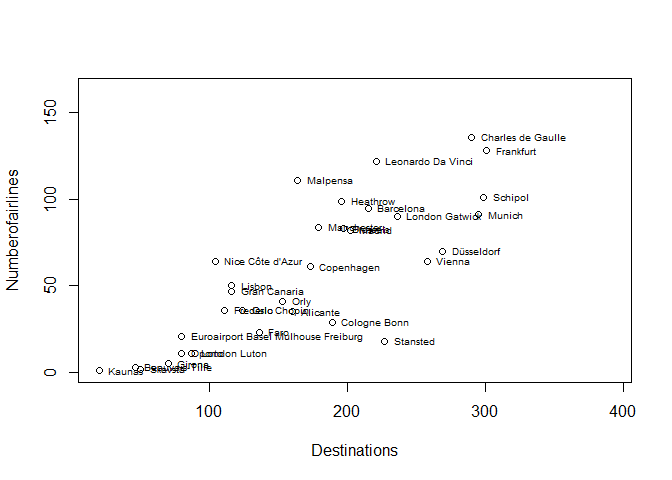
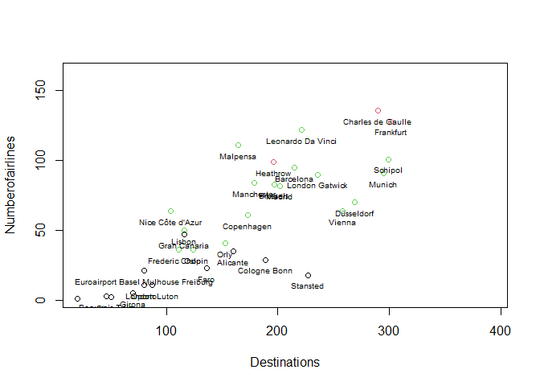
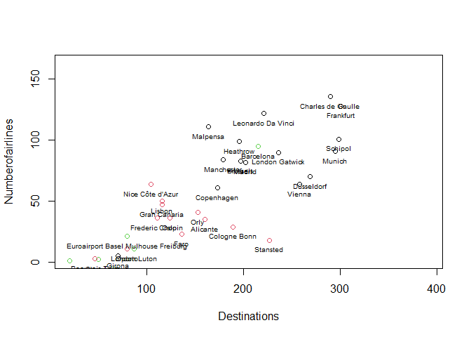

Cluster Analysis
================

#### Example exercise: Airports

**Your task**: Create and evaluate the many types of clustering methods.

#### Variables:

- `Code`: Code of the airport;  
- `Airport`: Name of the airport;  
- `Ordem`: ID of the observations;  
- `Passengers`: Number of passengers;  
- `Movements`: Number of flights;  
- `Numberofairlines`: Number of airlines in each airport;  
- `Mainairlineflightspercentage`: Percentage of flights of the main
  airline of each airport;  
- `Maximumpercentageoftrafficpercountry`: Maximum percentage of flights
  per country;  
- `NumberofLCCflightsweekly`: Number of weekly low cost flights\`;  
- `NumberofLowCostAirlines`: Number of low cost airlines of each
  airport;  
- `LowCostAirlinespercentage`: Percentage of the number of low cost
  airlines in each airport;  
- `Destinations`: Number of flights arriving at each airport;  
- `Average_route_Distance`: Average route distance in km;  
- `DistancetoclosestAirport`: Distance to closest airport in km
- `DistancetoclosestSimilarAirport`: Distance to closest similar airport
  in km;  
- `AirportRegionalRelevance`: Relevance of the airport in a regional
  scale (0 - 1);  
- `Distancetocitykm`: Distance between the airport and the city in km;  
- `Inhabitantscorrected`: Population of the city;  
- `numberofvisitorscorrected`: Number of vistors that arrived in the
  airport;  
- `GDP corrected`: Corrected value of the Gross Domestic Product;  
- `Cargoton`: Cargo ton. The total number of cargo transported in a
  certain period multiplied by the number o flights.

## Let’s begin!

##### Import Libraries

``` r
library(readxl) # Reading excel files
library(skimr) # Summary statistics
library(tidyverse) # Pack of useful tools
library(mclust) # Model based clustering
library(cluster) # Cluster analysis
library(factoextra) # Visualizing distances
```

##### Import dataset as a dataframe

``` r
dataset <- read_excel("Data/Data_Aeroports_Clustersv1.xlsX")
df <- data.frame(dataset)
```

## Get to know your data

##### Summary statistics

``` r
skim(df)
```

|                                                  |      |
|:-------------------------------------------------|:-----|
| Name                                             | df   |
| Number of rows                                   | 32   |
| Number of columns                                | 21   |
| \_\_\_\_\_\_\_\_\_\_\_\_\_\_\_\_\_\_\_\_\_\_\_   |      |
| Column type frequency:                           |      |
| character                                        | 2    |
| numeric                                          | 19   |
| \_\_\_\_\_\_\_\_\_\_\_\_\_\_\_\_\_\_\_\_\_\_\_\_ |      |
| Group variables                                  | None |

Data summary

**Variable type: character**

| skim_variable | n_missing | complete_rate | min | max | empty | n_unique | whitespace |
|:--------------|----------:|--------------:|----:|----:|------:|---------:|-----------:|
| Code          |         0 |             1 |   3 |   3 |     0 |       32 |          0 |
| Airport       |         0 |             1 |   4 |  35 |     0 |       32 |          0 |

**Variable type: numeric**

| skim_variable                        | n_missing | complete_rate |        mean |          sd |        p0 |        p25 |         p50 |         p75 |        p100 | hist  |
|:-------------------------------------|----------:|--------------:|------------:|------------:|----------:|-----------:|------------:|------------:|------------:|:------|
| Ordem                                |         0 |             1 |       16.50 |        9.38 |      1.00 |       8.75 |       16.50 |       24.25 |       32.00 | ▇▇▇▇▇ |
| Passengers                           |         0 |             1 | 20750710.88 | 17601931.34 | 456698.00 | 8927021.50 | 17275317.50 | 28666511.50 | 67054745.00 | ▇▅▂▂▁ |
| Movements                            |         0 |             1 |   205111.16 |   143564.45 |   5698.00 |   82765.75 |   191742.50 |   258654.50 |   518018.00 | ▇▅▇▂▃ |
| Numberofairlines                     |         0 |             1 |       57.81 |       40.42 |      1.00 |      22.50 |       55.50 |       90.25 |      136.00 | ▇▆▅▆▃ |
| Mainairlineflightspercentage         |         0 |             1 |       33.78 |       22.08 |     12.00 |      22.00 |       28.50 |       33.00 |       95.00 | ▇▆▁▁▂ |
| Maximumpercentageoftrafficpercountry |         0 |             1 |       17.47 |        7.31 |      9.00 |      12.00 |       15.00 |       22.25 |       35.00 | ▇▂▃▂▂ |
| NumberofLCCflightsweekly             |         0 |             1 |      397.59 |      221.56 |     37.00 |     226.25 |      366.50 |      546.75 |      776.00 | ▅▇▅▅▆ |
| NumberofLowCostAirlines              |         0 |             1 |       11.59 |        5.60 |      1.00 |       7.75 |       12.00 |       16.00 |       23.00 | ▃▇▇▆▃ |
| LowCostAirlinespercentage            |         0 |             1 |       36.44 |       30.10 |      6.25 |      16.29 |       19.59 |       50.36 |      100.00 | ▇▂▁▁▂ |
| Destinations                         |         0 |             1 |      167.62 |       80.13 |     20.00 |     109.25 |      168.50 |      222.50 |      301.00 | ▃▇▆▇▆ |
| Average_Route_Distance               |         0 |             1 |     2275.19 |      930.28 |   1225.00 |    1599.50 |     2152.00 |     2765.00 |     5635.00 | ▇▆▂▁▁ |
| DistancetoclosestAirport             |         0 |             1 |       90.19 |       64.56 |     13.84 |      45.83 |       66.50 |      111.61 |      244.50 | ▇▇▃▁▂ |
| DistancetoclosestSimilarAirport      |         0 |             1 |      248.64 |      183.60 |     38.16 |      97.74 |      206.12 |      376.15 |      635.05 | ▇▅▃▁▃ |
| AirportRegionalrelevance             |         0 |             1 |        0.73 |        0.23 |      0.19 |       0.58 |        0.80 |        0.91 |        0.99 | ▁▃▁▆▇ |
| Distancetocitykm                     |         0 |             1 |       25.81 |       25.44 |      3.00 |       9.75 |       14.50 |       35.00 |      100.00 | ▇▂▁▁▁ |
| Inhanbitantscorrected                |         0 |             1 |  4528561.95 |  2590542.88 | 329240.50 | 2856960.30 |  4532760.00 |  6733158.88 |  9870818.00 | ▆▆▇▇▁ |
| numberofvisitorscorrected            |         0 |             1 |  2766002.58 |  2549773.72 |  80232.50 | 1018390.89 |  1896295.60 |  3450491.78 |  9732062.00 | ▇▃▁▂▁ |
| GDPcorrected                         |         0 |             1 |    30160.75 |    10510.93 |   8500.00 |   25000.00 |    31150.00 |    35550.00 |    56600.00 | ▃▅▇▃▁ |
| Cargoton                             |         0 |             1 |   236531.76 |   478310.12 |      0.00 |   10325.00 |    72749.85 |   153372.85 |  1819000.00 | ▇▁▁▁▁ |

##### Sneak the plot

Now let us plot an example and take a look

``` r
plot(Numberofairlines ~ Destinations, df, xlim = c(min(df$Destinations), 1.3*max(df$Destinations)), ylim = c(min(df$Numberofairlines), 1.2*max(df$Numberofairlines))) #plot
text(Numberofairlines ~ Destinations, df, label = Airport, pos = 4, cex = 0.6) #labels over the previous plot
```

<!-- -->

By looking at the plot, you may already have a clue on the number of
clusters with this two variables. However, this is not clear and it does
not consider the other variables in the analysis.

### Prepare data before performing a cluster analysis

##### Deal with missing data

``` r
table(is.na(df))
```

    ## 
    ## FALSE 
    ##   672

In this example we do not have missing values. In case you do have in
the future, you can take out the missing values with *listwise deletion*
(`df <- na.omit(df)`) or use other ways of treating missing values.

##### Continuous variables

Leave only continuous variables, and make `Ordem` as the row ID variable

``` r
df_reduced = df[,!(names(df) %in% c("Code","Airport"))]
df_reduced = data.frame(df_reduced, row.names = 1) #Ordem is the 1st variable in the df
```

Take a look at the scale of the variables. See how they are different!

``` r
head(df_reduced)
```

    ##   Passengers Movements Numberofairlines Mainairlineflightspercentage
    ## 1    9830987    119322               64                           18
    ## 2    9742300    132200               29                           33
    ## 3    9155665    101557               47                           17
    ## 4    9139479     74281               35                           29
    ## 5    9129053     83013               11                           37
    ## 6    8320927    115934               36                           31
    ##   Maximumpercentageoftrafficpercountry NumberofLCCflightsweekly
    ## 1                                   20                      256
    ## 2                                   13                      351
    ## 3                                   26                      259
    ## 4                                   23                      300
    ## 5                                   22                      227
    ## 6                                   14                      341
    ##   NumberofLowCostAirlines LowCostAirlinespercentage Destinations
    ## 1                      18                  28.12500          104
    ## 2                      12                  41.37931          189
    ## 3                      19                  40.42553          116
    ## 4                      18                  51.42857          160
    ## 5                       8                  72.72727           87
    ## 6                       7                  19.44445          111
    ##   Average_Route_Distance DistancetoclosestAirport
    ## 1                   1253                 23.66681
    ## 2                   1721                 63.45766
    ## 3                   3143                122.58936
    ## 4                   1701                 63.09924
    ## 5                   1582                 45.13247
    ## 6                   1460                244.49577
    ##   DistancetoclosestSimilarAirport AirportRegionalrelevance Distancetocitykm
    ## 1                       223.83824                0.8698581                6
    ## 2                        63.45766                0.5127419               15
    ## 3                       132.45082                0.7840877               19
    ## 4                       134.50558                0.8098081                9
    ## 5                        45.13247                0.1947903               55
    ## 6                       559.31000                0.9810450               10
    ##   Inhanbitantscorrected numberofvisitorscorrected GDPcorrected Cargoton
    ## 1             3551805.0                 2152829.8        26300 11223.39
    ## 2             4180133.5                 1151381.6        30100   562.00
    ## 3              705807.8                 1678968.6        20700 25994.00
    ## 4             1508358.6                 1944196.8        25000  3199.73
    ## 5             1562709.8                  181063.5        32000 28698.00
    ## 6             6626197.0                  770720.5        11200 82756.54

##### Standardize variables

Z-score standardization: $(x_{i} - x_{\text{mean}}) / {\sigma}$

``` r
mean <- apply(df_reduced, 2, mean) # The "2" in the function is used to select the columns. MARGIN: c(1,2)
sd <- apply(df_reduced, 2, sd)
df_scaled <- scale(df_reduced, mean, sd)
```

## Hierarchical Clustering

##### Measuring Similarity through Euclidean distances

``` r
distance <- dist(df_scaled, method = "euclidean")
```

> **Note:** There are other forms of distance measures that can be used
> such as:  
> i) Minkowski distance; ii) Manhattan distance; iii) Mahanalobis
> distance.

##### Visualize distances in heatmap

``` r
fviz_dist(distance, gradient = list(low = "#00AFBB", mid = "white", high = "#FC4E07"), order = FALSE)
```

<!-- -->

#### Types of hierarchical clustering

There are many types of hierarchical clustering. Let’s explore some.

**1. Single linkage (nearest neighbor) clustering algorithm**

Based on a bottom-up approach, by linking two clusters that have the
closest distance between each other.

``` r
models <- hclust(distance, "single")
plot(models, labels = df$Airport, xlab = "Distance - Single linkage", cex=0.6, hang = -1)

rect.hclust(models, 4, border = "purple") # Visualize the cut on the dendogram, with 4 clusters
```

<!-- -->

**2. Complete linkage (Farthest neighbor) clustering algorithm**

Complete linkage is based on the maximum distance between observations
in each cluster.

``` r
modelc <- hclust(distance, "complete")
plot(modelc, labels = df$Airport, xlab = "Distance - Complete linkage", cex=0.6, hang = -1)
rect.hclust(modelc, 4, border = "blue") 
```

<!-- -->

**3. Average linkage between groups**

The average linkage considers the distance between clusters to be the
average of the distances between observations in one cluster to all the
members in the other cluster.

``` r
modela <- hclust(distance, "average")
plot(modela, labels = df$Airport, xlab = "Distance - Average linkage", cex=0.6, hang = -1)
rect.hclust(modelc, 4, border = "red")
```

<!-- -->

**4. Ward\`s method**

The Ward\`s method considers the measures of similarity as the sum of
squares within the cluster summed over all variables.

``` r
modelw <- hclust(distance, "ward.D2")
plot(modelw, labels = df$Airport, xlab = "Distance - Ward method", cex=0.6, hang = -1)
rect.hclust(modelw, 4, border = "orange")
```

<!-- -->

**5. Centroid method**

The centroid method considers the similarity between two clusters as the
distance between its centroids.

``` r
modelcen <- hclust(distance, "centroid")
plot(modelcen, labels = df$Airport, xlab = "Distance - Centroid method", cex=0.6, hang = -1)
rect.hclust(modelcen, 4, border = "darkgreen")
```

<!-- -->

##### Comparing results from different hierarchical methods

Now lets evaluate the **membership** of each observation with the
`cutree` function for each method.

``` r
member_single <- cutree(models, 4)
member_com <- cutree(modelc, 4)
member_av <- cutree(modela, 4)
member_ward <- cutree(modelw, 4)
member_cen <- cutree(modelcen, 4)
```

Compare how common each method is to each other.

``` r
table(member_com, member_av) # compare the complete linkage with the average linkage
```

    ##           member_av
    ## member_com  1  2  3  4
    ##          1 14  0  0  0
    ##          2 11  0  0  0
    ##          3  0  3  0  0
    ##          4  0  0  3  1

> **Note:** Try comparing other methods, and evaluate how common they
> are.

##### Silhouette Plots: evaluate which method is more appropriate

The silhouette plot evaluates how similar an observation is to its own
cluster compared to other clusters. The clustering configuration is
appropriate when most objects have high values. Low or negative values
indicate that the clustering method is not appropriate or the number of
clusters is not ideal.

``` r
plot(silhouette(member_single, distance))
```

<!-- -->

``` r
plot(silhouette(member_com, distance))
```

<!-- -->

``` r
plot(silhouette(member_av, distance))
```

<!-- -->

``` r
plot(silhouette(member_ward, distance))
```

<!-- -->

``` r
plot(silhouette(member_cen, distance))
```

<!-- -->

## Non-Hierarchical Clustering

##### K-means clustering

- k-means with n=3 clusters

``` r
km_clust <- kmeans(df_scaled, 3)
km_clust #print the results
```

    ## K-means clustering with 3 clusters of sizes 12, 3, 17
    ## 
    ## Cluster means:
    ##   Passengers  Movements Numberofairlines Mainairlineflightspercentage
    ## 1 -0.7916194 -0.9174079       -1.0056089                    0.7193019
    ## 2  2.2082860  1.9174235        1.5633070                   -0.2919658
    ## 3  0.1690927  0.3092132        0.4339639                   -0.4562191
    ##   Maximumpercentageoftrafficpercountry NumberofLCCflightsweekly
    ## 1                            0.7681965               -0.8816639
    ## 2                           -0.7482433                1.5198394
    ## 3                           -0.4102134                0.3541440
    ##   NumberofLowCostAirlines LowCostAirlinespercentage Destinations
    ## 1              -0.4483905                 1.0784388   -0.7805257
    ## 2              -0.2251255                -0.9329811    1.1819686
    ## 3               0.3562389                -0.5966072    0.3423766
    ##   Average_Route_Distance DistancetoclosestAirport
    ## 1            -0.61471392               0.19611608
    ## 2             2.17370314              -0.23116516
    ## 3             0.05032104              -0.09764103
    ##   DistancetoclosestSimilarAirport AirportRegionalrelevance Distancetocitykm
    ## 1                      -0.6618591               -0.6295906        0.4757942
    ## 2                       0.1667423                0.1904030       -0.2415823
    ## 3                       0.4377695                0.4108164       -0.2932226
    ##   Inhanbitantscorrected numberofvisitorscorrected GDPcorrected   Cargoton
    ## 1            -0.8667815                -0.6718495   -0.5211163 -0.4429756
    ## 2             0.9414886                 1.6718238    1.5164455  2.9391006
    ## 3             0.4457007                 0.1792189    0.1002388 -0.2059762
    ## 
    ## Clustering vector:
    ##  1  2  3  4  5  6  7  8  9 10 11 12 13 14 15 16 17 18 19 20 21 22 23 24 25 26 
    ##  3  1  1  1  1  3  1  1  1  3  3  3  3  3  3  3  3  2  2  2  3  3  3  3  3  3 
    ## 27 28 29 30 31 32 
    ##  1  1  3  1  1  1 
    ## 
    ## Within cluster sum of squares by cluster:
    ## [1] 130.09823  20.38512 149.66738
    ##  (between_SS / total_SS =  46.2 %)
    ## 
    ## Available components:
    ## 
    ## [1] "cluster"      "centers"      "totss"        "withinss"     "tot.withinss"
    ## [6] "betweenss"    "size"         "iter"         "ifault"

- Other ways of setting the number of clusters

This algorithm will detect how many clusters from 1 to 10 explains more
variance

``` r
  k <- list()
  for(i in 1:10){
    k[[i]] <- kmeans(df_scaled, i)
  }
```

> **Note**: Try printing the k value and take a look at the ratio
> `between_SS` / `total_SS`. Evaluate how it varies when you add
> clusters.

Now, let’s plot `between_SS` / `total_SS` into a scree plot

``` r
betSS_totSS <- list()
for(i in 1:10){
betSS_totSS[[i]] <- k[[i]]$betweenss/k[[i]]$totss
}
plot(1:10, betSS_totSS, type = "b", ylab = "Between SS / Total SS", xlab = "Number of clusters")
```

<!-- -->

Let’s take out the outliers and see the difference in the k-means
clustering:

- **Examine the boxplots**

``` r
par(cex.axis=0.6, mar=c(11,2,1,1))# Make labels fit in the boxplot
boxplot(df_scaled, las = 2) #labels rotated to vertical
```

<!-- -->

- **Detect the outliers**

``` r
outliers <- boxplot.stats(df_scaled)$out
outliers
```

    ##  [1] 2.630622 2.772024 2.772024 3.611626 2.916185 2.523102 2.732030 2.515406
    ##  [9] 3.308457 3.285459

- **Remove the biggest outlier**

``` r
nrow(df_scaled) #32
```

    ## [1] 32

``` r
out_ind <- which(df_scaled %in% c(outliers)) #the row.names that contain outliers
df_big_outlier = df_scaled[-c(out_ind),] #remove those rows from the df_scaled
nrow(df_big_outlier) #31
```

    ## [1] 31

> **Note:** There are many methods to treat outliers. This is just one
> of them. Note that it is not very appropriate, since it removes many
> observations that are relevant for the analysis. Try using other
> methods and evaluate the difference.

Execute a k-means clustering with the dataset without the outliers and
see the difference.

``` r
km_big_outlier <- kmeans(df_big_outlier, 3)
km_big_outlier
```

    ## K-means clustering with 3 clusters of sizes 15, 11, 5
    ## 
    ## Cluster means:
    ##   Passengers  Movements Numberofairlines Mainairlineflightspercentage
    ## 1  0.5890127  0.7260264        0.8111878                   -0.5183690
    ## 2 -0.6095999 -0.6567742       -0.5981361                   -0.1917995
    ## 3 -0.9520429 -1.0882984       -1.3214660                    1.9931973
    ##   Maximumpercentageoftrafficpercountry NumberofLCCflightsweekly
    ## 1                           -0.6296646                0.7116404
    ## 2                            0.5577814               -0.5451081
    ## 3                            0.6473374               -1.2772631
    ##   NumberofLowCostAirlines LowCostAirlinespercentage Destinations
    ## 1              0.46550744                -0.6675400    0.7801097
    ## 2              0.07256111                 0.1215978   -0.4548142
    ## 3             -1.39205703                 1.9302799   -1.4105623
    ##   Average_Route_Distance DistancetoclosestAirport
    ## 1              0.4294196               -0.4088129
    ## 2             -0.4759152                0.4952267
    ## 3             -0.9635706                0.2765206
    ##   DistancetoclosestSimilarAirport AirportRegionalrelevance Distancetocitykm
    ## 1                      0.27904593                0.2668308       -0.2520645
    ## 2                      0.04572232                0.2308600       -0.4143005
    ## 3                     -0.71705981               -1.2364486        1.6976272
    ##   Inhanbitantscorrected numberofvisitorscorrected GDPcorrected   Cargoton
    ## 1             0.6091294                 0.4709562    0.4324943  0.3093463
    ## 2            -0.4802512                -0.5070902   -0.6566693 -0.4356553
    ## 3            -0.9802943                -0.7587213   -0.3558915 -0.4142745
    ## 
    ## Clustering vector:
    ##  1  2  3  4  5  6  7  8  9 10 11 12 13 14 15 16 17 19 20 21 22 23 24 25 26 27 
    ##  2  2  2  2  3  2  2  2  2  1  1  1  2  1  1  1  2  1  1  1  1  1  1  1  1  3 
    ## 28 29 30 31 32 
    ##  3  1  2  3  3 
    ## 
    ## Within cluster sum of squares by cluster:
    ## [1] 135.98599  81.96037  41.82151
    ##  (between_SS / total_SS =  48.9 %)
    ## 
    ## Available components:
    ## 
    ## [1] "cluster"      "centers"      "totss"        "withinss"     "tot.withinss"
    ## [6] "betweenss"    "size"         "iter"         "ifault"

#### Plotting the clusters

Finally, plot the clusters results to check if they make sense.  
Let us go back to first example and take a look.

- **K-means with outliers**

``` r
plot(Numberofairlines ~ Destinations, df, col = km_clust$cluster, xlim = c(1.1*min(df$Destinations), 1.3*max(df$Destinations)), ylim = c(1.5*min(df$Numberofairlines), 1.2*max(df$Numberofairlines)))
with(df, text(Numberofairlines ~ Destinations, label = Airport, pos = 1, cex = 0.6))
```

<!-- -->

- **K-means without the highest outlier**

``` r
plot(Numberofairlines ~ Destinations, df, col = km_big_outlier$cluster, xlim = c(min(df$Destinations), 1.3*max(df$Destinations)), ylim = c(1.5*min(df$Numberofairlines), 1.2*max(df$Numberofairlines)))
with(df, text(Numberofairlines ~ Destinations, label = Airport, pos = 1, cex = 0.6))
```

<!-- -->
