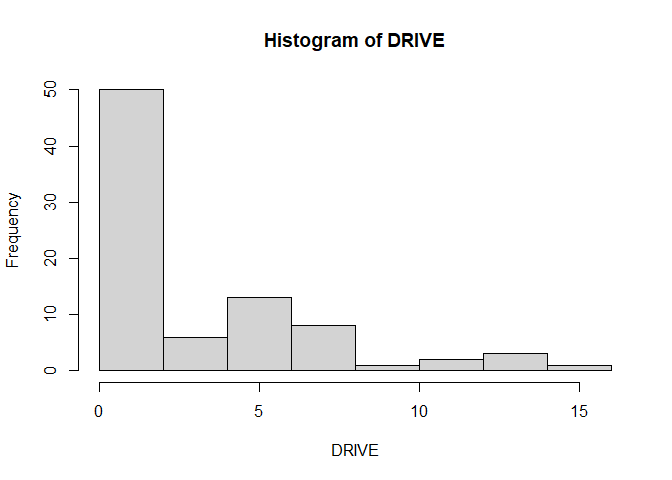

Generalized Linear Models
================

## Example: Accident data from California (1993 to 1998) and Michigan (1993 to 1997)

> Your Task: Analyze the number o accidents.

### Variables:

`ACCIDENT`: Count on injury accidents over observation period;

`STATE`: indicator variable for state:

``` 
0: California  

1: Michigan  
```

`AADT1`: Average annual daily traffic on major road;

`AADT2`: Average annual daily traffic on minor road;

`Median`: Median width on major road in feet;

`DRIVE`: Number of driveways within 250 ft of intersection center.

#### Import Libraries

``` r
library(readxl) # Library used for reading excel files
library(skimr) # Library used for summary statistics
library(tidyverse) # Library used in data science to perform exploratory data analysis
library(MASS) # Library used for negative binomial regression
library(vcd) # Library used for goodness of fit parameters
library(car) # Library used for goodness of fit
library(rcompanion) # Library used for goodness of fit
library(popbio) # Library used to calculate elasticities
```

#### Set working directory

``` r
setwd("G:/O meu disco/TDM - Lecture R/TDM github/Transport-Demand-Modelling")
```

#### Import dataset

``` r
dataset <- read_excel("Data/TDM_GZLM_CALMICH_Example.xlsX")
```

#### Let us take a look at the summary and structure of the dataset

``` r
summary(dataset)
```

    ##      Mean           0.2857142857142857 2.6190476190476191 12869.714285714286
    ##  Length:88          Length:88          Length:88          Length:88         
    ##  Class :character   Class :character   Class :character   Class :character  
    ##  Mode  :character   Mode  :character   Mode  :character   Mode  :character  
    ##  595.85714285714289 3.7976190476190474 3.0952380952380953
    ##  Length:88          Length:88          Length:88         
    ##  Class :character   Class :character   Class :character  
    ##  Mode  :character   Mode  :character   Mode  :character

``` r
str(dataset)
```

    ## tibble [88 x 7] (S3: tbl_df/tbl/data.frame)
    ##  $ Mean              : chr [1:88] "Max" "Min" "Stdev" NA ...
    ##  $ 0.2857142857142857: chr [1:88] "1" "0" "0.45446721279351154" "STATE" ...
    ##  $ 2.6190476190476191: chr [1:88] "13" "0" "3.3613851200682063" "ACCIDENT" ...
    ##  $ 12869.714285714286: chr [1:88] "33058" "2367" "6797.8534325828023" "AADT1" ...
    ##  $ 595.85714285714289: chr [1:88] "3001" "15" "679.26727253616912" "AADT2" ...
    ##  $ 3.7976190476190474: chr [1:88] "36" "0" "6.0892553245321928" "MEDIAN" ...
    ##  $ 3.0952380952380953: chr [1:88] "15" "0" "3.9043350871496845" "DRIVE" ...

> **Note**: The dataset looks weird. Use the view function to take a
> better look at the dataset.

``` r
view(dataset)
```

#### Treat the dataset

#### The best way to treat the dataset is to import it again. Use the following steps:

**1.** Go to “Import Dataset” on the “Environment” window at the upper
right display;

**2.** Click on “From excel”;

**3.** Check if “First row as names” is checked;

**4.** Put the number of rows you want to skip and click on “import”;

**5.** This will generate a code, which you can copy and use it the next
time you open the file.

#### Therefore, here is the following code:

``` r
TDM_GZLM_CALMICH_Example <- read_excel("Data/TDM_GZLM_CALMICH_Example.xlsx", skip = 5)
```

#### Transform “TDM\_GZLM\_CALMICH\_Example” into a dataframe to better manage the dataset

``` r
df <- data.frame(TDM_GZLM_CALMICH_Example)
view(df)
```

#### Now we can analyze the descriptive statistics of the dataframe

``` r
str(df)
```

    ## 'data.frame':    84 obs. of  6 variables:
    ##  $ STATE   : num  0 0 0 0 0 0 0 0 0 0 ...
    ##  $ ACCIDENT: num  0 0 0 0 2 8 2 4 3 12 ...
    ##  $ AADT1   : num  6633 6633 6633 6633 12700 ...
    ##  $ AADT2   : num  180 51 100 51 21 1700 51 701 45 65 ...
    ##  $ MEDIAN  : num  16 16 16 16 0 0 0 0 0 0 ...
    ##  $ DRIVE   : num  1 1 0 1 13 7 15 12 8 14 ...

``` r
skim(df)
```

|                                                  |      |
| :----------------------------------------------- | :--- |
| Name                                             | df   |
| Number of rows                                   | 84   |
| Number of columns                                | 6    |
| \_\_\_\_\_\_\_\_\_\_\_\_\_\_\_\_\_\_\_\_\_\_\_   |      |
| Column type frequency:                           |      |
| numeric                                          | 6    |
| \_\_\_\_\_\_\_\_\_\_\_\_\_\_\_\_\_\_\_\_\_\_\_\_ |      |
| Group variables                                  | None |

Data summary

**Variable type: numeric**

| skim\_variable | n\_missing | complete\_rate |     mean |      sd |   p0 |     p25 |     p50 |      p75 |  p100 | hist  |
| :------------- | ---------: | -------------: | -------: | ------: | ---: | ------: | ------: | -------: | ----: | :---- |
| STATE          |          0 |              1 |     0.29 |    0.45 |    0 |    0.00 |     0.0 |     1.00 |     1 | ▇▁▁▁▃ |
| ACCIDENT       |          0 |              1 |     2.62 |    3.36 |    0 |    0.00 |     1.0 |     4.00 |    13 | ▇▂▁▁▁ |
| AADT1          |          0 |              1 | 12869.71 | 6797.85 | 2367 | 7307.25 | 12050.0 | 16658.50 | 33058 | ▇▇▅▂▁ |
| AADT2          |          0 |              1 |   595.86 |  679.27 |   15 |  101.00 |   348.5 |   917.50 |  3001 | ▇▂▁▁▁ |
| MEDIAN         |          0 |              1 |     3.80 |    6.09 |    0 |    0.00 |     0.0 |     6.00 |    36 | ▇▁▁▁▁ |
| DRIVE          |          0 |              1 |     3.10 |    3.90 |    0 |    0.00 |     1.0 |     5.25 |    15 | ▇▂▂▁▁ |

#### Take a look at the histograms of the variables

``` r
hist(df$ACCIDENT, xlab = "ACCIDENT", main = "Histogram of ACCIDENT") 
```

<!-- -->

``` r
hist(df$STATE, xlab = "STATE", main = "Histogram of STATE")
```

<!-- -->

``` r
hist(df$AADT1, xlab = "AADT1", main = "Histogram of AADT1")
```

<!-- -->

``` r
hist(df$AADT2, xlab = "AADT2", main = "Histogram of AADT2")
```

<!-- -->

``` r
hist(df$MEDIAN, xlab = "MEDIAN", main = "Histogram of MEDIAN")
```

<!-- -->

``` r
hist(df$DRIVE, xlab = "DRIVE", main = "Histogram of DRIVE")
```

<!-- -->

#### Plot the density function of the variable ACCIDENTS

``` r
plot(density(df$ACCIDENT), main="Density estimate of ACCIDENTS")
```

<!-- -->

> **Note**: As the dependent variable is “count data”, as has discrete
> values, then a poisson distribution should be more adequate.

#### Poisson assumption:

Take a look at the mean and the variance of the Dependent variable.
Check if they are equal to each other.

``` r
mean(df$ACCIDENT)
```

    ## [1] 2.619048

``` r
var(df$ACCIDENT)
```

    ## [1] 11.29891

Or you could calculate the coefficient of variance:

``` r
var(df$ACCIDENT)/mean(df$ACCIDENT)
```

    ## [1] 4.314129

> **Note**: If the coefficient of variance \> 1, then you have
> overdispersion.

#### Try estimating goodness of fit parameter for the PDF of ACCIDENT. Use the Maximum Likelihood method.

``` r
gf<-goodfit(df$ACCIDENT,type= "poisson", method= "ML")
summary(gf)
```

    ## 
    ##   Goodness-of-fit test for poisson distribution
    ## 
    ##                       X^2 df     P(> X^2)
    ## Likelihood Ratio 155.7106 11 1.012305e-27

> **Note**: The null hypothesis is that it is a Poisson distribution.
> Therefore, for it to be a poisson distribution, the pvalue \> 0.05.

#### Now let us run the many possible models

**1. Poisson model:**

``` r
model1 = glm(ACCIDENT ~ as.factor(STATE) + AADT2 + MEDIAN + DRIVE + offset(log(AADT1)), family = poisson(link = "log"), data = df, method = "glm.fit")
```

> **Note**: The method “glm.fit” uses iteratively reweighted least
> squares to fit the model. Try looking for other methods and see the
> difference.

There are many families and links that can be used, depending on the
characteristics of your data.

| family           | link                   |
| :--------------- | :--------------------- |
| Gaussian         | identity               |
| Binomial         | logit, probit, cloglog |
| Poisson          | log, identity, sqrt    |
| Gamma            | inverse, identity, log |
| inverse.gaussian | 1/mu^2                 |

``` r
summary(model1)
```

    ## 
    ## Call:
    ## glm(formula = ACCIDENT ~ as.factor(STATE) + AADT2 + MEDIAN + 
    ##     DRIVE + offset(log(AADT1)), family = poisson(link = "log"), 
    ##     data = df, method = "glm.fit")
    ## 
    ## Deviance Residuals: 
    ##     Min       1Q   Median       3Q      Max  
    ## -3.1238  -1.2665  -0.5184   0.3952   3.7088  
    ## 
    ## Coefficients:
    ##                     Estimate Std. Error z value Pr(>|z|)    
    ## (Intercept)       -8.997e+00  1.656e-01 -54.320  < 2e-16 ***
    ## as.factor(STATE)1 -2.000e-01  1.590e-01  -1.258   0.2084    
    ## AADT2              5.136e-04  7.406e-05   6.935 4.06e-12 ***
    ## MEDIAN            -5.212e-02  2.147e-02  -2.427   0.0152 *  
    ## DRIVE              6.552e-02  1.634e-02   4.011 6.04e-05 ***
    ## ---
    ## Signif. codes:  0 '***' 0.001 '**' 0.01 '*' 0.05 '.' 0.1 ' ' 1
    ## 
    ## (Dispersion parameter for poisson family taken to be 1)
    ## 
    ##     Null deviance: 255.07  on 83  degrees of freedom
    ## Residual deviance: 167.31  on 79  degrees of freedom
    ## AIC: 339.29
    ## 
    ## Number of Fisher Scoring iterations: 5

If we obtain:

residuals \> degrees of freedom (overdispersion);

residuals \< degrees of freedom (underdispersion);

residuals = degrees of freedom (mean = variance).

> **Note:** In overdispersion, the estimates are reliable but the
> standard errors tend to be smaller.

#### Calculate the pseudo-Rsquare and perform an Omnibus test

``` r
nagelkerke(model1)
```

    ## $Models
    ##                                                                                                                              
    ## Model: "glm, ACCIDENT ~ as.factor(STATE) + AADT2 + MEDIAN + DRIVE + offset(log(AADT1)), poisson(link = \"log\"), df, glm.fit"
    ## Null:  "glm, ACCIDENT ~ 1, poisson(link = \"log\"), df, glm.fit"                                                             
    ## 
    ## $Pseudo.R.squared.for.model.vs.null
    ##                              Pseudo.R.squared
    ## McFadden                             0.331213
    ## Cox and Snell (ML)                   0.856499
    ## Nagelkerke (Cragg and Uhler)         0.858945
    ## 
    ## $Likelihood.ratio.test
    ##  Df.diff LogLik.diff  Chisq    p.value
    ##       -4      -81.54 163.08 3.1953e-34
    ## 
    ## $Number.of.observations
    ##          
    ## Model: 84
    ## Null:  84
    ## 
    ## $Messages
    ## [1] "Note: For models fit with REML, these statistics are based on refitting with ML"
    ## 
    ## $Warnings
    ## [1] "None"

> **Note**: The likelihood ratio test (Omnibus test) compares the fitted
> model (“Model”) with the only-intercept model (“Null”). This test
> verifies if the explained variance is higher than the the unexplained
> variance.

> **Note**: Ho: There is no overdispersion in the model. Therefore, if
> pvalue \< 0.05, there is overdispersion, and we should choose a
> Negative Binomial model.

#### Calculate the Type III test.

``` r
Anova(model1, type = "III", test = "Wald")
```

    ## Analysis of Deviance Table (Type III tests)
    ## 
    ## Response: ACCIDENT
    ##                  Df     Chisq Pr(>Chisq)    
    ## (Intercept)       1 2950.6671  < 2.2e-16 ***
    ## as.factor(STATE)  1    1.5825    0.20841    
    ## AADT2             1   48.0944  4.062e-12 ***
    ## MEDIAN            1    5.8922    0.01521 *  
    ## DRIVE             1   16.0891  6.043e-05 ***
    ## ---
    ## Signif. codes:  0 '***' 0.001 '**' 0.01 '*' 0.05 '.' 0.1 ' ' 1

> **Note**: Type III tests examine the significance of each partial
> effect. Thus, it considers the significance of an effect with all the
> other effects in the model. The Chisq tests the significance of the
> effect added to the model by having all of the other effects.

#### Let us correct the standard errors with an overdispersed poisson

``` r
model2 = glm(ACCIDENT ~ as.factor(STATE) + AADT2 + MEDIAN + DRIVE + offset(log(AADT1)), family = quasipoisson(link = "log"), data = df, method = "glm.fit")

summary(model2)
```

    ## 
    ## Call:
    ## glm(formula = ACCIDENT ~ as.factor(STATE) + AADT2 + MEDIAN + 
    ##     DRIVE + offset(log(AADT1)), family = quasipoisson(link = "log"), 
    ##     data = df, method = "glm.fit")
    ## 
    ## Deviance Residuals: 
    ##     Min       1Q   Median       3Q      Max  
    ## -3.1238  -1.2665  -0.5184   0.3952   3.7088  
    ## 
    ## Coefficients:
    ##                     Estimate Std. Error t value Pr(>|t|)    
    ## (Intercept)       -8.9972283  0.2387734 -37.681  < 2e-16 ***
    ## as.factor(STATE)1 -0.2000225  0.2292178  -0.873  0.38551    
    ## AADT2              0.0005136  0.0001068   4.811 7.08e-06 ***
    ## MEDIAN            -0.0521227  0.0309546  -1.684  0.09616 .  
    ## DRIVE              0.0655221  0.0235482   2.782  0.00675 ** 
    ## ---
    ## Signif. codes:  0 '***' 0.001 '**' 0.01 '*' 0.05 '.' 0.1 ' ' 1
    ## 
    ## (Dispersion parameter for quasipoisson family taken to be 2.07814)
    ## 
    ##     Null deviance: 255.07  on 83  degrees of freedom
    ## Residual deviance: 167.31  on 79  degrees of freedom
    ## AIC: NA
    ## 
    ## Number of Fisher Scoring iterations: 5

#### Calculate the pseudo-Rsquare and perform an Omnibus test

``` r
nagelkerke(model2)
```

    ## $Models
    ##                                                                                                                                   
    ## Model: "glm, ACCIDENT ~ as.factor(STATE) + AADT2 + MEDIAN + DRIVE + offset(log(AADT1)), quasipoisson(link = \"log\"), df, glm.fit"
    ## Null:  "glm, ACCIDENT ~ 1, quasipoisson(link = \"log\"), df, glm.fit"                                                             
    ## 
    ## $Pseudo.R.squared.for.model.vs.null
    ##                              Pseudo.R.squared
    ## McFadden                                   NA
    ## Cox and Snell (ML)                         NA
    ## Nagelkerke (Cragg and Uhler)               NA
    ## 
    ## $Likelihood.ratio.test
    ##  Df.diff LogLik.diff Chisq p.value
    ##       -4          NA    NA      NA
    ## 
    ## $Number.of.observations
    ##          
    ## Model: 84
    ## Null:  84
    ## 
    ## $Messages
    ## [1] "Note: For models fit with REML, these statistics are based on refitting with ML"
    ## 
    ## $Warnings
    ## [1] "None"

#### Calculate the Type III test.

``` r
Anova(model2, type = "III", test = "Wald") 
```

    ## Analysis of Deviance Table (Type III tests)
    ## 
    ## Response: ACCIDENT
    ##                  Df     Chisq Pr(>Chisq)    
    ## (Intercept)       1 1419.8598  < 2.2e-16 ***
    ## as.factor(STATE)  1    0.7615   0.382864    
    ## AADT2             1   23.1430  1.504e-06 ***
    ## MEDIAN            1    2.8353   0.092212 .  
    ## DRIVE             1    7.7421   0.005395 ** 
    ## ---
    ## Signif. codes:  0 '***' 0.001 '**' 0.01 '*' 0.05 '.' 0.1 ' ' 1

> **Note**: The estimates are the same, but the standard errors have
> increased because they are adjusted by the scale parameter

#### Let us try the negative binomial distribution

``` r
model3 = glm.nb(ACCIDENT ~ as.factor(STATE) + AADT2 + MEDIAN + DRIVE + offset(log(AADT1)), data = df)

summary(model3)
```

    ## 
    ## Call:
    ## glm.nb(formula = ACCIDENT ~ as.factor(STATE) + AADT2 + MEDIAN + 
    ##     DRIVE + offset(log(AADT1)), data = df, init.theta = 2.19225058, 
    ##     link = log)
    ## 
    ## Deviance Residuals: 
    ##     Min       1Q   Median       3Q      Max  
    ## -2.2604  -0.9918  -0.3235   0.2587   2.3277  
    ## 
    ## Coefficients:
    ##                     Estimate Std. Error z value Pr(>|z|)    
    ## (Intercept)       -8.9883516  0.2416863 -37.190  < 2e-16 ***
    ## as.factor(STATE)1 -0.2736628  0.2574693  -1.063   0.2878    
    ## AADT2              0.0005680  0.0001419   4.004 6.23e-05 ***
    ## MEDIAN            -0.0633165  0.0301447  -2.100   0.0357 *  
    ## DRIVE              0.0597809  0.0279771   2.137   0.0326 *  
    ## ---
    ## Signif. codes:  0 '***' 0.001 '**' 0.01 '*' 0.05 '.' 0.1 ' ' 1
    ## 
    ## (Dispersion parameter for Negative Binomial(2.1923) family taken to be 1)
    ## 
    ##     Null deviance: 125.481  on 83  degrees of freedom
    ## Residual deviance:  87.601  on 79  degrees of freedom
    ## AIC: 313.72
    ## 
    ## Number of Fisher Scoring iterations: 1
    ## 
    ## 
    ##               Theta:  2.192 
    ##           Std. Err.:  0.762 
    ## 
    ##  2 x log-likelihood:  -301.719

#### Calculate the pseudo-Rsquare and perform an Omnibus test

``` r
Anova(model3, type = "III", test = "Wald") 
```

    ## Analysis of Deviance Table (Type III tests)
    ## 
    ## Response: ACCIDENT
    ##                  Df     Chisq Pr(>Chisq)    
    ## (Intercept)       1 1383.1076  < 2.2e-16 ***
    ## as.factor(STATE)  1    1.1297    0.28783    
    ## AADT2             1   16.0325  6.227e-05 ***
    ## MEDIAN            1    4.4118    0.03569 *  
    ## DRIVE             1    4.5658    0.03262 *  
    ## ---
    ## Signif. codes:  0 '***' 0.001 '**' 0.01 '*' 0.05 '.' 0.1 ' ' 1

#### Calculate the Type III test.

``` r
nagelkerke(model3)
```

    ## $Models
    ##                                                                                                                
    ## Model: "glm.nb, ACCIDENT ~ as.factor(STATE) + AADT2 + MEDIAN + DRIVE + offset(log(AADT1)), df, 2.19225058, log"
    ## Null:  "glm.nb, ACCIDENT ~ 1, df, 0.6629432212, log"                                                           
    ## 
    ## $Pseudo.R.squared.for.model.vs.null
    ##                              Pseudo.R.squared
    ## McFadden                             0.150312
    ## Cox and Snell (ML)                   0.470285
    ## Nagelkerke (Cragg and Uhler)         0.477249
    ## 
    ## $Likelihood.ratio.test
    ##  Df.diff LogLik.diff  Chisq    p.value
    ##       -4     -26.687 53.375 7.1132e-11
    ## 
    ## $Number.of.observations
    ##          
    ## Model: 84
    ## Null:  84
    ## 
    ## $Messages
    ## [1] "Note: For models fit with REML, these statistics are based on refitting with ML"
    ## 
    ## $Warnings
    ## [1] "None"

#### Compare models:

#### Calculate the Akaike’s Information Criteria (AIC) and the Bayesian Information Criteria (BIC)

``` r
aic <- data.frame(model1 = AIC(model1), model2 = AIC(model2), model3 = AIC(model3))
knitr::kable(aic, align = "l")
```

| model1   | model2 | model3   |
| :------- | :----- | :------- |
| 339.2905 | NA     | 313.7189 |

``` r
bic <- data.frame(model1 = BIC(model1), model2 = BIC(model2), model3 = BIC(model3))
knitr::kable(bic, align = "l")
```

| model1   | model2 | model3   |
| :------- | :----- | :------- |
| 351.4446 | NA     | 328.3038 |

> **Note**: AIC and BIC evaluates the quality of a finite set of models.

> **Note**: AIC and BIC consider the maximum likelihood and the number
> of parameters in assessing the quality of the models.Nonetheless, the
> difference between both methods is that the BIC takes into account the
> number of observations of dataset.

> **Note**: The smaller the values of AIC and BIC, the better the model

#### Calculate the elasticities of the negative binomial model (model 3)

``` r
el1 <- as.numeric(model3$coefficients["AADT1"] * mean(df$AADT1)/mean(df$ACCIDENT))
el2 <- as.numeric(model3$coefficients["AADT2"] * mean(df$AADT2)/mean(df$ACCIDENT))
el3 <- as.numeric(model3$coefficients["MEDIAN"] * mean(df$MEDIAN)/mean(df$ACCIDENT))
el4 <- as.numeric(model3$coefficients["DRIVE"] * mean(df$DRIVE)/mean(df$ACCIDENT))
el5 <- as.numeric(model3$coefficients["STATE"] * mean(df$STATE)/mean(df$ACCIDENT))

variable <-c ("AADT1", "AADT2", "MEDIAN", "DRIVE", "STATE")
elasticity <-c (el1, el2, el3, el4, el5)
elas_table <- data.frame(variable,elasticity)
knitr::kable(elas_table, align = "l")
```

| variable | elasticity  |
| :------- | :---------- |
| AADT1    | NA          |
| AADT2    | 0.1292241   |
| MEDIAN   | \-0.0918089 |
| DRIVE    | 0.0706501   |
| STATE    | NA          |
