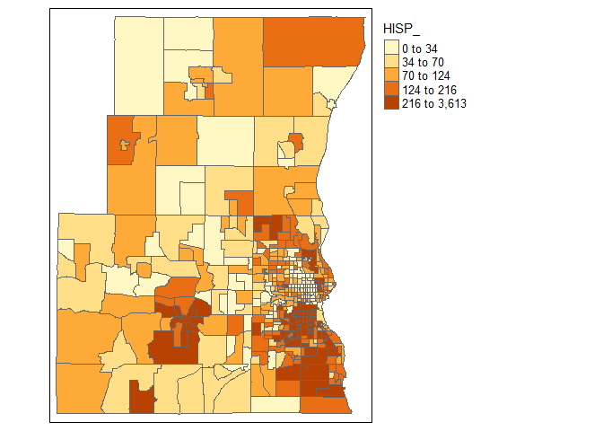
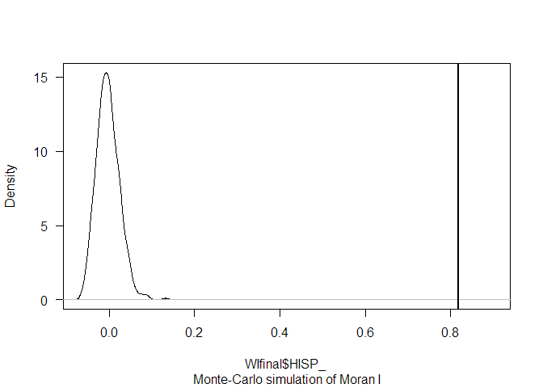

Panel and Spatial Regression Models
================

## Panel Regression Models

## Spatial Regression Models

### Moran’s I spatial autocorrelation

#### For polygon geometry

##### Import data

``` r
library(sf)
WIfinal = st_read("Data/Spatial/wi_final_census2_random4.shp") #it is a spatial feature dataset
```

    ## Reading layer `wi_final_census2_random4' from data source `D:\GIS\TDM\Transport-Demand-Modelling\Data\Spatial\wi_final_census2_random4.shp' using driver `ESRI Shapefile'
    ## Simple feature collection with 417 features and 34 fields
    ## geometry type:  MULTIPOLYGON
    ## dimension:      XY
    ## bbox:           xmin: -88.5423 ymin: 42.84136 xmax: -87.79183 ymax: 43.54352
    ## CRS:            NA

``` r
knitr::kable(head(WIfinal))
```

| FIPS        | MSA       | TOT\_POP | POP\_16 | POP\_65 | WHITE\_ | BLACK\_ | ASIAN\_ | HISP\_ | MULTI\_RA | MALES | FEMALES | MALE1664 | FEM1664 | EMPL16 | EMP\_AWAY | EMP\_HOME | EMP\_29 | EMP\_30 | EMP16\_2 | EMP\_MALE | EMP\_FEM | OCC\_MAN | OCC\_OFF1 | OCC\_INFO | HH\_INC | POV\_POP | POV\_TOT | HSG\_VAL | BLACK1 | BLACK\_R | PCTBLACK |  PCTBLCK | polyid | geometry                     |
|:------------|:----------|---------:|--------:|--------:|--------:|--------:|--------:|-------:|----------:|------:|--------:|---------:|--------:|-------:|----------:|----------:|--------:|--------:|---------:|----------:|---------:|---------:|----------:|----------:|--------:|---------:|---------:|---------:|-------:|---------:|---------:|---------:|-------:|:-----------------------------|
| 55131430100 | Milwaukee |     5068 |    1248 |     429 |    5005 |       5 |       6 |     32 |        17 |  2610 |    2458 |     1763 |    1628 |   2817 |      2690 |       127 |    1852 |     838 |     2854 |      1563 |     1291 |      477 |       456 |        44 |   58295 |     5057 |      185 |   157200 |      5 |     2201 | 0.860631 | 0.000987 |      1 | MULTIPOLYGON (((-88.28074 4… |
| 55089610100 | Milwaukee |     8003 |    1812 |     667 |    7720 |      35 |      36 |    129 |        59 |  3999 |    4004 |     2760 |    2764 |   4476 |      4237 |       239 |    2930 |    1307 |     4544 |      2386 |     2158 |      817 |       700 |        96 |   55124 |     7160 |      164 |   145900 |     35 |       26 | 0.005959 | 0.004373 |      2 | MULTIPOLYGON (((-87.8117 43… |
| 55131410100 | Milwaukee |     4393 |    1026 |     534 |    4320 |       2 |      19 |     19 |        27 |  2198 |    2195 |     1446 |    1387 |   2389 |      2316 |        73 |    1636 |     680 |     2418 |      1306 |     1112 |      466 |       352 |        23 |   51769 |     4327 |      211 |   129800 |      2 |       97 | 0.030012 | 0.000455 |      3 | MULTIPOLYGON (((-88.16157 4… |
| 55131400101 | Milwaukee |     7687 |    1801 |     703 |    7509 |       6 |       7 |    106 |        57 |  3943 |    3744 |     2652 |    2531 |   4296 |      4137 |       159 |    2637 |    1500 |     4358 |      2360 |     1998 |      736 |       896 |        61 |   62083 |     7682 |      224 |   162600 |      6 |      320 | 0.141892 | 0.000781 |      4 | MULTIPOLYGON (((-88.16078 4… |
| 55131420104 | Milwaukee |     5086 |    1065 |     821 |    4957 |      64 |       0 |     11 |         0 |  2485 |    2601 |     1598 |    1602 |   2701 |      2632 |        69 |    1767 |     865 |     2787 |      1479 |     1308 |      423 |       510 |        48 |   51858 |     5086 |      160 |   156000 |     64 |       40 | 0.010384 | 0.012584 |      5 | MULTIPOLYGON (((-88.21622 4… |
| 55131420102 | Milwaukee |     7619 |    1943 |     534 |    7253 |       0 |     143 |    103 |        15 |  3891 |    3728 |     2643 |    2499 |   4016 |      3898 |       118 |    2557 |    1341 |     4066 |      2187 |     1879 |      815 |       678 |        86 |   51844 |     7468 |      296 |   128800 |      0 |     2258 | 0.868852 | 0.000000 |      6 | MULTIPOLYGON (((-88.16137 4… |

Let’s look at the distribution of *Hispanic people* with a map, using a
quantile classification.

``` r
library(tmap) #tmap package
tm_shape(WIfinal) + 
  tm_polygons(style = "quantile", col = "HISP_") +
  tm_legend(outside = TRUE, text.size = .8) 
```

<!-- -->

##### Neighbors

The first step requires that we define “neighboring” polygons. This
could refer to contiguous polygons, polygons within a certain distance
band, or it could be non-spatial in nature and defined by social,
political or cultural “neighbors”.

Here, we’ll adopt a contiguous neighbor definition where we’ll accept
any contiguous polygon that shares at least on vertex (this is the
“queen” case and is defined by setting the parameter `queen=TRUE`). If
we required that at least one edge be shared between polygons then we
would set `queen=FALSE`.

``` r
library(spdep)
```

    ## Loading required package: sp

    ## Loading required package: spData

    ## To access larger datasets in this package, install the spDataLarge
    ## package with: `install.packages('spDataLarge',
    ## repos='https://nowosad.github.io/drat/', type='source')`

``` r
neighbors <- poly2nb(WIfinal, queen=TRUE)
```

##### Weights

Next, we need to assign weights to each neighboring polygon. In this
case, each neighboring polygon will be assigned equal weight
(`style="W"`). Style can take values “**W**”, “**B**”, “**C**”, “**U**”,
“**minmax**” and “**S**”.  
See more details: use `?nb2listw`.

``` r
weights = nb2listw(neighbors, style="W", zero.policy=TRUE)
```

##### Result

To get the Moran’s I value, simply use the `moran.test` function.

``` r
moran.test(WIfinal$HISP_, weights)
```

    ## 
    ##  Moran I test under randomisation
    ## 
    ## data:  WIfinal$HISP_  
    ## weights: weights    
    ## 
    ## Moran I statistic standard deviate = 29.937, p-value < 2.2e-16
    ## alternative hypothesis: greater
    ## sample estimates:
    ## Moran I statistic       Expectation          Variance 
    ##      0.8194219433     -0.0024038462      0.0007535949

Note that the p-value computed from the `moran.test` function is not
computed from an Monte Carlo simulation but analytically instead. This
may not always prove to be the most accurate measure of significance.  
To test for significance using the Monte Carlo simulation method
instead, use the `moran.mc` function.

``` r
#for a Monte Carlo simulation with 600 rounds
moran.mc(WIfinal$HISP_, weights, nsim=599)
```

    ## 
    ##  Monte-Carlo simulation of Moran I
    ## 
    ## data:  WIfinal$HISP_ 
    ## weights: weights  
    ## number of simulations + 1: 600 
    ## 
    ## statistic = 0.81942, observed rank = 600, p-value = 0.001667
    ## alternative hypothesis: greater

Plot the distribution (note that this is a density plot instead of a
histogram).

``` r
plot(moran.mc(WIfinal$HISP_, weights, nsim=599), main="", las=1) #density plot
```

<!-- -->

**See more
[here](https://mgimond.github.io/Spatial/spatial-autocorrelation-in-r.html)**

#### For points

Install and load ape package

``` r
# install.packages("ape")
library(ape)
```

##### Prepare data

It does not deal with ordered factors, zeros, or infinite distances.  
So we need to clean data first.

``` r
str(TABLE)
TABLE$classfactor<-as.numeric(TABLE$CLASS) #make ordered factors as numeric
TABLE$classfactor<-factor(TABLE$classfactor)
TABLEmoran<-TABLE
TABLEmoran$geometry<-NULL #drop geometry
TABLEmoran<-na.omit(TABLEmoran) #remove cases with NA
TABLEmoran<-TABLEmoran[TABLEmoran$Orig_Lat!=0,] #Remove cases with Lat/Lon equals to zero
```

##### Distances matrix, from coordinates (Lat Long)

To calculate Moran’s I, we will need to generate a matrix of inverse
distance weights. In the matrix, entries for pairs of points that are
close together are higher than for pairs of points that are far apart.

We can first generate a distance matrix, then take inverse of the matrix
values and replace the diagonal entries with zero:

``` r
ozone.dists <- as.matrix(dist(cbind(TABLEmoran$Orig_Long, TABLEmoran$Orig_Lat)))
ozone.dists.inv <- 1/ozone.dists
diag(ozone.dists.inv) <- 0 #diagonal as zero
ozone.dists.inv[is.infinite(ozone.dists.inv)] <- 0 #remove infinite distances
```

We have created a matrix where each off-diagonal entry \[ *i*, *j*\] in
the matrix is equal to 1/(distance between point *i* and point *j*).
Note that this is just one of several ways in which we can calculate an
inverse distance matrix.

##### Result

We can now calculate Moran’s I using the command `Moran.I`.

``` r
#First attempt
Moran.I(TABLEmoran$classfactor, ozone.dists.inv)
#Remove distances over 15 km
ozone.dists.bin <- (ozone.dists > 0 & ozone.dists <= 15000)

#Second attempt
Moran.I(TABLEmoran$classfactor, ozone.dists.bin) #Moran’s I =0.012, p = .001
```

> The result (observed) is the Moran’s I value, and if it is enough
> close to zero, we can affirm (with p=…) that ther is not a spatial
> pattern, suggesting an aleatory distribution in space. Tf the result
> was close to 1 or -1, it would suggest a pattern in distribuition in
> space.

**See more
[here](https://stats.idre.ucla.edu/r/faq/how-can-i-calculate-morans-i-in-r/)**
