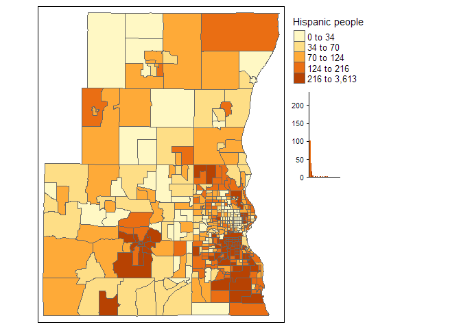
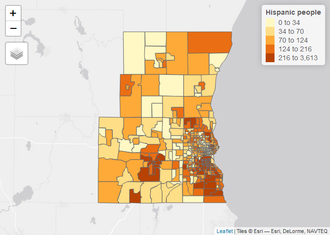
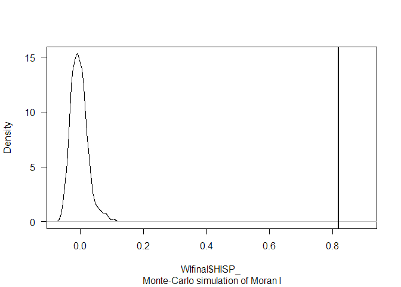
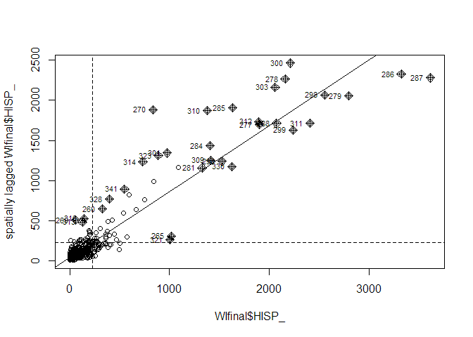
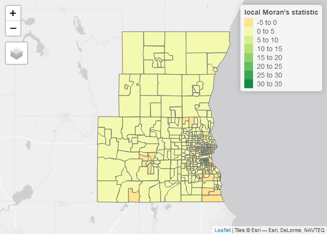
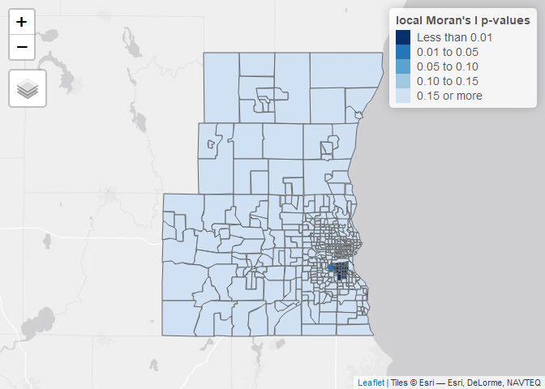
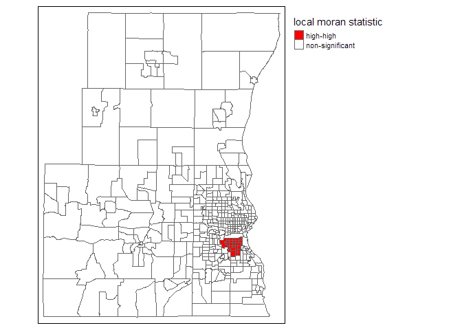

Spatial Regression Models
================

## Startup

##### Import data

``` r
library(sf)
WIfinal = st_read("Data/Spatial/wi_final_census2_random4.shp")
```

    ## Reading layer `wi_final_census2_random4' from data source `D:\GIS\TDM\Transport-Demand-Modelling\Data\Spatial\wi_final_census2_random4.shp' using driver `ESRI Shapefile'
    ## Simple feature collection with 417 features and 34 fields
    ## geometry type:  MULTIPOLYGON
    ## dimension:      XY
    ## bbox:           xmin: -88.5423 ymin: 42.84136 xmax: -87.79183 ymax: 43.54352
    ## CRS:            NA

``` r
class(WIfinal) #it is a spatial feature dataset
```

    ## [1] "sf"         "data.frame"

``` r
View(WIfinal)
```

| FIPS        | MSA       | TOT\_POP | POP\_16 | POP\_65 | WHITE\_ | BLACK\_ | ASIAN\_ | HISP\_ | MULTI\_RA | MALES | FEMALES | MALE1664 | FEM1664 | EMPL16 | EMP\_AWAY | EMP\_HOME | EMP\_29 | EMP\_30 | EMP16\_2 | EMP\_MALE | EMP\_FEM | OCC\_MAN | OCC\_OFF1 | OCC\_INFO | HH\_INC | POV\_POP | POV\_TOT | HSG\_VAL | BLACK1 | BLACK\_R | PCTBLACK |  PCTBLCK | polyid | geometry                     |
|:------------|:----------|---------:|--------:|--------:|--------:|--------:|--------:|-------:|----------:|------:|--------:|---------:|--------:|-------:|----------:|----------:|--------:|--------:|---------:|----------:|---------:|---------:|----------:|----------:|--------:|---------:|---------:|---------:|-------:|---------:|---------:|---------:|-------:|:-----------------------------|
| 55131430100 | Milwaukee |     5068 |    1248 |     429 |    5005 |       5 |       6 |     32 |        17 |  2610 |    2458 |     1763 |    1628 |   2817 |      2690 |       127 |    1852 |     838 |     2854 |      1563 |     1291 |      477 |       456 |        44 |   58295 |     5057 |      185 |   157200 |      5 |     2201 | 0.860631 | 0.000987 |      1 | MULTIPOLYGON (((-88.28074 4… |
| 55089610100 | Milwaukee |     8003 |    1812 |     667 |    7720 |      35 |      36 |    129 |        59 |  3999 |    4004 |     2760 |    2764 |   4476 |      4237 |       239 |    2930 |    1307 |     4544 |      2386 |     2158 |      817 |       700 |        96 |   55124 |     7160 |      164 |   145900 |     35 |       26 | 0.005959 | 0.004373 |      2 | MULTIPOLYGON (((-87.8117 43… |
| 55131410100 | Milwaukee |     4393 |    1026 |     534 |    4320 |       2 |      19 |     19 |        27 |  2198 |    2195 |     1446 |    1387 |   2389 |      2316 |        73 |    1636 |     680 |     2418 |      1306 |     1112 |      466 |       352 |        23 |   51769 |     4327 |      211 |   129800 |      2 |       97 | 0.030012 | 0.000455 |      3 | MULTIPOLYGON (((-88.16157 4… |
| 55131400101 | Milwaukee |     7687 |    1801 |     703 |    7509 |       6 |       7 |    106 |        57 |  3943 |    3744 |     2652 |    2531 |   4296 |      4137 |       159 |    2637 |    1500 |     4358 |      2360 |     1998 |      736 |       896 |        61 |   62083 |     7682 |      224 |   162600 |      6 |      320 | 0.141892 | 0.000781 |      4 | MULTIPOLYGON (((-88.16078 4… |
| 55131420104 | Milwaukee |     5086 |    1065 |     821 |    4957 |      64 |       0 |     11 |         0 |  2485 |    2601 |     1598 |    1602 |   2701 |      2632 |        69 |    1767 |     865 |     2787 |      1479 |     1308 |      423 |       510 |        48 |   51858 |     5086 |      160 |   156000 |     64 |       40 | 0.010384 | 0.012584 |      5 | MULTIPOLYGON (((-88.21622 4… |
| 55131420102 | Milwaukee |     7619 |    1943 |     534 |    7253 |       0 |     143 |    103 |        15 |  3891 |    3728 |     2643 |    2499 |   4016 |      3898 |       118 |    2557 |    1341 |     4066 |      2187 |     1879 |      815 |       678 |        86 |   51844 |     7468 |      296 |   128800 |      0 |     2258 | 0.868852 | 0.000000 |      6 | MULTIPOLYGON (((-88.16137 4… |

##### Project your spatial data

R does not know in which coordinate system our data is (`CRS = _NA_`),
and assumes it is in **WGS84** ([read more about it
here](https://en.wikipedia.org/wiki/World_Geodetic_System)). WGS84 is
the global coordinate system for **GPS** data, for instance.  
But it is not projected in a plan, as a cartesian XY, so if we want do
deal with distances in meters (and not angular distances), we should
project the data in another CRS, the 3857 ([see
more](https://epsg.io/3857)).

``` r
st_crs(WIfinal) = 4326 #set the crs to WGS84
WIfinal = st_transform(WIfinal, 3857) #project the data
```

Let’s look at the distribution of *Hispanic people* with a map, using a
quantile classification.

``` r
summary(WIfinal$HISP_)
```

    ##    Min. 1st Qu.  Median    Mean 3rd Qu.    Max. 
    ##     0.0    44.0    91.0   225.1   192.0  3613.0

``` r
library(tmap) #tmap package
tm_shape(WIfinal) + 
  tm_polygons(style = "quantile", col = "HISP_", title= "Hispanic people", legend.hist = TRUE) +
  tm_legend(outside = TRUE, text.size = .8) 
```

<!-- -->

You can use `tmap()` as interactive view mode. Example, using the same
command.

``` r
tmap_mode("view") #you can choose "plot" (as above) or "view"
```

    ## tmap mode set to interactive viewing

``` r
tm_shape(WIfinal) + 
  tm_polygons(style = "quantile", col = "HISP_", title= "Hispanic people")
```

<!-- -->

## Global spatial autocorrelation

### For polygon geometry

#### Neighbors

The first step requires that we define “neighboring” polygons. This
could refer to contiguous polygons, polygons within a certain distance
band, or it could be non-spatial in nature and defined by social,
political or cultural “neighbors”.

Here, we’ll adopt a contiguous neighbor definition where we’ll accept
any contiguous polygon that shares at least on vertex (this is the
“**queen**” case and is defined by setting the parameter `queen=TRUE`).
If we required that at least one edge be shared between polygons then we
would set `queen=FALSE` (**rook neighbours**).

``` r
library(spdep)
neighbors <- poly2nb(WIfinal, queen=TRUE) #queen
neighbors
```

    ## Neighbour list object:
    ## Number of regions: 417 
    ## Number of nonzero links: 2628 
    ## Percentage nonzero weights: 1.511309 
    ## Average number of links: 6.302158

``` r
neighbors_rook <- poly2nb(WIfinal, queen=F) #rook
neighbors_rook
```

    ## Neighbour list object:
    ## Number of regions: 417 
    ## Number of nonzero links: 2368 
    ## Percentage nonzero weights: 1.361788 
    ## Average number of links: 5.678657

#### Weights

Next, we need to assign weights to each neighboring polygon. In this
case, each neighboring polygon will be assigned equal weight
(`style="W"`). Style can take values “**W**”, “**B**”, “**C**”, “**U**”,
“**minmax**” and “**S**”.  
Use `?nb2listw` to see more details.

``` r
weightsW = nb2listw(neighbors, style="W")
weightsW
```

    ## Characteristics of weights list object:
    ## Neighbour list object:
    ## Number of regions: 417 
    ## Number of nonzero links: 2628 
    ## Percentage nonzero weights: 1.511309 
    ## Average number of links: 6.302158 
    ## 
    ## Weights style: W 
    ## Weights constants summary:
    ##     n     nn  S0       S1       S2
    ## W 417 173889 417 140.0808 1714.318

### Moran’s I test

The correlation score is between -1 and 1. Much like a correlation
coefficient:

-   **1** determines perfect positive spatial autocorrelation (so your
    data is clustered)
-   **0** identifies the data is randomly distributed, and
-   **-1** represents negative spatial autocorrelation (so dissimilar
    values are next to each other).

To get the Moran’s I value use the `moran.test()` function.

``` r
moran.test(WIfinal$HISP_, weightsW)
```

    ## 
    ##  Moran I test under randomisation
    ## 
    ## data:  WIfinal$HISP_  
    ## weights: weightsW    
    ## 
    ## Moran I statistic standard deviate = 29.937, p-value < 2.2e-16
    ## alternative hypothesis: greater
    ## sample estimates:
    ## Moran I statistic       Expectation          Variance 
    ##      0.8194219433     -0.0024038462      0.0007535949

> What can you say about this result?

#### Moran test with Monte Carlo simulation

Note that the p-value computed from the `moran.test` function is not
computed from an Monte Carlo simulation but analytically instead. This
may not always prove to be the most accurate measure of significance.  
To test for significance using the Monte Carlo simulation method
instead, use the `moran.mc` function.

``` r
#for a Monte Carlo simulation with 600 rounds
moran.mc(WIfinal$HISP_, weightsW, nsim=599)
```

    ## 
    ##  Monte-Carlo simulation of Moran I
    ## 
    ## data:  WIfinal$HISP_ 
    ## weights: weightsW  
    ## number of simulations + 1: 600 
    ## 
    ## statistic = 0.81942, observed rank = 600, p-value = 0.001667
    ## alternative hypothesis: greater

Plot the distribution (note that this is a density plot instead of a
histogram).

``` r
plot(moran.mc(WIfinal$HISP_, weightsW, nsim=599), main="", las=1) #density plot
```

<!-- -->

## Local spatial autocorrelation

### Local Moran

##### Moran scatterplot

``` r
moran.plot(WIfinal$HISP_, listw = weightsW)
```

<!-- -->

Notice how the plot is split in 4 quadrants. The top right corner
belongs to areas that have high level of Hispanic people and are
surrounded by other areas that have above the average level of Hispanic
people This are the high-high locations. The bottom left corner belongs
to the low-low areas. These are areas with low level of Hispanic people
and surrounded by areas with below average levels of Hispanic people.
Both the high-high and low-low represent clusters.  
A high-high cluster is what you may refer to as a hot spot. And the
low-low clusters represent cold spots. In the opposite diagonal we have
spatial outliers. They are not outliers in the standard sense, extreme
observations, they are outliers in that they are surrounded by areas
that are very unlike them. So you could have high-low spatial outliers,
areas with high levels of Hispanic people and low levels of surrounding
Hispanic people, or low-high spatial outliers, areas that have
themselves low levels of Hispanic people (or whatever else you are
mapping) and that are surrounded by areas with above average levels of
Hispanic people.

##### Local Moran statistics

``` r
localmoranstats <- localmoran(WIfinal$HISP_, weightsW)
summary(localmoranstats)
```

    ##        Ii                E.Ii               Var.Ii            Z.Ii            Pr(z > 0)     
    ##  Min.   :-0.23179   Min.   :-0.002404   Min.   :0.0536   Min.   :-0.75376   Min.   :0.0000  
    ##  1st Qu.: 0.03026   1st Qu.:-0.002404   1st Qu.:0.1332   1st Qu.: 0.08241   1st Qu.:0.3558  
    ##  Median : 0.09557   Median :-0.002404   Median :0.1558   Median : 0.24318   Median :0.4039  
    ##  Mean   : 0.81942   Mean   :-0.002404   Mean   :0.1650   Mean   : 2.20017   Mean   :0.3845  
    ##  3rd Qu.: 0.14393   3rd Qu.:-0.002404   3rd Qu.:0.1874   3rd Qu.: 0.36976   3rd Qu.:0.4672  
    ##  Max.   :33.54955   Max.   :-0.002404   Max.   :0.9455   Max.   :92.01262   Max.   :0.7745

The outputs of this statistics’ table are defined as:

-   Ii: local moran statistic. One for each area.
-   E.Ii: expectation of local moran statistic
-   Var.Ii: variance of local moran statistic
-   Z.Ii: standard deviate of local moran statistic
-   Pr(): p-value of local moran statistic

Let’s map the local moran statistics `Ii` and p-value

``` r
moranmap <- cbind(WIfinal, localmoranstats) #first, bind the statistics to the original data
names(moranmap)[39] <- "Pvalue" #change the name of this variable to make it easier to call it

tm_shape(moranmap) +
  tm_polygons(col = "Ii", style = "pretty", title = "local Moran's statistic") 
```

    ## Variable(s) "Ii" contains positive and negative values, so midpoint is set to 0. Set midpoint = NA to show the full spectrum of the color palette.

<!-- -->

``` r
tm_shape(moranmap) +
  tm_polygons(
    col = "Pvalue",
    breaks = c(-Inf, 0.01, 0.05, 0.1, 0.15, Inf),
    palette = "-Blues",
    title = "local Moran's I p-values") 
```

<!-- -->

A positive value for `Ii` indicates that the unit is surrounded by units
with similar values.  
Notice that with this variable we only have significant values at a
confidence level of 90% (pvalue &gt; 0.1).

### LISA clusters

> “**Everything is related to everything else, but near things are more
> related than distant things**.” - The First Law of Geography (Tobler)

In order to produce the LISA map we need to do some previous work. First
we are going to create some new variables that we are going to need.  
First we scale the variable of interest. When we scale `HISP_` what we
are doing is re-scaling the values so that the mean is zero.  
We also want to account for the spatial dependence of our values, so we
create a spatial lag variable with `lag.listw()`. Spatial lag is when
the dependent variable *y* in place *i* is affected by the independent
variables in both place *i* and *j*. This will be important to keep in
mind when considering spatial regression. With spatial lag in ordinary
least square regression, the assumption of uncorrelated error terms is
violated, because near things will have associated error terms.
Similarly, the assumption of independent observations is also violated,
as the observations are influenced by the other observations near them.
As a result, the estimates are biased and inefficient. Spatial lag is
suggestive of a possible diffusion process – events in one place predict
an increased likelihood of similar events in neighboring places.

``` r
#scale the variable of interest and save it to a new column
moranmap$HISP_scale <- as.vector(scale(moranmap$HISP_))
summary(moranmap$HISP_scale)
```

    ##     Min.  1st Qu.   Median     Mean  3rd Qu.     Max. 
    ## -0.49380 -0.39729 -0.29420  0.00000 -0.07266  7.43120

``` r
#create a spatial lag variable and save it to a new column
moranmap$HISP_lag <- lag.listw(weightsW, moranmap$HISP_scale)
summary(moranmap$HISP_lag)
```

    ##      Min.   1st Qu.    Median      Mean   3rd Qu.      Max. 
    ## -0.473697 -0.347207 -0.264430  0.004558 -0.074120  4.905265

Then we need to create a variable to distinguish in which quadrant each
observation is (recall the Moran scatterplot!).

``` r
library(tidyverse)
siglevel = 0.15 #we can change to different levels
moranmap <- moranmap %>%  mutate(quad_sig = ifelse(moranmap$HISP_scale > 0 & 
                              moranmap$HISP_lag > 0 & 
                              moranmap$Pvalue <= siglevel, 
                     "high-high",
                     ifelse(moranmap$HISP_scale <= 0 & 
                              moranmap$HISP_lag <= 0 & 
                              moranmap$Pvalue <= siglevel, 
                     "low-low", 
                     ifelse(moranmap$HISP_scale > 0 & 
                              moranmap$HISP_lag <= 0 & 
                              moranmap$Pvalue <= siglevel, 
                     "high-low",
                     ifelse(moranmap$HISP_scale <= 0 & 
                              moranmap$HISP_lag > 0 & 
                              moranmap$Pvalue <= siglevel,
                     "low-high", 
                     "non-significant")))))
moranmap$quad_sig = factor(moranmap$quad_sig)
table(moranmap$quad_sig)
```

    ## 
    ##       high-high non-significant 
    ##              31             386

And now let’s put the results in a map!

``` r
# palcolor = c("red",rgb(1,0,0,alpha=0.4),rgb(0,0,1,alpha=0.4),"blue", "white") #define the color palette for the 5 categories (HH, HL, LH, LL, NS)
palcolor = c("red", "white") #the color palette for only 2 categories
tmap_mode("plot")
tm_shape(moranmap)+
  tm_polygons(col = "quad_sig", palette = palcolor, title = "local moran statistic")+
  tm_legend(outside = TRUE) 
```

<!-- --> What can
you conclude?  
Now, try with other variable, for example the % of Black people per
tract (`PCTBLCK`).

**See more**
[here](https://mgimond.github.io/Spatial/spatial-autocorrelation-in-r.html),
[here](https://maczokni.github.io/crimemapping_textbook_bookdown/global-and-local-spatial-autocorrelation.html),
and [here](https://rpubs.com/quarcs-lab/spatial-autocorrelation)

### For points

Some of these analysis may also be performed for points, instead of
polygons. How? \#\#\#\#\# Install packages Install and load ape package

``` r
# install.packages("ape")
library(ape)
```

##### Prepare data

It does not deal with ordered factors, zeros, or infinite distances.  
So we need to clean data first.

``` r
str(TABLE)
TABLE$classfactor<-as.numeric(TABLE$CLASS) #make ordered factors as numeric
TABLE$classfactor<-factor(TABLE$classfactor)
TABLEmoran<-TABLE
TABLEmoran$geometry<-NULL #drop geometry
TABLEmoran<-na.omit(TABLEmoran) #remove cases with NA
TABLEmoran<-TABLEmoran[TABLEmoran$Orig_Lat!=0,] #Remove cases with Lat/Lon equals to zero
```

#### Distances matrix, from coordinates (Lat Long)

To calculate Moran’s I, we will need to generate a matrix of inverse
distance weights. In the matrix, entries for pairs of points that are
close together are higher than for pairs of points that are far apart.

We can first generate a distance matrix, then take inverse of the matrix
values and replace the diagonal entries with zero:

``` r
DISTANCES <- as.matrix(dist(cbind(TABLEmoran$Orig_Long, TABLEmoran$Orig_Lat)))
DISTANCESinv <- 1/DISTANCES
diag(DISTANCESinv) <- 0 #diagonal as zero
DISTANCESinv[is.infinite(DISTANCESinv)] <- 0 #remove infinite distances
```

We have created a matrix where each off-diagonal entry \[ *i*, *j*\] in
the matrix is equal to 1/(distance between point *i* and point *j*).
Note that this is just one of several ways in which we can calculate an
inverse distance matrix.

#### Moran’s I test

We can now calculate Moran’s I using the command `Moran.I`.

``` r
#First attempt
Moran.I(TABLEmoran$classfactor, DISTANCESinv)
#Remove distances over 15 km
DISTANCESbin <- (DISTANCES > 0 & DISTANCES <= 15000)

#Second attempt
Moran.I(TABLEmoran$classfactor, DISTANCESbin) #Moran’s I =0.012, p = .001
```

> **Note:** The result (observed) is the Moran’s I value, and if it is
> enough close to zero, we can affirm (with p=…) that ther is not a
> spatial pattern, suggesting an aleatory distribution in space. Tf the
> result was close to 1 or -1, it would suggest a pattern in
> distribuition in space.

**See more
[here](https://stats.idre.ucla.edu/r/faq/how-can-i-calculate-morans-i-in-r/)**

## Spatial Regression Models

*work in progress* Check more here, to perform SRL with R:

-   <https://maczokni.github.io/crimemapping_textbook_bookdown/spatial-regression-models.html>
-   <https://rpubs.com/quarcs-lab/tutorial-spatial-regression>
