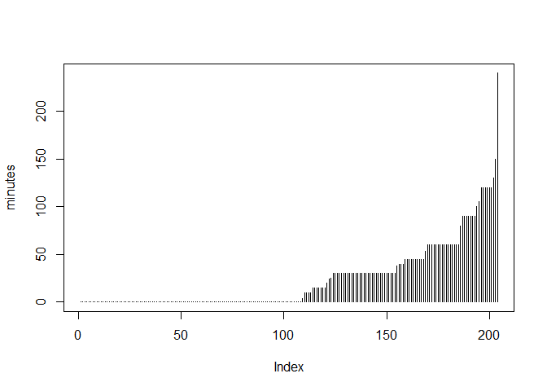
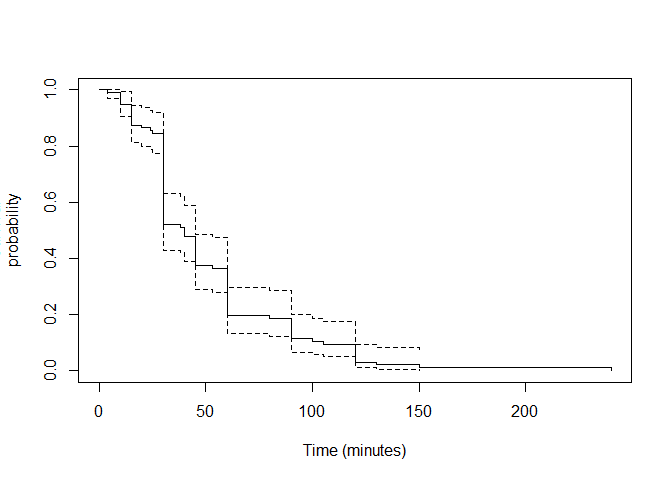
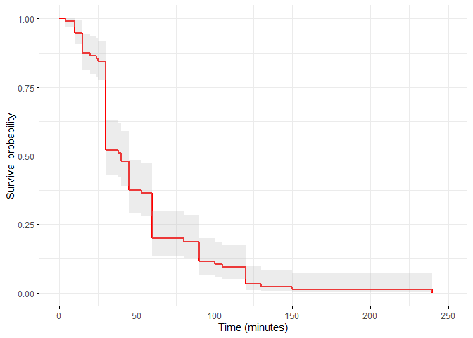
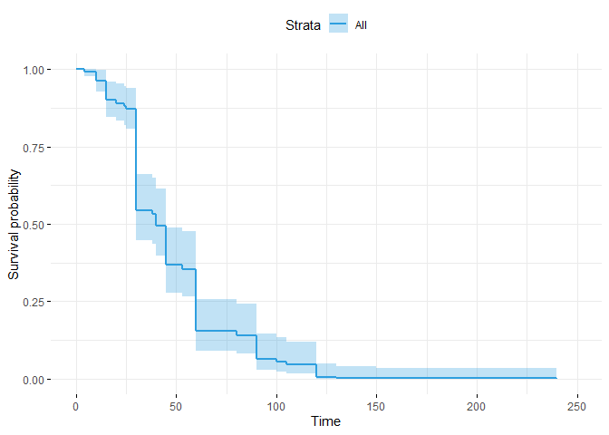
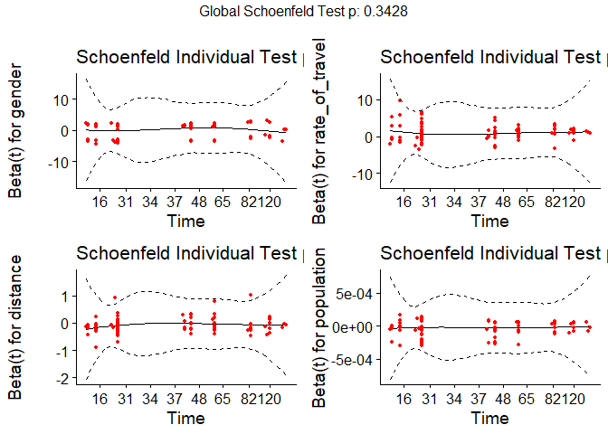

Hazard-Based Duration Models
================

``` r
library(readxl)
library(skimr)
library(survival)
library(coxme)
```

    ## Loading required package: bdsmatrix

    ## 
    ## Attaching package: 'bdsmatrix'

    ## The following object is masked from 'package:base':
    ## 
    ##     backsolve

``` r
library(survminer)
```

    ## Loading required package: ggplot2

    ## Loading required package: ggpubr

``` r
setwd("G:/O meu disco/TDM - Lecture R/TDM github/Transport-Demand-Modelling")
```

``` r
data.delay <- read_excel("Data/ExerciseHBDM.xlsx")


data.delay <- data.frame(data.delay)

head(data.delay)
```

    ##     id X1 X2 X3 X4 X5 X6 X7 X8 X9 X10 X11 X12 X13 X14 X15   X16  X17  X18  X19
    ## 1 1000  0  0  0  1  2  1  1  1  2   0   5   1  12   1 1.4 37070 1024 1295 5610
    ## 2 1001 30  1  1  1  2  1  2  0  2   0   5   0  14   1 1.8 24410 6430 3206 1997
    ## 3 1002  0  0  0  1  5  1  4  1  1   0   3   0   5   1 1.3 24410 6430 3206 1997
    ## 4 1003  0  0  0  1  5  1  4  1  1   0   2   0   5   1 1.3 24410 6430 3206 1997
    ## 5 1004  0  0  0  2  2  1  2  1  1   0   3   0   3   0 1.2  5079 1024  899 4092
    ## 6 1005 38  1  3  1  2  1  7  1  2   0   5   0  14   1 1.8 24410 6430 3206 1997

``` r
data.delay["minutes"] <- NA

data.delay$minutes <-  data.delay$X1

data.delay["activity"] <- NA

data.delay$activity <-  data.delay$X2

data.delay["number_of_times"] <- NA

data.delay$number_of_times <-  data.delay$X3

data.delay["mode"] <- NA

data.delay$mode <-  data.delay$X4

data.delay["route"] <- NA

data.delay$route <-  data.delay$X5

data.delay["congested"] <- NA

data.delay$congested <-  data.delay$X6

data.delay["age"] <- NA

data.delay$age <-  data.delay$X7

data.delay["gender"] <- NA

data.delay$gender <-  data.delay$X8

data.delay["number_cars"] <- NA

data.delay$number_cars <-  data.delay$X9

data.delay["number_children"] <- NA

data.delay$number_children <-  data.delay$X10

data.delay["income"] <- NA

data.delay$income <-  data.delay$X11

data.delay["flexible"] <- NA

data.delay$flexible <-  data.delay$X12

data.delay["distance"] <- NA

data.delay$distance <-  data.delay$X13

data.delay["LOSD"] <- NA

data.delay$LOSD <-  data.delay$X14

data.delay["rate_of_travel"] <- NA

data.delay$rate_of_travel <-  data.delay$X15

data.delay["population"] <- NA

data.delay$population <-  data.delay$X16

data.delay["retail"] <- NA

data.delay$retail <-  data.delay$X17

data.delay["service"] <- NA

data.delay$service <-  data.delay$X18

data.delay["size"] <- NA

data.delay$size <-  data.delay$X19    
```

``` r
str(data.delay)
```

    ## 'data.frame':    204 obs. of  39 variables:
    ##  $ id             : num  1000 1001 1002 1003 1004 ...
    ##  $ X1             : num  0 30 0 0 0 38 0 0 45 0 ...
    ##  $ X2             : num  0 1 0 0 0 1 0 0 1 0 ...
    ##  $ X3             : num  0 1 0 0 0 3 0 0 0 0 ...
    ##  $ X4             : num  1 1 1 1 2 1 2 1 2 1 ...
    ##  $ X5             : num  2 2 5 5 2 2 2 1 2 5 ...
    ##  $ X6             : num  1 1 1 1 1 1 1 0 1 0 ...
    ##  $ X7             : num  1 2 4 4 2 7 2 7 3 6 ...
    ##  $ X8             : num  1 0 1 1 1 1 1 1 1 1 ...
    ##  $ X9             : num  2 2 1 1 1 2 2 2 2 3 ...
    ##  $ X10            : num  0 0 0 0 0 0 0 0 0 1 ...
    ##  $ X11            : num  5 5 3 2 3 5 6 4 4 5 ...
    ##  $ X12            : num  1 0 0 0 0 0 0 0 0 0 ...
    ##  $ X13            : num  12 14 5 5 3 14 11 13 22 6 ...
    ##  $ X14            : num  1 1 1 1 0 1 1 0 1 0 ...
    ##  $ X15            : chr  "1.4" "1.8" "1.3" "1.3" ...
    ##  $ X16            : num  37070 24410 24410 24410 5079 ...
    ##  $ X17            : num  1024 6430 6430 6430 1024 ...
    ##  $ X18            : num  1295 3206 3206 3206 899 ...
    ##  $ X19            : num  5610 1997 1997 1997 4092 ...
    ##  $ minutes        : num  0 30 0 0 0 38 0 0 45 0 ...
    ##  $ activity       : num  0 1 0 0 0 1 0 0 1 0 ...
    ##  $ number_of_times: num  0 1 0 0 0 3 0 0 0 0 ...
    ##  $ mode           : num  1 1 1 1 2 1 2 1 2 1 ...
    ##  $ route          : num  2 2 5 5 2 2 2 1 2 5 ...
    ##  $ congested      : num  1 1 1 1 1 1 1 0 1 0 ...
    ##  $ age            : num  1 2 4 4 2 7 2 7 3 6 ...
    ##  $ gender         : num  1 0 1 1 1 1 1 1 1 1 ...
    ##  $ number_cars    : num  2 2 1 1 1 2 2 2 2 3 ...
    ##  $ number_children: num  0 0 0 0 0 0 0 0 0 1 ...
    ##  $ income         : num  5 5 3 2 3 5 6 4 4 5 ...
    ##  $ flexible       : num  1 0 0 0 0 0 0 0 0 0 ...
    ##  $ distance       : num  12 14 5 5 3 14 11 13 22 6 ...
    ##  $ LOSD           : num  1 1 1 1 0 1 1 0 1 0 ...
    ##  $ rate_of_travel : chr  "1.4" "1.8" "1.3" "1.3" ...
    ##  $ population     : num  37070 24410 24410 24410 5079 ...
    ##  $ retail         : num  1024 6430 6430 6430 1024 ...
    ##  $ service        : num  1295 3206 3206 3206 899 ...
    ##  $ size           : num  5610 1997 1997 1997 4092 ...

``` r
drop <- c("X1","X2", "X3", "X4", "X5", "X6", "X7", "X8", "X9", "X10", "X11", "X12", "X13", "X14", "X15", "X16", "X17", "X18", "X19")
df = data.delay[,!(names(data.delay) %in% drop)]
```

``` r
skim(df)
```

|                                                  |      |
| :----------------------------------------------- | :--- |
| Name                                             | df   |
| Number of rows                                   | 204  |
| Number of columns                                | 20   |
| \_\_\_\_\_\_\_\_\_\_\_\_\_\_\_\_\_\_\_\_\_\_\_   |      |
| Column type frequency:                           |      |
| character                                        | 1    |
| numeric                                          | 19   |
| \_\_\_\_\_\_\_\_\_\_\_\_\_\_\_\_\_\_\_\_\_\_\_\_ |      |
| Group variables                                  | None |

Data summary

**Variable type: character**

| skim\_variable   | n\_missing | complete\_rate | min | max | empty | n\_unique | whitespace |
| :--------------- | ---------: | -------------: | --: | --: | ----: | --------: | ---------: |
| rate\_of\_travel |          0 |              1 |   3 |   3 |     0 |        15 |          0 |

**Variable type: numeric**

| skim\_variable    | n\_missing | complete\_rate |     mean |       sd |   p0 |      p25 |     p50 |      p75 |  p100 | hist  |
| :---------------- | ---------: | -------------: | -------: | -------: | ---: | -------: | ------: | -------: | ----: | :---- |
| id                |          0 |              1 |  1101.50 |    59.03 | 1000 |  1050.75 |  1101.5 |  1152.25 |  1203 | ▇▇▇▇▇ |
| minutes           |          0 |              1 |    24.14 |    36.27 |    0 |     0.00 |     0.0 |    30.00 |   240 | ▇▁▁▁▁ |
| activity          |          0 |              1 |     0.78 |     0.97 |    0 |     0.00 |     0.0 |     1.00 |     3 | ▇▃▁▂▁ |
| number\_of\_times |          0 |              1 |     0.86 |     1.31 |    0 |     0.00 |     0.0 |     2.00 |     5 | ▇▂▁▁▁ |
| mode              |          0 |              1 |     2.08 |     1.49 |    1 |     1.00 |     1.0 |     4.00 |     5 | ▇▂▁▂▂ |
| route             |          0 |              1 |     3.49 |     1.46 |    1 |     2.00 |     3.5 |     5.00 |     5 | ▂▆▂▂▇ |
| congested         |          0 |              1 |     0.63 |     0.48 |    0 |     0.00 |     1.0 |     1.00 |     1 | ▅▁▁▁▇ |
| age               |          0 |              1 |     2.83 |     1.69 |    1 |     2.00 |     2.0 |     4.00 |     7 | ▇▃▂▁▁ |
| gender            |          0 |              1 |     0.64 |     0.48 |    0 |     0.00 |     1.0 |     1.00 |     1 | ▅▁▁▁▇ |
| number\_cars      |          0 |              1 |     1.80 |     1.04 |    0 |     1.00 |     2.0 |     2.00 |     7 | ▇▇▂▁▁ |
| number\_children  |          0 |              1 |     0.70 |     1.05 |    0 |     0.00 |     0.0 |     1.00 |     5 | ▇▂▁▁▁ |
| income            |          0 |              1 |     2.78 |     1.56 |    1 |     1.00 |     3.0 |     4.00 |     6 | ▇▃▂▂▁ |
| flexible          |          0 |              1 |     0.62 |     0.49 |    0 |     0.00 |     1.0 |     1.00 |     1 | ▅▁▁▁▇ |
| distance          |          0 |              1 |     7.15 |     4.81 |    1 |     4.00 |     6.0 |    10.00 |    25 | ▇▆▃▁▁ |
| LOSD              |          0 |              1 |     0.65 |     0.48 |    0 |     0.00 |     1.0 |     1.00 |     1 | ▅▁▁▁▇ |
| population        |          0 |              1 | 25367.32 | 10232.19 | 1303 | 23026.00 | 24410.0 | 34895.00 | 37070 | ▃▁▁▇▇ |
| retail            |          0 |              1 |  4604.66 |  4334.42 |  616 |  1866.00 |  3906.0 |  3966.00 | 16523 | ▆▇▁▁▂ |
| service           |          0 |              1 |  9733.06 | 10552.66 |  595 |  1606.00 | 10582.0 | 10582.00 | 38607 | ▇▇▁▁▂ |
| size              |          0 |              1 |  3087.51 |  1598.03 |  475 |  2472.00 |  2753.0 |  4447.75 |  5653 | ▃▇▇▁▆ |

#### Sort the data by time

``` r
df <- df[order(df$minutes),]
print(df)
```

    ##       id minutes activity number_of_times mode route congested age gender
    ## 1   1000       0        0               0    1     2         1   1      1
    ## 3   1002       0        0               0    1     5         1   4      1
    ## 4   1003       0        0               0    1     5         1   4      1
    ## 5   1004       0        0               0    2     2         1   2      1
    ## 7   1006       0        0               0    2     2         1   2      1
    ## 8   1007       0        0               0    1     1         0   7      1
    ## 10  1009       0        0               0    1     5         0   6      1
    ## 11  1010       0        0               0    2     3         1   4      1
    ## 12  1011       0        0               0    2     3         1   2      1
    ## 14  1013       0        0               0    1     2         1   3      1
    ## 19  1018       0        0               0    1     2         0   2      1
    ## 20  1019       0        0               0    2     2         1   3      0
    ## 21  1020       0        0               0    5     4         0   1      1
    ## 22  1021       0        0               0    4     2         1   2      0
    ## 27  1026       0        0               0    5     5         1   1      1
    ## 31  1030       0        0               0    1     2         1   7      0
    ## 32  1031       0        0               0    1     2         1   4      0
    ## 33  1032       0        0               0    1     5         0   7      0
    ## 36  1035       0        0               0    5     5         1   3      1
    ## 38  1037       0        0               0    5     5         0   2      1
    ## 39  1038       0        0               0    5     5         0   1      0
    ## 41  1040       0        0               0    4     3         1   2      0
    ## 42  1041       0        0               0    1     5         1   5      0
    ## 46  1045       0        0               0    2     5         0   5      1
    ## 47  1046       0        0               0    1     5         0   3      0
    ## 48  1047       0        0               0    1     2         0   2      0
    ## 49  1048       0        0               0    4     5         0   5      1
    ## 51  1050       0        0               0    1     2         1   4      0
    ## 52  1051       0        0               0    1     2         1   3      1
    ## 53  1052       0        0               0    1     2         1   5      1
    ## 57  1056       0        0               0    1     3         1   2      0
    ## 58  1057       0        0               0    1     1         1   3      1
    ## 59  1058       0        0               0    1     3         1   2      0
    ## 60  1059       0        0               0    1     3         0   1      0
    ## 62  1061       0        0               0    1     5         0   5      0
    ## 67  1066       0        0               0    5     2         0   2      0
    ## 68  1067       0        0               0    2     5         0   2      1
    ## 76  1075       0        0               0    2     5         0   3      1
    ## 78  1077       0        0               0    5     5         0   1      1
    ## 80  1079       0        0               0    2     2         0   2      0
    ## 81  1080       0        0               0    1     5         1   1      1
    ## 82  1081       0        0               0    4     1         1   1      1
    ## 83  1082       0        0               0    1     5         0   1      1
    ## 85  1084       0        0               0    5     5         0   1      0
    ## 86  1085       0        0               0    4     5         1   1      0
    ## 88  1087       0        0               0    4     3         1   1      0
    ## 90  1089       0        0               0    1     2         1   2      1
    ## 91  1090       0        0               0    4     2         0   3      1
    ## 92  1091       0        0               0    2     5         0   4      1
    ## 93  1092       0        0               0    4     5         1   2      0
    ## 94  1093       0        0               0    1     5         0   2      0
    ## 96  1095       0        0               0    1     5         0   4      1
    ## 98  1097       0        0               0    4     3         1   2      1
    ## 99  1098       0        0               0    4     5         1   2      1
    ## 101 1100       0        0               0    1     2         0   7      1
    ## 106 1105       0        0               0    4     2         0   3      0
    ## 108 1107       0        0               0    5     5         1   1      1
    ## 109 1108       0        0               0    1     5         1   1      1
    ## 111 1110       0        0               0    5     5         1   1      1
    ## 113 1112       0        0               0    4     5         0   2      1
    ## 114 1113       0        0               0    1     5         1   3      1
    ## 115 1114       0        0               0    5     5         0   2      0
    ## 117 1116       0        0               0    2     2         1   7      1
    ## 120 1119       0        0               0    2     4         1   6      1
    ## 121 1120       0        0               0    2     5         1   4      0
    ## 122 1121       0        0               0    3     4         1   7      1
    ## 124 1123       0        0               0    2     1         0   1      0
    ## 125 1124       0        0               0    2     4         0   1      0
    ## 126 1125       0        0               0    1     5         1   4      0
    ## 127 1126       0        0               0    1     4         1   5      1
    ## 129 1128       0        0               0    3     3         1   3      0
    ## 135 1134       0        0               0    2     1         1   2      1
    ## 136 1135       0        0               0    1     4         1   2      1
    ## 137 1136       0        0               0    1     1         1   2      0
    ## 139 1138       0        0               0    1     5         1   3      1
    ## 140 1139       0        0               0    1     4         1   2      1
    ## 141 1140       0        0               0    2     1         0   4      1
    ## 143 1142       0        0               0    1     4         0   2      1
    ## 144 1143       0        0               0    3     3         1   3      1
    ## 145 1144       0        0               0    5     5         0   2      0
    ## 146 1145       0        0               0    1     1         1   3      1
    ## 155 1154       0        0               0    4     5         0   1      1
    ## 156 1155       0        0               0    2     3         1   1      1
    ## 158 1157       0        0               0    4     2         1   4      1
    ## 159 1158       0        0               0    4     2         0   1      0
    ## 160 1159       0        0               0    1     5         0   1      1
    ## 162 1161       0        0               0    1     3         1   2      0
    ## 166 1165       0        0               0    5     5         0   1      0
    ## 167 1166       0        0               0    5     5         0   2      1
    ## 168 1167       0        0               0    1     5         1   1      0
    ## 170 1169       0        0               0    1     5         1   1      1
    ## 174 1173       0        0               0    1     2         0   7      0
    ## 175 1174       0        0               0    1     5         0   1      0
    ## 176 1175       0        0               0    1     5         0   1      1
    ## 178 1177       0        0               0    1     5         0   3      1
    ## 179 1178       0        0               0    1     5         0   4      1
    ## 180 1179       0        0               0    1     5         0   5      0
    ## 183 1182       0        0               0    1     5         0   5      0
    ## 187 1186       0        0               0    5     5         0   5      1
    ## 188 1187       0        0               0    1     2         0   2      0
    ## 189 1188       0        0               0    1     5         0   2      0
    ## 191 1190       0        0               0    5     5         1   4      1
    ## 192 1191       0        0               0    1     5         1   4      0
    ## 194 1193       0        0               0    5     5         1   2      0
    ## 195 1194       0        0               0    4     2         0   1      1
    ## 196 1195       0        0               0    5     5         0   4      1
    ## 197 1196       0        0               0    1     2         0   4      0
    ## 201 1200       0        0               0    5     5         0   7      0
    ## 147 1146       4        1               3    1     5         0   2      1
    ## 15  1014      10        1               3    1     2         1   7      1
    ## 103 1102      10        1               1    1     5         1   3      0
    ## 131 1130      10        1               1    1     3         1   1      1
    ## 185 1184      10        1               2    1     5         1   3      0
    ## 13  1012      15        2               2    1     2         1   1      1
    ## 105 1104      15        2               2    1     2         1   1      0
    ## 116 1115      15        1               3    1     4         1   3      1
    ## 154 1153      15        1               2    1     2         1   3      1
    ## 157 1156      15        1               3    1     3         1   1      1
    ## 165 1164      15        1               5    4     5         0   4      1
    ## 177 1176      15        1               5    1     5         0   6      0
    ## 148 1147      20        2               2    1     5         1   1      1
    ## 100 1099      24        2               2    1     5         1   7      0
    ## 130 1129      25        1               1    2     3         1   2      0
    ## 2   1001      30        1               1    1     2         1   2      0
    ## 16  1015      30        1               2    1     2         1   3      1
    ## 25  1024      30        2               2    1     3         1   4      1
    ## 29  1028      30        2               0    1     1         1   6      1
    ## 30  1029      30        2               1    1     5         0   6      0
    ## 40  1039      30        1               3    1     2         1   4      1
    ## 43  1042      30        3               1    1     2         0   5      1
    ## 44  1043      30        2               0    4     5         0   4      1
    ## 45  1044      30        2               0    4     3         1   3      1
    ## 54  1053      30        1               0    1     2         1   3      0
    ## 61  1060      30        1               1    1     5         0   5      1
    ## 64  1063      30        2               2    1     3         0   1      0
    ## 66  1065      30        3               3    1     1         1   4      1
    ## 70  1069      30        2               3    1     5         0   3      1
    ## 72  1071      30        1               1    1     2         1   2      1
    ## 73  1072      30        2               2    1     2         1   1      1
    ## 75  1074      30        1               3    1     5         1   2      1
    ## 79  1078      30        2               2    1     5         1   1      1
    ## 95  1094      30        1               2    4     2         1   1      0
    ## 97  1096      30        2               3    4     5         0   1      0
    ## 102 1101      30        1               5    1     4         1   2      1
    ## 119 1118      30        2               1    1     5         1   3      1
    ## 132 1131      30        1               0    3     3         1   4      1
    ## 142 1141      30        1               5    1     4         1   4      1
    ## 161 1160      30        2               1    4     3         1   2      1
    ## 164 1163      30        2               5    1     5         0   2      1
    ## 172 1171      30        2               1    1     2         1   2      1
    ## 182 1181      30        1               3    1     5         1   5      0
    ## 193 1192      30        2               1    5     2         0   2      0
    ## 198 1197      30        2               2    4     5         1   2      1
    ## 200 1199      30        1               0    4     3         1   5      1
    ## 6   1005      38        1               3    1     2         1   7      1
    ## 71  1070      40        1               1    1     2         0   1      1
    ## 74  1073      40        3               2    4     5         0   3      1
    ## 199 1198      40        1               3    1     4         1   2      1
    ## 9   1008      45        1               0    2     2         1   3      1
    ## 63  1062      45        3               2    1     3         1   2      0
    ## 65  1064      45        2               3    1     1         1   2      1
    ## 110 1109      45        2               0    1     5         1   1      1
    ## 112 1111      45        2               1    5     5         0   1      1
    ## 128 1127      45        1               0    1     3         1   4      1
    ## 169 1168      45        3               2    1     3         1   1      0
    ## 184 1183      45        2               3    1     5         1   1      1
    ## 190 1189      45        1               0    1     2         0   2      1
    ## 204 1203      45        3               2    1     2         1   3      0
    ## 84  1083      53        1               1    1     2         1   2      1
    ## 23  1022      60        2               1    1     2         0   2      1
    ## 26  1025      60        1               0    4     2         1   2      1
    ## 34  1033      60        1               2    1     5         1   5      0
    ## 37  1036      60        1               3    1     2         1   3      1
    ## 50  1049      60        3               1    2     1         1   2      1
    ## 55  1054      60        2               0    1     2         0   2      1
    ## 69  1068      60        1               2    2     1         1   1      0
    ## 77  1076      60        2               4    1     2         1   3      1
    ## 87  1086      60        1               3    1     2         1   1      1
    ## 104 1103      60        1               2    1     5         1   2      0
    ## 107 1106      60        2               0    1     5         1   5      1
    ## 152 1151      60        3               3    1     5         1   2      1
    ## 153 1152      60        1               1    4     2         0   2      1
    ## 171 1170      60        2               1    4     3         1   1      1
    ## 186 1185      60        3               1    1     4         1   5      1
    ## 203 1202      60        1               2    1     2         1   3      1
    ## 89  1088      80        1               2    3     5         1   3      1
    ## 18  1017      90        1               3    4     2         1   3      1
    ## 28  1027      90        3               2    1     5         1   2      0
    ## 118 1117      90        1               0    1     1         1   4      1
    ## 123 1122      90        1               2    1     1         1   3      1
    ## 133 1132      90        3               1    1     4         1   3      0
    ## 163 1162      90        1               2    3     2         1   2      1
    ## 173 1172      90        2               0    5     5         1   2      1
    ## 24  1023     100        2               1    4     2         0   3      0
    ## 35  1034     105        1               3    4     5         0   4      1
    ## 17  1016     120        2               2    1     2         1   1      0
    ## 56  1055     120        2               0    1     3         1   7      0
    ## 134 1133     120        2               1    3     4         1   4      0
    ## 150 1149     120        2               3    1     2         1   1      1
    ## 151 1150     120        3               5    1     3         0   1      0
    ## 181 1180     120        1               0    1     4         1   4      0
    ## 149 1148     130        3               5    4     5         1   1      0
    ## 138 1137     150        1               0    1     3         1   3      1
    ## 202 1201     240        3               2    1     5         0   1      1
    ##     number_cars number_children income flexible distance LOSD rate_of_travel
    ## 1             2               0      5        1       12    1            1.4
    ## 3             1               0      3        0        5    1            1.3
    ## 4             1               0      2        0        5    1            1.3
    ## 5             1               0      3        0        3    0            1.2
    ## 7             2               0      6        0       11    1            1.5
    ## 8             2               0      4        0       13    0            1.1
    ## 10            3               1      5        0        6    0            1.2
    ## 11            2               2      3        0       16    1            1.5
    ## 12            3               1      3        0       16    1            1.5
    ## 14            2               2      4        1       12    1            1.3
    ## 19            5               4      3        0        4    0            1.3
    ## 20            2               1      3        0        7    0            1.2
    ## 21            1               0      1        1        4    0            1.3
    ## 22            1               0      2        0       12    1            1.5
    ## 27            1               0      1        1        3    0            1.1
    ## 31            1               1      1        1       22    0            1.3
    ## 32            3               2      4        1        6    0            1.2
    ## 33            2               0      4        1        2    0            1.2
    ## 36            2               0      2        1        2    0            1.3
    ## 38            2               0      5        1        2    0            1.1
    ## 39            0               0      1        1        2    0            1.1
    ## 41            3               0      4        1       11    1            1.5
    ## 42            1               1      2        0        3    1            1.3
    ## 46            2               2      6        1        3    0            1.1
    ## 47            2               0      6        1        2    0            1.2
    ## 48            2               1      2        0        4    0            1.2
    ## 49            0               0      2        0        2    0            1.1
    ## 51            2               0      5        0        8    0            1.2
    ## 52            2               0      3        0       12    1            1.4
    ## 53            3               0      5        1        6    1            1.4
    ## 57            1               0      3        0        6    1            2.1
    ## 58            2               0      4        0        8    1            2.1
    ## 59            3               0      3        0        8    0            1.6
    ## 60            3               0      1        1        7    0            1.3
    ## 62            4               2      6        1        4    0            1.1
    ## 67            1               1      1        0        5    0            1.2
    ## 68            2               0      1        1        2    0            1.1
    ## 76            1               1      1        1        2    0            1.1
    ## 78            1               0      1        1        2    0            1.2
    ## 80            0               0      2        1       14    0            1.4
    ## 81            1               0      1        1        3    1            1.8
    ## 82            1               0      2        1        9    1            1.4
    ## 83            0               0      1        1        2    0            1.1
    ## 85            0               0      1        0        2    0            1.1
    ## 86            0               0      1        1        2    0            1.1
    ## 88            2               2      2        1        6    1            1.6
    ## 90            2               0      2        0        9    1            1.4
    ## 91            1               0      3        1        4    0            1.1
    ## 92            1               1      3        1        3    0            1.1
    ## 93            1               0      2        1        4    1            1.4
    ## 94            1               0      3        1        4    0            1.1
    ## 96            1               0      3        0        5    0            1.1
    ## 98            2               0      2        1       12    1            1.8
    ## 99            1               0      3        1        5    1            1.8
    ## 101           1               0      2        1       11    0            1.3
    ## 106           1               2      1        0        2    0            1.1
    ## 108           2               0      1        1        5    0            1.1
    ## 109           5               1      3        1        4    1            1.7
    ## 111           2               0      1        0        2    0            1.2
    ## 113           1               0      2        1        6    0            1.1
    ## 114           2               2      3        1        6    0            1.2
    ## 115           1               0      1        1        2    0            1.1
    ## 117           2               0      3        1       14    0            1.8
    ## 120           3               0      5        1       18    1            1.5
    ## 121           2               2      1        1        2    0            1.3
    ## 122           5               5      3        1       21    1            1.4
    ## 124           2               0      3        1       13    0            1.3
    ## 125           2               1      4        0       17    0            1.1
    ## 126           1               2      2        0        3    0            1.1
    ## 127           3               1      5        0       14    0            1.5
    ## 129           2               1      6        1       11    1            1.7
    ## 135           2               1      3        1       11    1            1.7
    ## 136           2               1      5        0        9    1            1.5
    ## 137           1               1      2        0       10    1            1.4
    ## 139           3               0      3        0        5    0            1.3
    ## 140           2               1      2        1       15    1            1.4
    ## 141           2               2      2        0       10    0            1.1
    ## 143           2               0      3        1       12    0            1.3
    ## 144           1               0      3        1       10    1            1.8
    ## 145           1               0      3        1        2    0            1.1
    ## 146           2               2      4        1        5    0            1.3
    ## 155           2               1      2        1        4    0            1.1
    ## 156           1               0      2        0        3    0            1.2
    ## 158           2               0      3        1       14    1            1.6
    ## 159           1               0      2        1        6    0            1.1
    ## 160           1               0      1        1        2    0            1.2
    ## 162           1               0      6        1        8    1            1.6
    ## 166           1               0      1        1        2    0            1.1
    ## 167           1               0      1        1        2    0            1.1
    ## 168           1               0      1        0        2    0            2.0
    ## 170           3               1      2        0        7    1            1.6
    ## 174           3               1      3        1        3    0            1.1
    ## 175           1               0      1        1        1    0            1.1
    ## 176           4               1      6        1        4    0            1.1
    ## 178           2               0      3        1        7    0            1.1
    ## 179           2               0      6        0        4    0            1.1
    ## 180           3               3      6        0        7    0            1.1
    ## 183           2               3      1        0        8    0            1.1
    ## 187           2               3      3        0        3    0            1.1
    ## 188           2               0      3        1        7    0            1.1
    ## 189           1               0      1        0       13    0            1.1
    ## 191           1               2      5        1        3    1            1.2
    ## 192           1               0      3        0        2    1            1.2
    ## 194           1               0      3        1        5    1            1.3
    ## 195           2               0      2        1        6    0            1.1
    ## 196           0               0      1        1        3    0            1.1
    ## 197           1               0      4        1        5    1            1.1
    ## 201           2               0      4        0        4    0            1.1
    ## 147           1               0      1        1        2    1            2.1
    ## 15            2               0      6        0        8    1            1.7
    ## 103           2               4      3        0        4    1            2.2
    ## 131           2               0      2        1        5    1            1.8
    ## 185           3               0      5        1        7    1            1.6
    ## 13            1               0      2        1       12    1            1.5
    ## 105           2               0      1        0        4    1            2.1
    ## 116           3               1      5        0       11    1            1.7
    ## 154           3               2      3        0        5    1            1.9
    ## 157           1               0      2        0        8    1            1.6
    ## 165           0               0      1        1        4    1            2.1
    ## 177           1               3      2        0        3    1            1.4
    ## 148           5               4      3        1        3    1            2.3
    ## 100           1               0      1        1        3    1            2.5
    ## 130           2               0      5        1       22    1            1.8
    ## 2             2               0      5        0       14    1            1.8
    ## 16            2               2      3        0        4    1            1.3
    ## 25            2               3      4        0        6    1            2.0
    ## 29            2               1      3        1       16    1            1.4
    ## 30            2               0      3        1        6    1            1.3
    ## 40            2               1      6        1        9    1            1.5
    ## 43            2               2      4        1        6    1            2.2
    ## 44            2               0      6        1        4    1            2.2
    ## 45            2               2      4        1        9    1            1.8
    ## 54            1               0      2        1        3    1            2.1
    ## 61            3               0      5        1        2    1            2.0
    ## 64            1               0      1        1        6    1            2.1
    ## 66            2               3      4        0        8    1            2.1
    ## 70            1               2      1        0        3    1            2.3
    ## 72            3               0      2        0       22    1            1.4
    ## 73            1               0      1        1        4    1            1.8
    ## 75            1               0      1        0        4    1            2.2
    ## 79            2               0      1        1        5    1            2.4
    ## 95            0               0      2        1        4    1            2.5
    ## 97            5               0      6        1        2    0            1.2
    ## 102           2               4      3        0        9    1            1.8
    ## 119           2               1      5        0       10    1            1.8
    ## 132           2               0      3        1        9    1            2.0
    ## 142           1               0      2        1        8    1            1.6
    ## 161           1               1      4        0        9    1            2.0
    ## 164           1               0      1        0        4    1            2.3
    ## 172           1               0      1        0        9    1            1.8
    ## 182           2               0      4        0        6    1            2.0
    ## 193           1               0      1        1       12    1            1.6
    ## 198           2               0      6        1        7    1            1.6
    ## 200           3               1      4        1        8    1            2.0
    ## 6             2               0      5        0       14    1            1.8
    ## 71            2               0      1        1        6    1            2.0
    ## 74            2               0      1        0        4    1            2.4
    ## 199           3               1      2        1       10    1            1.8
    ## 9             2               0      4        0       22    1            1.7
    ## 63            1               0      2        1        6    1            1.8
    ## 65            2               3      4        1        8    1            2.3
    ## 110           7               0      1        1        7    1            1.6
    ## 112           1               0      1        1        3    1            2.5
    ## 128           2               3      4        1        9    1            2.0
    ## 169           5               1      5        1       10    1            2.3
    ## 184           1               0      1        0        9    1            1.8
    ## 190           2               1      4        1       12    1            1.8
    ## 204           2               0      6        1        5    1            1.9
    ## 84            2               1      2        1       13    1            1.5
    ## 23            1               0      2        0        4    1            2.1
    ## 26            1               1      1        1        9    1            1.9
    ## 34            2               1      1        1        5    1            2.1
    ## 37            2               0      2        1       23    1            1.5
    ## 50            2               0      5        1        7    1            1.5
    ## 55            2               0      2        1        2    1            2.2
    ## 69            2               1      1        1       12    1            1.8
    ## 77            2               1      2        0        5    1            2.2
    ## 87            1               0      1        1        5    1            2.4
    ## 104           1               2      1        1        4    1            2.4
    ## 107           2               2      2        1        6    1            1.8
    ## 152           1               2      1        1        4    1            2.5
    ## 153           2               0      2        1       14    1            1.9
    ## 171           3               2      3        0        9    1            1.9
    ## 186           2               3      3        0       12    1            1.9
    ## 203           2               0      6        1        5    1            2.0
    ## 89            1               2      2        1        3    1            2.5
    ## 18            4               0      4        0        2    1            2.2
    ## 28            2               0      4        1        6    1            1.8
    ## 118           2               2      2        1        8    1            1.8
    ## 123           3               0      3        0       25    1            1.9
    ## 133           2               1      2        1        6    1            2.1
    ## 163           1               2      3        1       10    1            1.8
    ## 173           1               0      1        1        4    1            2.5
    ## 24            0               1      2        0        6    1            2.1
    ## 35            1               2      5        1        2    1            2.5
    ## 17            1               2      2        0        3    1            2.4
    ## 56            2               2      1        1        6    1            2.1
    ## 134           1               0      3        1       14    1            1.9
    ## 150           3               2      3        0       14    1            1.8
    ## 151           2               0      2        1       10    1            2.3
    ## 181           2               0      3        0       11    1            2.0
    ## 149           1               0      1        1        4    1            2.3
    ## 138           2               0      2        0        8    1            2.1
    ## 202           1               0      1        1        5    1            2.3
    ##     population retail service size
    ## 1        37070   1024    1295 5610
    ## 3        24410   6430    3206 1997
    ## 4        24410   6430    3206 1997
    ## 5         5079   1024     899 4092
    ## 7        24410   6430    3206 1997
    ## 8        24410   6430    3206 1997
    ## 10       24410   6430    3206 1997
    ## 11       24410   6430    3206 1997
    ## 12       24410   6430    3206 1997
    ## 14        5079   1024     899 4092
    ## 19        6322  16523   38607  475
    ## 20       21752   1700    1325 2531
    ## 21       28497   2753    4813 2902
    ## 22       34895   3966   10582 2753
    ## 27       34895   3966   10582 2753
    ## 31        1303   2109    2552 1293
    ## 32        1303   2109    2552 1293
    ## 33        1303   2109    2552 1293
    ## 36       34895   3966   10582 2753
    ## 38       34895   3966   10582 2753
    ## 39       34895   3966   10582 2753
    ## 41       34895   3966   10582 2753
    ## 42       34895   3906   10582 2753
    ## 46       34895   3906   10582 2753
    ## 47       23739    796    4431 2472
    ## 48       23739    796    4431 2472
    ## 49       23739    796    4431 2472
    ## 51       23739    796    4431 2472
    ## 52       23739    796    4431 2472
    ## 53       23739    796    4431 2472
    ## 57       23739    796    4431 2472
    ## 58        6322  16523   38607  475
    ## 59       16669   7419    9670 4808
    ## 60       16669   7419    9670 4808
    ## 62       16669   7419    9670 4808
    ## 67       34895   3906   10582 2472
    ## 68       34895   3906   10582 2472
    ## 76       34895   3906   10582 2472
    ## 78       34895   3906   10582 2472
    ## 80       34895   3906   10582 2472
    ## 81       34895   3906   10582 2472
    ## 82       34895   3906   10582 2472
    ## 83       34895   3906   10582 2472
    ## 85       34895   3906   10582 2472
    ## 86       34895   3906   10582 2472
    ## 88       34895   3906   10582 2472
    ## 90       34895   3906   10582 2472
    ## 91        6322  16523   38607  475
    ## 92       34895   3906   10582 2472
    ## 93        6322  16523   38607  475
    ## 94       34895   3906   10582 2472
    ## 96        6322  16523   38607  475
    ## 98       34895   3906   10582 2472
    ## 99       34895   3906   10582 2472
    ## 101      34895   3906   10582 2472
    ## 106      23739    796    4431 2472
    ## 108      24410   6430    3206 1997
    ## 109      24410   6430    3206 1997
    ## 111      11473    616     595 3066
    ## 113      28944   1702    5385 2964
    ## 114      28944   1702    5385 2964
    ## 115      34895   3906   10582 2472
    ## 117      23026   1866    1606 5653
    ## 120      23026   1866    1606 5653
    ## 121      23026   1866    1606 5653
    ## 122      23026   1866    1606 5653
    ## 124      23026   1866    1606 5653
    ## 125      23026   1866    1606 5653
    ## 126      23026   1866    1606 5653
    ## 127      23026   1866    1606 5653
    ## 129      23026   1866    1606 5653
    ## 135      23026   1866    1606 5653
    ## 136      23026   1866    1606 5653
    ## 137      23026   1866    1606 5653
    ## 139      23026   1866    1606 5653
    ## 140      23026   1866    1606 5653
    ## 141      23026   1866    1606 5653
    ## 143      23026   1866    1606 5653
    ## 144      23026   1866    1606 5653
    ## 145      34895   3966   10582 2753
    ## 146      23026   1866    1606 5653
    ## 155      34895   3966   10582 2753
    ## 156      23026   1866    1606 5653
    ## 158      34895   3966   10582 2753
    ## 159       6322  16523   38607  475
    ## 160      34895   3966   10582 2753
    ## 162      34895   3966   10582 2753
    ## 166      34895   3966   10582 2753
    ## 167      34895   3966   10582 2753
    ## 168      34895   3966   10582 2753
    ## 170      34895   3966   10582 2753
    ## 174      29798   1011    2405 4735
    ## 175      34895   3966   10582 2743
    ## 176      34895   3966   10582 2743
    ## 178      23026   1866    1606 5653
    ## 179      23026   1866    1606 5653
    ## 180      23026   1866    1606 5653
    ## 183      23026   1866    1606 5653
    ## 187      23026   1866    1606 5653
    ## 188      34895   3966   10582 2753
    ## 189       6322  16523   38607  475
    ## 191       6322  16523   38607  475
    ## 192       6322  16523   38607  475
    ## 194       6322  16523   38607  475
    ## 195       6322  16523   38607  475
    ## 196       6322  16523   38607  475
    ## 197       6322  16523   38607  475
    ## 201      34895   3966   10582 2753
    ## 147      21752   1700    1325 2531
    ## 15        1303   2109    2552 1293
    ## 103      23026   1866    1606 5653
    ## 131      23026   1866    1606 5653
    ## 185      23026   1866    1606 5653
    ## 13        1303   2109    2552 1293
    ## 105      30293   4672    8003 3366
    ## 116      23026   1866    1606 5653
    ## 154      21752   1700    1325 2531
    ## 157      23026   1866    1606 5653
    ## 165      34895   3966   10582 2753
    ## 177      34895   3966   10582 2743
    ## 148      23026   1866    1606 5653
    ## 100      34895   3906   10582 2472
    ## 130      23026   1866    1606 5653
    ## 2        24410   6430    3206 1997
    ## 16       21752   1700    1325 2531
    ## 25       34895   3966   10582 2753
    ## 29       34895   3966   10582 2753
    ## 30        1303   2109    2552 1293
    ## 40        1303   2109    2552 1293
    ## 43       34895   3906   10582 2753
    ## 44       34895   3906   10582 2753
    ## 45       34895   3906   10582 2753
    ## 54       23739    796    4431 2472
    ## 61       16669   7419    9670 4808
    ## 64       34895   3906   10582 2472
    ## 66       16669   7419    9670 4808
    ## 70       34895   3906   10582 2472
    ## 72       34895   3906   10582 2472
    ## 73       34895   3906   10582 2472
    ## 75       34895   3906   10582 2472
    ## 79       34895   3906   10582 2472
    ## 95        6322  16523   38607  475
    ## 97       34895   3906   10582 2472
    ## 102      21527    989    1842 4352
    ## 119      23026   1866    1606 5653
    ## 132      23026   1866    1606 5653
    ## 142      23026   1866    1606 5653
    ## 161      34895   3966   10582 2753
    ## 164      34895   3966   10582 2753
    ## 172      34895   3966   10582 2753
    ## 182      23026   1866    1606 5653
    ## 193       6322  16523   38607  475
    ## 198       6322  16523   38607  475
    ## 200       6322  16523   38607  475
    ## 6        24410   6430    3206 1997
    ## 71       34895   3906   10582 2472
    ## 74       34895   3906   10582 2472
    ## 199       6322  16523   38607  475
    ## 9        24410   6430    3206 1997
    ## 63       23739    796    4431 2472
    ## 65       16669   7419    9670 4808
    ## 110      30293   4672    8003 3366
    ## 112      34895   3906   10582 2472
    ## 128      23026   1866    1606 5653
    ## 169      34895   3966   10582 2753
    ## 184      23026   1866    1606 5653
    ## 190       6322  16523   38607  475
    ## 204       6322  16523   38607  475
    ## 84       34895   3906   10582 2472
    ## 23       34895   3966   10582 2753
    ## 26       34895   3966   10582 2753
    ## 34       34895   3966   10582 2753
    ## 37       34895   3966   10582 2753
    ## 50       23739    796    4431 2472
    ## 55       23739    796    4431 2472
    ## 69       28944   1702    5385 2964
    ## 77       34895   3906   10582 2472
    ## 87       34895   3906   10582 2472
    ## 104      30293   4672    8003 3366
    ## 107      21752   1700    1325 2531
    ## 152      34895   3966   10582 2753
    ## 153      34895   3966   10582 2753
    ## 171      34895   3966   10582 2753
    ## 186      34895   3966   10582 2753
    ## 203       6322  16523   38607  475
    ## 89       34895   3906   10582 2472
    ## 18       28497   2753    4813 2902
    ## 28       34895   3966   10582 2753
    ## 118      23026   1866    1606 5653
    ## 123      23026   1866    1606 5653
    ## 133      23026   1866    1606 5653
    ## 163      34895   3966   10582 2753
    ## 173      34895   3966   10582 2753
    ## 24       21752   1700    1325 2531
    ## 35       34895   3966   10582 2753
    ## 17       28497   2753    4813 2902
    ## 56       34895   3906   10582 2753
    ## 134      23026   1866    1606 5653
    ## 150      34895   3966   10582 2753
    ## 151      34895   3966   10582 2753
    ## 181      23026   1866    1606 5653
    ## 149      34895   3966   10582 2753
    ## 138      23026   1866    1606 5653
    ## 202      34895   3966   10582 2753

#### Create graph

``` r
with(df, plot(minutes, type="h"))
```

<!-- -->

#### Create the life table survival object for df

``` r
data.delay2 <-subset(df, minutes>0)
df.survfit = survfit(Surv(minutes) ~ 1, data= data.delay2)
summary(df.survfit)
```

    ## Call: survfit(formula = Surv(minutes) ~ 1, data = data.delay2)
    ## 
    ##  time n.risk n.event survival std.err lower 95% CI upper 95% CI
    ##     4     96       1   0.9896  0.0104      0.96948       1.0000
    ##    10     95       4   0.9479  0.0227      0.90450       0.9934
    ##    15     91       7   0.8750  0.0338      0.81128       0.9437
    ##    20     84       1   0.8646  0.0349      0.79878       0.9358
    ##    24     83       1   0.8542  0.0360      0.78640       0.9278
    ##    25     82       1   0.8438  0.0371      0.77416       0.9196
    ##    30     81      31   0.5208  0.0510      0.42990       0.6310
    ##    38     50       1   0.5104  0.0510      0.41961       0.6209
    ##    40     49       3   0.4792  0.0510      0.38897       0.5903
    ##    45     46      10   0.3750  0.0494      0.28965       0.4855
    ##    53     36       1   0.3646  0.0491      0.27997       0.4748
    ##    60     35      16   0.1979  0.0407      0.13231       0.2961
    ##    80     19       1   0.1875  0.0398      0.12364       0.2843
    ##    90     18       7   0.1146  0.0325      0.06571       0.1998
    ##   100     11       1   0.1042  0.0312      0.05794       0.1873
    ##   105     10       1   0.0937  0.0297      0.05033       0.1746
    ##   120      9       6   0.0312  0.0178      0.01026       0.0952
    ##   130      3       1   0.0208  0.0146      0.00529       0.0821
    ##   150      2       1   0.0104  0.0104      0.00148       0.0732
    ##   240      1       1   0.0000     NaN           NA           NA

> **Note:** The functions survfit() and Surv() create a life table
> survival object.

#### Plot the Kaplan-Meier curve

``` r
plot(df.survfit, xlab = "Time (minutes)", ylab="Survival
probability", conf.int=TRUE)
ggsurvplot(df.survfit, xlab = "Time (minutes)", xlim =
range(0:250) , conf.int = TRUE, color = "red", ggtheme =
theme_minimal())
```

    ## Warning: Now, to change color palette, use the argument palette= 'red' instead
    ## of color = 'red'

<!-- --><!-- -->

#### Cox Proportional Hazard Model Estimates of the Duration of Commuter Work-To-Home Delay to Avoid Congestion

``` r
result.cox <- coxph(Surv(minutes) ~ gender + rate_of_travel + distance + population, data= data.delay2)
summary(result.cox)
```

    ## Call:
    ## coxph(formula = Surv(minutes) ~ gender + rate_of_travel + distance + 
    ##     population, data = data.delay2)
    ## 
    ##   n= 96, number of events= 96 
    ## 
    ##                         coef  exp(coef)   se(coef)      z Pr(>|z|)  
    ## gender             1.617e-01  1.176e+00  2.608e-01  0.620   0.5352  
    ## rate_of_travel1.3 -3.625e-01  6.960e-01  1.280e+00 -0.283   0.7771  
    ## rate_of_travel1.4  1.233e+00  3.430e+00  1.251e+00  0.985   0.3245  
    ## rate_of_travel1.5 -5.127e-01  5.989e-01  1.186e+00 -0.432   0.6656  
    ## rate_of_travel1.6  3.660e-02  1.037e+00  1.147e+00  0.032   0.9746  
    ## rate_of_travel1.7  1.018e+00  2.767e+00  1.341e+00  0.759   0.4478  
    ## rate_of_travel1.8 -8.239e-01  4.387e-01  1.093e+00 -0.754   0.4510  
    ## rate_of_travel1.9 -9.901e-01  3.716e-01  1.142e+00 -0.867   0.3860  
    ## rate_of_travel2.0 -9.167e-01  3.998e-01  1.115e+00 -0.822   0.4112  
    ## rate_of_travel2.1 -1.468e+00  2.303e-01  1.086e+00 -1.353   0.1762  
    ## rate_of_travel2.2 -1.138e+00  3.204e-01  1.119e+00 -1.017   0.3089  
    ## rate_of_travel2.3 -1.853e+00  1.568e-01  1.109e+00 -1.670   0.0949 .
    ## rate_of_travel2.4 -1.515e+00  2.197e-01  1.117e+00 -1.357   0.1748  
    ## rate_of_travel2.5 -1.510e+00  2.208e-01  1.114e+00 -1.355   0.1753  
    ## distance          -7.486e-02  9.279e-01  3.403e-02 -2.200   0.0278 *
    ## population        -2.157e-05  1.000e+00  1.319e-05 -1.635   0.1020  
    ## ---
    ## Signif. codes:  0 '***' 0.001 '**' 0.01 '*' 0.05 '.' 0.1 ' ' 1
    ## 
    ##                   exp(coef) exp(-coef) lower .95 upper .95
    ## gender               1.1755     0.8507   0.70512    1.9597
    ## rate_of_travel1.3    0.6960     1.4369   0.05662    8.5547
    ## rate_of_travel1.4    3.4301     0.2915   0.29538   39.8330
    ## rate_of_travel1.5    0.5989     1.6698   0.05858    6.1226
    ## rate_of_travel1.6    1.0373     0.9641   0.10950    9.8255
    ## rate_of_travel1.7    2.7666     0.3615   0.19994   38.2812
    ## rate_of_travel1.8    0.4387     2.2793   0.05150    3.7373
    ## rate_of_travel1.9    0.3716     2.6914   0.03962    3.4847
    ## rate_of_travel2.0    0.3998     2.5010   0.04492    3.5593
    ## rate_of_travel2.1    0.2303     4.3425   0.02743    1.9335
    ## rate_of_travel2.2    0.3204     3.1208   0.03578    2.8698
    ## rate_of_travel2.3    0.1568     6.3758   0.01784    1.3792
    ## rate_of_travel2.4    0.2197     4.5514   0.02462    1.9612
    ## rate_of_travel2.5    0.2208     4.5287   0.02486    1.9616
    ## distance             0.9279     1.0777   0.86801    0.9919
    ## population           1.0000     1.0000   0.99995    1.0000
    ## 
    ## Concordance= 0.677  (se = 0.036 )
    ## Likelihood ratio test= 30.65  on 16 df,   p=0.01
    ## Wald test            = 32.27  on 16 df,   p=0.009
    ## Score (logrank) test = 36  on 16 df,   p=0.003

#### Testing proportional Hazards assumption

``` r
test.ph <- cox.zph(result.cox)
plot(test.ph)
```

<!-- --><!-- --><!-- -->

``` r
ggcoxzph(test.ph)
```

<!-- --><!-- -->

> **Note:** Include an interaction between the covariate and a function
> of time (or distance). Log time often used but could be any function.
> If significant then assumption violated.

> **Note:** Test the proportional hazards assumption on the basis of
> partial residuals. Type of residual known as Schoenfeld residuals.

> **Note:** For each covariate, the function cox.zph() correlates the
> corresponding set of scaled Schoenfeld residuals with time, to test
> for independence between residuals and time. Additionally, it performs
> a global test for the model as a whole.

> **Note:** In principle, the Schoenfeld residuals are independent of
> time. A plot that shows a non-random pattern against time is evidence
> of violation of the PH assumption.

#### Plot the baseline survival function

``` r
#  slide 56
```
