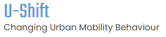

```{r setup, include=FALSE}
knitr::opts_chunk$set(echo = TRUE)
```


This repository intends to gather, and make available, the supporting materials for the [Transport Demand Modeling course](https://fenix.tecnico.ulisboa.pt/disciplinas/MPTra/2020-2021/1-semestre/materiais-de-apoio), lectured by [Prof. Filipe Moura](https://ushift.tecnico.ulisboa.pt/team-filipe-moura/).
This material is also an open source tutorial for applying R programming (chapters 1,2,3,4,5,6,7 and 9) and Python Biogeme (chapter 8) in transport demand modelling.     


This material was prepared by [Gabriel Valença](https://ushift.tecnico.ulisboa.pt/team-gabriel-valenca/), [Miguel Costa](https://ushift.tecnico.ulisboa.pt/team-miguel-costa/), [Rosa Félix](https://ushift.tecnico.ulisboa.pt/team-rosa-felix/), [Carlos Roque](https://ushift.tecnico.ulisboa.pt/team-carlos-roque/), and [Filipe Moura](https://ushift.tecnico.ulisboa.pt/team-filipe-moura/). 


 

## Summary

  1. [Exploratory Data Analysis](1-ExploratoryDataAnalysis.md) (**Gabriel Valença**)
  2. [Multiple Linear Regression models](2-MultipleLinearRegression.md) (**Gabriel Valença**)
  3. [Exploratory Factor Analysis](3-FactorAnalysis.md) (**Gabriel Valença**)
  4. [Cluster Analysis](4-ClusterAnalysis.md) (**Gabriel Valença**)
  5. [Generalized linear models](5-GeneralizedLinearModels.md) (**Gabriel Valença**)
  6. [Spatial regression models](6-SpatialModels.md) (**Rosa Félix**)
  7. [Panel Data Models](7-PanelModels.md) (**Gabriel Valença**)
  8. [Discrete Choice Models](8-DiscreteChoiceModels/) (**Miguel Costa**)
  
     * [Multinomial](8-DiscreteChoiceModels/8.1-MultinomialLogitAndProbitModels/) 
     * [Nested](8-DiscreteChoiceModels/8.2-NestedLogitModels/)
     * [Ordered Models](8-DiscreteChoiceModels/8.3-OrderedLogitModels/) 
     
  
  9. [Hazard-Based Duration Models](9-HazardBasedModels.md) (**Carlos Roque**)
  
### Files
* In [Data](Data/) folder you may find all the files to use for the exercises.   
* The [Code](Code/) folder contains scripts to use with each topic.
* In [Slides](Slides/Slides.md) you can find all the slides of the lectures given by Prof. Filipe Moura.

## R and Python stuff
* [How to install R and RStudio](0-InstallR.md) (**Rosa Félix**)
* Check [some tips](RMarkdownReports.md) how to make your home assignments as static or dynamic outputs with *R Markdown*. (**Rosa Félix**)
* How to install Python and Pandas Biogeme (**Miguel Costa**)

