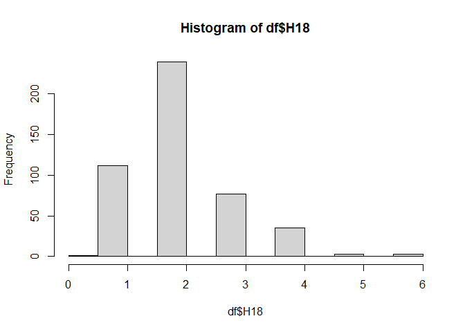
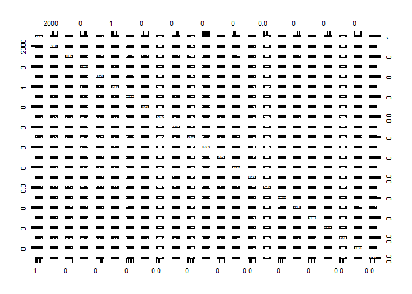
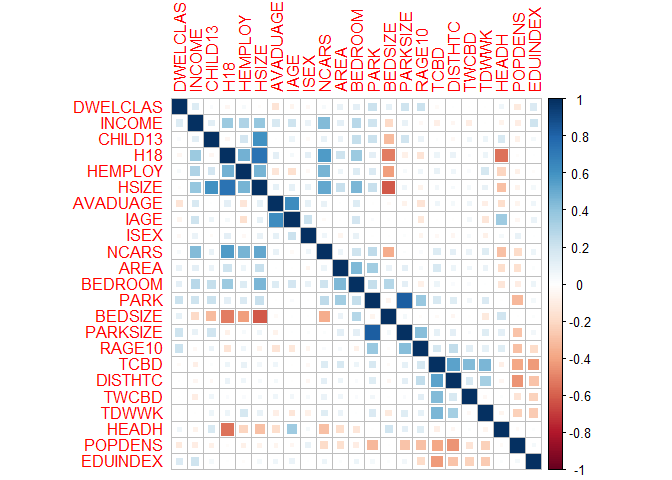
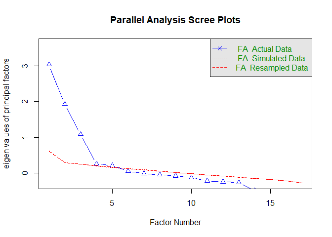
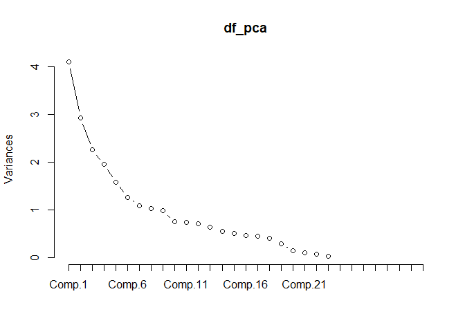
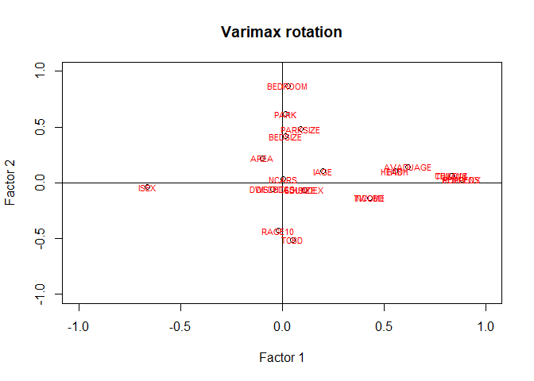
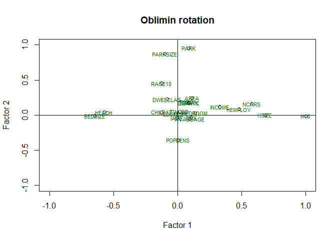

Exploratory Factor Analysis
================

#### Example exercise: “Residential location satisfaction in the Lisbon metropolitan area”

The aim of this study was to examine the perception of households
towards their residential location considering several land use and
accessibility factors as well as household socioeconomic and attitudinal
characteristics.

*Reference:* Martinez, L. G., de Abreu e Silva, J., & Viegas, J. M.
(2010). Assessment of residential location satisfaction in the Lisbon
metropolitan area, TRB (No. 10-1161).

**Your task:** Analyze the data and create meaningful latent factors.

## Data

#### Variables:

- `DWELCLAS`: Classification of the dwelling;
- `INCOME`: Income of the household;
- `CHILD13`: Number of children under 13 years old;
- `H18`: Number of household members above 18 years old;
- `HEMPLOY`: Number of household members employed;
- `HSIZE`: Household size;
- `IAGE`: Age of the respondent;
- `ISEX`: Sex of the respondent;
- `NCARS`: Number of cars in the household;
- `AREA`: Area of the dwelling;
- `BEDROOM`: Number of bedrooms in the dwelling;
- `PARK`: Number of parking spaces in the dwelling;
- `BEDSIZE`: BEDROOM/HSIZE;
- `PARKSIZE`: PARK/NCARS;
- `RAGE10`: 1 if Dwelling age \<= 10;
- `TCBD`: Private car distance in time to CBD;
- `DISTTC`: Euclidean distance to heavy public transport system stops;
- `TWCBD`: Private car distance in time of workplace to CBD;
- `TDWWK`: Private car distance in time of dwelling to work place;
- `HEADH`: 1 if Head of the Household;
- `POPDENS`: Population density per hectare;
- `EQUINDEX`: Number of undergraduate students/Population over 20 years
  old (500m)

#### Rules of thumb:

- At least 10 variables
- n \< 50 (Unacceptable); n \> 200 (recommended); 1:10 or higher
- It is recommended to use continuous variables. If your data contains
  categorical variables, you should transform them to dummy variables.

#### Assumptions:

- Normality;
- linearity;
- Homoscedasticity (some multicollinearity is desirable);
- Correlations between variables \< 0.3 (not appropriate to use Factor
  Analysis)

## Let’s start!

#### Import Libraries

``` r
library(foreign) # Library used to read SPSS files
library(nFactors) # Library used for factor analysis
library(tidyverse) # Library used in data science to perform exploratory data analysis
library(summarytools) # Library used for checking the summary of the dataset
library(psych) # Library used for factor analysis
library(GPArotation) # Library used for factor analysis
library(corrplot) # Library used for correlation analysis
library(car) #For linear regression and VIF calculation (testing multicollinearity)
```

### Get to know your dataset

##### Import dataset

``` r
df <- read.spss("Data/example_fact.sav", to.data.frame = T) #transforms a list into a data.frame directly
```

##### Select a dataset with the first variables explained above

``` r
df = df[,1:24]
```

##### Take a look at the main characteristics of the dataset

``` r
class(df) #type of data
```

    ## [1] "data.frame"

``` r
str(df)
```

    ## 'data.frame':    470 obs. of  24 variables:
    ##  $ RespondentID: num  7.99e+08 7.98e+08 7.98e+08 7.98e+08 7.98e+08 ...
    ##  $ DWELCLAS    : num  5 6 6 5 6 6 4 2 6 5 ...
    ##  $ INCOME      : num  7500 4750 4750 7500 2750 1500 12500 1500 1500 1500 ...
    ##  $ CHILD13     : num  1 0 2 0 1 0 0 0 0 0 ...
    ##  $ H18         : num  2 1 2 3 1 3 3 4 1 1 ...
    ##  $ HEMPLOY     : num  2 1 2 2 1 2 0 2 1 1 ...
    ##  $ HSIZE       : num  3 1 4 4 2 3 3 4 1 1 ...
    ##  $ AVADUAGE    : num  32 31 41.5 44.7 33 ...
    ##  $ IAGE        : num  32 31 42 52 33 47 62 21 34 25 ...
    ##  $ ISEX        : num  1 1 0 1 0 1 1 0 0 0 ...
    ##  $ NCARS       : num  2 1 2 3 1 1 2 3 1 1 ...
    ##  $ AREA        : num  100 90 220 120 90 100 178 180 80 50 ...
    ##  $ BEDROOM     : num  2 2 4 3 2 2 5 3 2 1 ...
    ##  $ PARK        : num  1 1 2 0 0 0 2 0 0 1 ...
    ##  $ BEDSIZE     : num  0.667 2 1 0.75 1 ...
    ##  $ PARKSIZE    : num  0.5 1 1 0 0 0 1 0 0 1 ...
    ##  $ RAGE10      : num  1 0 1 0 0 0 0 0 1 1 ...
    ##  $ TCBD        : num  36.79 15.47 24.1 28.72 7.28 ...
    ##  $ DISTHTC     : num  629 551 548 2351 698 ...
    ##  $ TWCBD       : num  10 15.5 12.71 3.17 5.36 ...
    ##  $ TDWWK       : num  31.1 0 20.4 32.9 13 ...
    ##  $ HEADH       : num  1 1 1 1 1 1 1 0 1 1 ...
    ##  $ POPDENS     : num  85.7 146.4 106.6 36.8 181.6 ...
    ##  $ EDUINDEX    : num  0.0641 0.2672 0.1 0.0867 0.1309 ...

##### Check summary statistics of variables

``` r
descriptive_stats <- dfSummary(df)
view(descriptive_stats)
```

### Data Frame Summary

#### df

**Dimensions:** 470 x 24  
**Duplicates:** 0

<table style="width:97%;">
<colgroup>
<col style="width: 4%" />
<col style="width: 13%" />
<col style="width: 31%" />
<col style="width: 18%" />
<col style="width: 18%" />
<col style="width: 8%" />
</colgroup>
<thead>
<tr class="header">
<th>No</th>
<th>Variable</th>
<th>Stats / Values</th>
<th>Freqs (% of Valid)</th>
<th>Graph</th>
<th>Missing</th>
</tr>
</thead>
<tbody>
<tr class="odd">
<td>1</td>
<td>RespondentID<br />
[numeric]</td>
<td>Mean (sd) : 784082878 (8627501)<br />
min &lt; med &lt; max:<br />
773001005 &lt; 780248283 &lt; 808234671<br />
IQR (CV) : 16634785 (0)</td>
<td>470 distinct values</td>
<td></td>
<td>0<br />
(0.0%)</td>
</tr>
<tr class="even">
<td>2</td>
<td>DWELCLAS<br />
[numeric]</td>
<td>Mean (sd) : 5.1 (1.3)<br />
min &lt; med &lt; max:<br />
1 &lt; 5 &lt; 7<br />
IQR (CV) : 2 (0.2)</td>
<td>1 : 5 ( 1.1%)<br />
2 : 14 ( 3.0%)<br />
3 : 31 ( 6.6%)<br />
4 : 75 (16.0%)<br />
5 : 130 (27.7%)<br />
6 : 162 (34.5%)<br />
7 : 53 (11.3%)</td>
<td></td>
<td>0<br />
(0.0%)</td>
</tr>
<tr class="odd">
<td>3</td>
<td>INCOME<br />
[numeric]</td>
<td>Mean (sd) : 4259.6 (3001.8)<br />
min &lt; med &lt; max:<br />
700 &lt; 2750 &lt; 12500<br />
IQR (CV) : 2000 (0.7)</td>
<td>700 : 20 ( 4.3%)<br />
1500 : 96 (20.4%)<br />
2750 : 142 (30.2%)<br />
4750 : 106 (22.6%)<br />
7500 : 75 (16.0%)<br />
12500 : 31 ( 6.6%)</td>
<td></td>
<td>0<br />
(0.0%)</td>
</tr>
<tr class="even">
<td>4</td>
<td>CHILD13<br />
[numeric]</td>
<td>Mean (sd) : 0.4 (0.8)<br />
min &lt; med &lt; max:<br />
0 &lt; 0 &lt; 4<br />
IQR (CV) : 0 (2)</td>
<td>0 : 353 (75.1%)<br />
1 : 62 (13.2%)<br />
2 : 41 ( 8.7%)<br />
3 : 13 ( 2.8%)<br />
4 : 1 ( 0.2%)</td>
<td></td>
<td>0<br />
(0.0%)</td>
</tr>
<tr class="odd">
<td>5</td>
<td>H18<br />
[numeric]</td>
<td>Mean (sd) : 2.1 (0.9)<br />
min &lt; med &lt; max:<br />
0 &lt; 2 &lt; 6<br />
IQR (CV) : 0.8 (0.4)</td>
<td>0 : 1 ( 0.2%)<br />
1 : 112 (23.8%)<br />
2 : 239 (50.9%)<br />
3 : 77 (16.4%)<br />
4 : 35 ( 7.4%)<br />
5 : 3 ( 0.6%)<br />
6 : 3 ( 0.6%)</td>
<td></td>
<td>0<br />
(0.0%)</td>
</tr>
<tr class="even">
<td>6</td>
<td>HEMPLOY<br />
[numeric]</td>
<td>Mean (sd) : 1.5 (0.7)<br />
min &lt; med &lt; max:<br />
0 &lt; 2 &lt; 5<br />
IQR (CV) : 1 (0.5)</td>
<td>0 : 39 ( 8.3%)<br />
1 : 171 (36.4%)<br />
2 : 237 (50.4%)<br />
3 : 21 ( 4.5%)<br />
4 : 1 ( 0.2%)<br />
5 : 1 ( 0.2%)</td>
<td></td>
<td>0<br />
(0.0%)</td>
</tr>
<tr class="odd">
<td>7</td>
<td>HSIZE<br />
[numeric]</td>
<td>Mean (sd) : 2.6 (1.3)<br />
min &lt; med &lt; max:<br />
1 &lt; 2 &lt; 7<br />
IQR (CV) : 2 (0.5)</td>
<td>1 : 104 (22.1%)<br />
2 : 147 (31.3%)<br />
3 : 96 (20.4%)<br />
4 : 96 (20.4%)<br />
5 : 20 ( 4.3%)<br />
6 : 5 ( 1.1%)<br />
7 : 2 ( 0.4%)</td>
<td></td>
<td>0<br />
(0.0%)</td>
</tr>
<tr class="even">
<td>8</td>
<td>AVADUAGE<br />
[numeric]</td>
<td>Mean (sd) : 37.8 (9.9)<br />
min &lt; med &lt; max:<br />
0 &lt; 36 &lt; 78<br />
IQR (CV) : 12.7 (0.3)</td>
<td>126 distinct values</td>
<td></td>
<td>0<br />
(0.0%)</td>
</tr>
<tr class="odd">
<td>9</td>
<td>IAGE<br />
[numeric]</td>
<td>Mean (sd) : 36.9 (11.6)<br />
min &lt; med &lt; max:<br />
0 &lt; 34 &lt; 78<br />
IQR (CV) : 15 (0.3)</td>
<td>53 distinct values</td>
<td></td>
<td>0<br />
(0.0%)</td>
</tr>
<tr class="even">
<td>10</td>
<td>ISEX<br />
[numeric]</td>
<td>Min : 0<br />
Mean : 0.5<br />
Max : 1</td>
<td>0 : 214 (45.5%)<br />
1 : 256 (54.5%)</td>
<td></td>
<td>0<br />
(0.0%)</td>
</tr>
<tr class="odd">
<td>11</td>
<td>NCARS<br />
[numeric]</td>
<td>Mean (sd) : 1.7 (0.9)<br />
min &lt; med &lt; max:<br />
0 &lt; 2 &lt; 5<br />
IQR (CV) : 1 (0.5)</td>
<td>0 : 23 ( 4.9%)<br />
1 : 182 (38.7%)<br />
2 : 193 (41.1%)<br />
3 : 56 (11.9%)<br />
4 : 13 ( 2.8%)<br />
5 : 3 ( 0.6%)</td>
<td></td>
<td>0<br />
(0.0%)</td>
</tr>
<tr class="even">
<td>12</td>
<td>AREA<br />
[numeric]</td>
<td>Mean (sd) : 133 (121.5)<br />
min &lt; med &lt; max:<br />
30 &lt; 110 &lt; 2250<br />
IQR (CV) : 60 (0.9)</td>
<td>76 distinct values</td>
<td></td>
<td>0<br />
(0.0%)</td>
</tr>
<tr class="odd">
<td>13</td>
<td>BEDROOM<br />
[numeric]</td>
<td>Mean (sd) : 2.9 (1.1)<br />
min &lt; med &lt; max:<br />
0 &lt; 3 &lt; 7<br />
IQR (CV) : 1 (0.4)</td>
<td>0 : 1 ( 0.2%)<br />
1 : 28 ( 6.0%)<br />
2 : 153 (32.6%)<br />
3 : 180 (38.3%)<br />
4 : 73 (15.5%)<br />
5 : 26 ( 5.5%)<br />
6 : 7 ( 1.5%)<br />
7 : 2 ( 0.4%)</td>
<td></td>
<td>0<br />
(0.0%)</td>
</tr>
<tr class="even">
<td>14</td>
<td>PARK<br />
[numeric]</td>
<td>Mean (sd) : 0.8 (1)<br />
min &lt; med &lt; max:<br />
0 &lt; 1 &lt; 4<br />
IQR (CV) : 1 (1.2)</td>
<td>0 : 224 (47.7%)<br />
1 : 136 (28.9%)<br />
2 : 84 (17.9%)<br />
3 : 18 ( 3.8%)<br />
4 : 8 ( 1.7%)</td>
<td></td>
<td>0<br />
(0.0%)</td>
</tr>
<tr class="odd">
<td>15</td>
<td>BEDSIZE<br />
[numeric]</td>
<td>Mean (sd) : 1.4 (0.8)<br />
min &lt; med &lt; max:<br />
0 &lt; 1 &lt; 5<br />
IQR (CV) : 0.7 (0.6)</td>
<td>22 distinct values</td>
<td></td>
<td>0<br />
(0.0%)</td>
</tr>
<tr class="even">
<td>16</td>
<td>PARKSIZE<br />
[numeric]</td>
<td>Mean (sd) : 0.5 (0.6)<br />
min &lt; med &lt; max:<br />
0 &lt; 0.2 &lt; 3<br />
IQR (CV) : 1 (1.2)</td>
<td>13 distinct values</td>
<td></td>
<td>0<br />
(0.0%)</td>
</tr>
<tr class="odd">
<td>17</td>
<td>RAGE10<br />
[numeric]</td>
<td>Min : 0<br />
Mean : 0.2<br />
Max : 1</td>
<td>0 : 356 (75.7%)<br />
1 : 114 (24.3%)</td>
<td></td>
<td>0<br />
(0.0%)</td>
</tr>
<tr class="even">
<td>18</td>
<td>TCBD<br />
[numeric]</td>
<td>Mean (sd) : 24.7 (16.2)<br />
min &lt; med &lt; max:<br />
0.8 &lt; 23.8 &lt; 73.3<br />
IQR (CV) : 25.7 (0.7)</td>
<td>434 distinct values</td>
<td></td>
<td>0<br />
(0.0%)</td>
</tr>
<tr class="odd">
<td>19</td>
<td>DISTHTC<br />
[numeric]</td>
<td>Mean (sd) : 1347 (1815.8)<br />
min &lt; med &lt; max:<br />
49 &lt; 719 &lt; 17732.7<br />
IQR (CV) : 1125 (1.3)</td>
<td>434 distinct values</td>
<td></td>
<td>0<br />
(0.0%)</td>
</tr>
<tr class="even">
<td>20</td>
<td>TWCBD<br />
[numeric]</td>
<td>Mean (sd) : 17 (16.2)<br />
min &lt; med &lt; max:<br />
0.3 &lt; 9.9 &lt; 67.8<br />
IQR (CV) : 20 (1)</td>
<td>439 distinct values</td>
<td></td>
<td>0<br />
(0.0%)</td>
</tr>
<tr class="odd">
<td>21</td>
<td>TDWWK<br />
[numeric]</td>
<td>Mean (sd) : 23.5 (17.1)<br />
min &lt; med &lt; max:<br />
0 &lt; 22.2 &lt; 80.7<br />
IQR (CV) : 23.6 (0.7)</td>
<td>414 distinct values</td>
<td></td>
<td>0<br />
(0.0%)</td>
</tr>
<tr class="even">
<td>22</td>
<td>HEADH<br />
[numeric]</td>
<td>Min : 0<br />
Mean : 0.9<br />
Max : 1</td>
<td>0 : 64 (13.6%)<br />
1 : 406 (86.4%)</td>
<td></td>
<td>0<br />
(0.0%)</td>
</tr>
<tr class="odd">
<td>23</td>
<td>POPDENS<br />
[numeric]</td>
<td>Mean (sd) : 92 (58.2)<br />
min &lt; med &lt; max:<br />
0 &lt; 83.2 &lt; 255.6<br />
IQR (CV) : 89.2 (0.6)</td>
<td>431 distinct values</td>
<td></td>
<td>0<br />
(0.0%)</td>
</tr>
<tr class="even">
<td>24</td>
<td>EDUINDEX<br />
[numeric]</td>
<td>Mean (sd) : 0.2 (0.1)<br />
min &lt; med &lt; max:<br />
0 &lt; 0.2 &lt; 0.7<br />
IQR (CV) : 0.2 (0.6)</td>
<td>434 distinct values</td>
<td></td>
<td>0<br />
(0.0%)</td>
</tr>
</tbody>
</table>

> **Note:** I used a different library of the MLR chapter for perfoming
> the summary statistics. “R” allows you to do the same or similar tasks
> with different packages.

##### Take a look at the first values of the dataset

``` r
head(df,5)
```

    ##   RespondentID DWELCLAS INCOME CHILD13 H18 HEMPLOY HSIZE AVADUAGE IAGE ISEX
    ## 1    799161661        5   7500       1   2       2     3 32.00000   32    1
    ## 2    798399409        6   4750       0   1       1     1 31.00000   31    1
    ## 3    798374392        6   4750       2   2       2     4 41.50000   42    0
    ## 4    798275277        5   7500       0   3       2     4 44.66667   52    1
    ## 5    798264250        6   2750       1   1       1     2 33.00000   33    0
    ##   NCARS AREA BEDROOM PARK   BEDSIZE PARKSIZE RAGE10      TCBD   DISTHTC
    ## 1     2  100       2    1 0.6666667      0.5      1 36.791237  629.1120
    ## 2     1   90       2    1 2.0000000      1.0      0 15.472989  550.5769
    ## 3     2  220       4    2 1.0000000      1.0      1 24.098125  547.8633
    ## 4     3  120       3    0 0.7500000      0.0      0 28.724796 2350.5782
    ## 5     1   90       2    0 1.0000000      0.0      0  7.283384  698.3000
    ##       TWCBD    TDWWK HEADH   POPDENS   EDUINDEX
    ## 1 10.003945 31.14282     1  85.70155 0.06406279
    ## 2 15.502989  0.00000     1 146.43494 0.26723192
    ## 3 12.709374 20.38427     1 106.60810 0.09996816
    ## 4  3.168599 32.94246     1  36.78380 0.08671065
    ## 5  5.364160 13.04013     1 181.62720 0.13091674

##### Make ID as row names or case number

``` r
df<-data.frame(df, row.names = 1)
```

### Evaluating the assumptions for factorial analysis

**Adequate Sample Size:** Ideally, you should have at least 5–10
observations per variable for reliable factor analysis results. More is
generally better.

``` r
n_obs <- nrow(df)
n_vars <- ncol(df)
ratio=n_obs/n_vars

n_obs
```

    ## [1] 470

``` r
n_vars
```

    ## [1] 23

``` r
ratio
```

    ## [1] 20.43478

- **Normality**

``` r
shapiro.test(df$DWELCLAS)  # Test normality of each variable
```

    ## 
    ##  Shapiro-Wilk normality test
    ## 
    ## data:  df$DWELCLAS
    ## W = 0.90203, p-value < 2.2e-16

Make normality tests to all variables

``` r
normality_tests <- sapply(df, function(x) {
  if (is.numeric(x)) {
    shapiro.test(x)
  } else {
    NA  # Skip non-numeric variables
  }
})
```

Print the p-values for each variable

``` r
normality_tests
```

    ##           DWELCLAS                      INCOME                       
    ## statistic 0.9020336                     0.8261471                    
    ## p.value   8.272063e-17                  3.299416e-22                 
    ## method    "Shapiro-Wilk normality test" "Shapiro-Wilk normality test"
    ## data.name "x"                           "x"                          
    ##           CHILD13                       H18                          
    ## statistic 0.5709899                     0.8375837                    
    ## p.value   2.331789e-32                  1.590027e-21                 
    ## method    "Shapiro-Wilk normality test" "Shapiro-Wilk normality test"
    ## data.name "x"                           "x"                          
    ##           HEMPLOY                       HSIZE                        
    ## statistic 0.8244585                     0.8994548                    
    ## p.value   2.633268e-22                  4.904234e-17                 
    ## method    "Shapiro-Wilk normality test" "Shapiro-Wilk normality test"
    ## data.name "x"                           "x"                          
    ##           AVADUAGE                      IAGE                         
    ## statistic 0.932016                      0.9353388                    
    ## p.value   8.595638e-14                  2.101209e-13                 
    ## method    "Shapiro-Wilk normality test" "Shapiro-Wilk normality test"
    ## data.name "x"                           "x"                          
    ##           ISEX                          NCARS                        
    ## statistic 0.6336266                     0.8671536                    
    ## p.value   1.936176e-30                  1.41819e-19                  
    ## method    "Shapiro-Wilk normality test" "Shapiro-Wilk normality test"
    ## data.name "x"                           "x"                          
    ##           AREA                          BEDROOM                      
    ## statistic 0.3810604                     0.8987106                    
    ## p.value   4.702747e-37                  4.225014e-17                 
    ## method    "Shapiro-Wilk normality test" "Shapiro-Wilk normality test"
    ## data.name "x"                           "x"                          
    ##           PARK                          BEDSIZE                      
    ## statistic 0.7906915                     0.8056548                    
    ## p.value   3.957969e-24                  2.373473e-23                 
    ## method    "Shapiro-Wilk normality test" "Shapiro-Wilk normality test"
    ## data.name "x"                           "x"                          
    ##           PARKSIZE                      RAGE10                       
    ## statistic 0.7774897                     0.5319634                    
    ## p.value   8.826135e-25                  1.916486e-33                 
    ## method    "Shapiro-Wilk normality test" "Shapiro-Wilk normality test"
    ## data.name "x"                           "x"                          
    ##           TCBD                          DISTHTC                      
    ## statistic 0.9378631                     0.6022255                    
    ## p.value   4.232035e-13                  1.970889e-31                 
    ## method    "Shapiro-Wilk normality test" "Shapiro-Wilk normality test"
    ## data.name "x"                           "x"                          
    ##           TWCBD                         TDWWK                        
    ## statistic 0.8209078                     0.9527661                    
    ## p.value   1.647601e-22                  4.122546e-11                 
    ## method    "Shapiro-Wilk normality test" "Shapiro-Wilk normality test"
    ## data.name "x"                           "x"                          
    ##           HEADH                         POPDENS                      
    ## statistic 0.405341                      0.9670161                    
    ## p.value   1.58934e-36                   8.739157e-09                 
    ## method    "Shapiro-Wilk normality test" "Shapiro-Wilk normality test"
    ## data.name "x"                           "x"                          
    ##           EDUINDEX                     
    ## statistic 0.9392883                    
    ## p.value   6.337856e-13                 
    ## method    "Shapiro-Wilk normality test"
    ## data.name "x"

Or Extract p-values from the normality test results ONLY

``` r
normality_pvalues <- sapply(df, function(x) {
  if (is.numeric(x)) {
    shapiro.test(x)$p.value
  } else {
    NA  # Skip non-numeric variables
  }
})
```

# Print the p-values for each variable

``` r
normality_pvalues
```

    ##     DWELCLAS       INCOME      CHILD13          H18      HEMPLOY        HSIZE 
    ## 8.272063e-17 3.299416e-22 2.331789e-32 1.590027e-21 2.633268e-22 4.904234e-17 
    ##     AVADUAGE         IAGE         ISEX        NCARS         AREA      BEDROOM 
    ## 8.595638e-14 2.101209e-13 1.936176e-30 1.418190e-19 4.702747e-37 4.225014e-17 
    ##         PARK      BEDSIZE     PARKSIZE       RAGE10         TCBD      DISTHTC 
    ## 3.957969e-24 2.373473e-23 8.826135e-25 1.916486e-33 4.232035e-13 1.970889e-31 
    ##        TWCBD        TDWWK        HEADH      POPDENS     EDUINDEX 
    ## 1.647601e-22 4.122546e-11 1.589340e-36 8.739157e-09 6.337856e-13

If you want to focus on which variables do not follow normality, you can
filter the output:

``` r
non_normal_vars <- names(normality_pvalues[normality_pvalues < 0.05])
non_normal_vars
```

    ##  [1] "DWELCLAS" "INCOME"   "CHILD13"  "H18"      "HEMPLOY"  "HSIZE"   
    ##  [7] "AVADUAGE" "IAGE"     "ISEX"     "NCARS"    "AREA"     "BEDROOM" 
    ## [13] "PARK"     "BEDSIZE"  "PARKSIZE" "RAGE10"   "TCBD"     "DISTHTC" 
    ## [19] "TWCBD"    "TDWWK"    "HEADH"    "POPDENS"  "EDUINDEX"

If you want to focus on which variables follow normality, you can filter
the output:

``` r
normal_vars <- names(normality_pvalues[normality_pvalues >= 0.05])
normal_vars
```

    ## character(0)

Example of histogram:

``` r
hist(df$H18)
```

<!-- -->

> **Note:** There are no normally distributed variables in the dataset.
> Factor analysis can still work with non-normally distributed data, but
> for Maximum Likelihood (ML) extraction, normality is preferable.

- **Linearity Between Variables**

``` r
pairs(df[,1:10], pch = 19, lower.panel = NULL)  # Pairwise scatter plots for the first 10 variables. Check the others!
```

<!-- -->

> **Note:** Most relationships are non-linear.

**Correlations between variables**

``` r
#' Correlation matrix
corr_matrix <- cor(df, method = "pearson")
corrplot(corr_matrix, method = "square")
```

<!-- -->

**The Bartlett sphericity test**

This test checks if the correlation matrix is significantly different
from an identity matrix (where variables are uncorrelated). If
significant, the data is suitable for factor analysis. If the p-value is
small (p \< 0.05), you can reject the null hypothesis (which states that
the variables are uncorrelated), meaning that FA is appropriate.

``` r
cortest.bartlett(corr_matrix, n = nrow(df))
```

    ## $chisq
    ## [1] 5604.544
    ## 
    ## $p.value
    ## [1] 0
    ## 
    ## $df
    ## [1] 253

> **Note:** The null hypothesis is that there is no correlation between
> variables. Therefore, in factor analysis you want to reject the null
> hypothesis.

- **Check for sampling adequacy - KMO test**

It assesses whether the correlations between variables are high enough
to justify a factor analysis. It looks at the proportion of variance
that could be common among variables.

``` r
KMO(corr_matrix)
```

    ## Kaiser-Meyer-Olkin factor adequacy
    ## Call: KMO(r = corr_matrix)
    ## Overall MSA =  0.59
    ## MSA for each item = 
    ## DWELCLAS   INCOME  CHILD13      H18  HEMPLOY    HSIZE AVADUAGE     IAGE 
    ##     0.73     0.86     0.32     0.58     0.89     0.59     0.37     0.40 
    ##     ISEX    NCARS     AREA  BEDROOM     PARK  BEDSIZE PARKSIZE   RAGE10 
    ##     0.69     0.74     0.57     0.53     0.59     0.58     0.54     0.80 
    ##     TCBD  DISTHTC    TWCBD    TDWWK    HEADH  POPDENS EDUINDEX 
    ##     0.69     0.79     0.52     0.70     0.46     0.80     0.69

> **Note:** We want at least 0.7 of the overall Mean Sample Adequacy
> (MSA). If, 0.6 \< MSA \< 0.7, it is not a good value, but acceptable
> in some cases.

MSA for each item (variable-specific KMO scores): The KMO test also
provides an MSA (Measure of Sampling Adequacy) for each variable,
indicating how well each variable fits with the others in terms of
common variance. Here are some important interpretations: \* Good MSA
values (≥ 0.70): Variables such as INCOME (0.86), HEMPLOY (0.89), and
RAGE10 (0.80) are well-suited for factor analysis and share sufficient
common variance with the other variables.

- Mediocre MSA values (0.50 ≤ MSA \< 0.70): Variables like DWELCLAS
  (0.73), HSIZE (0.59), and PARK (0.59) are marginal for factor
  analysis.

- These variables have some shared variance with the other variables but
  are not as strong contributors.

- Low MSA values (\< 0.50): Variables like CHILD13 (0.32), AVADUAGE
  (0.37), IAGE (0.40), and HEADH (0.46) have very low MSA scores

- These variables do not share enough common variance with the others
  and might be poorly suited for factor analysis.

You exclude the low MSA value variables:

``` r
new_df <- df %>% select(-CHILD13, -AVADUAGE, -IAGE, -HEADH, -BEDROOM, -AREA)
```

**Correlation matrix**

``` r
corr_matrix <- cor(new_df, method = "pearson")
KMO(corr_matrix)
```

    ## Kaiser-Meyer-Olkin factor adequacy
    ## Call: KMO(r = corr_matrix)
    ## Overall MSA =  0.73
    ## MSA for each item = 
    ## DWELCLAS   INCOME      H18  HEMPLOY    HSIZE     ISEX    NCARS     PARK 
    ##     0.70     0.85     0.79     0.89     0.78     0.51     0.79     0.62 
    ##  BEDSIZE PARKSIZE   RAGE10     TCBD  DISTHTC    TWCBD    TDWWK  POPDENS 
    ##     0.81     0.57     0.75     0.68     0.78     0.52     0.68     0.80 
    ## EDUINDEX 
    ##     0.70

- **Check for multicollinearity**. Multicollinearity happens when
  variables are very highly correlated (e.g., correlations above 0.9),
  which can distort factor analysis results.

``` r
vif(lm(df$DWELCLAS ~ ., data = new_df))  # Replace Variable1 with a dependent variable
```

    ##   INCOME      H18  HEMPLOY    HSIZE     ISEX    NCARS     PARK  BEDSIZE 
    ## 1.415497 2.734940 1.530409 2.902787 1.061340 1.997574 4.129505 1.744990 
    ## PARKSIZE   RAGE10     TCBD  DISTHTC    TWCBD    TDWWK  POPDENS EDUINDEX 
    ## 4.023440 1.439405 2.304019 1.629772 1.391409 1.477552 1.525314 1.408794

### Determine the number of factors to extract

**1. Parallel Analysis**

``` r
num_factors = fa.parallel(new_df, fm = "ml", fa = "fa")
```

<!-- -->

    ## Parallel analysis suggests that the number of factors =  5  and the number of components =  NA

> **Note:** `fm` = factor math; `ml` = maximum likelihood; `fa` = factor
> analysis

The selection of the number of factors in the Parallel analysis can be
threefold:

- Detect where there is an “elbow” in the graph;
- Detect the intersection between the “FA Actual Data” and the “FA
  Simulated Data”;
- Consider the number of factors with eigenvalue \> 1.

**2. Kaiser Criterion**

``` r
sum(num_factors$fa.values > 1) #Determines the number of factors with eigenvalue > 1
```

    ## [1] 3

You can also consider factors with eigenvalue \> 0.7, since some of the
literature indicate that this value does not overestimate the number of
factors as much as considering an eigenvalue = 1.

**3. Principal Component Analysis (PCA)**

- Print variance that explains the components

``` r
df_pca <- princomp(new_df, cor=TRUE) #cor = TRUE, standardizes your dataset before running a PCA
summary(df_pca)  
```

    ## Importance of components:
    ##                           Comp.1    Comp.2    Comp.3     Comp.4     Comp.5
    ## Standard deviation     1.8997952 1.6781639 1.4295978 1.06695332 1.02159849
    ## Proportion of Variance 0.2123072 0.1656608 0.1202206 0.06696408 0.06139197
    ## Cumulative Proportion  0.2123072 0.3779680 0.4981886 0.56515264 0.62654461
    ##                            Comp.6     Comp.7     Comp.8     Comp.9    Comp.10
    ## Standard deviation     0.98493655 0.92520466 0.86831066 0.82978037 0.77129420
    ## Proportion of Variance 0.05706471 0.05035316 0.04435079 0.04050209 0.03499381
    ## Cumulative Proportion  0.68360932 0.73396247 0.77831326 0.81881535 0.85380916
    ##                           Comp.11    Comp.12    Comp.13    Comp.14    Comp.15
    ## Standard deviation     0.72374146 0.69716735 0.67944566 0.60012054 0.54798812
    ## Proportion of Variance 0.03081186 0.02859072 0.02715567 0.02118498 0.01766418
    ## Cumulative Proportion  0.88462102 0.91321175 0.94036742 0.96155240 0.97921657
    ##                          Comp.16     Comp.17
    ## Standard deviation     0.4722460 0.360973692
    ## Proportion of Variance 0.0131186 0.007664824
    ## Cumulative Proportion  0.9923352 1.000000000

- Scree Plot

``` r
plot(df_pca,type="lines", npcs = 17, las = 2) 
```

<!-- -->

> **Note:** Check the cummulative variance of the first components and
> the scree plot, and see if the PCA is a good approach to detect the
> number of factors in this case.

**PCA is not the same thing as Factor Analysis!** PCA only considers the
common information (variance) of the variables, while factor analysis
takes into account also the unique variance of the variable. Both
approaches are often mixed up. In this example we use PCA as only a
first criteria for choosing the number of factors. PCA is very used in
image recognition and data reduction of big data.

## Exploratory Factor Analysis

- **Model 1**: No rotation
- **Model 2**: Rotation Varimax
- **Model 3**: Rotation Oblimin

``` r
# No rotation
df_factor <- factanal(new_df, factors = 4, rotation = "none", scores=c("regression"), fm = "ml")
# Rotation Varimax
df_factor_var <- factanal(new_df, factors = 4, rotation = "varimax", scores=c("regression"), fm = "ml")
# Rotiation Oblimin
df_factor_obl <- factanal(new_df, factors = 4, rotation = "oblimin", scores=c("regression"), fm = "ml")
```

Let’s print out the results of `df_factor_var`, and have a look.

``` r
print(df_factor_var, digits=2, cutoff=0.3, sort=TRUE) #cutoff of 0.3 due to the sample size is higher than 350 observations.
```

    ## 
    ## Call:
    ## factanal(x = new_df, factors = 4, scores = c("regression"), rotation = "varimax",     fm = "ml")
    ## 
    ## Uniquenesses:
    ## DWELCLAS   INCOME      H18  HEMPLOY    HSIZE     ISEX    NCARS     PARK 
    ##     0.88     0.63     0.29     0.66     0.22     0.98     0.38     0.23 
    ##  BEDSIZE PARKSIZE   RAGE10     TCBD  DISTHTC    TWCBD    TDWWK  POPDENS 
    ##     0.54     0.01     0.76     0.24     0.60     0.82     0.74     0.65 
    ## EDUINDEX 
    ##     0.66 
    ## 
    ## Loadings:
    ##          Factor1 Factor2 Factor3 Factor4
    ## H18       0.83                          
    ## HEMPLOY   0.56                          
    ## HSIZE     0.88                          
    ## NCARS     0.62                    0.46  
    ## BEDSIZE  -0.66                          
    ## TCBD              0.87                  
    ## DISTHTC           0.62                  
    ## EDUINDEX         -0.51                  
    ## PARK                      0.83          
    ## PARKSIZE                  1.00          
    ## DWELCLAS                                
    ## INCOME    0.43                    0.40  
    ## ISEX                                    
    ## RAGE10                    0.42          
    ## TWCBD             0.42                  
    ## TDWWK             0.48                  
    ## POPDENS          -0.43                  
    ## 
    ##                Factor1 Factor2 Factor3 Factor4
    ## SS loadings       2.87    2.12    2.05    0.68
    ## Proportion Var    0.17    0.12    0.12    0.04
    ## Cumulative Var    0.17    0.29    0.41    0.45
    ## 
    ## Test of the hypothesis that 4 factors are sufficient.
    ## The chi square statistic is 259.3 on 74 degrees of freedom.
    ## The p-value is 2.1e-22

> **Note:** The variability contained in the factors = Communality +
> Uniqueness.  
> Varimax assigns orthogonal rotation, and oblimin assigns oblique
> rotation.

Plot factor 1 against factor 2, and compare the results of different
rotations

- **No Rotation**

``` r
plot(
  df_factor$loadings[, 1],
  df_factor$loadings[, 2],
  xlab = "Factor 1",
  ylab = "Factor 2",
  ylim = c(-1, 1),
  xlim = c(-1, 1),
  main = "No rotation"
)
abline(h = 0, v = 0)
load <- df_factor$loadings[, 1:2]
text(
  load,
  names(df),
  cex = .7,
  col = "blue"
)
```

<!-- -->

- **Varimax rotation**

``` r
plot(
  df_factor_var$loadings[, 1],
  df_factor_var$loadings[, 2],
  xlab = "Factor 1",
  ylab = "Factor 2",
  ylim = c(-1, 1),
  xlim = c(-1, 1),
  main = "Varimax rotation"
)
abline(h = 0, v = 0)
load <- df_factor_var$loadings[, 1:2]
text(
  load,
  labels = names(df),
  cex = .7,
  col = "red"
)
```

<!-- -->

- **Oblimin Rotation**

``` r
plot(
  df_factor_obl$loadings[, 1],
  df_factor_obl$loadings[, 2],
  xlab = "Factor 1",
  ylab = "Factor 2",
  ylim = c(-1, 1),
  xlim = c(-1, 1),
  main = "Oblimin rotation"
)
abline(h = 0, v = 0)
load <- df_factor_obl$loadings[, 1:2]
text(
  load,
  labels = names(df),
  cex = .7,
  col = "darkgreen"
)
```

<!-- -->

When you have more than two factors it is difficult to analyze the
factors by the plots. Variables that have low explaining variance in the
two factors analyzed, could be highly explained by the other factors not
present in the graph. However, try comparing the plots with the factor
loadings and plot the other graphs to get more familiar with exploratory
factor analysis.
